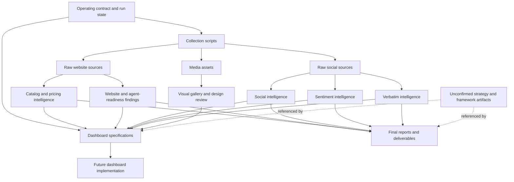

# 00 — Project Inventory

> **System:** Dashboard Intelligence Operating System (DIOS)  
> **Repository:** `omarali304ii-byte/Islam-Brain`  
> **Branch reviewed:** `main`  
> **Baseline commit:** `44cea987cd42f077cc0f6e448bcdc69f2683ecb1`  
> **Inventory date:** 2026-07-12  
> **Phase status:** Phase 0 — Inventory only  
> **Next phase:** Blocked until this inventory is validated

---

## Table of Contents

1. [Purpose and Boundary](#1-purpose-and-boundary)
2. [Inventory Method](#2-inventory-method)
3. [Repository Snapshot](#3-repository-snapshot)
4. [Artifact Classification](#4-artifact-classification)
5. [Dependency and Relationship Map](#5-dependency-and-relationship-map)
6. [Detailed Inventory](#6-detailed-inventory)
7. [Media Asset Inventory](#7-media-asset-inventory)
8. [Referenced but Unconfirmed Artifacts](#8-referenced-but-unconfirmed-artifacts)
9. [Contradictions and Inconsistencies](#9-contradictions-and-inconsistencies)
10. [Missing Information Register](#10-missing-information-register)
11. [Phase 0 Validation Gate](#11-phase-0-validation-gate)
12. [Glossary](#12-glossary)

---

## 1. Purpose and Boundary

This document inventories the material currently present in the repository. It records what each artifact appears to be, how it relates to other artifacts, and what is missing or uncertain.

### This phase does

- Identify available files and logical file groups.
- Classify each artifact by type and role.
- Record declared dependencies and relationships.
- Record evidence confidence.
- Record contradictions, gaps, and unavailable context.
- Establish the source boundary for later DIOS phases.

### This phase does not

- Evaluate whether the dashboard strategy is correct.
- Redesign pages, charts, components, flows, or visual language.
- Recommend product, UX, UI, architecture, or marketing changes.
- Validate calculations by independently recomputing them.
- Treat generated conclusions as equivalent to raw evidence.
- Move to Phase 1.

> [!IMPORTANT]
> The repository is currently an **evidence-and-deliverables estate**, not a confirmed runnable dashboard application. It contains dashboard specifications and generated deliverables, but the reviewed snapshot does not confirm the React implementation described by those specifications.

---

## 2. Inventory Method

### 2.1 Evidence used

The inventory is based on:

1. GitHub repository metadata.
2. The initial commit and its file-level patch metadata.
3. File names, paths, formats, and embedded descriptions.
4. Declared relationships inside `RUN_STATE.json`, source registries, scripts, specifications, and final deliverables.
5. Binary asset names and their corresponding manifest files.

### 2.2 Confidence scale

| Confidence | Meaning |
|---|---|
| **High** | File existence and purpose are directly supported by its path, content, or explicit documentation. |
| **Medium** | File existence is confirmed, but exact role or completeness is inferred from naming and neighboring artifacts. |
| **Low** | Artifact is referenced by another document, but its existence or location is not confirmed in the reviewed file list. |

### 2.3 Importance scale

| Importance | Meaning |
|---|---|
| **Critical** | Required to reconstruct provenance, project state, or the dashboard contract. |
| **Core** | Primary source, derived dataset, dashboard specification, or canonical client deliverable. |
| **Supporting** | Helps reproduce, explain, validate, or visually inspect core artifacts. |
| **Archive** | Preserved capture, temporary file, intermediate output, duplicate export, or binary supporting evidence. |

### 2.4 Source layers

The repository contains multiple layers that must remain separate in future phases:

| Layer | Description | Examples |
|---|---|---|
| **L0 — Operating contract** | Rules, prompts, run state, and declared workflow. | `CIELITO_TAB_DEEPENING_MASTER_PROMPT.md`, `RUN_STATE.json` |
| **L1 — Raw evidence** | Website captures, social captures, audit outputs, images, transcripts. | `_sources/**`, `instruments/**`, `_media/**` |
| **L2 — Derived intelligence** | Processed datasets and analytical outputs created from L1. | `_intel/catalog_full.json`, `_intel/social_intel.json` |
| **L3 — Dashboard specifications** | Proposed dashboard structure and BI implementation contracts. | `dashboard/react_dashboard_spec.md`, `dashboard/powerbi_spec.md` |
| **L4 — Client-facing deliverables** | Reports, briefs, slide decks, PDFs, and decision summaries. | `final/**`, `deliverables/**` |

> [!CAUTION]
> Later phases must not use an L4 claim as proof of itself. Claims in deliverables must be traced backward to L2 and then to L1 where possible.

---

## 3. Repository Snapshot

| Field | Observed value | Confidence | Notes |
|---|---|---:|---|
| Repository | `omarali304ii-byte/Islam-Brain` | High | Public repository accessible through the connected GitHub account. |
| Default branch | `main` | High | Repository metadata. |
| Reviewed commit | `44cea987cd42f077cc0f6e448bcdc69f2683ecb1` | High | Commit message: `Initial Islam Brain project`. |
| Repository metadata size | `0` | High | GitHub metadata reports zero despite a large initial commit. See contradiction register. |
| Primary project represented | Cielito Egypt / Cielito 360 | High | Repeated consistently across root files, data, dashboard specs, and deliverables. |
| Declared platform/model | `Claude-Fable-5` | High | From `RUN_STATE.json`; this is declared provenance, not independently verified. |
| Declared run ID | `cielito-egypt-base360-2026-07-09` | High | From `RUN_STATE.json`. |
| Declared run phase | `closed` | High | `RUN_STATE.json`, with partial internal synthesis also recorded. |
| Confirmed dashboard source code | Not confirmed | High | Specifications exist; reviewed inventory does not confirm the implementation files named by the specs. |
| Confirmed deploy | None declared | High | `RUN_STATE.json` contains an empty `deploys` array. |

### 3.1 Top-level logical structure

```text
Islam-Brain/
├── CIELITO_TAB_DEEPENING_MASTER_PROMPT.md
├── RUN_STATE.json
├── _intel/
├── _media/
├── _sources/
│   ├── search/
│   ├── social/
│   └── website/
├── creative/
├── dashboard/
├── deliverables/
├── final/
├── instruments/
└── docs/DIOS/                 # Added for DIOS documentation
```

The reviewed snapshot may contain additional artifacts referenced by the documents. Those are listed separately when their file existence was not directly confirmed.

---

## 4. Artifact Classification

| Group | Primary purpose | Type | Upstream dependencies | Downstream relationships | Importance | Confidence |
|---|---|---|---|---|---|---:|
| Root operating files | Define project contract and current run state. | Markdown, JSON | Operator decisions, previous workflow | All phases and deliverables | Critical | High |
| `_sources/search` | Preserve secondary web-research findings. | Markdown | Public web sources | Source registry, strategy, final reporting | Core | High |
| `_sources/social` | Preserve raw and intermediate Instagram/TikTok captures. | JSON | Apify and direct collection routes | Social intelligence, sentiment, verbatims, media manifests | Critical | High |
| `_sources/website` | Preserve public Shopify/site captures and normalized text. | HTML, JSON, XML, TXT | Cielito public website | Catalog intelligence, pricing/design analysis, website findings | Critical | High |
| `_intel` scripts | Collect, transform, and derive intelligence. | Python | Raw sources, runtime secrets, external packages/services | `_intel` datasets and media | Core | High |
| `_intel` datasets | Store processed catalog, social, sentiment, and visual intelligence. | JSON, Markdown, YAML | Scripts and raw sources | Dashboard specs and client deliverables | Critical | High |
| `_media` | Preserve images and transcripts for visual review. | JPG, JSON | Social and catalog URLs | Visual gallery, design review, future dashboard media | Supporting | High |
| `instruments` | Preserve technical audits. | JSON | PageSpeed/agent-readiness audit processes | Website dashboard modules and final reports | Core | High |
| `dashboard` | Specify React and Power BI dashboard builds. | Markdown | Derived intelligence, instruments, strategy artifacts | Future implementation | Critical | High |
| `creative` | Define image-generation concepts. | Markdown | Strategy and visual-direction IDs | Creative production and campaign frames | Supporting | High |
| `final` | Deliver concise client-safe reporting and decisions. | Markdown | Intelligence and strategy artifacts | Leadership/client consumption | Core | High |
| `deliverables` | Preserve export-ready presentations and structured copies. | PDF, PPTX, JSON | Final reporting and intelligence | Client handoff | Core | High |

---

## 5. Dependency and Relationship Map



### 5.1 Declared but unresolved implementation relationship

The React specification declares a future compiler and application route:

```text
_intel/*.json + instruments/*.json + strategy.json
    -> dashboard/build_cielito_data.py
    -> cielito_360_data.json
    -> React dashboard at /dashboard/cielito-360
```

The current inventory confirms the specification, but does not confirm the compiler, emitted dataset, React components, or deployed route.

---

## 6. Detailed Inventory

### 6.1 Root operating artifacts

| Path | Purpose | Type | Dependencies | Relationships | Importance | Confidence | Missing information |
|---|---|---|---|---|---|---:|---|
| `CIELITO_TAB_DEEPENING_MASTER_PROMPT.md` | Defines the ≥20-card-per-tab dashboard expansion contract, evidence tags, no-fabrication rules, and execution order. | Markdown prompt/contract | Existing Cielito intelligence and proposed data routes | Governs future dashboard implementation and data-gap placeholders | Critical | High | Prompt author, exact execution history, and whether every rule was implemented are not recorded here. |
| `RUN_STATE.json` | Records run identity, phase status, costs, workflow completion, and next-step notes. | JSON state record | External estate runtime and operator actions | References project phases, deploy status, patch ledger, watch register, and future dashboard build | Critical | High | Referenced estate files, patch ledger, watch-register documents, and runtime logs are not confirmed in this repository snapshot. |

### 6.2 `_intel` source registry, controls, and scripts

| Path | Purpose | Type | Dependencies | Relationships | Importance | Confidence | Missing information |
|---|---|---|---|---|---|---:|---|
| `_intel/SOURCE_REGISTRY.md` | Maps source IDs to captured evidence and grades. | Markdown registry | Raw source files and operator context | Required for traceability in intelligence and dashboard cards | Critical | High | Some referenced paths are outside the confirmed repository boundary. |
| `_intel/data_pass_menu_base360.md` | Lists free, paid, client, and survey routes for closing data gaps. | Markdown decision menu | Gap register and collection architecture | Referenced by next steps and dashboard gap cards | Core | High | Recorded approvals/deferrals beyond the text itself are not separately confirmed. |
| `_intel/scraping_evidence_log.yaml` | Records collection routes, status, cost, confidence, failures, and explicit dropped routes. | YAML audit log | Collection executions | Supports provenance and cost reconciliation | Critical | High | No machine-readable schema or validation script is confirmed. |
| `_intel/apify_rest_capture.py` | Captures initial Instagram and TikTok data through approved Apify routes. | Python collector | Apify token, network, actor availability | Writes social source files and capture summary | Core | High | Runtime environment, requirements file, and secret-loading contract are not confirmed. |
| `_intel/apify_deep_capture.py` | Performs deeper Instagram post/comment capture and additional TikTok collection. | Python collector | Apify token, existing source paths | Writes deep social captures and summary | Core | High | Retry strategy, idempotency, and exact actor versions are not documented in the inventory evidence. |
| `_intel/apify_reviews_capture.py` | Attempts TikTok-comment and Noon-review capture. | Python collector | Apify token and actors | Writes review capture summary and social review data | Supporting | High | Noon actor failed and was later explicitly dropped; no replacement route exists in the snapshot. |
| `_intel/download_media.py` | Downloads Instagram images, TikTok covers, and available transcripts for local visual review. | Python downloader | Social source URLs and network access | Writes `_media` assets and manifests | Core | High | Media licensing/retention policy is not confirmed. |
| `_intel/build_cielito_pricing_design.py` | Derives catalog, pricing, sizing, and design-language outputs from product data; downloads a review sample. | Python transformer | `_sources/website/products_p1.json` | Writes `cielito_pricing_design.json` and product images | Core | High | Reproducible environment and test fixtures are not confirmed. |
| `_intel/build_cielito_sentiment.py` | Produces sentiment outputs from social text using a declared Arabic sentiment model and emoji rules. | Python analysis script | Social captures, model/runtime dependencies | Writes `cielito_social_sentiment.json` | Core | High | Model package version, local model checksum, evaluation dataset, and run log are not confirmed. |
| `_intel/build_cielito_verbatims.py` | Produces coded verbatim, pillar, benefit, tension, and word-exercise outputs. | Python analysis script | Instagram/TikTok comments | Writes `cielito_verbatims_analysis.json` | Core | High | Codebook governance and human-review record are not separately confirmed. |

### 6.3 `_intel` processed datasets

| Path | Purpose | Type | Dependencies | Relationships | Importance | Confidence | Missing information |
|---|---|---|---|---|---|---:|---|
| `_intel/catalog_full.json` | Full derived catalog inventory and aggregate catalog metrics for 250 products. | JSON derived dataset | Website product capture | Dashboard catalog/pricing modules and reports | Critical | High | Generation timestamp/checksum is not embedded in the inventory evidence. |
| `_intel/catalog_intel.json` | Earlier or narrower catalog intelligence output, apparently based on a smaller returned product set. | JSON derived dataset | Website product endpoint | May support earlier analysis | Supporting | High | Canonical relationship to `catalog_full.json` is not explicitly declared. |
| `_intel/cielito_pricing_design.json` | Pricing architecture, category mix, sizes, design observations, and product-image review output. | JSON derived dataset | Product capture and analysis script | Pricing and product-design dashboard modules | Critical | High | Some design observations are manual; reviewer identity and review procedure are not confirmed. |
| `_intel/cielito_social_sentiment.json` | Generated social sentiment output. | JSON derived dataset | Sentiment script and social captures | Sentiment dashboard and reports | Critical | High for existence; Medium for content review | The commit metadata confirms the file but did not expose its patch content in the reviewed response. |
| `_intel/cielito_verbatims_analysis.json` | Structured verbatim analysis with coded examples and themes. | JSON derived dataset | Verbatim script and comment corpus | Voice-of-customer modules and deliverables | Critical | High | No independent coding validation file is confirmed. |
| `_intel/instagram_owned_intel.json` | Metrics and examples for owned Instagram posts within a defined window. | JSON derived dataset | Instagram owned-post capture | Social command center and owned-vs-earned diagnosis | Core | High | Window-selection rationale is not documented in the file inventory. |
| `_intel/instagram_profile.json` | Instagram profile snapshot including follower/post/highlight metadata. | JSON captured/normalized profile | Instagram collector | Source registry and dashboard profile metrics | Core | High | Capture timestamp is not visible in the inventory snippet. |
| `_intel/social_intel.json` | Consolidated social metrics and selected post/comment evidence. | JSON derived dataset | Instagram and TikTok captures | Social dashboard, reports, and strategy | Critical | High | Canonical precedence relative to other social JSON files must be established in Phase 1. |
| `_intel/visual_gallery.json` | Maps selected media assets to post metadata for visual review or dashboard galleries. | JSON presentation dataset | `_media` assets and social captures | Visual modules and design review | Core | High | Referenced dashboard media route is not confirmed as implemented. |

### 6.4 `_sources/search`

| Path | Purpose | Type | Dependencies | Relationships | Importance | Confidence | Missing information |
|---|---|---|---|---|---|---:|---|
| `_sources/search/search_corpus.md` | Preserves secondary-source research on brand identity, founder, market, rivals, social presence, and a second domain. | Markdown research corpus | Public web search | Source registry, market context, competitive context, final reports | Core | High | Direct URLs, retrieval timestamps per claim, and archived copies are incomplete or not uniformly visible. |

### 6.5 `_sources/social` capture records and intermediate files

| Path | Purpose | Type | Dependencies | Relationships | Importance | Confidence | Missing information |
|---|---|---|---|---|---|---:|---|
| `_sources/social/_capture_summary.json` | Records initial paid collection outcomes and cost. | JSON run summary | Initial Apify collection | Cost/provenance logs | Supporting | High | Actor run IDs are not confirmed in the inventory evidence. |
| `_sources/social/_deep_capture_summary.json` | Records deeper Instagram capture counts and costs. | JSON run summary | Deep capture script | Provenance and cost reconciliation | Supporting | High | Actor run IDs/checksums are not confirmed. |
| `_sources/social/_reviews_capture_summary.json` | Records TikTok review/comment success and Noon failure. | JSON run summary | Reviews capture script | Gap and failure documentation | Supporting | High | No alternative marketplace-review source was completed. |
| `_sources/social/_comments_tmp.json` | Temporary normalized comment collection. | JSON intermediate | Social captures | Likely consumed by intelligence builders | Archive | Medium | Whether it is canonical, disposable, or superseded is not explicitly stated. |
| `_sources/social/_roster_tmp.json` | Temporary creator/handle roster and associated metrics/captions. | JSON intermediate | Social captures | Creator intelligence | Archive | Medium | Supersession and completeness are not documented. |
| `_sources/social/instagram_comments_deep.json` | Deep Instagram comment corpus. | JSON raw capture | Apify deep route | Sentiment and verbatim analysis | Critical | High for existence | Patch content was not exposed in the reviewed connector response. |
| `_sources/social/instagram_owned_posts.json` | Owned Instagram-post capture. | JSON raw capture | Instagram route | Owned-post intelligence | Critical | High for existence | Exact record count and schema require direct file review in Phase 1. |
| `_sources/social/instagram_posts.json` | Initial Instagram-post capture. | JSON raw capture | Instagram route | Social intelligence and media download | Critical | High for existence | Exact record count and schema require direct file review. |
| `_sources/social/instagram_posts_deep.json` | Expanded Instagram-post capture. | JSON raw capture | Deep capture route | Social intelligence and media download | Critical | High for existence | Canonical precedence relative to `instagram_posts.json` is not yet established. |
| `_sources/social/tiktok_comments.json` | TikTok comment corpus. | JSON raw capture | Apify TikTok route | Sentiment and verbatim analysis | Critical | High | Data-window and selection rules need direct file review. |
| `_sources/social/tiktok_videos.json` | TikTok video/post capture. | JSON raw capture | Apify TikTok route | Social intelligence, covers, transcripts | Critical | High for existence | Patch content was not exposed in the reviewed connector response. |

### 6.6 `_sources/website` public site captures

#### Structured catalog and collection files

| Path | Purpose | Type | Dependencies | Relationships | Importance | Confidence | Missing information |
|---|---|---|---|---|---|---:|---|
| `_sources/website/products_p1.json` | Primary product export containing the observed 250-product catalog. | JSON raw capture | Public Shopify product endpoint | Catalog and pricing/design intelligence | Critical | High | Capture request parameters and checksum are not separately stored. |
| `_sources/website/products_p2.json` | Additional product page; observed as empty. | JSON raw capture | Public Shopify product endpoint | Confirms pagination result | Archive | High | None beyond request metadata. |
| `_sources/website/products_p3.json` | Additional product page; observed as empty. | JSON raw capture | Public Shopify product endpoint | Confirms pagination result | Archive | High | None beyond request metadata. |
| `_sources/website/raw_products.json.txt` | Raw textual preservation of a product endpoint response. | TXT/JSON capture | Public Shopify endpoint | Source evidence and comparison | Supporting | High for existence | Relationship to `products_p1.json` needs direct comparison. |
| `_sources/website/raw_collections.json.txt` | Collection metadata and product counts. | TXT/JSON capture | Public Shopify collections endpoint | Catalog hierarchy analysis | Core | High | Duplicate/stale collection handling is not documented here. |

#### Website HTML captures

| Path/pattern | Purpose | Type | Dependencies | Relationships | Importance | Confidence | Missing information |
|---|---|---|---|---|---|---:|---|
| `_sources/website/raw_homepage.txt` | Raw or normalized homepage capture. | TXT | Public website | Brand/site analysis | Core | High for existence | Exact capture form requires direct review. |
| `_sources/website/raw_about.html` | About-page source. | HTML | Public website | Founder/brand evidence | Core | High | Capture timestamp/checksum not embedded in inventory evidence. |
| `_sources/website/raw_contact.html` | Contact-page source. | HTML | Public website | Contact/conversion analysis | Core | High | Same as above. |
| `_sources/website/raw_shipping.html` | Shipping-policy source. | HTML | Public website | Commerce-policy analysis | Core | High | Same as above. |
| `_sources/website/raw_refund.html` | Refund-policy source. | HTML | Public website | Returns/friction analysis | Core | High | Same as above. |
| `_sources/website/raw_bags.html` | Bags collection/page capture. | HTML | Public website | Catalog/category analysis | Supporting | High | Exact route and status require direct review. |
| `_sources/website/raw_bestsellers.html` | Best-sellers page capture. | HTML | Public website | Catalog merchandising analysis | Supporting | High | Evidence log records a best-sellers 404; exact relationship to this file needs validation. |
| `_sources/website/raw_mycielito.html` | Capture of the second `mycielito.com` domain. | HTML | Public second domain | Watch-register and brand/domain relationship | Core | High | Ownership and relationship to the main brand remain explicitly unknown. |

#### Website machine-discovery captures

| Path | Purpose | Type | Dependencies | Relationships | Importance | Confidence | Missing information |
|---|---|---|---|---|---|---:|---|
| `_sources/website/raw_robots.txt.txt` | Preserves crawl rules and advertised agent/UCP/MCP discovery routes. | TXT | Public website | Agent-readiness analysis | Core | High | Availability and behavior of advertised endpoints were not confirmed by this inventory alone. |
| `_sources/website/raw_sitemap.xml.txt` | Preserves sitemap index. | XML/TXT | Public website | Site inventory and crawl discovery | Core | High | Child sitemap captures are not confirmed in the reviewed list. |

#### Normalized text extracts

| Path/pattern | Purpose | Type | Dependencies | Relationships | Importance | Confidence | Missing information |
|---|---|---|---|---|---|---:|---|
| `_sources/website/text_contact.txt` | Readable text extracted from contact page. | TXT | Corresponding HTML capture | Analysis and citation convenience | Supporting | High | Extraction script/method is not confirmed. |
| `_sources/website/text_refund.txt` | Readable text extracted from refund page. | TXT | Corresponding HTML capture | Policy analysis | Supporting | High | Extraction script/method is not confirmed. |
| `_sources/website/text_shipping.txt` | Readable text extracted from shipping page. | TXT | Corresponding HTML capture | Policy analysis | Supporting | High | Extraction script/method is not confirmed. |
| Other `text_*` website extracts present in the commit | Readable derivatives of captured pages. | TXT | Corresponding HTML captures | Research convenience | Supporting | Medium | Complete normalized-text file list requires a direct tree export. |

### 6.7 `instruments`

| Path | Purpose | Type | Dependencies | Relationships | Importance | Confidence | Missing information |
|---|---|---|---|---|---|---:|---|
| `instruments/agent_readiness_audit.json` | Scores agent-readiness categories and records recommendations. | JSON audit output | Site inspection/audit process | Website dashboard and final reporting | Core | High | Audit tool version, rubric source, and execution log are not confirmed. |
| `instruments/pagespeed_audit.json` | Stores mobile and desktop PageSpeed/Lighthouse-style results. | JSON audit output | PageSpeed API/audit | Website dashboard and final reporting | Core | High | Raw API response and run identifier are not confirmed. |

### 6.8 `dashboard`

| Path | Purpose | Type | Dependencies | Relationships | Importance | Confidence | Missing information |
|---|---|---|---|---|---|---:|---|
| `dashboard/react_dashboard_spec.md` | Defines proposed React dashboard route, information architecture, modules, chart rules, fail-closed compiler behavior, and source relationships. | Markdown specification | `_intel`, `instruments`, referenced strategy/framework artifacts | Intended input to future hero dashboard build | Critical | High | `build_cielito_data.py`, React components, application repository, and deployment are not confirmed. |
| `dashboard/powerbi_spec.md` | Defines a parallel Power BI star schema, measures, refresh path, and honesty rules. | Markdown specification | Derived datasets and future client data | Intended Power BI implementation | Critical | High | `.pbix`, seed CSVs, and validator script are not confirmed. |

### 6.9 `creative`

| Path | Purpose | Type | Dependencies | Relationships | Importance | Confidence | Missing information |
|---|---|---|---|---|---|---:|---|
| `creative/IMAGE_GENERATION_BRIEFS.md` | Provides seven production-ready synthetic-image briefs mapped to direction IDs. | Markdown creative brief | Referenced visual system and strategy IDs | Future campaign production | Supporting | High | The referenced strategy visual system and direction library are not confirmed as files in the reviewed list. |

### 6.10 `final`

| Path | Purpose | Type | Dependencies | Relationships | Importance | Confidence | Missing information |
|---|---|---|---|---|---|---:|---|
| `final/BOARD_ONE_PAGER.md` | One-page leadership summary with verdict, facts, decisions, financial gap, and monitoring list. | Markdown deliverable | Derived intelligence and source registry | Board/client communication | Core | High | Claim-level source links are summarized rather than embedded beside every statement. |
| `final/DECISION_DOCK.md` | Defines the persistent dashboard decision strip: verdict, decisions, north star, and watch list. | Markdown dashboard/client artifact | Strategy and intelligence | Intended command-dashboard top layer | Core | High | Implementation mapping to a real component is not confirmed. |
| `final/EXECUTIVE_BRIEF.md` | Leadership-oriented narrative of diagnosis, opportunity, decisions, data requests, and dashboard promise. | Markdown deliverable | Intelligence and strategy | Client/leadership communication | Core | High | Same traceability note as above. |
| `final` research report artifact | Longer Cielito 360 research report covering brand, market, diagnosis, assets, positioning, plan, gaps, and method. | Markdown deliverable | Intelligence, search corpus, strategy | Client-safe comprehensive report | Core | High for existence/content | Exact filename must be confirmed with a direct tree listing. |
| `final/NEXT_STEPS.md` | Records immediate tasks, queued waves, client asks, and data-pass priorities. | Markdown operating document | Run state and dashboard specification | Future implementation and collection work | Core | High | Several referenced commands, runtime scripts, and external repositories are outside the confirmed repository boundary. |

### 6.11 `deliverables`

| Path | Purpose | Type | Dependencies | Relationships | Importance | Confidence | Missing information |
|---|---|---|---|---|---|---:|---|
| `deliverables/Cielito_Marketing_Strategy.pdf` | Client-ready PDF strategy export. | PDF | Strategy/report source files | Final handoff | Core | High for existence | PDF contents were not visually inspected in Phase 0. |
| `deliverables/cielito_marketing_strategy_deck.pptx` | Client-ready presentation deck. | PowerPoint | Strategy/report source files | Final handoff/presentation | Core | High for existence | Slide contents were not visually inspected in Phase 0. |
| `deliverables/cielito_verbatims_analysis.json` | Exported copy of the verbatim analysis. | JSON deliverable copy | `_intel/cielito_verbatims_analysis.json` | Handoff or downstream use | Supporting | High | Equality with the `_intel` copy has not been checksum-verified. |

---

## 7. Media Asset Inventory

Binary media is inventoried as individually named assets grouped by deterministic path patterns. Their manifests provide item-level metadata.

### 7.1 Instagram review media

| Path/pattern | Observed scope | Purpose | Type | Relationship | Importance | Confidence | Missing information |
|---|---:|---|---|---|---|---:|---|
| `_media/ig/000_wom_Video.jpg` through `_media/ig/149_own_Image.jpg` with at least one numbering gap | 149 images declared by the evidence log; filenames encode owned/WOM and media type | Visual inspection of captured Instagram posts | JPG | Indexed by `_media/ig_manifest.json`; used by visual gallery | Archive/Supporting | High | Exact count should be verified from a direct repository tree and manifest length. |
| `_media/ig_manifest.json` | Manifest for Instagram media | Metadata index | JSON | Links files to owner, ownership class, URL, date, and engagement data | Core | High | File-to-source integrity has not been checksum-validated. |

### 7.2 Product review media

| Path/pattern | Observed scope | Purpose | Type | Relationship | Importance | Confidence | Missing information |
|---|---:|---|---|---|---|---:|---|
| `_media/products/Appa_*.jpg` | 6 observed apparel images | Manual design-language review | JPG | Generated by pricing/design script | Supporting | High | Product IDs and source URLs depend on the derived dataset. |
| `_media/products/Bags_*.jpg` | 4 observed bag images | Manual design-language review | JPG | Generated by pricing/design script | Supporting | High | Same as above. |
| `_media/products/Foot_*.jpg` | 6 observed footwear images | Manual design-language review | JPG | Generated by pricing/design script | Supporting | High | Same as above. |
| `_media/products/Othe_*.jpg` | 6 observed other-category images | Manual design-language review | JPG | Generated by pricing/design script | Supporting | High | Same as above. |
| **Product sample total** | **22 observed images** | Matches the declared manual visual-review sample | JPG | Feeds `cielito_pricing_design.json` | Supporting | High | Selection method needs direct script/data validation in a later phase. |

### 7.3 TikTok review media and transcripts

| Path/pattern | Observed scope | Purpose | Type | Relationship | Importance | Confidence | Missing information |
|---|---:|---|---|---|---|---:|---|
| `_media/tt/000_cover.jpg` through `_media/tt/059_cover.jpg` | 60 filenames observed | TikTok visual review | JPG | Indexed by `_media/tt_manifest.json` | Archive/Supporting | High | Evidence log separately states 59 covers; count conflict requires validation. |
| `_media/tt_manifest.json` | TikTok cover/video metadata | JSON manifest | TikTok video capture | Links covers to metrics, URLs, and transcript availability | Core | High | Manifest length should determine the canonical count. |
| `_media/tt_transcripts.json` | Available transcript text for TikTok videos | JSON derived/captured text | TikTok video data and transcript route | Content and language analysis | Core | High | Evidence log declares 45 transcripts; actual non-null count must be verified directly. |

### 7.4 Media handling status

| Question | Current inventory answer |
|---|---|
| Are media files local? | Yes, repository paths are confirmed. |
| Are media files intended for hotlinking? | No; downloader documentation says local visual review and warns against dashboard hotlinking. |
| Are licensing/consent records present? | Not confirmed. |
| Are synthetic images included? | Briefs exist, but generated synthetic image files are not confirmed in the reviewed inventory. |
| Are checksums present? | Not confirmed. |

---

## 8. Referenced but Unconfirmed Artifacts

The following artifacts are named or implied by confirmed files but were not directly confirmed as repository files in the reviewed file-level evidence. They must not be treated as available until verified.

| Referenced artifact | Referenced by | Expected role | Confidence of reference | Inventory status |
|---|---|---|---:|---|
| `strategy.json` | React spec, creative briefs, run state, final report | Binding structured marketing strategy | High | Referenced; file existence not confirmed in reviewed list. |
| `strategy/MARKETING_STRATEGY.md` | `final/NEXT_STEPS.md` | Long-form strategy prose | High | Explicitly described as incomplete; file existence not confirmed. |
| `dashboard/build_cielito_data.py` | React spec | Fail-closed data compiler | High | Proposed/not confirmed. |
| `cielito_360_data.json` | React spec | Compiled dashboard dataset | High | Proposed/not confirmed. |
| React components/application route | React spec and run state | Runnable dashboard UI | High | Not confirmed; deploy list is empty. |
| Power BI `.pbix` file | Power BI spec | Runnable BI dashboard | High | Not confirmed. |
| Power BI seed CSVs | Power BI spec | Initial fact/dimension data | High | Not confirmed. |
| `validate_cielito_pbi.py` | Power BI spec | Power BI data validator | High | Not confirmed. |
| `website_audit.json` | React spec | Website-health data | Medium | Referenced; only PageSpeed and agent-readiness audit files are confirmed. |
| `CONTENT_INTELLIGENCE` | React spec/final report | Content-analysis framework/output | Medium | Referenced; exact file path not confirmed. |
| `VOICE_VALIDATION` | React spec/final report | Voice-of-customer validation artifact | Medium | Referenced; exact file path not confirmed. |
| `SOV_BATTLE_MAP` | React spec/final report | Competitive share-of-voice artifact | Medium | Referenced; exact file path not confirmed. |
| `CAMPAIGN_CALENDAR` | React spec/final report | 90-day content calendar | Medium | Referenced; exact file path not confirmed. |
| `EVIDENCE_LEDGER` / 17 EV records | Run state/final report | Frozen evidence ledger | Medium | Declared complete, but file path not confirmed. |
| `gaps.yaml` | React spec | Dashboard gap register | Medium | Referenced; exact file path not confirmed. |
| Brand & Creative Foundation | Final report companion list | Brand and creative system | Medium | Referenced; exact file path not confirmed. |
| Social Media Brand Audit | Final report and run state | Social audit | Medium | Referenced; exact file path not confirmed. |
| Era/ATLAS/GTM outputs | Run state | Internal synthesis artifacts | Medium | Partial completion declared; file locations not confirmed. |
| `ESTATE_STATE.json` | Source registry | External operator intake/state | High | Explicitly outside current confirmed repository scope. |
| Patch ledger and watch register files | `RUN_STATE.json` | Change/history and monitoring state | High | IDs are declared; files not confirmed. |
| `esm-landing` repository/application | React spec | Intended deployment target | High | External project; not present in this repository inventory. |
| Runtime workflow scripts | `final/NEXT_STEPS.md` | Resume/build automation | Medium | External paths/commands; not present in confirmed inventory. |

---

## 9. Contradictions and Inconsistencies

No contradiction is resolved in Phase 0. Each is preserved for later validation.

| ID | Evidence A | Evidence B | Inventory interpretation | Required validation |
|---|---|---|---|---|
| C-001 | GitHub repository metadata reports size `0`. | Initial commit contains a large set of text, JSON, binary media, PDF, and PPTX artifacts. | Repository size metadata is stale, delayed, or otherwise not representative of the commit contents. | Re-read repository metadata and obtain a direct tree/size listing. |
| C-002 | `RUN_STATE.json` says phase is `closed`. | The same file records internal era synthesis as partial and queues backfill; dashboard build is also queued. | “Closed” appears to mean base-360 run closure, not total project completion. | Define project-level versus run-level completion semantics. |
| C-003 | `RUN_STATE.json` records estate cost to date as `$0.434`. | Scraping evidence log includes later deep capture costs above that amount. | Run-state cost may represent base-run cost before later enrichment or may be stale. | Reconcile all cost summaries by timestamp and route. |
| C-004 | Evidence log states 149 Instagram images and 59 TikTok covers. | File-level listing shows TikTok covers numbered `000`–`059`, implying 60 filenames. | Either one file is excluded/invalid, the evidence log is off by one, or numbering is not equal to count. | Compare manifest lengths, valid files, and log totals. |
| C-005 | Source registry and scripts refer to 250 products. | `catalog_intel.json` states a smaller returned set, while `catalog_full.json` represents 250. | Multiple catalog generations exist. | Establish canonical dataset and generation order. |
| C-006 | Final reports cite one number of reviewed social posts in some narrative text. | Other captures and deep-capture artifacts indicate larger datasets. | Narrative outputs may describe different capture windows or earlier run stages. | Build a capture-window and dataset-version matrix. |
| C-007 | Best-sellers HTML capture exists. | Scraping log records a best-sellers route returning 404. | The file may contain an error page, a different route, or a successful earlier/later capture. | Inspect file content and recorded URL/status. |
| C-008 | Dashboard spec describes buildability and a future route. | `RUN_STATE.json` has no deployments and the implementation files are unconfirmed. | Specification readiness is not implementation completion. | Locate application repository or confirm it was never built. |
| C-009 | `cielito_verbatims_analysis.json` exists under `_intel` and `deliverables`. | Equality between the two copies is not confirmed. | They may be duplicates or divergent exports. | Compare checksums and schemas. |
| C-010 | Noon review capture failed and notes originally mention retry. | Later evidence explicitly says Noon was dropped by operator decision. | The latest explicit operator decision appears to supersede retry intent, but decision chronology needs preserving. | Establish timestamped decision log. |

---

## 10. Missing Information Register

### 10.1 Repository-level gaps

| ID | Missing information | Why it matters | Status |
|---|---|---|---|
| M-001 | Direct canonical repository tree export with exact file count and byte sizes | Required to prove complete inventory coverage | Missing |
| M-002 | README describing repository purpose and entry points | Required for developer onboarding | Not confirmed |
| M-003 | License and data-retention policy | Required for code, captures, social data, and media governance | Not confirmed |
| M-004 | `.gitignore` and secret-handling policy | Required to verify safe runtime practices | Not confirmed |
| M-005 | Dependency manifests (`requirements.txt`, `pyproject.toml`, package files) | Required to reproduce scripts | Not confirmed |
| M-006 | CI/test configuration | Required to understand validation automation | Not confirmed |
| M-007 | Dataset checksums/version manifest | Required for traceable regeneration | Not confirmed |

### 10.2 Dashboard implementation gaps

| ID | Missing information | Why it matters | Status |
|---|---|---|---|
| M-101 | Actual React source code | Needed for page/component inventory and architecture analysis | Missing/unconfirmed |
| M-102 | Actual CSS/design tokens | Needed for design-system reverse engineering | Missing/unconfirmed |
| M-103 | Actual chart components and chart library configuration | Needed for visualization analysis | Missing/unconfirmed |
| M-104 | Actual navigation and routes | Needed for user-flow inventory | Missing/unconfirmed |
| M-105 | Compiled dashboard dataset | Needed to link data fields to modules | Missing/unconfirmed |
| M-106 | Deployed dashboard URL or deployment record | Needed to inspect live behavior | Missing/unconfirmed |
| M-107 | Power BI file | Needed for BI architecture inspection | Missing/unconfirmed |

### 10.3 Product and business context gaps

| ID | Missing information | Why it matters | Status |
|---|---|---|---|
| M-201 | Original stakeholder conversations and full prompt history | Required for Phase 5 and Phase 6 | Missing |
| M-202 | Target-user interviews or usability evidence | Required to distinguish intended from validated user needs | Missing |
| M-203 | Client order/revenue/analytics data | Explicitly required by existing specs for financial metrics | Missing by design |
| M-204 | Approved dashboard acceptance criteria from client | Required to validate “done” | Not confirmed |
| M-205 | Brand asset pack and approved design system | Required to validate provisional visual decisions | Not confirmed |
| M-206 | Founder decision on fruit-leather story and second-domain relationship | Explicit unresolved business questions | Missing |

### 10.4 Provenance and analytical gaps

| ID | Missing information | Why it matters | Status |
|---|---|---|---|
| M-301 | Exact collection timestamps per raw file | Needed to align windows and avoid mixing snapshots | Partial |
| M-302 | Exact actor versions/run IDs for paid captures | Needed for reproducibility | Not confirmed |
| M-303 | Sentiment model version/checksum and evaluation report | Needed to assess derived sentiment reliability | Not confirmed |
| M-304 | Human coding/review protocol for design and verbatim analysis | Needed to assess repeatability | Not confirmed |
| M-305 | Canonical dataset precedence rules | Needed where initial, deep, temporary, and derived files overlap | Missing |
| M-306 | Claim-to-source machine-readable mapping | Needed to automatically validate final deliverables | Partial through source registry, not complete |

---

## 11. Phase 0 Validation Gate

### 11.1 Gate checklist

| Quality gate | Result | Evidence / reason |
|---|---|---|
| Have all currently visible source groups been inventoried? | **Yes, with qualification** | Root, `_sources`, `_intel`, `_media`, `instruments`, `dashboard`, `creative`, `final`, and `deliverables` are covered. Exact direct tree export remains missing. |
| Are facts separated from assumptions? | **Yes** | Unconfirmed files and inferred purposes are explicitly labeled. |
| Is every claim supported by repository evidence? | **Yes for inventory claims** | Claims are based on file paths, content descriptions, and commit metadata. |
| Are uncertainties clearly identified? | **Yes** | Confidence column, contradiction register, and missing-information register are included. |
| Are contradictions documented rather than silently resolved? | **Yes** | Ten contradictions/inconsistencies are preserved. |
| Is the document internally consistent? | **Yes, subject to tree verification** | Source layers and artifact roles are kept distinct. |
| Have beginner-friendly explanations been included? | **Yes** | Layer model, confidence scale, importance scale, and glossary are included. |
| Have cross-references to previous phases been updated? | **Not applicable** | This is the first DIOS phase. |
| Is Phase 1 allowed to begin? | **No** | Phase 0 needs owner validation and a complete tree export/direct file access for exact coverage. |

### 11.2 Phase status

> [!WARNING]
> **Phase 0 is drafted, not finally approved.** It must be validated before Phase 1 begins. No redesign or dashboard improvement work is authorized by this document.

### 11.3 Required validation inputs

1. Confirm that `Islam-Brain` is the intended repository and that Cielito 360 is the intended dashboard project.
2. Confirm whether external artifacts such as `strategy.json`, brand files, era outputs, and `esm-landing` should be added to this repository or inventoried from another repository.
3. Provide or authorize a complete repository-tree export so exact file counts and unlisted filenames can be locked.
4. Confirm whether the PDF and PPTX should be visually inspected in a later phase.
5. Confirm whether the temporary files should be treated as preserved evidence or disposable intermediates.

---

## 12. Glossary

| Term | Definition in this project |
|---|---|
| **Artifact** | Any file, dataset, prompt, specification, report, or media asset relevant to the project. |
| **Canonical** | The designated source of truth when multiple versions or copies exist. Canonical status has not yet been fully established. |
| **Capture** | A preserved copy of data retrieved from a public website, social platform, API, or scraping route. |
| **Derived dataset** | A file produced by transforming, scoring, grouping, or interpreting raw captures. |
| **Fail-closed** | A rule that blocks output when required evidence or validation is missing instead of inventing or silently defaulting data. |
| **Gap / RequiresData** | A known missing input represented honestly rather than displayed as zero or fabricated information. |
| **Manifest** | A metadata index connecting local files to their original URLs, owners, dates, metrics, or other source fields. |
| **Provenance** | The trace showing where a claim or data point came from and how it was transformed. |
| **Raw evidence** | A captured source before project-specific analysis or interpretation. |
| **Specification** | A design or implementation contract describing what should be built; it is not proof that the build exists. |
| **WOM** | Word of mouth; in the repository naming, it commonly distinguishes creator/earned content from brand-owned content. |

---

## Document Control

| Field | Value |
|---|---|
| Document | `00_Project_Inventory.md` |
| DIOS phase | 0 |
| Repository baseline | `44cea987cd42f077cc0f6e448bcdc69f2683ecb1` |
| Status | Draft awaiting validation |
| Changes to production code | None |
| Dashboard redesign performed | No |
| Next permitted action | Validate and amend Phase 0 only |
