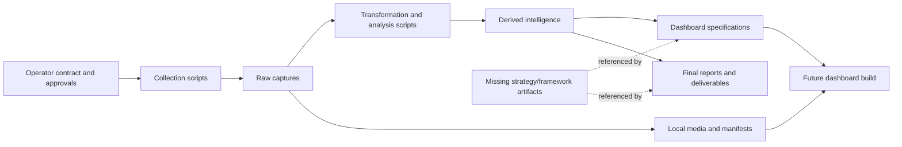
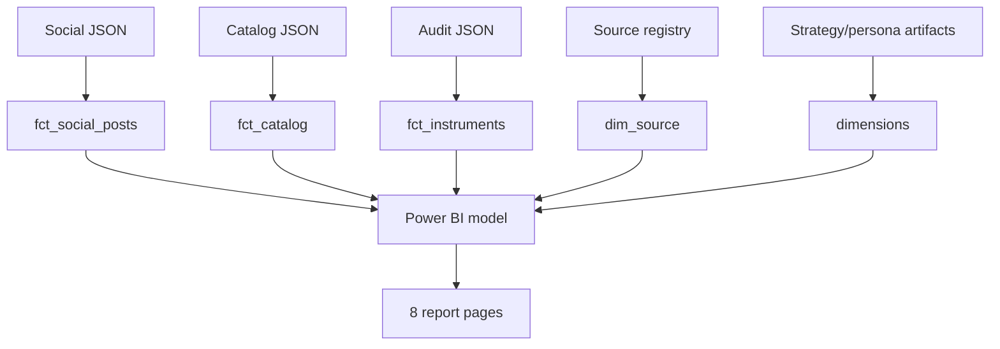
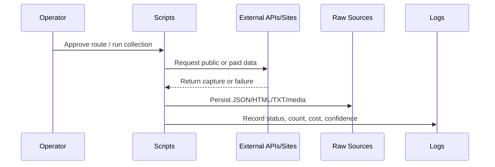
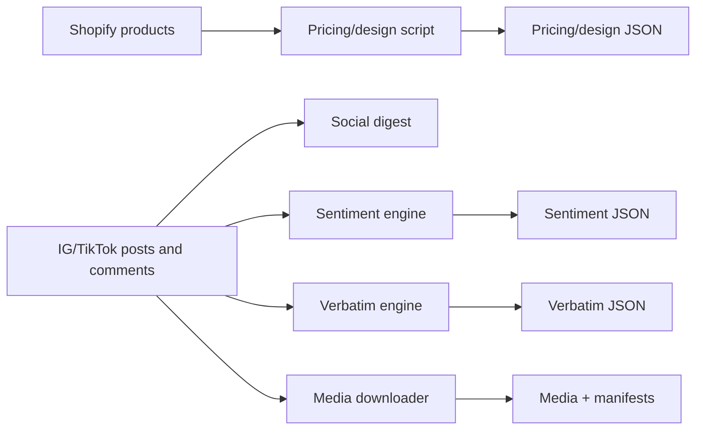
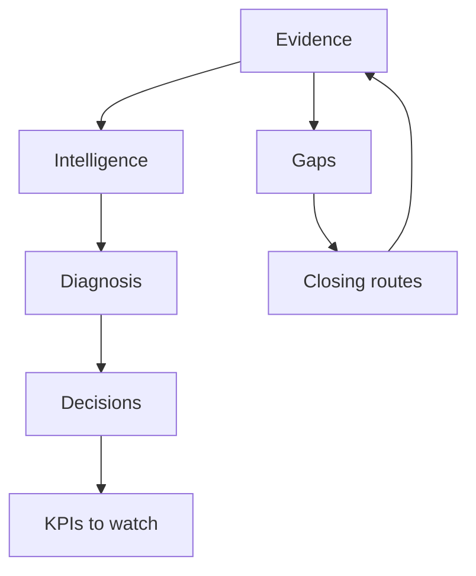
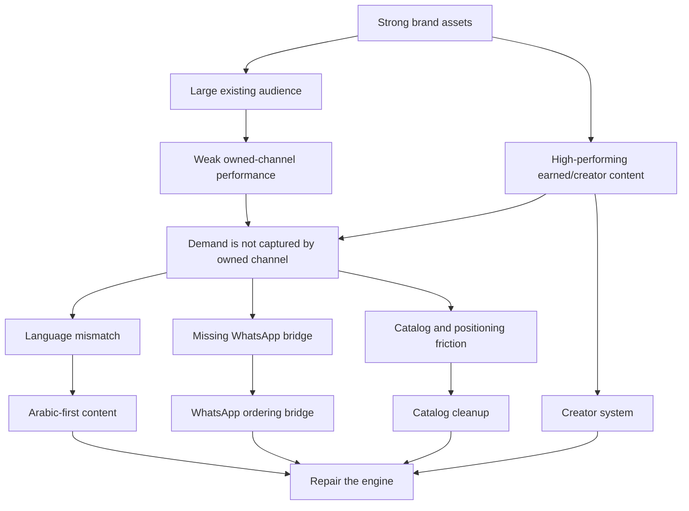

# 01 — Project Understanding

> **System:** Dashboard Intelligence Operating System (DIOS)  
> **Repository:** `omarali304ii-byte/Islam-Brain`  
> **Repository baseline:** `44cea987cd42f077cc0f6e448bcdc69f2683ecb1`  
> **DIOS working branch:** `docs/dios-phase-0-inventory`  
> **Understanding date:** 2026-07-12  
> **Phase status:** Phase 1 — Accepted by owner on 2026-07-12  
> **Previous artifact:** [`00_Project_Inventory.md`](./00_Project_Inventory.md)  
> **Next artifact:** [`02_Dashboard_Architecture.md`](./02_Dashboard_Architecture.md)

---

## Table of Contents

1. [Phase Entry Decision](#1-phase-entry-decision)
2. [Executive Mental Model](#2-executive-mental-model)
3. [Facts, Interpretations, and Unknowns](#3-facts-interpretations-and-unknowns)
4. [Project Identity](#4-project-identity)
5. [Business Goals](#5-business-goals)
6. [Dashboard Goals](#6-dashboard-goals)
7. [Target Users and Their Decisions](#7-target-users-and-their-decisions)
8. [Current System Boundary](#8-current-system-boundary)
9. [Current Repository Architecture](#9-current-repository-architecture)
10. [Intended Dashboard Architecture](#10-intended-dashboard-architecture)
11. [Technology Model](#11-technology-model)
12. [Folder and Artifact Responsibilities](#12-folder-and-artifact-responsibilities)
13. [End-to-End Data Flow](#13-end-to-end-data-flow)
14. [Dataset Generations and Canonicality](#14-dataset-generations-and-canonicality)
15. [Information Architecture](#15-information-architecture)
16. [Navigation and User Flow](#16-navigation-and-user-flow)
17. [Design Philosophy](#17-design-philosophy)
18. [Visualization Philosophy](#18-visualization-philosophy)
19. [Evidence and Confidence Philosophy](#19-evidence-and-confidence-philosophy)
20. [Core Business Narrative](#20-core-business-narrative)
21. [Project Strengths](#21-project-strengths)
22. [Project Weaknesses and Risks](#22-project-weaknesses-and-risks)
23. [Contradictions and Important Nuances](#23-contradictions-and-important-nuances)
24. [What Can and Cannot Be Concluded](#24-what-can-and-cannot-be-concluded)
25. [Working Project Model](#25-working-project-model)
26. [Phase 1 Validation Gate](#26-phase-1-validation-gate)
27. [Glossary](#27-glossary)
28. [Document Control](#28-document-control)

---

## 1. Phase Entry Decision

Phase 0 originally blocked Phase 1 until the repository owner validated the inventory boundary. On 2026-07-12, the owner explicitly instructed the system to proceed with Phase 1.

This is recorded as:

- **Phase 0 acceptance:** Accepted by owner with known limitations.
- **Confirmed project:** `Islam-Brain`, representing the Cielito 360 dashboard/research estate.
- **Known limitations retained:** No complete machine-generated repository tree, no visual inspection of the PDF/PPTX exports, and several referenced external artifacts remain unavailable.
- **Effect:** These limitations do not prevent a reliable project-level mental model, but they restrict claims about the actual dashboard UI and implementation.

> [!IMPORTANT]
> Owner authorization allows Phase 1 to proceed; it does not convert missing evidence into facts. Every unresolved item from Phase 0 remains open unless this phase finds direct evidence.

---

## 2. Executive Mental Model

The project is best understood as **three coupled systems**, not one ordinary dashboard repository.

### 2.1 System A — Evidence Estate

A collection of:

- Website captures
- Shopify catalog data
- Instagram and TikTok captures
- Comments and transcripts
- PageSpeed and agent-readiness audits
- Local media files
- Source and cost logs
- Python collection and analysis scripts

Its purpose is to preserve what was observed and make later claims traceable.

### 2.2 System B — Decision Intelligence Layer

A collection of:

- Catalog intelligence
- Pricing analysis
- Social-performance analysis
- Sentiment scoring
- Verbatim coding
- Technical audits
- Gap registers
- Costed data-acquisition routes
- Executive diagnosis
- Recommended decisions

Its purpose is to transform evidence into decisions without hiding uncertainty.

### 2.3 System C — Dashboard Blueprint

A specification for:

- A React command center
- A Power BI alternative
- An executive narrative
- Diagnostic rooms
- An evidence room
- Source-linked charts
- RequiresData placeholders
- A fail-closed data compiler

Its purpose is to turn the intelligence estate into an interactive, maintainable decision product.

### 2.4 The critical boundary

```text
Systems A and B exist as repository artifacts.
System C exists mainly as specifications.
The runnable dashboard is not confirmed.
```

This is the most important mental model for all later phases.

---

## 3. Facts, Interpretations, and Unknowns

### 3.1 Fact classes

| Class | Meaning | Example |
|---|---|---|
| **Repository fact** | Directly visible in a confirmed repository file. | `catalog_full.json` reports 250 products. |
| **Captured fact** | A public source was captured and stored. | The Instagram profile capture reports 88,903 followers. |
| **Derived fact** | Calculated from captured data. | 96 of 250 products are represented as on sale. |
| **Declared state** | A workflow file says something happened. | `RUN_STATE.json` says the base 360 was delivered. |
| **Interpretation** | A reasoned conclusion from several facts. | Cielito has an owned-channel performance problem. |
| **Hypothesis** | Plausible but not verified. | Fruit leather could be a current differentiator. |
| **Unknown** | Evidence is missing or contradictory. | Whether the React dashboard was built elsewhere. |

### 3.2 Confidence rule

A polished final document is not automatically stronger evidence than a raw capture. Claims should trace backward:

```text
Final narrative → derived intelligence → raw capture → original public/client source
```

---

## 4. Project Identity

### 4.1 Repository identity

- Repository name: `Islam-Brain`
- Confirmed project content: Cielito Egypt / Cielito 360
- Primary run: `cielito-egypt-base360-2026-07-09`
- Declared model/runtime label: `Claude-Fable-5`
- Declared primary lens: Executive
- Declared secondary lens: Marketer

### 4.2 What the project is

The project is a research-and-dashboard estate created to understand Cielito Egypt and produce a decision-grade 360 command center.

It combines:

- Brand and business research
- Social-media collection
- Catalog analysis
- Customer-language analysis
- Website audits
- Strategic synthesis
- Dashboard planning
- Client-facing exports

### 4.3 What the project is not yet confirmed to be

It is not yet confirmed as:

- A deployable React repository
- A running SaaS dashboard
- A refreshable Power BI package
- A database-backed analytics product
- A continuously scheduled data pipeline
- A complete customer analytics system

---

## 5. Business Goals

### 5.1 Primary client business goal

Help Cielito convert existing brand equity, audience attention, and creator activity into a stronger owned growth and conversion engine.

### 5.2 Core diagnosis reflected by the project

The project presents this thesis:

> Cielito has a real brand, audience, catalog, and word-of-mouth engine, but its owned content and conversion path do not capture the available demand.

### 5.3 Priority business decisions

The persistent decision model is:

1. Install a WhatsApp ordering bridge.
2. Clean the catalog and switch to Arabic-first content.
3. Formalize creators into a repeatable program.
4. Improve mobile performance.
5. Resolve founder-level positioning questions.

### 5.4 Monitoring goals

The proposed watch list includes:

- Owned engagement rate
- Owned-versus-earned performance
- WhatsApp conversations
- TikTok efficiency
- Mobile performance
- Catalog hygiene
- UGC velocity
- Discount discipline

### 5.5 Agency/business-development goal

The dashboard is also a WOM agency pitch centerpiece. It is intended to demonstrate that the agency can produce a living, evidence-linked command center rather than a generic slide report.

This means the project serves two business systems:

- **Cielito decision support**
- **WOM capability demonstration and paid-engagement conversion**

---

## 6. Dashboard Goals

### 6.1 Primary goal

Give leadership a decision-grade view of the business in approximately 30 seconds, with deeper evidence available when required.

### 6.2 Secondary goal

Give marketers and operators detailed rooms for:

- Social performance
- Post exploration
- Creator analysis
- Sentiment and verbatims
- Catalog and pricing
- Product design
- Website health
- Competitive context
- Audience/personas
- Content planning
- Strategy
- Evidence

### 6.3 Trust goal

Every important number should disclose:

- Source
- Sample size
- Capture window
- Confidence or source grade

### 6.4 Honesty goal

When data is missing, the dashboard should show:

```text
Requires data — [route]
```

It must not display:

- Invented values
- Fake financial projections
- Zero values that really mean unknown
- Unsupported absence claims
- Unlabeled hypotheses

### 6.5 Completion goal

The deepening prompt defines a tab as complete when it contains at least 20 cards, each being either:

- A source-tagged real chart, or
- A clearly labeled RequiresData card with an acquisition route

This is a completeness contract, not proof of implementation.

---

## 7. Target Users and Their Decisions

### 7.1 Executive/owner

**Needs to know:**

- What is happening?
- Why does it matter?
- What should be decided first?
- What can be fixed quickly?
- What should be monitored?
- Which claims are certain versus uncertain?

**Preferred experience:**

- Verdict first
- Three decisions
- Financial honesty
- Few high-load-bearing visuals
- Optional evidence drill-down

### 7.2 Marketing lead/operator

**Needs to know:**

- Which posts perform?
- Which language and format work?
- Who creates earned attention?
- Which content themes create intent?
- What should be published next?
- How should the creator system operate?

### 7.3 Analyst/researcher

**Needs to know:**

- Data sources
- Capture windows
- Sample sizes
- Raw-versus-derived status
- Confidence grades
- Dataset generation
- Missing data
- Method limitations

### 7.4 Developer/dashboard builder

**Needs to know:**

- Expected pages and components
- Data contracts
- Source IDs
- Validation rules
- Missing-state behavior
- Media handling
- Build/deploy target

### 7.5 Agency strategist/sales team

**Needs to know:**

- How the evidence supports the pitch
- Which recommendations are immediate
- What additional paid work can be proposed
- What client data unlocks financial scenarios

### 7.6 Target-user validation status

No user interviews, usability tests, stakeholder recordings, or approved acceptance criteria are confirmed. Target users are inferred from the executive/marketer lens and deliverable language.

---

## 8. Current System Boundary

### 8.1 Inside the confirmed repository

- Operating prompt
- Run-state file
- Source registry
- Website captures
- Social captures
- Search corpus
- Collection scripts
- Analysis scripts
- Catalog intelligence
- Social intelligence
- Sentiment output
- Verbatim output
- Local media
- Technical audits
- React specification
- Power BI specification
- Creative briefs
- Final reports
- PDF/PPTX deliverables
- DIOS documentation

### 8.2 Referenced but outside or unconfirmed

- `strategy.json`
- `strategy/MARKETING_STRATEGY.md`
- `dashboard/build_cielito_data.py`
- `cielito_360_data.json`
- React source and components
- `scripts/banned_vocab.py`
- `gaps.yaml`
- `CONTENT_INTELLIGENCE.md`
- `VOICE_VALIDATION`
- `SOV_BATTLE_MAP`
- `CAMPAIGN_CALENDAR`
- Evidence-ledger records
- `ESTATE_STATE.json`
- Runtime workflow scripts
- `esm-landing` deployment repository
- Power BI `.pbix`
- Power BI seed CSVs and validator

### 8.3 External systems used or expected

- Cielito Shopify storefront
- Instagram
- TikTok
- Apify
- Google PageSpeed Insights
- Local CAMeLBERT model
- Client Shopify/analytics exports
- Power BI
- Future React application host

---

## 9. Current Repository Architecture

The current architecture is file-oriented and pipeline-oriented rather than application-oriented.



### 9.1 Architectural style

- Batch collection
- Local file persistence
- Script-based transformations
- Static JSON/Markdown outputs
- Explicit source registry
- Human-readable decision documents
- Future compile step into dashboard-ready JSON

### 9.2 Current persistence model

There is no database in the confirmed repository. Persistence is achieved through:

- JSON
- Markdown
- YAML
- HTML/TXT/XML captures
- JPG media
- PDF/PPTX exports

### 9.3 Current execution model

Scripts are executed manually or through an external “Mega Run” estate runtime. Evidence for the runtime itself is outside the repository.

### 9.4 Current architecture limitation

There is no confirmed central orchestrator, package manifest, schema registry, CI pipeline, test suite, or application runtime inside the repository.

---

## 10. Intended Dashboard Architecture

### 10.1 Intended React path

```mermaid
flowchart TD
    A[strategy.json] --> E[build_cielito_data.py]
    B[_intel JSON datasets] --> E
    C[instruments JSON audits] --> E
    D[local media manifests] --> E
    V[banned vocabulary and validation rules] --> E
    E -->|fail closed| F[cielito_360_data.json]
    F --> G[React dashboard]
    G --> H[/dashboard/cielito-360]
```

### 10.2 Compiler responsibilities

The proposed compiler must block output when it finds:

- Unsourced KPIs
- Missing source IDs
- Unguarded money values
- Internal vocabulary in client copy
- Missing media
- Oversized media
- CDN-hotlinked images
- Unsupported self-reported or hypothesis-grade claims

### 10.3 Intended frontend structure

- Persistent Decision Dock
- Executive five-screen story
- Diagnostic rooms/tabs
- Evidence room
- Chart cards
- RequiresData cards
- Sortable tables
- Media thumbnails
- Confidence/source footers

### 10.4 Intended Power BI path



### 10.5 Critical implementation truth

Both architectures are specifications. Neither is confirmed as implemented.

---

## 11. Technology Model

### 11.1 Confirmed technologies

| Technology | Role | Status |
|---|---|---|
| Python | Collection, transformation, scoring, media download | Confirmed |
| Python standard library | HTTP, JSON, filesystem, regex, statistics | Confirmed |
| PyTorch | Sentiment-model inference | Referenced in confirmed script |
| Hugging Face Transformers | Tokenizer and sequence-classification model | Referenced in confirmed script |
| CAMeLBERT-DA Egyptian | Arabic sentiment model | Confirmed as declared runtime dependency |
| Apify REST API | Instagram/TikTok/comment collection | Confirmed |
| Shopify public JSON endpoints | Catalog and collection source | Confirmed |
| Google PageSpeed API | Website-performance audit | Confirmed |
| Markdown | Specifications, reports, prompts, registries | Confirmed |
| JSON | Raw and derived data | Confirmed |
| YAML | Scraping evidence log | Confirmed |
| HTML/XML/TXT | Website and discovery captures | Confirmed |
| JPG | Local visual-review assets | Confirmed |

### 11.2 Intended technologies

| Technology | Intended role | Status |
|---|---|---|
| React | Web dashboard UI | Specified, not confirmed |
| D3 or compatible chart layer | Visualization implementation | Referenced by specification, not confirmed |
| Power BI | Alternative BI dashboard | Specified, not confirmed |
| DAX | Power BI measures | Specified, not confirmed |
| Leonardo Phoenix | Compatible image-generation prompts | Briefs present; generated outputs not confirmed |

### 11.3 Environment characteristics

Confirmed scripts contain absolute Windows paths such as:

```text
C:/Users/eslam/MyKnoweldgeBase/SmartProds/Research/cielito-egypt/Claude-Fable-5
C:\Users\eslam\.secrets\gtm-saas.env
```

This indicates the estate was developed in a specific local Windows environment.

### 11.4 Reproducibility status

Not confirmed:

- Python version
- `requirements.txt`
- `pyproject.toml`
- Model checksum
- Model download instructions
- Environment variables specification
- Test command
- Build command
- CI workflow

---

## 12. Folder and Artifact Responsibilities

### 12.1 Root

| Artifact | Responsibility |
|---|---|
| `CIELITO_TAB_DEEPENING_MASTER_PROMPT.md` | Defines dashboard expansion and evidence rules. |
| `RUN_STATE.json` | Declares run identity, completion state, costs, and next actions. |

### 12.2 `_sources/`

The raw evidence boundary.

- `website/` stores storefront and public endpoint captures.
- `social/` stores Instagram/TikTok data and run summaries.
- `search/` stores secondary web research.

Rule: raw evidence should remain distinguishable from interpretation.

### 12.3 `_intel/`

The analysis and control boundary.

Contains:

- Source registry
- Data-pass menu
- Collection scripts
- Analysis scripts
- Derived JSON
- Scraping evidence log

This directory acts as the analytical engine.

### 12.4 `_media/`

The local media boundary.

Contains:

- Instagram screenshots/images
- TikTok covers
- Product samples
- Manifests
- Transcripts

The intended use is visual review and local dashboard media, not CDN hotlinking.

### 12.5 `instruments/`

Technical measurement outputs:

- PageSpeed
- Agent readiness

These describe the client website, not the unbuilt dashboard.

### 12.6 `dashboard/`

Implementation specifications:

- React architecture
- Power BI architecture

The directory name may imply source code, but confirmed content is documentation only.

### 12.7 `creative/`

Campaign-image concepts and generation briefs.

The palette is explicitly provisional and synthetic media must be labeled.

### 12.8 `final/`

Client-safe decision narratives:

- Board summary
- Decision Dock
- Executive brief
- Mega 360 report
- Next steps

### 12.9 `deliverables/`

Export-ready files:

- PDF strategy
- PowerPoint strategy deck
- JSON handoff copy

### 12.10 `docs/DIOS/`

Permanent project-understanding artifacts created by this operating system.

---

## 13. End-to-End Data Flow

### 13.1 Collection flow



### 13.2 Analysis flow



### 13.3 Decision flow



The gap loop is intentional: missing evidence becomes an explicit future data-acquisition action.

---

## 14. Dataset Generations and Canonicality

The project contains multiple generations of social data.

### 14.1 Observed generations

| Generation | Approximate scope | Main artifacts | Intended use |
|---|---:|---|---|
| Initial Instagram | 60 mixed posts | `instagram_posts.json`, `social_intel.json` | Base social diagnosis |
| Corrective owned Instagram | 50 pulled, 17 unique owned in selected window | `instagram_owned_posts.json`, `instagram_owned_intel.json` | Clean owned baseline |
| Deep Instagram | 150 posts | `instagram_posts_deep.json` | Dense dashboard/media analysis |
| Deep Instagram comments | 898 comments on top 40 posts | `instagram_comments_deep.json` | Sentiment/verbatim corpus |
| TikTok videos | 60 videos | `tiktok_videos.json`, `social_intel.json` | Platform performance |
| TikTok comments | 60 collected, 51 represented in sentiment output | `tiktok_comments.json` | Sentiment/verbatims |
| Sentiment aggregate | 1,050 items | `cielito_social_sentiment.json` | Review Explorer and sentiment views |
| Verbatim aggregate | 964 comments | `cielito_verbatims_analysis.json` | Qualitative voice analysis |

### 14.2 Canonical dataset problem

The repository does not define one machine-readable precedence contract for:

- Initial versus deep captures
- Raw versus temporary normalized files
- Earlier versus later narrative counts
- Social posts versus comments versus captions
- Dashboard v1 measures versus deepening-prompt measures

### 14.3 Working precedence for understanding

Until a formal manifest exists:

1. Use the newest raw capture for exhaustive analysis.
2. Use the corrective owned dataset for owned-channel baselines.
3. Use the source registry when interpreting the original Base 360 pitch.
4. Use the deepening master prompt for intended expanded dashboard scope.
5. Never combine counts across generations without naming the generation and window.

This is a Phase 1 working rule, not a repository-enforced rule.

---

## 15. Information Architecture

The intended information architecture uses four levels.

### 15.1 L0 — Decision Dock

Persistent strip on every screen:

- Verdict
- Three decisions
- Financial honesty chip
- North-star metric

Purpose: prevent drill-down from disconnecting users from the business decision.

### 15.2 L1 — Five-Screen Executive Story

| Screen | Question | Core content |
|---|---|---|
| 1 | What is happening? | Audience size, weak owned posts, earned-content gap |
| 2 | Why? | Language mismatch, WhatsApp gap, identity drift |
| 3 | What is the financial impact? | Locked scenario shell pending client data |
| 4 | What should we decide? | Three sequenced actions and first moves |
| 5 | What should we watch? | Eight KPI covenant metrics |

### 15.3 L2 — Diagnostic Rooms

- Social Command Center
- Catalog & Pricing
- Website & Discoverability
- Competitive
- Audience & Personas
- Content Engine
- Strategy

### 15.4 L3 — Evidence Room

- Source registry
- Confidence grades
- Capture windows
- Sample sizes
- Gap register
- Costed data-pass routes

### 15.5 Architectural intent

The structure moves from:

```text
Decision → Explanation → Diagnosis → Evidence
```

rather than:

```text
Data → More data → More charts → User figures out the point
```

---

## 16. Navigation and User Flow

### 16.1 Intended executive flow


### 16.2 Intended marketer flow


### 16.3 Intended evidence flow


### 16.4 Click-depth principle

The React specification maps major surfaces to zero, one, or two clicks from the diagnostic level. Evidence is allowed to be deeper than the decision story, but still reachable.

### 16.5 Current validation limit

No actual router, navigation component, keyboard behavior, mobile navigation, or interaction implementation is available for inspection.

---

## 17. Design Philosophy

### 17.1 Executive first

The dashboard is designed around decisions, not around displaying every available metric equally.

### 17.2 Repair, do not rebuild

The core narrative treats Cielito as a brand with valuable existing assets. The design should reinforce recovery and activation rather than crisis or total reinvention.

### 17.3 Egyptian and Masri-first context

The category doctrine prioritizes:

- Egyptian Arabic content
- WhatsApp behavior
- Local demand seasons
- Local craftsmanship
- Cairo/Sahel/Ramadan cultural relevance

### 17.4 Evidence visible but not overwhelming

Internal research terminology is intended to remain hidden from client-facing copy, while source and confidence information remains accessible through the evidence layer.

### 17.5 Visual direction

Confirmed creative briefs suggest:

- Warm tan
- Cream
- Terracotta
- Charcoal accents
- Editorial fashion imagery
- Craft detail
- Egyptian context
- Real creator and product media

However, the creative brief explicitly says the palette is provisional until checked against approved brand assets.

### 17.6 Synthetic-media rule

- Real product/founder/creator photography is preferred.
- Generated imagery fills concept gaps.
- Generated imagery must be labeled.

---

## 18. Visualization Philosophy

### 18.1 One question per chart

Charts should answer a clear business question rather than act as decoration.

### 18.2 Insight-led titles

The title should communicate the finding, and the card should include a “So what?” line.

### 18.3 Evidence footer

Every chart should disclose:

- Data-source tag
- Sample size
- Capture window
- Confidence where relevant

### 18.4 Honest missing states

Missing financial, competitor, survey, or platform-insights data must display as RequiresData cards—not zero values.

### 18.5 Scale selection

The owned-versus-earned difference spans large ranges, so the specification requires a log scale, broken axis, or explicit callout.

### 18.6 Semantic color

The prompt proposes:

- Owned = grey
- Earned/creator = terracotta
- Positive = green
- Negative = red
- RequiresData = dashed orange

### 18.7 Real media

The dashboard should use local captured media and permanent links, not temporary CDN hotlinks.

### 18.8 Financial restraint

Money values remain blank or explicitly unbaselined until real client data exists.

---

## 19. Evidence and Confidence Philosophy

### 19.1 Confidence grades

| Grade | Meaning |
|---|---|
| HELD | Primary capture or verified evidence |
| LIKELY | Strong but not fully verified evidence |
| ESTIMATE_ONLY | Banded or derived estimate |
| SELF_REPORTED | Brand/client claim |
| HYPOTHESIS | Plausible but unverified |
| GAP | Missing |

### 19.2 Rules

- A source being inaccessible does not prove absence.
- A hypothesis is never plotted as fact.
- A self-reported claim must remain labeled.
- Every capture should disclose n and time window.
- Gaps should include a closing route.
- Paid collection requires explicit approval.

### 19.3 Evidence room purpose

The evidence room allows a user to answer:

- Where did this claim come from?
- Is it primary or secondary?
- How many items were measured?
- When was it captured?
- What is still missing?
- How much would it cost to close the gap?

---

## 20. Core Business Narrative

The project’s dominant narrative is:



### 20.1 Assets the project identifies

- Verified Instagram audience
- Active creator/word-of-mouth content
- Product catalog
- Egyptian/local-made identity
- Founder story
- Check-before-you-pay delivery mechanic
- Potential fruit-leather heritage

### 20.2 Frictions the project identifies

- Weak owned engagement
- English-heavy owned captions
- No WhatsApp conversion bridge
- Catalog typing/collection hygiene problems
- Large discount surface
- Mobile performance weakness
- Mixed positioning/taglines
- Missing client financial and analytics data

### 20.3 Proposed response

Repair and activate existing assets before spending heavily on audience acquisition.

---

## 21. Project Strengths

### 21.1 Evidence is preserved locally

The project does not rely only on a final deck. It keeps raw captures, derived datasets, logs, and media.

### 21.2 Missing data is treated honestly

RequiresData placeholders and BLANK measures are stronger than fabricated KPIs.

### 21.3 The dashboard has a decision hierarchy

The L0–L3 model separates executive story, diagnosis, and evidence.

### 21.4 Local market context is built into the doctrine

The project recognizes Egyptian Arabic, WhatsApp, cash/check-on-delivery behavior, and seasonal demand windows.

### 21.5 The data-pass menu is operational

Missing evidence has a route, cost, PII classification, and decision state.

### 21.6 The project uses real item-level evidence

Posts, comments, product records, images, and permanent URLs enable drill-down.

### 21.7 It recognizes multiple audiences

Executive and marketer needs are explicitly separated.

### 21.8 It avoids generic dashboard thinking

The dashboard is organized around the brand’s actual business problem rather than a template KPI collection.

---

## 22. Project Weaknesses and Risks

### 22.1 The implementation is absent or external

The largest limitation is the missing React/Power BI build.

### 22.2 Reproducibility is weak

Scripts contain local absolute paths, and no dependency/environment manifest is confirmed.

### 22.3 Dataset canonicality is undefined

Several overlapping social datasets and narrative counts exist.

### 22.4 Some claims may mix incompatible denominators

Examples include owned versus earned comparisons and cross-platform engagement measures.

### 22.5 Catalog option handling is unreliable

The pricing/design script treats `option1` as size, but output includes color values such as `Black`, `Beige`, and `Brown`, plus `Default Title`.

This means the current size-distribution output is not a clean size metric.

### 22.6 Sentiment validation is transferred from another dataset

The engine states 89.5% accuracy on DaleelStore reviews, not on the Cielito social corpus.

### 22.7 Intent detection has false-positive risk

The detector uses substring matching. Short Arabic tokens such as `كام` can match unrelated text. At least one output item appears semantically unrelated to purchase intent.

### 22.8 Internal privacy language is imperfect

The script says “PII fail-closed” but still stores public handles and comment text. That may be acceptable for the project’s handle-only rule, but it is not zero-PII storage.

### 22.9 Security terminology can be misunderstood

“Security clean” in the agent-readiness audit refers to no detected hidden prompt-injection instructions. It is not a full application-security audit.

### 22.10 Source freshness is snapshot-based

Most evidence is captured around July 9–10, 2026. The dashboard is described as living, but no refresh scheduler is confirmed.

### 22.11 Some strategy dependencies are missing

The dashboard relies on strategy, persona, content, competitive, and evidence artifacts not present in the confirmed snapshot.

### 22.12 Cost state is stale or generation-specific

`RUN_STATE.json` records the base cost of `$0.434`, while later deep collection increased total spend.

---

## 23. Contradictions and Important Nuances

### 23.1 Run closed versus project incomplete

- Base 360 research run: closed
- Internal era coverage: partial
- Dashboard build: queued
- Total project: incomplete

### 23.2 120 posts versus 210 posts

- React/Power BI base specification uses a 120-post seed.
- Deepening prompt states 210 posts are available.

These are different dashboard generations.

### 23.3 254 comments versus 964/1,050 items

- Original Social Command Center references 254 comments.
- Verbatim output contains 964 comments.
- Sentiment output contains 1,050 total items because it includes comments and captions.

These counts answer different questions and must not be presented as interchangeable.

### 23.4 Product versus SKU language

The project often says 250 SKUs, but the captured Shopify endpoint contains 250 product objects with variants. Product count and sellable-variant/SKU count are different concepts.

### 23.5 “No WhatsApp” scope

The project reports no WhatsApp path in captured site, bio, and posts. That is strong evidence for observed surfaces, but does not prove no unpublished/manual WhatsApp sales process exists.

### 23.6 Fruit-leather claim

- Press story: likely/secondary evidence
- Current live-site status: not present
- Strategic use: founder-gated hypothesis

It must not be represented as a current active line without confirmation.

### 23.7 Second domain

`mycielito.com` exists and appears to be Shopify, but its ownership and relationship to `cielitoeg.com` remain unknown.

---

## 24. What Can and Cannot Be Concluded

### 24.1 High-confidence conclusions

- The repository contains substantial real evidence and analysis.
- The Cielito public catalog contained 250 captured products at the collection time.
- Recent owned Instagram performance in the corrective sample was weak relative to the account’s follower count.
- Captured earned/creator posts include much stronger individual performance.
- Recent owned Instagram captions were overwhelmingly English in the selected sample.
- Catalog typing and collection hygiene issues exist in the capture.
- Mobile PageSpeed was materially lower than desktop in the audit.
- Financial outcomes cannot be quantified without client data.
- The dashboard implementation is not confirmed in this repository.

### 24.2 Medium-confidence interpretations

- Arabic-first content is likely an immediate improvement lever.
- Creator content is a valuable existing asset.
- A WhatsApp conversion bridge is strategically appropriate.
- Catalog cleanup is likely a low-cost improvement.
- Cielito may have positioning white space between mass volume and premium craft.

### 24.3 Conclusions that cannot currently be made

- Exact revenue uplift
- Exact conversion uplift
- True follower quality
- Audience demographics or geography
- Creator CAC or conversion
- Product sell-through
- Margin by category
- Return rate by design/size
- Full competitive share of voice
- Validated NPS
- Validated brand awareness
- Actual production dashboard usability

---

## 25. Working Project Model

### 25.1 Canonical mental model

```text
Islam-Brain is the Cielito 360 evidence and decision-intelligence estate.
It is designed to feed a future evidence-governed dashboard.
It is not itself the confirmed dashboard application.
```

### 25.2 Working source precedence

```text
Raw captures
    ↓
Latest validated derived dataset
    ↓
Source registry and confidence grade
    ↓
Dashboard compiler
    ↓
Client-safe chart/card
```

### 25.3 Working responsibility model

| Concern | Current source of truth |
|---|---|
| Raw website evidence | `_sources/website/` |
| Raw social evidence | `_sources/social/` |
| Technical audits | `instruments/` |
| Catalog facts | `_intel/catalog_full.json` plus raw product capture |
| Owned Instagram baseline | `_intel/instagram_owned_intel.json` |
| Deep sentiment | `_intel/cielito_social_sentiment.json` with model caveats |
| Verbatim themes | `_intel/cielito_verbatims_analysis.json` with coding caveats |
| Source grades | `_intel/SOURCE_REGISTRY.md` |
| Future data routes | `_intel/data_pass_menu_base360.md` |
| Dashboard intent | `dashboard/react_dashboard_spec.md` and Power BI spec |
| Expanded tab contract | `CIELITO_TAB_DEEPENING_MASTER_PROMPT.md` |
| Executive decisions | `final/DECISION_DOCK.md` |
| Permanent documentation | `docs/DIOS/` |

---

## 26. Phase 1 Validation Gate

### 26.1 Gate checklist

| Quality gate | Result | Evidence / reason |
|---|---|---|
| Were previous artifacts reviewed? | **Yes** | Phase 0 was reviewed and accepted by owner instruction. |
| Are business and dashboard goals understood? | **Yes** | Client, agency, decision, trust, and completeness goals are documented. |
| Are target users identified? | **Yes, inferred** | Executive, marketer, analyst, developer, and agency users are documented; interviews remain missing. |
| Is current architecture separated from intended architecture? | **Yes** | File pipeline and future React/Power BI paths are documented separately. |
| Are technologies and dependencies understood? | **Yes, with reproducibility gaps** | Confirmed and intended technologies are separated. |
| Is the data flow understood? | **Yes** | Collection, analysis, media, dashboard, and decision flows are diagrammed. |
| Is information hierarchy understood? | **Yes** | L0–L3 architecture is documented. |
| Are strengths and weaknesses documented? | **Yes** | Evidence, honesty, architecture, reproducibility, data-quality, and implementation risks are covered. |
| Are contradictions preserved? | **Yes** | Dataset, count, run-state, product/SKU, and hypothesis nuances are retained. |
| Was redesign avoided? | **Yes** | No design or production changes were made. |
| Is Phase 1 complete? | **Yes** | A complete project-level mental model is documented. |
| Was Phase 1 accepted? | **Yes** | Owner authorized Phase 2 on 2026-07-12. |

### 26.2 Phase status

> [!NOTE]
> **Phase 1 was accepted by owner instruction on 2026-07-12.** Phase 2 is documented in [`02_Dashboard_Architecture.md`](./02_Dashboard_Architecture.md).

### 26.3 Remaining inputs that would improve later phases

1. Actual React application or deployment repository.
2. `strategy.json` and missing strategy/content/competitive artifacts.
3. Complete prompt and chat history.
4. Client data and approved acceptance criteria.
5. Dependency and environment manifests.
6. Visual inspection of the PDF/PPTX.

---

## 27. Glossary

| Term | Definition in this project |
|---|---|
| **Agent readiness** | How easily AI agents can discover, read, and interact with the storefront, based on the project’s custom audit. |
| **Base 360** | Initial full research and strategy run for Cielito. |
| **Capture window** | The date range represented by a dataset. |
| **Corrective pull** | Additional collection run intended to fix or isolate a weakness in the original capture. |
| **Decision Dock** | Persistent executive summary containing verdict, priority decisions, financial honesty, and north star. |
| **Diagnostic room** | Detailed dashboard section for a specific business domain. |
| **Evidence estate** | Preserved raw captures, logs, media, and source records. |
| **Fail-closed** | Block output when evidence or validation requirements are not satisfied. |
| **Generation** | A version or stage of a dataset produced by a particular collection/analysis run. |
| **Owned content** | Content published by the brand’s own account. |
| **Earned content** | Public content produced by creators/customers rather than the brand account. |
| **Masri-first** | Prioritizing Egyptian Arabic and Egyptian cultural context. |
| **RequiresData card** | Dashboard card that truthfully explains what data is missing and how to obtain it. |
| **Source grade** | Confidence label describing evidence status. |
| **Word-of-mouth flywheel** | Repeating cycle where creator/customer content produces attention and further participation. |

---

## 28. Document Control

| Field | Value |
|---|---|
| Document | `01_Understanding.md` |
| DIOS phase | 1 |
| Repository baseline | `44cea987cd42f077cc0f6e448bcdc69f2683ecb1` |
| Working branch | `docs/dios-phase-0-inventory` |
| Status | Accepted by owner on 2026-07-12 |
| Previous phase | Phase 0 accepted with limitations |
| Production-code changes | None |
| Dashboard redesign performed | No |
| Next artifact | `02_Dashboard_Architecture.md` |