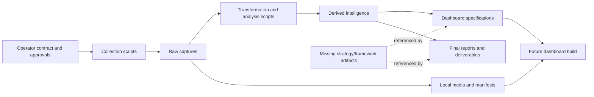
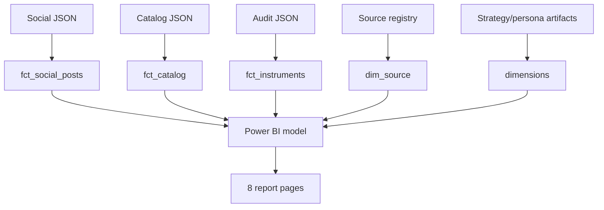
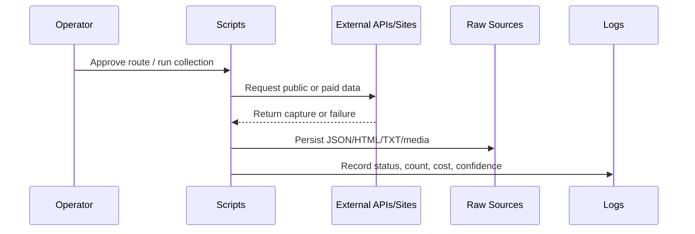
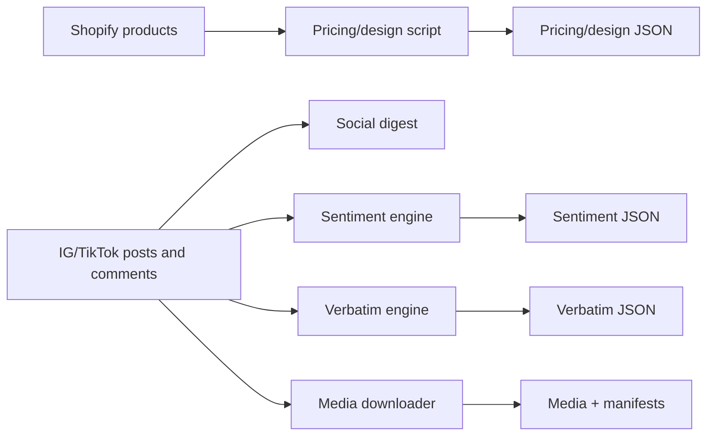
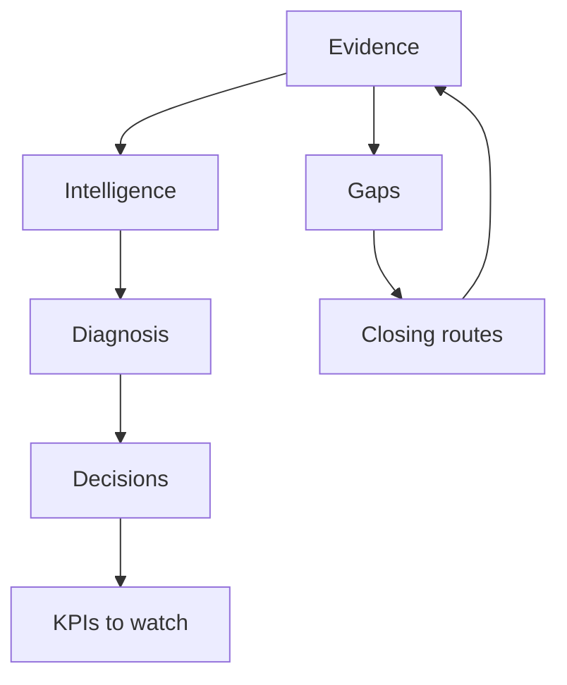

# 01 — Project Understanding

> **System:** Dashboard Intelligence Operating System (DIOS)  
> **Repository:** `omarali304ii-byte/Islam-Brain`  
> **Repository baseline:** `44cea987cd42f077cc0f6e448bcdc69f2683ecb1`  
> **DIOS working branch:** `docs/dios-phase-0-inventory`  
> **Understanding date:** 2026-07-12  
> **Phase status:** Phase 1 — Complete, awaiting validation  
> **Previous artifact:** [`00_Project_Inventory.md`](./00_Project_Inventory.md)  
> **Next phase:** Blocked until this document passes its quality gate

---

## Table of Contents

1. [Phase Entry Decision](#1-phase-entry-decision)
2. [Executive Mental Model](#2-executive-mental-model)
3. [Facts, Interpretations, and Unknowns](#3-facts-interpretations-and-unknowns)
4. [Project Identity](#4-project-identity)
5. [Business Goals](#5-business-goals)
6. [Dashboard Goals](#6-dashboard-goals)
7. [Target Users and Their Decisions](#7-target-users-and-their-decisions)
8. [Current System Boundary](#8-current-system-boundary)
9. [Current Repository Architecture](#9-current-repository-architecture)
10. [Intended Dashboard Architecture](#10-intended-dashboard-architecture)
11. [Technology Model](#11-technology-model)
12. [Folder and Artifact Responsibilities](#12-folder-and-artifact-responsibilities)
13. [End-to-End Data Flow](#13-end-to-end-data-flow)
14. [Dataset Generations and Canonicality](#14-dataset-generations-and-canonicality)
15. [Information Architecture](#15-information-architecture)
16. [Navigation and User Flow](#16-navigation-and-user-flow)
17. [Design Philosophy](#17-design-philosophy)
18. [Visualization Philosophy](#18-visualization-philosophy)
19. [Evidence and Confidence Philosophy](#19-evidence-and-confidence-philosophy)
20. [Core Business Narrative](#20-core-business-narrative)
21. [Project Strengths](#21-project-strengths)
22. [Project Weaknesses and Risks](#22-project-weaknesses-and-risks)
23. [Contradictions and Important Nuances](#23-contradictions-and-important-nuances)
24. [What Can and Cannot Be Concluded](#24-what-can-and-cannot-be-concluded)
25. [Working Project Model](#25-working-project-model)
26. [Phase 1 Validation Gate](#26-phase-1-validation-gate)
27. [Glossary](#27-glossary)
28. [Document Control](#28-document-control)

---

## 1. Phase Entry Decision

Phase 0 originally blocked Phase 1 until the repository owner validated the inventory boundary. On 2026-07-12, the owner explicitly instructed the system to proceed with Phase 1.

This is recorded as:

- **Phase 0 acceptance:** Accepted by owner with known limitations.
- **Confirmed project:** `Islam-Brain`, representing the Cielito 360 dashboard/research estate.
- **Known limitations retained:** No complete machine-generated repository tree, no visual inspection of the PDF/PPTX exports, and several referenced external artifacts remain unavailable.
- **Effect:** These limitations do not prevent a reliable project-level mental model, but they restrict claims about the actual dashboard UI and implementation.

> [!IMPORTANT]
> Owner authorization allows Phase 1 to proceed; it does not convert missing evidence into facts. Every unresolved item from Phase 0 remains open unless this phase finds direct evidence.

---

## 2. Executive Mental Model

The project is best understood as **three coupled systems**, not one ordinary dashboard repository.

### 2.1 System A — Evidence Estate

A collection of:

- Website captures
- Shopify catalog data
- Instagram and TikTok captures
- Comments and transcripts
- PageSpeed and agent-readiness audits
- Local media files
- Source and cost logs
- Python collection and analysis scripts

Its purpose is to preserve what was observed and make later claims traceable.

### 2.2 System B — Decision Intelligence Layer

A collection of:

- Catalog intelligence
- Pricing analysis
- Social-performance analysis
- Sentiment scoring
- Verbatim coding
- Executive conclusions
- Strategic decisions
- Data-gap routes

Its purpose is to transform evidence into decisions while preserving uncertainty.

### 2.3 System C — Dashboard Blueprint

A proposed:

- React command center
- Power BI alternative
- Executive information architecture
- Marketer drill-down model
- Evidence room
- Fail-closed data compiler
- Source-aware chart system

Its purpose is to make the decision intelligence explorable and continuously refreshable.

### 2.4 Current reality

```text
Evidence Estate              = Present
Decision Intelligence Layer  = Present
Dashboard Specifications     = Present
Runnable React Dashboard     = Not confirmed
Runnable Power BI Dashboard  = Not confirmed
Deployment                   = Not confirmed
```

The repository therefore contains a **well-developed dashboard brain and evidence package**, but not a confirmed dashboard body.

---

## 3. Facts, Interpretations, and Unknowns

### 3.1 Classification method

| Classification | Meaning |
|---|---|
| **Fact** | Directly supported by a confirmed repository artifact. |
| **Interpretation** | A reasoned explanation supported by multiple artifacts, but not explicitly declared in one canonical source. |
| **Unknown** | Evidence is missing, contradictory, incomplete, or external. |

### 3.2 Project-level truth table

| Statement | Classification | Confidence | Evidence basis |
|---|---|---:|---|
| The represented client is Cielito Egypt. | Fact | High | `RUN_STATE.json`, source registry, reports, dashboard specs. |
| The project was created as a WOM pitch/research centerpiece. | Fact | High | React spec, next steps, run state. |
| The primary dashboard audience is an executive and the secondary audience is a marketer. | Fact | High | `RUN_STATE.json`, React spec. |
| The intended product is a living command center rather than a static slide deck. | Fact | High | React spec. |
| The repository currently contains the React application. | Unknown / unsupported | High confidence that it is unconfirmed | Build is described as future work; deploy list is empty. |
| The dashboard already uses the dashed-orange RequiresData component. | Unknown | Medium | The prompt says it is “already in the build,” but the build is not present. |
| The dashboard is production-ready. | Unsupported | High | No application code, tests, deployment, or runtime evidence. |
| Cielito has a large audience but weak owned-channel engagement. | Fact within the captured windows | High | Instagram profile and owned-post intelligence. |
| Creator/earned content materially outperforms recent owned posts. | Fact within the selected datasets | High | Social and owned-post datasets. |
| WhatsApp will improve conversion. | Strategic hypothesis | Medium | Strong market/category reasoning, but no client conversion experiment is present. |
| Arabic-first content will improve performance. | Evidence-backed strategic interpretation | Medium–High | Better-performing Arabic examples exist; no controlled experiment is present. |
| Fruit leather is an active current differentiator. | Unknown / hypothesis | Low | Secondary press evidence exists; live-site status and founder intent are unresolved. |
| Financial upside is known. | False | High | Financial measures are explicitly “to be baselined.” |

---

## 4. Project Identity

### 4.1 Formal identity

| Field | Current understanding |
|---|---|
| Project name | Cielito 360 |
| Repository name | Islam-Brain |
| Client | Cielito Egypt |
| Client category | Egyptian women’s fashion and footwear D2C brand |
| Agency/business context | WOM pitch and potential paid engagement |
| Research run | `cielito-egypt-base360-2026-07-09` |
| Declared model | `Claude-Fable-5` |
| Primary lens | Executive |
| Secondary lens | Marketer |
| Current repository mode | Evidence, intelligence, specifications, and deliverables |
| Intended future mode | Living web dashboard and/or refreshable Power BI report |

### 4.2 What the name `Islam-Brain` means in practice

The repository name does not describe the client or dashboard. The contents consistently describe Cielito Egypt and Cielito 360. Therefore:

- **Fact:** The repository is named `Islam-Brain`.
- **Fact:** The contained project is Cielito 360.
- **Interpretation:** `Islam-Brain` is likely a container or personal/project knowledge repository name rather than the product name.
- **Unknown:** Whether the repository will later contain multiple client brains.

---

## 5. Business Goals

The project serves two business layers.

### 5.1 Client business goal

Help Cielito repair an existing brand and commercial engine rather than rebuild the brand from zero.

The proposed sequence is:

1. Install a WhatsApp conversion bridge.
2. Clean catalog structure and switch toward Arabic-first content.
3. Formalize the creator/UGC engine.
4. Improve mobile site performance.
5. Resolve founder-level positioning questions.

The strategic thesis is:

> Cielito already has audience, brand assets, products, and creator attention. The fastest value comes from reconnecting those assets into a measurable conversion and content system.

### 5.2 Agency/WOM business goal

Use the 360 research and dashboard as a pitch centerpiece that demonstrates:

- Research depth
- Evidence traceability
- Strategic clarity
- Technical capability
- A differentiated owned-versus-earned diagnosis
- A credible route from free findings to paid engagement

`final/NEXT_STEPS.md` explicitly connects the work to a future priced proposal.

### 5.3 Data-business goal

Turn missing information into a managed commercial conversation rather than a hidden weakness.

Examples:

- Client data request unlocks ROI scenarios.
- Follower-quality audit unlocks paid-media confidence.
- Competitive data pass unlocks benchmark views.
- Survey unlocks awareness and price-elasticity analysis.

This makes the gap register part of the sales and research architecture.

---

## 6. Dashboard Goals

### 6.1 Primary goal

Enable an owner or executive to understand the diagnosis and required decisions in approximately 30 seconds.

### 6.2 Secondary goal

Allow marketers to drill from the executive conclusion into:

- Social performance
- Post-level evidence
- Creator activity
- Language performance
- Voice of customer
- Catalog and pricing
- Website health
- Competitive context
- Audience and personas
- Content plan

### 6.3 Trust goal

Make every important number traceable to:

- A source ID
- A confidence grade
- A sample size
- A capture window
- A route for closing missing data

### 6.4 Operational goal

Become refreshable after the client provides:

- Shopify exports
- GA4
- Instagram Insights
- TikTok Insights
- Revenue/order data

### 6.5 Expansion goal

Reach at least 20 cards per tab without inventing data. Missing cards remain visible as RequiresData placeholders.

### 6.6 Non-goals

The repository does not support the following as current goals:

- A general-purpose ecommerce administration dashboard
- A transaction-processing system
- A live social publishing platform
- A CRM
- A real-time financial system
- A replacement for Shopify or Meta Insights

---

## 7. Target Users and Their Decisions

### 7.1 Primary user — Owner / Executive

**Needs:**

- A decisive summary
- Business implications
- A short sequence of actions
- Honest uncertainty
- A small monitoring covenant

**Questions:**

- What is happening?
- Why is it happening?
- What is it costing us?
- What should we decide?
- What should we watch?

**Expected interaction depth:** Low. The executive shell should answer most questions without deep navigation.

### 7.2 Secondary user — Marketer / Growth Operator

**Needs:**

- Post-level performance
- Language and format comparisons
- Creator roster
- Content patterns
- Audience signals
- Campaign calendar
- Conversion-friction evidence

**Questions:**

- Which content works?
- Is Arabic outperforming English?
- Which creators matter?
- Where does purchase intent appear?
- Which category or price band needs attention?
- What should be published next?

**Expected interaction depth:** Medium. This user drills into diagnostic rooms and data tables.

### 7.3 Evidence user — Analyst / Researcher / Reviewer

**Needs:**

- Source provenance
- Capture windows
- Dataset sizes
- Confidence grades
- Raw-to-derived relationships
- Explicit gaps and contradictions

**Questions:**

- Where did this claim come from?
- Is this primary, secondary, inferred, or missing?
- Which dataset generation produced it?
- Can it be reproduced?

**Expected interaction depth:** High. This user enters the Evidence Room and may inspect repository artifacts.

### 7.4 Implementation user — Developer / Future AI

**Needs:**

- Canonical data contracts
- Component rules
- Chart specifications
- Build validation
- Runtime dependencies
- Source schemas

**Current limitation:** The implementation contract exists, but the actual app, compiler, component library, and dependency manifests are unavailable.

### 7.5 Client team / BI user

The Power BI specification suggests an alternate user who prefers:

- Refreshable business intelligence
- Familiar page-based reports
- DAX measures
- Scheduled/manual refresh
- Bilingual field labels

---

## 8. Current System Boundary

### 8.1 Inside the repository

- Operating prompt
- Run state
- Source registry
- Raw captures
- Derived datasets
- Python scripts
- Media
- Technical audits
- Dashboard specifications
- Executive documents
- PDF/PPTX deliverables
- DIOS documentation

### 8.2 Referenced but outside or missing

- `strategy.json`
- `strategy/MARKETING_STRATEGY.md`
- `dashboard/build_cielito_data.py`
- `cielito_360_data.json`
- React source and components
- `scripts/banned_vocab.py`
- `gaps.yaml`
- `CONTENT_INTELLIGENCE.md`
- `VOICE_VALIDATION`
- `SOV_BATTLE_MAP`
- `CAMPAIGN_CALENDAR`
- Evidence-ledger records
- `ESTATE_STATE.json`
- Runtime workflow scripts
- `esm-landing` deployment repository
- Power BI `.pbix`
- Power BI seed CSVs and validator

### 8.3 External systems used or expected

- Cielito Shopify storefront
- Instagram
- TikTok
- Apify
- Google PageSpeed Insights
- Local CAMeLBERT model
- Client Shopify/analytics exports
- Power BI
- Future React application host

---

## 9. Current Repository Architecture

The current architecture is file-oriented and pipeline-oriented rather than application-oriented.



### 9.1 Architectural style

- Batch collection
- Local file persistence
- Script-based transformations
- Static JSON/Markdown outputs
- Explicit source registry
- Human-readable decision documents
- Future compile step into dashboard-ready JSON

### 9.2 Current persistence model

There is no database in the confirmed repository. Persistence is achieved through:

- JSON
- Markdown
- YAML
- HTML/TXT/XML captures
- JPG media
- PDF/PPTX exports

### 9.3 Current execution model

Scripts are executed manually or through an external “Mega Run” estate runtime. Evidence for the runtime itself is outside the repository.

### 9.4 Current architecture limitation

There is no confirmed central orchestrator, package manifest, schema registry, CI pipeline, test suite, or application runtime inside the repository.

---

## 10. Intended Dashboard Architecture

### 10.1 Intended React path

```mermaid
flowchart TD
    A[strategy.json] --> E[build_cielito_data.py]
    B[_intel JSON datasets] --> E
    C[instruments JSON audits] --> E
    D[local media manifests] --> E
    V[banned vocabulary and validation rules] --> E
    E -->|fail closed| F[cielito_360_data.json]
    F --> G[React dashboard]
    G --> H[/dashboard/cielito-360]
```

### 10.2 Compiler responsibilities

The proposed compiler must block output when it finds:

- Unsourced KPIs
- Missing source IDs
- Unguarded money values
- Internal vocabulary in client copy
- Missing media
- Oversized media
- CDN-hotlinked images
- Unsupported self-reported or hypothesis-grade claims

### 10.3 Intended frontend structure

- Persistent Decision Dock
- Executive five-screen story
- Diagnostic rooms/tabs
- Evidence room
- Chart cards
- RequiresData cards
- Sortable tables
- Media thumbnails
- Confidence/source footers

### 10.4 Intended Power BI path



### 10.5 Critical implementation truth

Both architectures are specifications. Neither is confirmed as implemented.

---

## 11. Technology Model

### 11.1 Confirmed technologies

| Technology | Role | Status |
|---|---|---|
| Python | Collection, transformation, scoring, media download | Confirmed |
| Python standard library | HTTP, JSON, filesystem, regex, statistics | Confirmed |
| PyTorch | Sentiment-model inference | Referenced in confirmed script |
| Hugging Face Transformers | Tokenizer and sequence-classification model | Referenced in confirmed script |
| CAMeLBERT-DA Egyptian | Arabic sentiment model | Confirmed as declared runtime dependency |
| Apify REST API | Instagram/TikTok/comment collection | Confirmed |
| Shopify public JSON endpoints | Catalog and collection source | Confirmed |
| Google PageSpeed API | Website-performance audit | Confirmed |
| Markdown | Specifications, reports, prompts, registries | Confirmed |
| JSON | Raw and derived data | Confirmed |
| YAML | Scraping evidence log | Confirmed |
| HTML/XML/TXT | Website and discovery captures | Confirmed |
| JPG | Local visual-review assets | Confirmed |

### 11.2 Intended technologies

| Technology | Intended role | Status |
|---|---|---|
| React | Web dashboard UI | Specified, not confirmed |
| D3 or compatible chart layer | Visualization implementation | Referenced by specification, not confirmed |
| Power BI | Alternative BI dashboard | Specified, not confirmed |
| DAX | Power BI measures | Specified, not confirmed |
| Leonardo Phoenix | Compatible image-generation prompts | Briefs present; generated outputs not confirmed |

### 11.3 Environment characteristics

Confirmed scripts contain absolute Windows paths such as:

```text
C:/Users/eslam/MyKnoweldgeBase/SmartProds/Research/cielito-egypt/Claude-Fable-5
C:\Users\eslam\.secrets\gtm-saas.env
```

This indicates the estate was developed in a specific local Windows environment.

### 11.4 Reproducibility status

Not confirmed:

- Python version
- `requirements.txt`
- `pyproject.toml`
- Model checksum
- Model download instructions
- Environment variables specification
- Test command
- Build command
- CI workflow

---

## 12. Folder and Artifact Responsibilities

### 12.1 Root

| Artifact | Responsibility |
|---|---|
| `CIELITO_TAB_DEEPENING_MASTER_PROMPT.md` | Defines dashboard expansion and evidence rules. |
| `RUN_STATE.json` | Declares run identity, completion state, costs, and next actions. |

### 12.2 `_sources/`

The raw evidence boundary.

- `website/` stores storefront and public endpoint captures.
- `social/` stores Instagram/TikTok data and run summaries.
- `search/` stores secondary web research.

Rule: raw evidence should remain distinguishable from interpretation.

### 12.3 `_intel/`

The analysis and control boundary.

Contains:

- Source registry
- Data-pass menu
- Collection scripts
- Analysis scripts
- Derived JSON
- Scraping evidence log

This directory acts as the analytical engine.

### 12.4 `_media/`

The local media boundary.

Contains:

- Instagram screenshots/images
- TikTok covers
- Product samples
- Manifests
- Transcripts

The intended use is visual review and local dashboard media, not CDN hotlinking.

### 12.5 `instruments/`

Technical measurement outputs:

- PageSpeed
- Agent readiness

These describe the client website, not the unbuilt dashboard.

### 12.6 `dashboard/`

Implementation specifications:

- React architecture
- Power BI architecture

The directory name may imply source code, but confirmed content is documentation only.

### 12.7 `creative/`

Campaign-image concepts and generation briefs.

The palette is explicitly provisional and synthetic media must be labeled.

### 12.8 `final/`

Client-safe decision narratives:

- Board summary
- Decision Dock
- Executive brief
- Mega 360 report
- Next steps

### 12.9 `deliverables/`

Export-ready files:

- PDF strategy
- PowerPoint strategy deck
- JSON handoff copy

### 12.10 `docs/DIOS/`

Permanent project-understanding artifacts created by this operating system.

---

## 13. End-to-End Data Flow

### 13.1 Collection flow



### 13.2 Analysis flow



### 13.3 Decision flow



The gap loop is intentional: missing evidence becomes an explicit future data-acquisition action.

---

## 14. Dataset Generations and Canonicality

The project contains multiple generations of social data.

### 14.1 Observed generations

| Generation | Approximate scope | Main artifacts | Intended use |
|---|---:|---|---|
| Initial Instagram | 60 mixed posts | `instagram_posts.json`, `social_intel.json` | Base social diagnosis |
| Corrective owned Instagram | 50 pulled, 17 unique owned in selected window | `instagram_owned_posts.json`, `instagram_owned_intel.json` | Clean owned baseline |
| Deep Instagram | 150 posts | `instagram_posts_deep.json` | Dense dashboard/media analysis |
| Deep Instagram comments | 898 comments on top 40 posts | `instagram_comments_deep.json` | Sentiment/verbatim corpus |
| TikTok videos | 60 videos | `tiktok_videos.json`, `social_intel.json` | Platform performance |
| TikTok comments | 60 collected, 51 represented in sentiment output | `tiktok_comments.json` | Sentiment/verbatims |
| Sentiment aggregate | 1,050 items | `cielito_social_sentiment.json` | Review Explorer and sentiment views |
| Verbatim aggregate | 964 comments | `cielito_verbatims_analysis.json` | Qualitative voice analysis |

### 14.2 Canonical dataset problem

The repository does not define one machine-readable precedence contract for:

- Initial versus deep captures
- Raw versus temporary normalized files
- Earlier versus later narrative counts
- Social posts versus comments versus captions
- Dashboard v1 measures versus deepening-prompt measures

### 14.3 Working precedence for understanding

Until a formal manifest exists:

1. Use the newest raw capture for exhaustive analysis.
2. Use the corrective owned dataset for owned-channel baselines.
3. Use the source registry when interpreting the original Base 360 pitch.
4. Use the deepening master prompt for intended expanded dashboard scope.
5. Never combine counts across generations without naming the generation and window.

This is a Phase 1 working rule, not a repository-enforced rule.

---

## 15. Information Architecture

The intended information architecture uses four levels.

### 15.1 L0 — Decision Dock

Persistent strip on every screen:

- Verdict
- Three decisions
- Financial honesty chip
- North-star metric

Purpose: prevent drill-down from disconnecting users from the business decision.

### 15.2 L1 — Five-Screen Executive Story

| Screen | Question | Core content |
|---|---|---|
| 1 | What is happening? | Audience size, weak owned posts, earned-content gap |
| 2 | Why? | Language mismatch, WhatsApp gap, identity drift |
| 3 | What is the financial impact? | Locked scenario shell pending client data |
| 4 | What should we decide? | Three sequenced actions and first moves |
| 5 | What should we watch? | Eight KPI covenant metrics |

### 15.3 L2 — Diagnostic Rooms

- Social Command Center
- Catalog & Pricing
- Website & Discoverability
- Competitive
- Audience & Personas
- Content Engine
- Strategy

### 15.4 L3 — Evidence Room

- Source registry
- Confidence grades
- Capture windows
- Sample sizes
- Gap register
- Costed data-pass routes

### 15.5 Architectural intent

The structure moves from:

```text
Decision → Explanation → Diagnosis → Evidence
```

rather than:

```text
Data → More data → More charts → User figures out the point
```

---

## 16. Navigation and User Flow

### 16.1 Intended executive flow


### 16.2 Intended marketer flow


### 16.3 Intended evidence flow


### 16.4 Click-depth principle

The React specification maps major surfaces to zero, one, or two clicks from the diagnostic level. Evidence is allowed to be deeper than the decision story, but still reachable.

### 16.5 Current validation limit

No actual router, navigation component, keyboard behavior, mobile navigation, or interaction implementation is available for inspection.

---

## 17. Design Philosophy

### 17.1 Executive first

The dashboard is designed around decisions, not around displaying every available metric equally.

### 17.2 Repair, do not rebuild

The core narrative treats Cielito as a brand with valuable existing assets. The design should reinforce recovery and activation rather than crisis or total reinvention.

### 17.3 Egyptian and Masri-first context

The category doctrine prioritizes:

- Egyptian Arabic content
- WhatsApp behavior
- Local demand seasons
- Local craftsmanship
- Cairo/Sahel/Ramadan cultural relevance

### 17.4 Evidence visible but not overwhelming

Internal research terminology is intended to remain hidden from client-facing copy, while source and confidence information remains accessible through the evidence layer.

### 17.5 Visual direction

Confirmed creative briefs suggest:

- Warm tan
- Cream
- Terracotta
- Charcoal accents
- Editorial fashion imagery
- Craft detail
- Egyptian context
- Real creator and product media

However, the creative brief explicitly says the palette is provisional until checked against approved brand assets.

### 17.6 Synthetic-media rule

- Real product/founder/creator photography is preferred.
- Generated imagery fills concept gaps.
- Generated imagery must be labeled.

---

## 18. Visualization Philosophy

### 18.1 One question per chart

Charts should answer a clear business question rather than act as decoration.

### 18.2 Insight-led titles

The title should communicate the finding, and the card should include a “So what?” line.

### 18.3 Evidence footer

Every chart should disclose:

- Data-source tag
- Sample size
- Capture window
- Confidence where relevant

### 18.4 Honest missing states

Missing financial, competitor, survey, or platform-insights data must display as RequiresData cards—not zero values.

### 18.5 Scale selection

The owned-versus-earned difference spans large ranges, so the specification requires a log scale, broken axis, or explicit callout.

### 18.6 Semantic color

The prompt proposes:

- Owned = grey
- Earned/creator = terracotta
- Positive = green
- Negative = red
- RequiresData = dashed orange

These are intended semantics, not a confirmed implemented design system.

### 18.7 Planned chart families

- Bar charts
- Log-scale comparisons
- Histograms
- Scatter plots
- Funnels
- Gauges/bullet charts
- Radial score visuals
- Donuts
- Treemaps
- Timelines
- Tables with thumbnails
- Word clouds
- Heatmaps
- Placeholder cards

### 18.8 Density doctrine

A tab may contain at least 20 cards by combining:

- Real charts
- Honest gap cards

The philosophy favors complete decision coverage over artificially complete data.

### 18.9 Visualization risks already visible

- Twenty cards per tab may create high cognitive load.
- Some intended comparisons use different statistics, such as owned medians versus earned peaks.
- Different capture generations can produce inconsistent numbers.
- No implemented responsive behavior is available.
- No dashboard-specific accessibility validation is available.

These are understanding findings, not redesign decisions.

---

## 19. Evidence and Confidence Philosophy

### 19.1 Confidence grades

| Grade | Meaning |
|---|---|
| HELD | Primary capture, verified within the project. |
| LIKELY | Strong secondary evidence or a single primary indication. |
| ESTIMATE_ONLY | Banded or derived estimate, not a precise fact. |
| SELF_REPORTED | Client or brand claim; confirmed only as something the brand said. |
| HYPOTHESIS | Plausible but unverified; should not be plotted as fact. |
| GAP | Missing evidence. |

### 19.2 Inaccessible is not absent

The project correctly distinguishes:

- “We could not capture it”
- “It does not exist”

This matters for Facebook data, marketplace reviews, competitor information, and client metrics.

### 19.3 Fail-closed doctrine

When evidence is missing or validation fails, the intended system should:

- Block compilation, or
- Render a gap state

It should not invent a fallback business number.

### 19.4 Evidence depth

The project aims to preserve a chain:

```text
Claim → Derived metric → Raw capture → Capture route and date
```

The chain exists conceptually and partially in files, but is not yet complete as a machine-readable claim ledger.

---

## 20. Core Business Narrative

The dashboard is organized around the following narrative.

### 20.1 Asset

Cielito has:

- A verified Instagram audience near 89K
- A 250-product catalog
- Creator attention
- Locally relevant brand assets
- Fashion and footwear depth
- A check-before-payment trust mechanic

### 20.2 Problem

Recent owned Instagram performance is extremely weak relative to audience size, while creator/earned posts demonstrate stronger reach and engagement.

### 20.3 Causes proposed by the project

- English-heavy owned captions in an Arabic-responsive market
- No visible WhatsApp ordering bridge
- Under-systematized creator activity
- Catalog hygiene problems
- Heavy discount surface
- Mobile performance weakness
- Brand-message drift

### 20.4 Action thesis

Repair the connection between audience, content, catalog, and conversion before spending heavily on acquisition.

### 20.5 Measurement thesis

Track:

- Owned engagement rate
- Owned-versus-earned ratio
- WhatsApp chats
- TikTok efficiency
- Mobile PageSpeed
- Catalog hygiene
- UGC velocity
- Discount discipline

### 20.6 Financial constraint

Revenue impact cannot be calculated until client order, traffic, attribution, and conversion data are supplied.

---

## 21. Project Strengths

### 21.1 Strong evidence ethics

The no-fabrication contract is unusually explicit. Missing information is treated as a visible state rather than hidden.

### 21.2 Clear audience hierarchy

The separation between executive, marketer, and evidence users is strong and reflected in the proposed navigation.

### 21.3 Decision-led information architecture

The system begins with a verdict and decisions, then offers diagnostic depth.

### 21.4 Raw and derived data are separated

The repository distinguishes captures from analysis outputs, reducing the risk of confusing interpretation with evidence.

### 21.5 Source registry

S01–S13 creates a useful common language for evidence provenance.

### 21.6 Gap-closing architecture

Unknowns have routes, estimated costs, approval states, and expected unlocks.

### 21.7 Paid collection controls

The data-pass menu requires route approval and records deferral as a legitimate decision.

### 21.8 Category-specific thinking

The project is not a generic dashboard template. It incorporates:

- Footwear sizing
- Seasonal demand
- Arabic content
- WhatsApp conversion
- Creator/UGC dynamics
- Local craft and pricing

### 21.9 Local media preservation

Media is downloaded locally with manifests instead of relying on temporary external URLs.

### 21.10 Multiple delivery formats

The project supports executive Markdown, PDF/PPTX, React, and Power BI concepts.

### 21.11 Honest financial handling

Revenue, AOV, conversion, CAC, and ROI are deliberately left blank pending client data.

---

## 22. Project Weaknesses and Risks

### 22.1 No confirmed dashboard implementation

The largest gap is the absence of the React application, compiler, components, and deployment.

### 22.2 Missing canonical strategy artifacts

The dashboard and final reports depend on `strategy.json` and other framework documents that are not confirmed in this repository.

### 22.3 Dataset version drift

Counts and windows differ between Base 360 artifacts and later deepening artifacts.

### 22.4 Hard-coded local paths

Several scripts depend on Eslam-specific Windows directories. They are not portable without editing.

### 22.5 Missing dependency and environment manifests

The scripts cannot be reliably reproduced from the repository alone.

### 22.6 No automated schema validation confirmed

JSON contracts are implied rather than centrally defined and enforced.

### 22.7 No test or CI system confirmed

Transformations, calculations, and narrative claims are not protected by repository-level automated tests.

### 22.8 Monolithic scripts

Collection and analysis scripts execute at module scope and mix loading, transformation, inference, output, and logging.

### 22.9 API token transport

The Apify token is placed in a URL query string. It is not printed by the script, but query-string credentials can appear in intermediary logs or diagnostics.

### 22.10 Data-model ambiguity in product options

The pricing script treats every variant `option1` as a size. The resulting distribution includes values such as:

- `Black`
- `Beige`
- `Brown`
- `Default Title`

Therefore, “average sizes per product” is not a clean sizing metric across the full catalog.

### 22.11 Raw type versus inferred category ambiguity

- `catalog_full.json` reports 128 raw untyped products.
- `cielito_pricing_design.json` infers only 18 as “Other / untyped.”

These are different measures and must not be displayed as if they are the same.

### 22.12 Sentiment transfer-validity risk

The sentiment engine cites 89.5% accuracy on DaleelStore star-rated reviews, not on this Cielito social-comment corpus.

### 22.13 Intent-detector false positives

The keyword detector uses substring matching. For example, the Arabic sequence `فين` can appear inside another word such as `تعرفين`, incorrectly marking a non-purchase comment as intent.

### 22.14 PII wording is stronger than implementation

The sentiment script says “PII fail-closed,” but `strip_pii()` returns text unchanged and public handles are retained. The output is intentionally limited, but no actual sanitizer is demonstrated.

### 22.15 Manual analysis governance is incomplete

Manual product-image review and qualitative codebooks lack a confirmed reviewer log, inter-rater validation, or versioned methodology file.

### 22.16 Licensing and retention are unconfirmed

Public social media images and handles are stored locally, but repository evidence does not confirm retention, consent, or client-display rules.

### 22.17 No user validation

No executive usability test, marketer interview, or client acceptance criteria are confirmed.

### 22.18 Design system is provisional

Color and visual direction exist as briefs, but approved brand assets and production tokens are not confirmed.

### 22.19 Accessibility is not validated for the dashboard

PageSpeed accessibility scores describe the client website, not the proposed dashboard.

### 22.20 “Security clean” is narrow

The agent-readiness audit’s security result means no prompt-injection pattern was detected on the inspected website. It is not a full application-security audit.

---

## 23. Contradictions and Important Nuances

### 23.1 Dataset-count matrix

| Topic | Earlier/Base 360 value | Later/deeper value | Interpretation |
|---|---:|---:|---|
| Social posts | 120 in React/Power BI spec | 210 in deepening prompt | Different capture generations. |
| Instagram posts | 60 initial | 150 deep | Deep enrichment after base run. |
| Voice-of-customer comments | 254 in React spec | 964 verbatim comments | Earlier dashboard specification versus deeper corpus. |
| Sentiment items | Not central in base spec | 1,050 including comments and captions | Different unit: comments + captions + emoji items. |
| Estate cost | $0.434 in run state | Later deep routes add $2.4267+ | Run state is stale or base-run-only. |
| TikTok covers | 59 in evidence log | Filenames `000`–`059` imply 60 attempts/files | Must use manifest validity, not filename range. |

### 23.2 Owned versus earned comparison nuance

The flagship story compares recent owned performance with high-performing earned/creator content. Some narrative expressions use:

- Owned median
- Earned peak

This is rhetorically powerful but is not the same as comparing median to median. The exact statistic must remain visible in the final chart.

### 23.3 Instagram handle anomaly

`_intel/social_intel.json` lists the Instagram handle as `haninemoussaa` while also storing Cielito’s 88,903 follower count. This likely reflects mixed/parent data from the first captured item rather than a canonical account identifier. It should not be treated as a reliable brand-handle field without validation.

### 23.4 Product sizing nuance

The catalog contains mixed variant option structures. Option 1 is not consistently “size,” so color and default values contaminate the sizing distribution.

### 23.5 Sentiment versus customer satisfaction

A praise-heavy social-comment corpus does not equal customer satisfaction, NPS, product quality, or review rating. The repository itself warns against quoting one blended sentiment number.

### 23.6 Fruit-leather nuance

- Press/history evidence suggests a fruit-leather story.
- The story is missing from current live surfaces.
- Founder intent and current product status are unknown.

It should remain a founder-gated hypothesis.

### 23.7 Project completion nuance

`phase: closed` means the Base 360 run closed. It does not mean:

- The dashboard is built.
- Internal research coverage is complete.
- Client data is available.
- The project is fully delivered in its final intended form.

---

## 24. What Can and Cannot Be Concluded

### 24.1 Can be concluded

- The project has a strong evidence-governance philosophy.
- It has a coherent executive-to-evidence information architecture.
- It contains meaningful Cielito catalog, social, and website evidence.
- It has a clear strategic story and decision sequence.
- It has sufficient specifications to begin a dashboard implementation after missing contracts are recovered or rebuilt.
- It has multiple data generations that require formal canonicality rules.

### 24.2 Cannot be concluded

- That the React dashboard exists or works.
- That any dashboard component is accessible or responsive.
- That the proposed navigation is usable.
- That every narrative claim is linked automatically to raw evidence.
- That client financial impact is known.
- That audience demographics or follower quality are known.
- That the current design palette is approved.
- That the Python pipeline is reproducible on another machine.
- That the sentiment and intent classifications are accurate enough for unsupervised client-facing use.
- That the PDF and PowerPoint match every current dataset generation.

---

## 25. Working Project Model

The following model becomes the Phase 1 source of truth until later phases refine it.

### 25.1 Product statement

> Cielito 360 is an evidence-governed executive and marketing decision system for diagnosing and repairing Cielito Egypt’s audience-to-content-to-conversion engine.

### 25.2 Core promise

> Give leadership the decision in seconds, give marketers the evidence and operating detail, and never invent a number when data is missing.

### 25.3 Current-state architecture

```text
Raw captures
  → local scripts
  → derived intelligence
  → executive/strategy documents
  → dashboard specifications
```

### 25.4 Target-state architecture

```text
Versioned evidence
  → validated transformation layer
  → canonical dashboard dataset
  → React and/or Power BI presentation
  → source-aware interactions
  → refresh loop with client data
```

### 25.5 Primary decision sequence

```text
WhatsApp bridge
  → Catalog hygiene + Arabic-first content
  → Creator operating system
  → Mobile performance
  → Founder-gated positioning
```

### 25.6 North star

Owned engagement-rate recovery, contextualized by capture window and the content format being tested.

### 25.7 Governing principles

1. No fabrication.
2. Facts and assumptions remain separate.
3. Every number carries context.
4. Missing data stays visible.
5. Decisions precede detail.
6. Evidence is always reachable.
7. Client-safe language does not erase internal rigor.
8. New data must not silently overwrite old conclusions.

---

## 26. Phase 1 Validation Gate

### 26.1 Gate checklist

| Quality gate | Result | Evidence / reason |
|---|---|---|
| Were Phase 0 findings reviewed? | **Yes** | Inventory layers, gaps, contradictions, and boundaries were carried forward. |
| Are business and dashboard goals understood? | **Yes** | Client, agency, dashboard, trust, and operational goals are documented. |
| Are target users understood? | **Yes, as intended users** | Executive, marketer, evidence, developer, and BI users are mapped. No user interviews exist. |
| Is current architecture distinguished from target architecture? | **Yes** | Present evidence estate and unbuilt UI are documented separately. |
| Is the technology model documented? | **Yes** | Confirmed and intended technologies are separated. |
| Is data flow understood? | **Yes, with canonicality limitations** | Collection, analysis, media, decision, and planned compile flows are mapped. |
| Is information hierarchy understood? | **Yes** | L0–L3 model and five-screen story are documented. |
| Are design and visualization philosophies understood? | **Yes, as specifications** | Their implementation remains unverified. |
| Are strengths and weaknesses documented? | **Yes** | Evidence, architecture, portability, data quality, privacy, and validation are covered. |
| Are contradictions preserved? | **Yes** | Dataset generations and metric nuances are explicitly recorded. |
| Are unsupported claims avoided? | **Yes** | Missing app, client data, design approval, and runtime evidence remain unknown. |
| Has every available binary deliverable been visually inspected? | **No** | PDF/PPTX visual inspection remains unavailable in this phase. |
| Is Phase 2 allowed to begin automatically? | **No** | Owner validation of this mental model is required. |

### 26.2 Phase result

> [!IMPORTANT]
> **Phase 1 is complete with declared evidence limitations.** The project’s purpose, audience, architecture, data flow, information hierarchy, design philosophy, visualization philosophy, strengths, weaknesses, and unresolved boundaries are now documented.

### 26.3 Required validation before Phase 2

1. Confirm that the three-system mental model is correct: Evidence Estate + Decision Intelligence + Dashboard Blueprint.
2. Confirm whether the future implementation should be React, Power BI, or both.
3. Confirm whether the deeper 210-post/1,050-item datasets supersede the Base 360 dashboard numbers.
4. Confirm whether `strategy.json` and the missing framework artifacts exist elsewhere.
5. Confirm whether Phase 2 should reverse-engineer the specification only, or wait for the actual dashboard source.

---

## 27. Glossary

| Term | Meaning in this project |
|---|---|
| **Base 360** | Initial closed research/pitch run completed on 2026-07-09. |
| **Canonical dataset** | The approved source of truth when overlapping files exist. It is not yet fully established. |
| **Capture window** | Date range represented by a dataset. |
| **Decision Dock** | Persistent executive strip containing verdict, actions, financial honesty, and north star. |
| **Diagnostic Room** | A drill-down dashboard area focused on one analytical domain. |
| **Evidence Estate** | The raw captures, logs, media, scripts, registries, and datasets preserved in the repository. |
| **Evidence Room** | Dashboard layer exposing sources, confidence, sample sizes, windows, and gaps. |
| **Fail-closed** | Stop or show a gap rather than emit unsupported data. |
| **GapPlaceholder / RequiresData** | Honest visual state for information that has not been obtained. |
| **HELD** | Primary captured evidence verified within the project. |
| **Lens stack** | Intended audience priority; executive primary, marketer secondary. |
| **Masri-first** | Prioritizing Egyptian Arabic language and local behavior/context. |
| **Owned content** | Content published by the Cielito brand account. |
| **Earned/WOM content** | Public creator/customer content about or tagging Cielito. |
| **Source registry** | Mapping from S-IDs to evidence paths and confidence ceilings. |
| **Survival Ledger** | Specification rule that every important research module must have a dashboard home. |
| **WOM** | Word of mouth; also the agency/project context referenced by the dashboard specification. |

---

## 28. Document Control

| Field | Value |
|---|---|
| Document | `01_Understanding.md` |
| DIOS phase | 1 |
| Previous artifact | `00_Project_Inventory.md` |
| Repository baseline | `44cea987cd42f077cc0f6e448bcdc69f2683ecb1` |
| Status | Complete, awaiting validation |
| Production code changes | None |
| Data collection triggered | None |
| Paid routes triggered | None |
| Dashboard redesign performed | No |
| Current source of truth for project mental model | This document, subject to owner validation |
| Next permitted action | Validate Phase 1, then begin Phase 2 |
