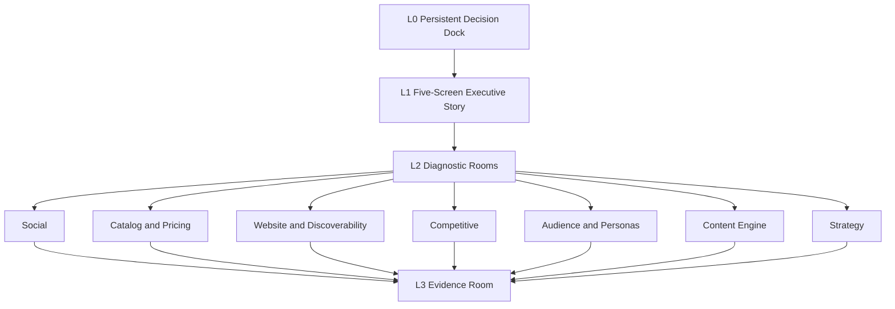
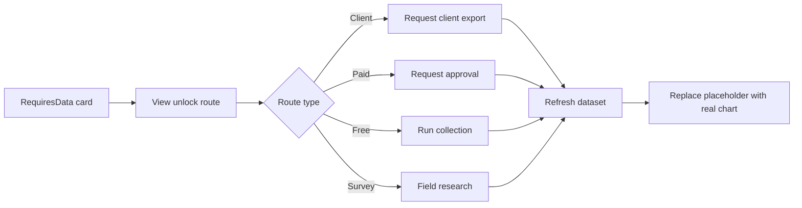

# 02 — Dashboard Architecture

> **System:** Dashboard Intelligence Operating System (DIOS)  
> **Repository:** `omarali304ii-byte/Islam-Brain`  
> **Repository baseline:** `44cea987cd42f077cc0f6e448bcdc69f2683ecb1`  
> **DIOS working branch:** `docs/dios-phase-0-inventory`  
> **Architecture date:** 2026-07-12  
> **Phase status:** Phase 2 — Complete, awaiting validation  
> **Previous artifacts:** [`00_Project_Inventory.md`](./00_Project_Inventory.md) · [`01_Understanding.md`](./01_Understanding.md)  
> **Next phase:** Blocked until this document passes its quality gate

---

## Table of Contents

1. [Phase Entry Decision](#1-phase-entry-decision)
2. [Scope and Evidence Boundary](#2-scope-and-evidence-boundary)
3. [Architecture in One View](#3-architecture-in-one-view)
4. [Dashboard Surface Map](#4-dashboard-surface-map)
5. [Persistent Application Shell](#5-persistent-application-shell)
6. [Command Center](#6-command-center)
7. [Social Command Center](#7-social-command-center)
8. [Post Explorer](#8-post-explorer)
9. [Creator Directory](#9-creator-directory)
10. [Sentiment, Words, and Verbatims](#10-sentiment-words-and-verbatims)
11. [Pricing and Value](#11-pricing-and-value)
12. [Product Design](#12-product-design)
13. [Catalog and Pricing Room](#13-catalog-and-pricing-room)
14. [Website and Discoverability Room](#14-website-and-discoverability-room)
15. [Competitive Room](#15-competitive-room)
16. [Audience and Personas Room](#16-audience-and-personas-room)
17. [Content Engine Room](#17-content-engine-room)
18. [Strategy Room](#18-strategy-room)
19. [Evidence Room](#19-evidence-room)
20. [Power BI Page Mapping](#20-power-bi-page-mapping)
21. [Shared Component Model](#21-shared-component-model)
22. [Chart and Metric Model](#22-chart-and-metric-model)
23. [Filters, Controls, and Interactions](#23-filters-controls-and-interactions)
24. [Application States](#24-application-states)
25. [Navigation and User Flows](#25-navigation-and-user-flows)
26. [Animations, Modals, and Buttons](#26-animations-modals-and-buttons)
27. [Strengths of the Dashboard Architecture](#27-strengths-of-the-dashboard-architecture)
28. [Weaknesses and Architectural Risks](#28-weaknesses-and-architectural-risks)
29. [Alternatives and Industry Patterns](#29-alternatives-and-industry-patterns)
30. [Traceability Matrix](#30-traceability-matrix)
31. [Contradictions and Unresolved Questions](#31-contradictions-and-unresolved-questions)
32. [Phase 2 Validation Gate](#32-phase-2-validation-gate)
33. [Glossary](#33-glossary)
34. [Document Control](#34-document-control)

---

## 1. Phase Entry Decision

Phase 1 was marked complete but awaiting owner validation. On 2026-07-12, the repository owner explicitly instructed the system to proceed with **Phase 2**.

This is recorded as:

- **Phase 1 acceptance:** Accepted by owner with documented limitations.
- **Authorized work:** Reverse-engineer the dashboard architecture.
- **Forbidden work:** Do not build, redesign, deploy, scrape, or alter production code.
- **Evidence limitation:** The actual React application and Power BI file remain unavailable.

> [!IMPORTANT]
> Phase 2 reverse-engineers the **specified dashboard architecture**, not a confirmed running interface. Statements about runtime behavior, responsive behavior, animations, accessibility implementation, and component code remain unverified unless directly specified.

---

## 2. Scope and Evidence Boundary

### 2.1 Primary architecture evidence

This document is grounded mainly in:

- `dashboard/react_dashboard_spec.md`
- `dashboard/powerbi_spec.md`
- `CIELITO_TAB_DEEPENING_MASTER_PROMPT.md`
- `final/DECISION_DOCK.md`
- `final/EXECUTIVE_BRIEF.md`
- `final/MEGA_360_REPORT.md`
- `_intel/SOURCE_REGISTRY.md`
- `_intel/data_pass_menu_base360.md`
- `_intel/social_intel.json`
- `_intel/instagram_owned_intel.json`
- `_intel/catalog_full.json`
- `_intel/cielito_pricing_design.json`
- `_intel/cielito_social_sentiment.json`
- `_intel/cielito_verbatims_analysis.json`
- `instruments/pagespeed_audit.json`
- `instruments/agent_readiness_audit.json`
- Phase 0 and Phase 1 DIOS artifacts

### 2.2 Architecture categories used in this document

| Category | Meaning |
|---|---|
| **Specified** | Explicitly described by the React, Power BI, prompt, or decision documents. |
| **Data-supported** | A source dataset exists for the proposed surface. |
| **Conceptual** | A component or behavior is necessary to make the specification coherent but has no confirmed implementation. |
| **RequiresData** | The surface is specified but cannot display a real value until new data is obtained. |
| **Unverified** | The actual runtime behavior cannot be inspected. |

### 2.3 What “reverse-engineer” means here

For every specified page, section, widget, chart, metric, filter, and relationship, this document explains:

- What it is
- Why it exists
- Its input data
- Its intended behavior
- The decision it supports
- Its benefits
- Its weaknesses
- Possible alternatives
- Applicable professional practices
- Its implementation confidence

### 2.4 What cannot be fully reverse-engineered

The following are not present:

- React source files
- JSX/TSX components
- CSS or Tailwind configuration
- Route definitions
- State-management code
- Chart-library code
- Event handlers
- Loading/error components
- Modal code
- Animation code
- Accessibility implementation
- Responsive layouts
- Power BI `.pbix`

Therefore, this phase describes architecture contracts and expected behavior, not verified code execution.

---

## 3. Architecture in One View

The dashboard uses a **decision-first, evidence-backed, progressive-disclosure architecture**.



The user journey is intentionally:

```text
Verdict → Why → Decision → Diagnosis → Evidence
```

rather than:

```text
Dashboard opens → dozens of charts → user must invent the story
```

### 3.1 Architectural layers

| Layer | Role | Main user |
|---|---|---|
| **L0** | Keep the verdict, priority decisions, financial honesty, and north star visible. | Executive and marketer |
| **L1** | Present the complete business story in five screens. | Executive |
| **L2** | Allow specialist investigation by business domain. | Marketer, analyst, operator |
| **L3** | Prove claims and expose uncertainty, sample sizes, windows, and data gaps. | Analyst, skeptical stakeholder, developer |

### 3.2 Primary architectural principle

The dashboard is not intended to be a passive reporting screen. It is intended to function as a **living command center** that connects:

1. Observed evidence
2. Diagnosis
3. Decisions
4. Actions
5. Monitoring metrics
6. Missing-data routes

---

## 4. Dashboard Surface Map

### 4.1 React surface map

| Surface | Level | Purpose | Status |
|---|---:|---|---|
| Decision Dock | L0 | Persistent executive orientation | Specified |
| Five-Screen Story | L1 | Explain the situation and decision sequence | Specified |
| Social Command Center | L2 | Diagnose owned, earned, content, language, creators, and voice | Specified and data-supported |
| Post Explorer | L2 sub-room | Inspect individual post performance | Specified by deepening prompt |
| Creator Directory | L2 sub-room | Analyze creator contribution and economics | Partially data-supported |
| Sentiment | L2 sub-room | Understand polarity and purchase-intent signals | Data-supported with model caveats |
| Words & Verbatims | L2 sub-room | Understand customer language and qualitative themes | Data-supported |
| Catalog & Pricing | L2 | Understand assortment, price, discounts, availability, and hygiene | Data-supported |
| Pricing & Value | L2 sub-room | Deep price architecture and value analysis | Data-supported plus client gaps |
| Product Design | L2 sub-room | Analyze visual/design language | Partially data-supported |
| Website & Discoverability | L2 | Site performance, SEO, agent readiness | Data-supported |
| Competitive | L2 | Benchmark Cielito against rivals | Mostly RequiresData |
| Audience & Personas | L2 | Personas and market context | Partly referenced; core artifacts missing |
| Content Engine | L2 | Pillars, feed mix, calendar, ideas | Referenced; core artifacts missing |
| Strategy | L2 | Positioning, message house, objectives | Referenced; `strategy.json` missing |
| Evidence | L3 | Sources, grades, windows, gaps, costs | Data-supported |

### 4.2 Power BI surface map

Power BI compresses the architecture into eight report pages:

1. Executive Summary
2. Social Command Center
3. Content & Calendar
4. Catalog & Pricing
5. Website & Discoverability
6. Competitive
7. Audience & Market
8. Evidence & Confidence

The React specification is more navigation-oriented and story-oriented. The Power BI specification is more report-page-oriented.

---

## 5. Persistent Application Shell

### 5.1 Decision Dock

**Type:** Persistent top strip  
**Level:** L0  
**Source:** `final/DECISION_DOCK.md`, React specification

#### Content

- Verdict headline
- Three load-bearing decisions
- Financial-impact honesty chip
- North-star metric
- Watch-list metrics

#### Three decisions

1. Install the WhatsApp ordering bridge.
2. Clean the catalog and switch to Arabic-first content.
3. Turn creators into a repeatable system.

#### Why it exists

Users can become lost when moving between social, pricing, website, and evidence views. The dock preserves the reason for the dashboard and keeps analytical detail connected to action.

#### Intended behavior

- Remains visible across screens.
- Provides stable executive context.
- May expand on the “Decide” screen.
- Acts as a summary of the current operating thesis.

#### Benefits

- Reduces decision drift.
- Keeps priorities visible.
- Prevents a chart-first experience.
- Creates consistency across rooms.

#### Weaknesses

- A persistent strip can consume valuable vertical space.
- Long text may be difficult on mobile.
- If the three decisions change, stale dock content could mislead users.
- No evidence describes editing, versioning, or approval state.

#### Possible alternatives

- Collapsible executive header
- Sticky side summary
- Single verdict card on the command page only
- Context-sensitive decision summary per room

#### Professional practice

Persistent decision context is useful when the application contains many diagnostic views, but it should remain concise and should expose the date or version of the operating thesis.

### 5.2 Primary navigation

**Specified destinations:** Command, Social, Catalog & Pricing, Website, Competitive, Audience, Content Engine, Strategy, Evidence.

The exact navigation component is unknown. It could be tabs, sidebar navigation, top navigation, or a hybrid.

#### Required conceptual behaviors

- Show current location.
- Allow direct access to diagnostic rooms.
- Keep evidence reachable within two clicks.
- Preserve filters where useful.
- Support Arabic/English labels if bilingual mode is implemented.

#### Unverified

- Mobile navigation
- Keyboard navigation
- Route persistence
- Browser history behavior
- Deep links
- Breadcrumbs

---

## 6. Command Center

The Command Center combines L0 and L1 into the executive pitch spine.

### 6.1 Screen 1 — What is happening?

#### Core question

Why does a brand with a large audience have weak owned-channel performance while earned content performs much better?

#### Main widgets

| Widget | Type | Intended data | Purpose |
|---|---|---|---|
| Instagram audience card | KPI card | 88,903 followers; 1,368 posts | Establish audience scale |
| Owned-post baseline card | KPI card | Median 3 likes; median 655 video views; n=17 owned | Establish weak owned performance |
| Owned-vs-earned hero | Bar/callout | Owned baseline vs earned performance | Reframe the main problem |
| Source footer | Evidence control | S08/S10, n, window | Prove the metric |

#### Hero chart

**Specified visualization:** Grouped bar using log scale, broken axis, or callout.

**Why:** The values span orders of magnitude.

**Benefit:** Makes the performance gap immediately visible.

**Critical metric defect:**

- React copy compares owned medians with earned peaks.
- The Power BI measure is named `Earned Median Views / Owned Median Views`.
- The claimed `~190×` aligns closely with `124,937 earned peak views / 655 owned median views`, not a confirmed median-to-median calculation.

This metric must not be treated as a stable canonical KPI until numerator and denominator are formally defined.

#### Possible alternatives

- Distribution plot comparing all owned and earned posts
- Median-to-median ratio with confidence disclosure
- Box plots by ownership class
- Percentile comparison

A distribution-based comparison would be statistically stronger than peak-versus-median, but no redesign is authorized in this phase.

### 6.2 Screen 2 — Why is it happening?

#### Main widgets

| Widget | Type | Purpose |
|---|---|---|
| Language-performance split | Paired bars | Compare Arabic and English performance |
| Conversion funnel with gap | Funnel diagram | Show missing WhatsApp bridge |
| Identity-drift explanation | Narrative/card | Explain mixed brand voice and positioning |
| Evidence snippets | Verbatim/source cards | Ground the diagnosis |

#### Language-performance split

**Inputs:** Instagram and TikTok captions, Arabic-ratio fields, post metrics.

**Intended insight:** Arabic content performs better while most recent owned Instagram captions are English.

**Known baseline:** 16 of 17 owned captions are fully English; one Arabic owned post is the strongest in the selected owned set.

**Weakness:** One strong Arabic example does not alone prove a universal language effect. A formal comparison requires sufficient Arabic and English samples and control for format, creator status, and timing.

#### Funnel with WhatsApp gap

**Conceptual stages:** Audience → Content engagement → Product interest → Ordering conversation → Purchase.

**Specified state:** Conversion stage flagged as a gap.

**Weakness:** No real funnel event data exists. This is a conceptual diagnostic diagram, not a measured conversion funnel.

### 6.3 Screen 3 — Financial impact

#### Components

- Revenue placeholder
- AOV placeholder
- Conversion placeholder
- Scenario shell
- “To be baselined” label

#### State

All financial cards must remain locked or blank until client data arrives.

#### Why it exists

Executives need financial relevance, but the project explicitly refuses to fabricate revenue effects.

#### Benefits

- Preserves credibility.
- Makes missing data actionable.
- Shows the client what data would unlock.

#### Weaknesses

- A page dominated by placeholders may feel unfinished.
- No scenario methodology is specified.
- No permissions or data-upload workflow is defined.

#### Professional practice

Missing values should not be represented as zero. The dashboard correctly uses unavailable-state semantics rather than misleading numeric defaults.

### 6.4 Screen 4 — Decide

#### Components

- Expanded Decision Dock
- Three decision cards
- First-move instructions
- Cost and impact labels
- 60-day or 90-day plan view

#### Purpose

Translate analysis into sequenced action.

#### Decision relationship


#### Weakness

The repository references both a 60-day plan and a 90-day plan. Their exact relationship is not defined.

### 6.5 Screen 5 — Watch

#### Components

Eight KPI gauges or bullet charts:

1. Owned engagement rate
2. Owned-vs-earned ratio
3. WhatsApp chats per week
4. TikTok followers per video
5. Mobile PageSpeed
6. Catalog hygiene
7. UGC velocity
8. Discount discipline

#### Purpose

Turn recommendations into an operating covenant.

#### State classes

- **Measured now:** Owned engagement, TikTok efficiency, PageSpeed, catalog hygiene, discount surface.
- **Partially measurable:** UGC velocity, owned-vs-earned ratio.
- **Requires client/process data:** WhatsApp chats.

#### Weaknesses

- Targets and thresholds are not formally defined for every KPI.
- Gauge charts can overemphasize arbitrary thresholds.
- Historical trend requirements are not specified.
- The owned-vs-earned metric definition is inconsistent.

---

## 7. Social Command Center

### 7.1 Original six-panel architecture

The React specification defines six major panels.

#### Panel 1 — Owned-vs-Earned Engine

- **Type:** Hero comparison chart
- **Question:** Is the brand’s own channel capturing the demand visible in earned content?
- **Inputs:** Owned corrective dataset and mixed/earned Instagram data
- **Main risk:** Peak-versus-median comparison and mixed data generations

#### Panel 2 — Platform Vitals

- **Type:** KPI card group
- **Instagram:** Followers, posts, engagement rate, owned sample size
- **TikTok:** Followers, account video count, followers per video, captured sample size
- **Purpose:** Establish scale and efficiency by platform

#### Panel 3 — Content Leaderboard

- **Type:** Sortable table with thumbnails and permanent URLs
- **Fields:** Platform, ownership, format, language, likes, comments, views, date, URL
- **Interaction:** Sort and filter
- **Purpose:** Move from aggregate insight to exact content examples

#### Panel 4 — Language Performance Split

- **Type:** Paired bars
- **Filters:** Platform and potentially ownership class
- **Purpose:** Test Arabic-versus-English performance

#### Panel 5 — UGC Flywheel

- **Type:** Creator roster and contribution cards
- **Purpose:** Show creator and founder contribution
- **Data limitation:** Original spec references 12 handles and founder contribution from an earlier capture; later deep data contains more creators.

#### Panel 6 — Voice of Customer

- **Type:** Sentiment/theme cards plus RTL verbatims
- **Purpose:** Expose praise, friction, and purchase-intent questions
- **Data-generation conflict:** Original spec cites 254 comments; later analysis contains 964 qualitative comments and 1,050 sentiment items.

### 7.2 Deepened 20-card Social Command Center

| # | Card | Type | Data status | Decision supported |
|---:|---|---|---|---|
| 1 | Owned-vs-earned comparison | Log/grouped bar | HAVE, definition unresolved | Channel repair priority |
| 2 | Platform vitals | KPI group | HAVE | Platform allocation |
| 3 | Arabic/English split | Paired bars | HAVE, sample-balance caution | Language strategy |
| 4 | Format × engagement | Grouped bars/box plot | HAVE | Format planning |
| 5 | Posting cadence | Timeline | HAVE | Publishing consistency |
| 6 | Engagement timeline | Time series | HAVE | Performance change |
| 7 | Reach/views vs engagement | Scatter | HAVE | Efficiency and outliers |
| 8 | Hashtag frequency × average likes | Scatter/table | HAVE | Hashtag usefulness |
| 9 | Caption length vs engagement | Scatter | HAVE | Copy-length hypothesis |
| 10 | Emoji vs text captions | Comparison | HAVE | Caption style |
| 11 | Owned vs earned volume share | Donut/bar | HAVE | Content-source balance |
| 12 | Top-post decay curve | Ranked curve | HAVE | Concentration risk |
| 13 | Reach/impressions funnel | Funnel | CLIENT | Full-funnel analysis |
| 14 | Follower growth | Time series | CLIENT | Audience health |
| 15 | Story completion | Funnel/line | CLIENT | Story effectiveness |
| 16 | Save/share rate | Bars | CLIENT | Content value |
| 17 | Best posting time | Heatmap | CLIENT | Scheduling |
| 18 | Follower geography | Map | CLIENT | Market targeting |
| 19 | Age/gender | Demographic charts | CLIENT | Audience fit |
| 20 | Paid/organic split | Stacked bars | CLIENT | Media efficiency |

### 7.3 Social room strengths

- Strong connection between aggregate and post-level evidence.
- Clear distinction between owned and earned content.
- Data gaps are represented rather than fabricated.
- Permanent post URLs improve traceability.

### 7.4 Social room weaknesses

- Mixed datasets and time windows can produce inconsistent comparisons.
- “Reach” and “views” are sometimes used interchangeably.
- Instagram mixed capture appears to include another handle as the top-level handle in `social_intel.json`, which requires schema clarification.
- No canonical post ID model is documented.
- No deduplication contract is exposed to the dashboard.

---

## 8. Post Explorer

The Post Explorer is specified by the deepening prompt as a 20-card analytical workspace.

### 8.1 Core table

#### Purpose

Provide one row per captured social post so users can inspect exact evidence rather than relying only on averages.

#### Expected columns

- Thumbnail
- Platform
- Owner/handle
- Owned or earned
- Format
- Date
- Language
- Caption
- Hashtags
- Likes/diggs
- Comments
- Views/plays
- Shares where available
- Permanent URL

#### Expected interactions

- Sort by metric
- Filter by platform
- Filter by ownership
- Filter by language
- Filter by format
- Open permanent URL

#### Missing implementation details

- Pagination
- Search
- Export
- Column resizing
- Mobile table behavior
- Data virtualization

### 8.2 Twenty specified surfaces

| # | Surface | Purpose | Status |
|---:|---|---|---|
| 1 | All-posts table | Full evidence exploration | HAVE |
| 2 | Views vs likes scatter | Identify efficient/outlier posts | HAVE |
| 3 | Likes histogram | Understand distribution | HAVE |
| 4 | Comments distribution | Understand conversation depth | HAVE |
| 5 | Performance by type | Compare Reel/Sidecar/Image | HAVE |
| 6 | Owned/earned facet | Separate content sources | HAVE |
| 7 | Monthly volume | Publishing activity | HAVE |
| 8 | Engagement rate per post | Normalize for audience | HAVE with denominator caveat |
| 9 | Language per post | Connect language and result | HAVE |
| 10 | Hashtag count vs views | Test hashtag-volume relationship | HAVE |
| 11 | Top-10/bottom-10 boards | Rapid examples | HAVE |
| 12 | Caption-theme tag | Content taxonomy | HAVE/derived |
| 13 | Reel watch time/completion | Video quality | CLIENT |
| 14 | Sound/audio used | Creative pattern | SCRAPE-FREE |
| 15 | Posting gap vs next-post result | Cadence effect | HAVE-derivable |
| 16 | CTA present vs engagement | CTA relationship | HAVE-derivable |
| 17 | Product tagged vs not | Commerce integration | SCRAPE-FREE |
| 18 | First-comment timing | Early engagement | Unclear route |
| 19 | Shares per post | Shareability | CLIENT for Instagram |
| 20 | Saves per post | Utility/desire | CLIENT |

### 8.3 Analytical caution

Correlation charts such as caption length, hashtag count, CTA presence, and posting gap do not establish causation. Professional interpretation should disclose sample size, platform, ownership, and format controls.

---

## 9. Creator Directory

### 9.1 Purpose

Turn a loose set of public creators into a measurable creator/ambassador system.

### 9.2 Core conceptual component

A creator table/card directory with:

- Handle
- Number of captured posts
- Total likes
- Total views
- Average engagement
- Format mix
- Language mix
- New/returning status
- Founder/creator classification
- Evidence links

Only handle-level public information is intended. The project explicitly avoids names, emails, profile pictures, or private exports in its PII rules.

### 9.3 Twenty specified surfaces

| # | Surface | Status |
|---:|---|---|
| 1 | Creators by total likes | HAVE |
| 2 | Creators by total views | HAVE |
| 3 | Posts per creator | HAVE |
| 4 | Average engagement per creator | HAVE |
| 5 | Founder vs others contribution | HAVE, generation-dependent |
| 6 | Follower-band mix | Partial |
| 7 | New vs returning creators over time | HAVE-derivable |
| 8 | Creator format mix | HAVE |
| 9 | Language per creator | HAVE |
| 10 | Tag-only vs styled content | Derived/manual taxonomy |
| 11 | Creator follower counts | SCRAPE-PAID |
| 12 | Creator audience geography | SCRAPE-PAID |
| 13 | Creator engagement rate | SCRAPE-PAID |
| 14 | Estimated media value | Requires 11–13 and methodology |
| 15 | Category affinity | SCRAPE-PAID |
| 16 | Rival-brand overlap | SCRAPE-PAID |
| 17 | CAC per creator | CLIENT |
| 18 | Conversion per creator link | CLIENT |
| 19 | Gifting cost vs return | CLIENT |
| 20 | Contract/exclusivity status | CLIENT |

### 9.4 Benefits

- Formalizes a proven earned-content asset.
- Supports creator selection using evidence.
- Separates public activity from client-only economics.

### 9.5 Weaknesses

- Public engagement does not equal commercial impact.
- Creator identity can be misclassified.
- Current roster may be biased toward the captured window.
- Estimated media value is undefined and should not be invented.
- Consent and usage-right status are not captured in public data.

---

## 10. Sentiment, Words, and Verbatims

This domain combines quantitative model scoring and qualitative coding.

### 10.1 Sentiment panel

#### Current engine

- CAMeLBERT-DA Egyptian binary classifier
- Neutral margin of 0.60
- Emoji-only polarity rules
- Rule-based fallback if model loading fails
- 1,050 total scored items in current output

#### Main widgets

- Overall sentiment donut
- Channel sentiment bars
- Theme × polarity stacked bars
- Positive/negative examples
- Purchase-intent count
- Model/method disclosure

#### Critical caveats

- The reported 89.5% accuracy comes from a different dataset.
- The Cielito corpus has not been independently labeled for validation.
- Captions and comments are combined in some totals despite representing different voices.
- Emoji-only scoring is rule-based.
- The intent detector uses substring matching and includes false-positive risk.
- A blended “82.2% positive” number must not be used without channel context.

### 10.2 Words and verbatims panel

#### Main components

- Word frequency
- Four-pillar coding
- Benefit ladder
- Tension-to-opportunity mapping
- Brand dipstick
- Tag-a-friend behavior
- Verbatim cards with platform and handle

#### Four pillars

1. Functional
2. Emotional
3. Frustrations
4. Need gaps

#### Purpose

Explain the language customers actually use, not merely the sentiment label assigned by a model.

### 10.3 Twenty combined surfaces

| # | Surface | Status |
|---:|---|---|
| 1 | Overall sentiment | HAVE with caveat |
| 2 | Sentiment by channel | HAVE |
| 3 | Theme × polarity | HAVE |
| 4 | AR/EN word frequency | HAVE |
| 5 | Four-pillar counts | HAVE |
| 6 | Pillar verbatim cards | HAVE |
| 7 | Brand-dipstick words | HAVE |
| 8 | Benefit ladder | HAVE |
| 9 | Three motivations | HAVE/qualitative |
| 10 | Tag-a-friend rate | HAVE |
| 11 | Tension → opportunity | HAVE/qualitative |
| 12 | Intent-signal count | HAVE with detector caveat |
| 13 | Sentiment over time | HAVE-derivable |
| 14 | Emoji sentiment split | HAVE |
| 15 | Positive vs negative word clouds | HAVE, visualization caveat |
| 16 | Sentiment vs star-rating validation | SCRAPE-PAID/review data |
| 17 | Rival sentiment benchmark | SCRAPE-PAID |
| 18 | Complaint-resolution time | CLIENT |
| 19 | NPS | SURVEY |
| 20 | Importance × satisfaction | SURVEY |

### 10.4 Professional practice

Verbatims should remain exact and should preserve Arabic text. Machine sentiment should be labeled as modeled interpretation, not human truth. Word clouds are useful for exploration but weak for precise comparison; frequency tables or bars are more analytically reliable.

---

## 11. Pricing and Value

### 11.1 Purpose

Explain the catalog’s price architecture, discount behavior, category differences, and size/value structure.

### 11.2 Current data foundation

- 250 products
- 250 priced products
- EGP 400 minimum
- EGP 7,600 maximum
- EGP 1,200 median
- 96 products on sale in `catalog_full.json`
- Category-normalized pricing output in `cielito_pricing_design.json`

### 11.3 Twenty specified surfaces

| # | Surface | Type | Status |
|---:|---|---|---|
| 1 | Price architecture by category | Box/bar table | HAVE |
| 2 | Price tiers | Donut/bar | HAVE |
| 3 | Discount-depth distribution | Histogram | HAVE |
| 4 | Sub-family price ladder | Ranked bars | HAVE |
| 5 | Apparel vs footwear discount gap | Comparison | HAVE |
| 6 | Size availability | Distribution | HAVE with option ambiguity |
| 7 | Average sizes per product | KPI | HAVE with option ambiguity |
| 8 | Price vs created date | Scatter/time series | HAVE |
| 9 | On-sale share by month | Time series | HAVE-derivable |
| 10 | Compare-at vs actual price | Gap plot | HAVE |
| 11 | Price band × availability | Heatmap/stacked bars | HAVE |
| 12 | Premium-tier composition | Bars | HAVE |
| 13 | Fine-bin price histogram | Histogram | HAVE |
| 14 | SKU count by price point | Frequency plot | HAVE |
| 15 | Rival category prices | Benchmark | SCRAPE-PAID |
| 16 | Price index vs rivals | Index chart | SCRAPE-PAID |
| 17 | Sell-through by price | Curve | CLIENT |
| 18 | Margin by category | Bars | CLIENT |
| 19 | Discount-to-sell-through elasticity | Scatter/model | CLIENT |
| 20 | Willingness to pay | Van Westendorp | SURVEY |

### 11.4 Critical data-model issue

The pricing/design script treats Shopify variant `option1` as size. The output includes values such as `Black`, `Beige`, `Brown`, and `Default Title`. Therefore:

- “Average sizes per product” is not a clean size metric.
- Size distributions mix size, color, and default-option values.
- Any size-availability chart must first identify Shopify option names or apply a validated size taxonomy.

### 11.5 Benefits

- Strong raw catalog coverage.
- Useful category normalization.
- Honest separation of catalog data and client sales data.

### 11.6 Weaknesses

- No units sold or stock quantity.
- “On sale” does not prove effective discounting.
- Compare-at prices may be persistent merchandising values rather than temporary promotions.
- Product count is not SKU/variant count, despite occasional “SKU” wording.

---

## 12. Product Design

### 12.1 Purpose

Translate product imagery, names, tags, categories, and materials into a visual/design-language understanding.

### 12.2 Current inputs

- 22 downloaded product images
- Product titles
- Product tags
- Product types
- Price data
- Creation dates
- Manual design review in derived output

### 12.3 Twenty specified surfaces

| # | Surface | Status |
|---:|---|---|
| 1 | Real product gallery | HAVE |
| 2 | Design-language families | Manual/derived |
| 3 | Palette chips | Manual/derived |
| 4 | Category mix | HAVE |
| 5 | Sub-family counts | HAVE |
| 6 | Color distribution | HAVE-derivable |
| 7 | Material mentions | SCRAPE-FREE/product bodies |
| 8 | Motif tags | HAVE-derivable |
| 9 | Heel/product-form mix | HAVE-derivable |
| 10 | Price × design language | Manual join |
| 11 | New-arrival design trend | Derived |
| 12 | Botanical/fruit-leather inventory | Partial/hypothesis caveat |
| 13 | Design × sell-through | CLIENT |
| 14 | Color × sell-through | CLIENT |
| 15 | Returns by design/fit | CLIENT |
| 16 | Rival design comparison | SCRAPE-PAID |
| 17 | Trend-alignment score | External research, method undefined |
| 18 | Review sentiment by design | Requires review/product linkage |
| 19 | Repeat purchase by design | CLIENT |
| 20 | Audience tagging by design | Cross-map, HAVE-derivable |

### 12.4 Benefits

- Keeps real product imagery central.
- Connects design language to pricing and content.
- Makes qualitative judgments visible rather than hiding them in prose.

### 12.5 Weaknesses

- A 22-image sample may not represent 250 products.
- The script selects higher-priced products first with category caps, creating sampling bias.
- Manual design labels have no reviewer protocol.
- The palette is provisional.
- Fruit-leather status remains founder-gated and must not be presented as a current active product truth.

---

## 13. Catalog and Pricing Room

The original room is broader and simpler than the deep Pricing & Value and Product Design sub-rooms.

### 13.1 Core widgets

- Total products
- In-stock count/share
- On-sale count/share
- Price bands
- Product-family counts
- Catalog-age cohort
- Untyped-product share
- Duplicate-collection flags
- In-stock status by category
- Tag cloud

### 13.2 Purpose

Expose merchandising structure and catalog hygiene rather than only price levels.

### 13.3 Catalog hygiene metric

Power BI specifies:

```text
Catalog Hygiene % = 1 - untyped_count / total_products
```

With 128 untyped products out of 250, this yields approximately 48.8% typed.

#### Weakness

Catalog hygiene is broader than product-type completion. A single percentage based only on type coverage may overstate the completeness of the metric name.

### 13.4 Missing states

- Sell-through
- Stock turn
- Bestseller rank
- Revenue by product
- Margin
- Return rate

These require client data and must remain RequiresData states.

---

## 14. Website and Discoverability Room

### 14.1 Core widgets

- Mobile PageSpeed gauge: 55
- Desktop PageSpeed gauge: 98
- Mobile accessibility: 91
- Desktop accessibility: 82
- SEO: 100
- Agent-readiness score: B / 72
- Agent-readiness category bars
- Gap list
- Security/prompt-injection result

### 14.2 Purpose

Show whether the storefront can support acquisition, conversion, search visibility, and AI-agent discovery.

### 14.3 PageSpeed widgets

**Specified type:** Dual radial gauges.

**Benefits:** Rapid device comparison.

**Weaknesses:**

- Radial gauges use substantial space.
- One audit snapshot is not a trend.
- Field data is unknown.
- The audit contains category scores but limited detailed performance metrics.

### 14.4 Agent-readiness widgets

Potential cards/bars:

- Discoverability: 75
- Content accessibility: 100
- Bot access control: 25
- Protocol discovery: 33
- Structured data/meta: 100
- Prompt-injection security check: 100

### 14.5 Critical labeling rule

The “security = clean” result means the scanned website showed no detected hidden prompt-injection instructions. It is **not** a complete web security audit, penetration test, privacy audit, or vulnerability assessment.

### 14.6 RequiresData surfaces

- Repeated Lighthouse series
- LCP/CLS/TTI trends
- CrUX field data
- GA4 funnel drop-off
- Search Console performance

---

## 15. Competitive Room

### 15.1 Purpose

Place Cielito in context against Dejavu and other Egyptian fashion/footwear competitors.

### 15.2 Current content

- Dejavu social comparison snippet
- Positioning map
- Rival table/framework
- GAP rows for missing competitors and metrics

### 15.3 Intended widgets

- Rival follower table
- Posting cadence comparison
- Price ladders
- Discount cadence
- Share of voice
- Rival sentiment
- Hero categories
- WhatsApp usage
- Ads-library activity
- Growth curves
- Positioning map

### 15.4 Current state

Most competitive surfaces are RequiresData and depend on P1/P3/P4 paid routes.

### 15.5 Benefits

- Makes evidence absence explicit.
- Prevents a single-rival anecdote from becoming a full benchmark.
- Connects data collection to concrete dashboard unlocks.

### 15.6 Weaknesses

- The room may appear mostly empty before paid collection.
- Competitor selection criteria are not documented.
- Comparability rules for categories, dates, and platforms are undefined.
- Positioning-map axes and scoring method are not confirmed.

---

## 16. Audience and Personas Room

### 16.1 Purpose

Connect content, price, and positioning decisions to people and market context.

### 16.2 Intended widgets

- Four persona cards
- Persona evidence labels
- Market-size cards
- Women’s demand share
- Offline/online context
- Segment sizing RequiresData state
- Perceptual/attribute maps RequiresData state

### 16.3 Current evidence status

The React specification references four personas and `strategy.json`, but the canonical persona artifact is unavailable in the repository snapshot.

### 16.4 Risks

- Persona cards may be strategic hypotheses rather than validated user research.
- Market-size values are estimate-only and conflicting.
- Social comments do not provide reliable age, geography, or socioeconomic data.

### 16.5 Professional practice

Persona cards should distinguish:

- Observed behavior
- Client knowledge
- Market research
- Assumption
- Survey-validated segment

No such full provenance model is confirmed for the persona layer.

---

## 17. Content Engine Room

### 17.1 Purpose

Turn diagnosis into an operational publishing system.

### 17.2 Intended surfaces

- Content pillars
- Feed-mix donut
- 90-day calendar
- Seasonal demand windows
- Content ideas
- Arabic-first guidance
- Creator usage
- Message/CTA guidance

### 17.3 Referenced inputs

- `CAMPAIGN_CALENDAR`
- `strategy.json`
- Content intelligence
- Creative image briefs

These canonical files are referenced but not confirmed in the repository.

### 17.4 Benefits

- Connects analysis to execution.
- Uses local seasonal context.
- Supports repeatability.

### 17.5 Weaknesses

- No workflow state such as draft, approved, scheduled, posted, or measured is specified.
- No calendar editing behavior is specified.
- No integration with a social scheduler is specified.
- Feed-mix percentages could become prescriptive without continuous measurement.

---

## 18. Strategy Room

### 18.1 Purpose

Present the formal strategic system behind the decisions.

### 18.2 Intended components

- Positioning map
- Current-to-target drift arrow
- White-space quadrant
- Message house
- Objectives
- Strategic pillars
- Decision dependencies
- Founder-gated questions

### 18.3 Current evidence status

The binding `strategy.json` is referenced repeatedly but is not confirmed in this repository. Therefore, exact strategy-room fields cannot be fully enumerated.

### 18.4 Risks

- Strategy content may be duplicated across Command, Content Engine, and Strategy rooms.
- The fruit-leather positioning is hypothesis/founder-gated.
- Positioning axes and scoring are not documented.

---

## 19. Evidence Room

### 19.1 Purpose

Allow every material claim to be challenged and traced.

### 19.2 Core components

- Source table S01–S13
- Source type
- File path
- Confidence grade
- Capture window
- Sample size
- Known gaps
- Costed data-pass menu
- Blocked-route status
- Hypothesis and self-reported caveats

### 19.3 Confidence grades

- HELD
- LIKELY
- ESTIMATE_ONLY
- SELF_REPORTED
- HYPOTHESIS
- GAP

### 19.4 Source footer interaction

Conceptually:


### 19.5 Benefits

- Strong traceability model.
- Makes uncertainty visible.
- Supports client trust.
- Converts missing evidence into a collection plan.

### 19.6 Weaknesses

- No machine-readable claim-to-source map is confirmed.
- Some final claims summarize sources without inline IDs.
- Source grades do not replace statistical quality assessment.
- Source files can become stale without snapshot/version controls.

---

## 20. Power BI Page Mapping

| Power BI page | React equivalent | Key components |
|---|---|---|
| Executive Summary | Command Center | Verdict, decisions, hero metric, north star |
| Social Command Center | Social room | Owned/earned, vitals, leaderboard, language |
| Content & Calendar | Content Engine | Pillars, feed mix, 90-day timeline |
| Catalog & Pricing | Catalog, Pricing, Product Design | Price bands, discounts, hygiene, treemap |
| Website & Discoverability | Website room | PageSpeed, agent readiness, gaps |
| Competitive | Competitive room | Rival comparison and GAP framework |
| Audience & Market | Audience room | Personas and market estimates |
| Evidence & Confidence | Evidence room | Sources, grades, data gaps |

### 20.1 Power BI fact model

- `fct_social_posts`
- `fct_catalog`
- `fct_instruments`

### 20.2 Power BI dimensions

- `dim_date`
- `dim_platform`
- `dim_persona`
- `dim_pillar`
- `dim_competitor`
- `dim_source`

### 20.3 Power BI weaknesses

- The proposed `fct_social_posts` seed uses 120 rows while deep captures later contain more data.
- The proposed catalog fact is described as one row per SKU, but `catalog_full.json` appears to be one row per product.
- No star-schema keys or relationship cardinalities are specified.
- No incremental refresh strategy is specified.
- No `.pbix` exists for validation.

---

## 21. Shared Component Model

The following shared components are either explicit or necessary conceptual abstractions.

| Component | Status | Responsibility |
|---|---|---|
| Decision Dock | Explicit | Persistent verdict and decisions |
| KPI card | Conceptual/implicit | Display one metric with context |
| Chart card | Explicit pattern | Chart, title, so-what, source footer |
| RequiresData card | Explicit | Explain missing data and unlock route |
| GapPlaceholder | Explicit name | Prevent zero/fabricated values |
| Source footer | Explicit behavior | Show source, n, window, grade |
| Caveat bar | Explicit | Mark hypothesis/self-reported content |
| Sortable table | Explicit | Explore posts or evidence |
| Media thumbnail | Explicit | Connect data to local visual evidence |
| Ownership badge | Explicit/implicit | Mark owned versus earned |
| Language badge/filter | Explicit/implicit | Mark Arabic versus English |
| Confidence badge | Explicit | Communicate evidence grade |
| Gauge/bullet chart | Explicit | Monitor KPI baseline/target |
| Verbatim card | Explicit/implicit | Show exact customer text |
| Data-pass route card | Conceptual | Explain cost and approval path |

### 21.1 Standard chart-card anatomy

```text
Insight-led title
Business question / short subtitle
Visualization
So-what line
Data-source tag · n= · capture window · confidence
```

### 21.2 Missing shared-component contracts

- Prop schemas
- Empty/loading/error variants
- Responsive behavior
- Typography rules
- Spacing rules
- Keyboard interactions
- Localization method
- Number formatting
- Date formatting
- Currency formatting
- Chart tooltip contract

These belong to later design-system and system-architecture phases.

---

## 22. Chart and Metric Model

### 22.1 Metric classes

| Class | Examples | Rule |
|---|---|---|
| Raw count | Products, posts, comments | Cite source and window |
| Derived ratio | Engagement rate, discount surface | Define numerator and denominator |
| Distribution | Price, likes, views | Show n and outliers |
| Modeled metric | Sentiment | Show method and validation limits |
| Estimate | Market size | Show range and ESTIMATE_ONLY grade |
| Client-only metric | Revenue, CAC, conversion | RequiresData; never zero |
| Qualitative construct | Design language, persona | Show coding/research method |

### 22.2 Key metrics and definitions

| Metric | Intended definition | Current issue |
|---|---|---|
| Owned engagement rate | `(likes + comments) / follower base` on owned posts | Aggregation level and median/mean choice need definition |
| Owned-vs-earned ratio | Comparison of earned and owned performance | Numerator is inconsistent: peak vs median or median vs median |
| Discount surface | On-sale products / total products | Persistent compare-at prices may not equal campaign discounting |
| Catalog hygiene | 1 - untyped products / total products | Name is broader than definition |
| Followers per video | TikTok followers / account video count | Crude efficiency metric; not performance per captured video |
| UGC velocity | Earned content volume over time | Formal formula not specified |
| Discount discipline | Intended monitoring KPI | Formal formula/threshold not specified |
| WhatsApp chats/week | Count of conversations | Data source/integration not specified |

### 22.3 Chart-selection principles

- Bars for comparisons
- Histograms for distributions
- Scatter plots for relationships
- Timelines for cadence and trends
- Heatmaps for time/category intersections
- Tables for traceable item-level evidence
- Maps only when real geography exists
- RequiresData cards instead of fake visualizations

---

## 23. Filters, Controls, and Interactions

### 23.1 Explicit or strongly implied filters

- Platform
- Owned versus earned
- Language
- Post format
- Date/time
- Creator
- Category
- Price band
- Availability
- Sale status
- Confidence/source grade

### 23.2 Explicit interactions

- Sort content leaderboard
- Filter by language
- Drill from overview to diagnostic rooms
- Reach evidence within two clicks
- Open permanent post URLs
- Read source footer

### 23.3 Conceptual interactions required for coherence

- Select a dashboard room
- Hover/focus chart data points
- Open source details
- Expand RequiresData route
- Change date window
- Reset filters

These are not confirmed implementations.

### 23.4 Interaction risks

- Cross-filter behavior is not specified.
- Global versus local filters are not distinguished.
- Filter persistence is not specified.
- Shareable filtered URLs are not specified.
- Accessibility of chart hover states is unknown.

---

## 24. Application States

### 24.1 Explicit states

| State | Meaning | Presentation rule |
|---|---|---|
| HAVE | Real data available | Render real chart/card |
| SCRAPE-FREE | Collectable without paid route | RequiresData with route |
| SCRAPE-PAID | Requires approval and cost | RequiresData with cost/route |
| CLIENT | Only client can provide | RequiresData with client request |
| SURVEY | Requires primary research | RequiresData with survey route |
| HYPOTHESIS | Plausible, not verified | Caveat; never plot as fact |
| SELF_REPORTED | Brand/client claim | Label source nature |
| GAP | Missing | Never render as zero |

### 24.2 Runtime states not specified

- Loading
- Network failure
- Data parse failure
- Partial data
- Stale data
- Permission denied
- Empty filtered result
- Unsupported media
- Compiler validation failure UI

### 24.3 Recommended industry interpretation

The fail-closed compiler should distinguish build-time validation failures from user-facing missing-data states. The repository describes the principle but not the exact error taxonomy.

---

## 25. Navigation and User Flows

### 25.1 Executive flow


### 25.2 Marketer flow


### 25.3 Analyst/evidence flow


### 25.4 Future-data flow



No actual approval, upload, or refresh interface is confirmed.

---

## 26. Animations, Modals, and Buttons

### 26.1 Animations

No animation specification is confirmed.

Unknown:

- Page transitions
- Chart entrance animations
- Filter transitions
- Motion-reduction support
- Loading skeletons

### 26.2 Modals

No modal is explicitly specified.

Potential conceptual uses include source detail or data-pass explanation, but these must not be assumed as implemented.

### 26.3 Buttons and links

Explicit or strongly implied controls:

- Navigation controls
- Permanent post URL links
- Sort controls
- Filter controls
- Evidence/source links
- Potential RequiresData route/approval controls

Unknown:

- Labels
- Hierarchy
- Disabled states
- Confirmation behavior
- External-link handling
- Focus states

---

## 27. Strengths of the Dashboard Architecture

### 27.1 Decision-first hierarchy

The architecture gives executives a clear answer before exposing detail.

### 27.2 Evidence discipline

Source IDs, confidence grades, sample sizes, windows, and RequiresData states are first-class concepts.

### 27.3 Progressive disclosure

Users can stop at the verdict or continue to diagnosis and evidence.

### 27.4 Local category relevance

The dashboard reflects Egyptian language, WhatsApp behavior, seasonal demand, and local fashion context.

### 27.5 Raw-to-item traceability

Tables, permanent URLs, and verbatims can connect a chart to exact evidence.

### 27.6 Honest financial state

The architecture refuses to invent revenue or conversion values.

### 27.7 Multi-audience structure

Executives, marketers, analysts, and developers can use different depths of the same system.

### 27.8 Expandable data-gap model

Missing information has an explicit acquisition route and cost.

---

## 28. Weaknesses and Architectural Risks

### 28.1 Specification without implementation

The architecture may be strong on paper but cannot be judged for usability, speed, responsiveness, or accessibility.

### 28.2 Scope explosion

A target of at least 20 cards per tab can create hundreds of surfaces, increasing cognitive load and maintenance cost.

### 28.3 Dataset-generation drift

Original dashboard numbers and later deepened numbers come from different windows and generations.

### 28.4 Metric-definition ambiguity

The owned-vs-earned ratio is the most visible example, but several other KPIs also lack canonical formulas.

### 28.5 Repeated content

Decisions, strategy, content plans, and evidence can be duplicated across multiple rooms.

### 28.6 RequiresData saturation

Some rooms—especially Competitive and Financial Impact—may contain more placeholders than real charts.

### 28.7 Statistical overinterpretation

Small samples and uncontrolled correlations may be presented with visually strong charts.

### 28.8 Qualitative-method opacity

Personas, design languages, and strategic labels lack complete coding and validation records.

### 28.9 Missing operational workflow

The dashboard explains decisions but does not specify task assignment, ownership, status, deadlines, or approvals.

### 28.10 No refresh/version model

Capture dates exist, but the application-level handling of stale snapshots and refreshed datasets is undefined.

---

## 29. Alternatives and Industry Patterns

This section records possible architectural alternatives for comparison. It does not authorize redesign.

### 29.1 Executive story alternatives

- Single scrolling narrative page
- Presentation mode plus separate analyst workspace
- Role-based landing pages
- Executive summary with expandable sections

### 29.2 Diagnostic-room alternatives

- Fewer rooms with stronger cross-filters
- Search-driven analytics
- Notebook/report format
- Metric tree rather than tab structure

### 29.3 Evidence alternatives

- Inline provenance drawer
- Data catalog integration
- Claim graph
- Downloadable methodology report

### 29.4 Missing-data alternatives

- Placeholder cards as specified
- Data-readiness score per room
- Collapsed “future unlocks” panel
- Separate data-acquisition roadmap

### 29.5 Professional best practices applicable here

- Define every KPI in a metric registry.
- Use one canonical dataset manifest.
- Show data freshness.
- Avoid peak-versus-median comparisons unless explicitly labeled.
- Separate correlation from causation.
- Test chart readability without color.
- Provide keyboard-accessible alternatives to hover.
- Keep evidence links stable.
- Treat modeled sentiment as probabilistic output.
- Use role-based defaults without hiding evidence.

---

## 30. Traceability Matrix

| Dashboard surface | Primary artifact | Data source | Confidence |
|---|---|---|---:|
| Decision Dock | `final/DECISION_DOCK.md` | Derived/final intelligence | High for specification |
| Five-screen story | React spec | Multiple referenced artifacts | High for specification |
| Owned baseline | `instagram_owned_intel.json` | Corrective Instagram capture | High |
| Mixed social performance | `social_intel.json` | Instagram/TikTok capture | High with schema questions |
| Catalog cards | `catalog_full.json` | Shopify product capture | High |
| Pricing cards | `cielito_pricing_design.json` | Catalog script | High with option issue |
| Sentiment cards | `cielito_social_sentiment.json` | Model + rules | Medium-high with validation caveat |
| Verbatim cards | `cielito_verbatims_analysis.json` | Comment corpus + coding | Medium-high |
| PageSpeed | `pagespeed_audit.json` | PSI API | High for snapshot |
| Agent readiness | `agent_readiness_audit.json` | Custom audit | High for recorded output; rubric external |
| Competitive room | React spec/data-pass menu | Mostly unavailable | Low-current / high-spec |
| Audience/personas | React spec/strategy reference | Missing canonical files | Low-current |
| Content Engine | React spec/calendar reference | Missing canonical files | Low-current |
| Strategy room | React spec/`strategy.json` reference | Missing canonical file | Low-current |
| Evidence room | `SOURCE_REGISTRY.md` | Source files | High |
| Power BI pages | Power BI spec | Proposed star schema | High for specification only |

---

## 31. Contradictions and Unresolved Questions

| ID | Contradiction/question | Impact |
|---|---|---|
| A-001 | Is the owned-vs-earned ratio peak/median or median/median? | Flagship metric is not canonical. |
| A-002 | Does “reach” mean views, plays, impressions, or another metric? | Cross-platform comparison may be invalid. |
| A-003 | Original Social Command uses 120 posts; deepening prompt uses 210. | Page counts and metrics may diverge. |
| A-004 | Original Voice of Customer uses 254 comments; later files use 964/1,050. | Dashboard generations are mixed. |
| A-005 | Power BI says one catalog row per SKU; source dataset appears product-level. | Fact-grain mismatch. |
| A-006 | Product `option1` is treated as size but includes colors/default values. | Size charts are unreliable without normalization. |
| A-007 | The dashboard references a 60-day plan and a 90-day calendar. | Decision timeline relationship is unclear. |
| A-008 | “Security clean” can be read broadly but only reflects prompt-injection scanning. | Risk of misleading security interpretation. |
| A-009 | `strategy.json`, persona files, calendar, and battle map are referenced but absent. | Several rooms cannot be fully reconstructed. |
| A-010 | 20 cards per tab is a completion contract, but information hierarchy prioritizes executive simplicity. | Density and simplicity goals may conflict. |
| A-011 | RequiresData cards are described as already styled in the build, while the build is explicitly not yet created. | Wording suggests an earlier/external implementation not present here. |
| A-012 | The Social digest top-level Instagram handle is not obviously the brand handle. | Data normalization/schema needs validation. |
| A-013 | Current state says base run closed, but dashboard build is queued. | “Project complete” and “research run complete” differ. |
| A-014 | No canonical target thresholds exist for several watch KPIs. | Gauges cannot be interpreted consistently. |
| A-015 | No actual interaction, responsive, or accessibility code exists. | Runtime UX cannot be validated. |

---

## 32. Phase 2 Validation Gate

### 32.1 Gate checklist

| Quality gate | Result | Evidence/reason |
|---|---|---|
| Were previous DIOS artifacts reviewed? | **Yes** | Phase 0 and Phase 1 were reviewed before architecture analysis. |
| Were all specified dashboard rooms covered? | **Yes, with evidence qualifications** | Command, Social, Post, Creator, Sentiment, Verbatims, Pricing, Design, Catalog, Website, Competitive, Audience, Content, Strategy, Evidence, and Power BI are covered. |
| Were pages, sections, widgets, charts, metrics, filters, interactions, and states explained? | **Yes** | Each category has dedicated sections and matrices. |
| Were animations, modals, and buttons addressed? | **Yes** | Their absence or unspecified status is recorded. |
| Were facts separated from conceptual architecture? | **Yes** | Specified, conceptual, RequiresData, and unverified categories are used. |
| Were contradictions preserved? | **Yes** | Fifteen architecture contradictions/questions are recorded. |
| Was redesign avoided? | **Yes** | Alternatives are documented for comparison only; no implementation changes were made. |
| Was production code modified? | **No** | Documentation only. |
| Is Phase 2 complete? | **Yes, awaiting owner validation** | The specified architecture is comprehensively documented. |
| May Phase 3 begin automatically? | **No** | Owner validation/authorization is required. |

### 32.2 Phase status

> [!WARNING]
> Phase 2 is complete as a reverse-engineering artifact, but actual component behavior remains unverified until the React application or Power BI file becomes available.

### 32.3 Required validation decisions

1. Confirm that the specified architecture—not an external unshared dashboard—is the intended Phase 2 subject.
2. Decide the canonical definition of the owned-vs-earned ratio.
3. Decide which social dataset generation should power the dashboard.
4. Confirm whether the 20-card-per-tab contract is a hard production requirement or an analytical planning target.
5. Provide missing strategy/persona/calendar/competitive artifacts if they exist elsewhere.

---

## 33. Glossary

| Term | Definition |
|---|---|
| **Card** | A bounded dashboard unit containing a KPI, chart, table, narrative, or missing-data state. |
| **Command Center** | Executive dashboard layer that summarizes what is happening and what to decide. |
| **Diagnostic Room** | A domain-specific drill-down such as Social or Catalog. |
| **Distribution** | The spread and frequency of values, not only their average. |
| **Drill-down** | Moving from a summary into more detailed information. |
| **Evidence footer** | Metadata area showing source, sample size, window, and confidence. |
| **Facet** | Splitting the same visualization by a category such as owned and earned. |
| **Gauge** | A visual showing a metric relative to a target or range. |
| **Information architecture** | The organization and relationship of pages, sections, and navigation. |
| **Metric grain** | What one row or one measurement represents, such as one product or one variant. |
| **Progressive disclosure** | Showing simple information first and deeper detail only when requested. |
| **RequiresData** | An honest state explaining that a real metric cannot yet be produced. |
| **Semantic color** | Color that has a consistent meaning, such as positive or negative. |
| **Source registry** | Catalog of evidence sources and confidence grades. |
| **Widget** | A reusable dashboard element such as a KPI card, chart, filter, or table. |

---

## 34. Document Control

| Field | Value |
|---|---|
| Document | `02_Dashboard_Architecture.md` |
| DIOS phase | 2 |
| Repository baseline | `44cea987cd42f077cc0f6e448bcdc69f2683ecb1` |
| Working branch | `docs/dios-phase-0-inventory` |
| Status | Complete, awaiting validation |
| Previous phase | Phase 1 accepted by owner instruction |
| Production-code changes | None |
| Dashboard redesign performed | No |
| Scraping/data collection triggered | No |
| Next permitted action | Validate Phase 2, then authorize Phase 3 |
