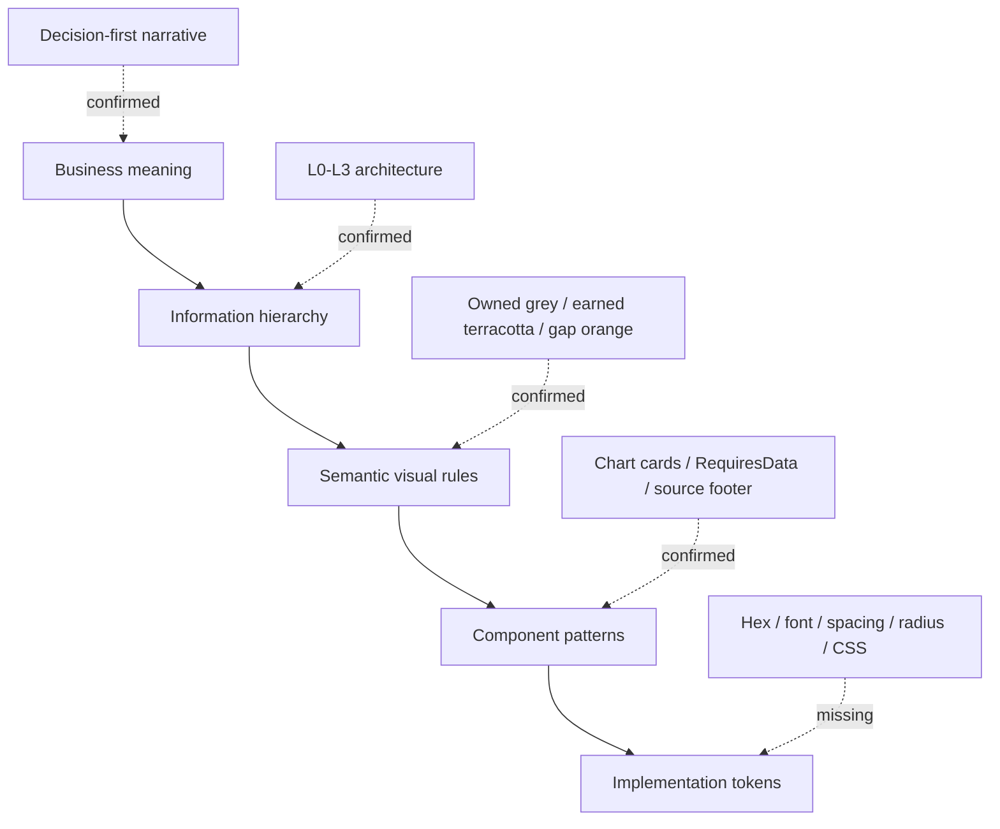
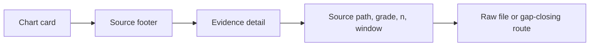

# 03 — Design System

> **System:** Dashboard Intelligence Operating System (DIOS)  
> **Repository:** `omarali304ii-byte/Islam-Brain`  
> **Repository baseline:** `44cea987cd42f077cc0f6e448bcdc69f2683ecb1`  
> **DIOS working branch:** `docs/dios-phase-0-inventory`  
> **Design-system date:** 2026-07-12  
> **Phase status:** Phase 3 — Complete, awaiting validation  
> **Previous artifacts:** [`00_Project_Inventory.md`](./00_Project_Inventory.md) · [`01_Understanding.md`](./01_Understanding.md) · [`02_Dashboard_Architecture.md`](./02_Dashboard_Architecture.md)  
> **Next phase:** Blocked until this document passes its quality gate

---

## Table of Contents

1. [Phase Entry Decision](#1-phase-entry-decision)
2. [Scope and Evidence Boundary](#2-scope-and-evidence-boundary)
3. [Executive Design-System Model](#3-executive-design-system-model)
4. [Design-System Maturity](#4-design-system-maturity)
5. [Core Design Principles](#5-core-design-principles)
6. [Visual Identity Evidence](#6-visual-identity-evidence)
7. [Color System](#7-color-system)
8. [Typography System](#8-typography-system)
9. [Layout and Grid](#9-layout-and-grid)
10. [Spacing System](#10-spacing-system)
11. [Surface and Card System](#11-surface-and-card-system)
12. [Borders, Radius, and Shadows](#12-borders-radius-and-shadows)
13. [Iconography](#13-iconography)
14. [Imagery and Media](#14-imagery-and-media)
15. [Data-Visualization System](#15-data-visualization-system)
16. [Shared Component Styles](#16-shared-component-styles)
17. [Data and Evidence States](#17-data-and-evidence-states)
18. [Source and Confidence Styling](#18-source-and-confidence-styling)
19. [Badges, Chips, and Labels](#19-badges-chips-and-labels)
20. [Tables and Dense Data](#20-tables-and-dense-data)
21. [Controls and Form Elements](#21-controls-and-form-elements)
22. [Navigation Styling](#22-navigation-styling)
23. [Responsive Behavior](#23-responsive-behavior)
24. [Arabic, English, and RTL](#24-arabic-english-and-rtl)
25. [Accessibility](#25-accessibility)
26. [Motion and Animation](#26-motion-and-animation)
27. [React and Power BI Parity](#27-react-and-power-bi-parity)
28. [Design Inconsistencies and Debt](#28-design-inconsistencies-and-debt)
29. [Professional Alternatives and Practices](#29-professional-alternatives-and-practices)
30. [Design-Token Documentation Schema](#30-design-token-documentation-schema)
31. [Traceability Matrix](#31-traceability-matrix)
32. [Unresolved Questions](#32-unresolved-questions)
33. [Phase 3 Validation Gate](#33-phase-3-validation-gate)
34. [Glossary](#34-glossary)
35. [Document Control](#35-document-control)

---

## 1. Phase Entry Decision

Phase 2 was complete but awaiting owner validation. On 2026-07-12, the repository owner explicitly instructed the system to proceed with **Phase 3**.

This is recorded as:

- **Phase 2 acceptance:** Accepted by owner with the documented implementation limitations.
- **Authorized work:** Extract and document the dashboard design system.
- **Forbidden work:** Do not redesign, implement, deploy, recolor, restyle, or alter production code.
- **Evidence limitation:** No React source, CSS, Tailwind configuration, Power BI file, Figma file, Storybook, or approved brand kit is present.

> [!IMPORTANT]
> This phase documents the **specified and evidenced design language**. It does not claim that a complete coded design system already exists.

---

## 2. Scope and Evidence Boundary

### 2.1 Primary design evidence

This document is grounded mainly in:

- `dashboard/react_dashboard_spec.md`
- `dashboard/powerbi_spec.md`
- `CIELITO_TAB_DEEPENING_MASTER_PROMPT.md`
- `creative/IMAGE_GENERATION_BRIEFS.md`
- `final/DECISION_DOCK.md`
- `final/EXECUTIVE_BRIEF.md`
- `final/MEGA_360_REPORT.md`
- `_intel/SOURCE_REGISTRY.md`
- `_intel/visual_gallery.json`
- `_media/**`
- `instruments/pagespeed_audit.json`
- Phase 0, Phase 1, and Phase 2 DIOS artifacts

### 2.2 Evidence classes used in this phase

| Class | Meaning |
|---|---|
| **Confirmed semantic rule** | Explicitly stated in a prompt, specification, or creative brief. |
| **Confirmed asset rule** | Supported by local media, manifests, or a production brief. |
| **Structural inference** | Required by the documented dashboard architecture but not directly implemented. |
| **Provisional direction** | Explicitly described as provisional or awaiting brand approval. |
| **Missing token** | A design value that is not present and must not be invented. |
| **Unverified implementation** | A behavior that cannot be inspected without the real UI or source code. |

### 2.3 Not available for extraction

The following are absent or unconfirmed:

- Exact color hex/RGB/HSL values
- Approved brand palette
- Font family names
- Typography scale
- Font weights
- Line-height rules
- Spacing scale
- Grid columns and gutters
- Breakpoints
- Border-width rules
- Radius values
- Shadow/elevation values
- Icon library
- Component code
- Design tokens
- Theme files
- Dark mode
- Figma variables/components
- Power BI theme JSON
- Accessibility annotations
- Responsive screenshots

Therefore, exact values remain `TBD`, not guessed.

---

## 3. Executive Design-System Model

The project currently has a **semantic design system without a complete implementation token system**.

It can be understood as five layers:



### 3.1 What is strong

- Clear meaning is assigned to several colors.
- Evidence and missing-data states are first-class visual concepts.
- Chart cards have a defined content anatomy.
- Real media is preferred over synthetic media.
- Synthetic media must be labeled.
- Executive hierarchy is explicit.
- The dashboard is designed around decisions rather than decoration.

### 3.2 What is incomplete

- No exact tokens exist.
- No component states are coded.
- No typography is selected.
- No responsive system is defined.
- No accessibility validation exists.
- No cross-platform React/Power BI theme contract exists.

### 3.3 Design-system status in one sentence

> The repository defines **what visual elements mean**, but not yet **their exact reusable implementation values**.

---

## 4. Design-System Maturity

| Design-system layer | Current status | Confidence |
|---|---|---:|
| Product/design philosophy | Strongly specified | High |
| Information hierarchy | Strongly specified | High |
| Chart semantics | Partly specified | High |
| Evidence-state semantics | Strongly specified | High |
| Brand color direction | Provisional | High that it is provisional |
| Exact palette | Missing | High |
| Typography roles | Structurally inferable | Medium |
| Exact typography tokens | Missing | High |
| Component inventory | Strongly specified | High |
| Component visual details | Mostly missing | High |
| Spacing/grid | Missing | High |
| Radius/shadow | Almost entirely missing | High |
| Iconography | Missing | High |
| Motion | Missing | High |
| Responsive behavior | Missing | High |
| RTL/bilingual requirement | Specified | High |
| RTL implementation | Missing | High |
| Accessibility implementation | Missing | High |
| Power BI theme implementation | Missing | High |

### 4.1 Maturity classification

The design system is at a **documented concept / pre-token stage**.

It is beyond a mood board because it has:

- Semantic color roles
- Component patterns
- Evidence states
- Chart rules
- Media rules
- Information hierarchy

It is not yet a production design system because it lacks:

- Tokens
- Components
- Specifications with measurements
- Accessibility checks
- Versioning
- Governance

---

## 5. Core Design Principles

### 5.1 Decision before data density

The visual hierarchy must lead with:

1. Verdict
2. Decisions
3. Business explanation
4. Diagnostic detail
5. Evidence

The interface should not open with an undifferentiated chart wall.

### 5.2 Evidence is part of the visual design

Source, sample size, capture window, and confidence are not hidden metadata. They belong inside the chart-card system.

### 5.3 Missing data is a designed state

A missing value is not:

- Zero
- Blank without explanation
- A fabricated estimate
- A disabled chart with no route forward

It is a designed **RequiresData** or **GapPlaceholder** state.

### 5.4 Client-safe on the surface, rigorous underneath

Internal terms such as ATLAS, MIDAS, era codes, and internal source grades should not overwhelm client-facing surfaces. The evidence layer may expose deeper provenance when needed.

### 5.5 Egyptian context is structural, not decorative

The visual system should support:

- Arabic and English
- RTL text
- Egyptian Arabic content
- Local seasons and cultural moments
- Egyptian creator/product media
- WhatsApp-centered conversion behavior

### 5.6 Real media first

Real product, creator, and founder media is preferred. Synthetic imagery fills concept gaps and must be disclosed.

### 5.7 Color communicates meaning

Color should encode ownership, evidence state, sentiment, and missing data consistently rather than being assigned randomly by chart.

### 5.8 One question per chart

A chart card exists to answer a business question. Its title should reveal the insight, and its “So what?” line should explain relevance.

---

## 6. Visual Identity Evidence

### 6.1 Confirmed creative direction

The creative briefs repeatedly describe:

- Warm tan
- Cream
- Terracotta
- Charcoal accents
- Warm neutrals
- Editorial fashion photography
- Natural or soft directional light
- Visible material texture
- Egyptian settings
- Premium but accessible styling
- Craft and workshop imagery
- Product-focused negative space

### 6.2 Additional accents

A botanical green accent appears specifically in the fruit-leather concept.

This does not prove that green is a global dashboard brand color. It is tied to a founder-gated sustainability concept.

### 6.3 Explicit limitation

The creative brief states that the palette is **provisional** and must be locked against real brand assets.

Therefore:

- Warm tan/cream/terracotta are directional.
- They are not approved tokens.
- No exact values may be treated as canonical.

### 6.4 Visual character

The implied character is:

| Attribute | Evidence-backed interpretation |
|---|---|
| Tone | Warm, editorial, premium-accessible |
| Materiality | Leather, textile, craft detail |
| Cultural context | Egyptian, Masri-first, Cairo/Sahel/seasonal |
| Photography | Natural, candid/editorial, real-media preferred |
| Dashboard mood | Executive clarity with fashion-brand warmth |
| Avoid | Generic SaaS neon, decorative gradients without meaning, anonymous stock imagery |

---

## 7. Color System

### 7.1 Confirmed semantic color assignments

| Semantic role | Specified color family | Evidence status |
|---|---|---|
| Owned content | Grey | Confirmed semantic rule |
| Earned/creator content | Terracotta | Confirmed semantic rule |
| Positive sentiment | Green | Confirmed semantic rule |
| Negative sentiment | Red | Confirmed semantic rule |
| RequiresData / missing route | Orange with dashed treatment | Confirmed semantic rule |
| Brand/editorial base | Warm tan and cream | Provisional creative direction |
| Text/accent | Charcoal | Provisional creative direction |
| Botanical concept | Green accent | Concept-specific, not global |

### 7.2 Semantic palette architecture

A normalized documentation model is:

```text
Brand neutrals
├── canvas
├── surface
├── elevated surface
├── text primary
├── text secondary
└── border

Data ownership
├── owned
└── earned

Sentiment
├── positive
├── negative
└── neutral

Evidence state
├── held/available
├── likely
├── estimate
├── self-reported
├── hypothesis
└── gap/requires-data

Operational status
├── success
├── warning
├── critical
└── inactive
```

Exact values are missing.

### 7.3 Color-token status table

| Proposed semantic token name | Intended meaning | Exact value |
|---|---|---|
| `color.surface.canvas` | Main dashboard background | `TBD` |
| `color.surface.card` | Default card background | `TBD` |
| `color.text.primary` | Main text | `TBD` |
| `color.text.secondary` | Supporting text | `TBD` |
| `color.border.default` | Standard divider/border | `TBD` |
| `color.data.owned` | Brand-owned social content | Grey family; exact value `TBD` |
| `color.data.earned` | Creator/earned content | Terracotta family; exact value `TBD` |
| `color.sentiment.positive` | Positive sentiment | Green family; exact value `TBD` |
| `color.sentiment.negative` | Negative sentiment | Red family; exact value `TBD` |
| `color.sentiment.neutral` | Neutral sentiment | `TBD` |
| `color.state.requiresData` | Missing-data state | Orange family; exact value `TBD` |
| `color.brand.tan` | Warm brand direction | Provisional; exact value `TBD` |
| `color.brand.cream` | Warm surface direction | Provisional; exact value `TBD` |
| `color.brand.terracotta` | Brand/data accent | Provisional; exact value `TBD` |
| `color.brand.charcoal` | Text/contrast accent | Provisional; exact value `TBD` |

> [!NOTE]
> The token names above normalize the existing semantic rules for documentation. They are not evidence that these variables exist in code.

### 7.4 Confidence-grade color problem

The evidence grades include:

- HELD
- LIKELY
- ESTIMATE_ONLY
- SELF_REPORTED
- HYPOTHESIS
- GAP

No approved color mapping exists for those six states.

Color alone should not carry the distinction. Each state needs text and possibly an icon or pattern.

### 7.5 Color conflicts and risks

1. **Terracotta is both brand-like and data-semantic.** If terracotta represents earned content, using it as a general accent may weaken the ownership meaning.
2. **Green is both positive sentiment and botanical sustainability.** Context must prevent confusion.
3. **Red may represent negative sentiment, performance failure, or critical system state.** Labels are necessary.
4. **Orange is defined for missing data.** It should not also become a generic primary action color without careful distinction.
5. **Grey-owned content may appear visually de-emphasized.** Grey must still meet contrast requirements.
6. **Exact contrast ratios are unknown.** No palette has been accessibility-tested.
7. **PageSpeed red/green assumptions are not formally tokenized.** Threshold semantics remain undefined.

### 7.6 Color usage principle

Color should answer one of these questions:

- Who produced the content?
- What is the sentiment?
- What is the evidence state?
- What is the operational status?

If a color does not answer a meaningful question, it should not be added merely for variety.

---

## 8. Typography System

### 8.1 Current evidence status

No font family, scale, weight, tracking, or line-height is confirmed.

### 8.2 Required typographic roles

The architecture requires at least these roles:

| Role | Purpose | Status |
|---|---|---|
| Verdict display | Main executive statement | Structurally required |
| Page title | Name the room/screen | Structurally required |
| Section title | Organize modules | Structurally required |
| Insight title | State the chart finding | Explicit pattern |
| Question/subtitle | Explain the business question | Explicit pattern |
| KPI value | Display numeric emphasis | Structurally required |
| KPI label | Explain the metric | Structurally required |
| Body copy | Narrative and explanation | Structurally required |
| Table text | Dense analytical reading | Structurally required |
| Evidence metadata | Source, n, window, confidence | Explicit pattern |
| Arabic verbatim | Preserve exact customer language | Explicit requirement |
| English gloss | Explain Arabic content where needed | Explicit/implicit |
| Badge/chip text | State ownership, language, confidence | Structurally required |

### 8.3 Typographic hierarchy

The semantic hierarchy should be:

```text
Verdict
└── Page title
    └── Section title
        └── Insight-led chart title
            ├── Business question / subtitle
            ├── Visualization labels
            ├── So-what line
            └── Evidence metadata
```

Exact sizes are missing.

### 8.4 Bilingual type requirements

Any chosen type system must support:

- Arabic glyph coverage
- Egyptian Arabic text
- Latin text
- Arabic and Western numerals where required
- Currency and percentage symbols
- Mixed Arabic/English captions
- Clear punctuation in bidirectional text
- Readable compact metadata

### 8.5 Typography risks

- A Latin-first font may render Arabic poorly.
- One font may not provide suitable display and data-table behavior.
- KPI numerals may not align cleanly without tabular numerals.
- Small evidence footers may become illegible.
- English glosses can visually compete with Arabic verbatims.
- Uppercase-heavy SaaS styling may be inappropriate for Arabic.

### 8.6 Typography alternatives

Possible implementation patterns, not decisions:

1. One bilingual family for all roles.
2. One bilingual UI family plus a display family.
3. Separate Arabic and Latin families with matched metrics.
4. System-font stack with tested Arabic fallback.

The repository does not select among them.

---

## 9. Layout and Grid

### 9.1 Confirmed layout concepts

- Persistent top Decision Dock
- Five-screen executive story
- Diagnostic rooms/tabs
- Evidence room
- Card-based analytical surfaces
- Dense table views
- Media galleries
- Up to 20 cards per analytical tab

### 9.2 Implied layout model

The interface likely requires:

```text
Application shell
├── Persistent Decision Dock
├── Primary navigation
└── Main content region
    ├── Page header
    ├── Filter/control region
    ├── KPI summary row
    ├── Hero visualization
    ├── Analytical card grid
    └── Evidence/source access
```

This is structural inference, not confirmed DOM or CSS.

### 9.3 Grid requirements

The architecture needs a grid capable of supporting:

- Full-width hero charts
- Half-width comparison cards
- Third/quarter-width KPI cards
- Wide tables
- Tall media galleries
- Mixed-density analytical cards
- RequiresData cards that occupy the same structural space as future charts

No column count, gutter, max-width, or breakpoint is specified.

### 9.4 Density challenge

The ≥20-card target creates a high risk of:

- Visual overload
- Excessive scrolling
- Unequal card heights
- Weak priority hierarchy
- Placeholder-heavy rooms
- Mobile collapse into an unusable feed

The architecture relies on hierarchy and progressive disclosure, but exact layout controls are not defined.

### 9.5 Decision Dock layout risk

A persistent top strip must balance:

- Verdict visibility
- Three decision summaries
- Financial-honesty state
- North-star metric
- Watch-list context

Without a collapse rule, it could dominate the viewport on smaller screens.

---

## 10. Spacing System

### 10.1 Current status

No spacing values or scale are present.

### 10.2 Required spacing categories

| Category | Purpose |
|---|---|
| Inline micro spacing | Icon-label, badge text, metadata separators |
| Component internal spacing | Card padding, table cells, controls |
| Component gap | KPI groups, filter groups, badges |
| Grid gap | Space between cards |
| Section spacing | Separate major analytical blocks |
| Page spacing | Page edge and shell spacing |
| Narrative rhythm | Verdict, explanation, action, evidence sequence |

### 10.3 Spacing principle

Spacing should reinforce the L0–L3 hierarchy:

- Tight within related metadata
- Moderate within a card
- Larger between analytical sections
- Strongest between decision story stages

### 10.4 Missing implementation decisions

- Base spacing unit
- Compact versus comfortable density
- Table density modes
- Mobile edge padding
- Card padding variants
- Dock height
- Filter-bar height
- Chart minimum height

---

## 11. Surface and Card System

### 11.1 Card families

| Card family | Purpose | Evidence status |
|---|---|---|
| Decision card | Communicate action, first move, cost, impact | Specified |
| KPI card | Display one metric and context | Implicit/required |
| Chart card | Present one question, chart, so-what, and source | Explicit pattern |
| RequiresData card | Explain unavailable metric and unlock route | Explicit |
| GapPlaceholder | Prevent fabricated/zero values | Explicit name |
| Caveat bar/card | Mark hypothesis or self-reported content | Explicit |
| Verbatim card | Show exact customer language | Explicit/implicit |
| Persona card | Present audience hypothesis/evidence | Specified |
| Media card | Connect image to post/product metadata | Specified |
| Data-pass card | Show missing source, route, cost, and approval | Conceptual but evidence-backed |
| Source record card/row | Show provenance and confidence | Specified |
| Plan/calendar card | Show action or content schedule | Specified but source artifact missing |

### 11.2 Standard chart-card anatomy

```text
[State or category label]
Insight-led title
Business question / subtitle
Visualization
So-what line
Source · n= · capture window · confidence
```

### 11.3 KPI-card anatomy

A KPI card needs:

- Metric label
- Current value or honest unavailable state
- Unit
- Baseline/window
- Optional comparison
- Source reference
- Confidence/caveat

No exact visual layout is specified.

### 11.4 RequiresData-card anatomy

The evidence supports:

```text
Requires data
Metric or question that cannot yet be answered
Reason data is unavailable
Required source class: CLIENT / SCRAPE / SURVEY
Unlock route
Estimated cost or client request where applicable
```

### 11.5 Card consistency risks

- Twenty cards per tab can create repeated visual weight.
- Real charts and placeholders may look too similar or too different.
- Source footers can become crowded.
- Long insight titles may break card rhythm.
- RTL verbatims need different alignment from English analytical copy.
- Metric units and formatting have no shared contract.

---

## 12. Borders, Radius, and Shadows

### 12.1 Confirmed evidence

The creative brief mentions a **consistent corner radius** for the UGC repost frame.

The deepening prompt specifies a **dashed-orange placeholder style** for RequiresData cards.

### 12.2 Missing values

No values exist for:

- Default radius
- Small/large radius variants
- Border width
- Dashed-border pattern
- Divider thickness
- Shadow blur/spread
- Elevation levels
- Focus ring

### 12.3 Structural interpretation

| Surface | Likely treatment based on evidence | Confidence |
|---|---|---:|
| Standard analytical card | Solid surface with consistent radius | Medium |
| RequiresData card | Dashed orange border | High |
| Caveat state | Distinct bar or bordered callout | High for concept |
| UGC frame | Consistent rounded frame | High |
| Evidence table | Dividers or row separation | Structural inference |
| Modal/drawer | Unknown | Low |

### 12.4 Risk

A fashion-editorial visual system may favor softer surfaces, while a dense command center needs crisp information separation. The exact balance is unresolved.

---

## 13. Iconography

### 13.1 Current status

No icon set or icon usage rules are confirmed.

### 13.2 Semantic icon needs

The architecture may require icons for:

- Source/evidence
- Confidence
- External link
- Instagram
- TikTok
- WhatsApp
- Owned content
- Creator content
- Arabic/English language
- Positive/negative/neutral sentiment
- Warning/caveat
- Missing data
- Client data
- Survey data
- Paid scrape route
- Filter
- Sort
- Search
- Download/export
- Calendar
- Product/catalog
- Website performance
- Strategy/decision

These are functional needs, not evidence of implemented icons.

### 13.3 Icon principles

- Icons must have text labels where meaning is not universal.
- Platform logos should not replace accessible labels.
- Evidence grades should not depend only on icons.
- RTL placement must be tested.
- Icon stroke/fill style should be consistent.

---

## 14. Imagery and Media

### 14.1 Media hierarchy

The project supports four media classes:

1. Real product photography
2. Real creator/UGC media
3. Real founder/brand photography
4. Synthetic concept imagery

### 14.2 Priority rule

```text
Real relevant media > real supporting media > clearly labeled synthetic concept > generic stock
```

### 14.3 Confirmed image directions

- Sahel boardwalk lifestyle
- Egyptian workshop craft detail
- Product flat-lay with negative space
- Founder atelier portrait
- Fruit-leather still life
- UGC repost frame
- Cairo winter-boots editorial

### 14.4 Aspect-ratio system

Confirmed creative aspect ratios include:

- `1:1`
- `4:5`
- `9:16`

No dashboard-thumbnail ratio is specified.

### 14.5 Local media rule

The media downloader and React specification favor local assets and reject CDN hotlinking.

This means the visual system must account for:

- Local image paths
- Missing-image states
- File-size validation
- Thumbnail cropping
- Alt text
- Creator credit
- Permanent source URL

### 14.6 UGC frame pattern

The brief specifies:

- Bottom-third warm-tan bar
- Small wordmark
- Creator `@handle` credit
- Consistent corner radius
- Real creator media as the primary content

### 14.7 Synthetic-media disclosure

Synthetic images must be labeled as concept/synthetic in client-facing work.

### 14.8 Imagery risks

- Rights and consent records are not confirmed.
- Cropping behavior is unspecified.
- Alt-text rules are absent.
- Product images may have inconsistent backgrounds.
- Founder synthetic imagery must not be mistaken for the real founder.
- The provisional palette may conflict with actual brand assets.

---

## 15. Data-Visualization System

### 15.1 Chart-card doctrine

Every chart should have:

- One business question
- Insight-led title
- Appropriate scale
- So-what line
- Source tag
- Sample size
- Capture window
- Confidence/caveat where relevant

### 15.2 Confirmed chart types

| Chart type | Intended use |
|---|---|
| Grouped/log bar | Owned versus earned comparison |
| Paired bars | Arabic versus English performance |
| Histogram | Price and engagement distributions |
| Scatter | Reach/views versus engagement; price relationships |
| Timeline/line | Posting cadence, growth, trend |
| Heatmap | Best posting time |
| Donut | Share/composition, feed mix, tiers |
| Box plot | Format distributions |
| Ranked curve | Top-post decay/concentration |
| Stacked bars | Sentiment by theme, paid/organic |
| Gauge/bullet | KPI watch, PageSpeed, readiness |
| Funnel | Conversion stages or story completion |
| Map | Geography |
| Treemap | Catalog category mix |
| Positioning map | Brand/competitor position |
| Table | Post explorer, creators, evidence, rivals |
| Gallery | Product/creator media |
| Word cloud/frequency | Customer language |

### 15.3 Semantic chart colors

- Owned = grey
- Earned/creator = terracotta
- Positive = green
- Negative = red
- RequiresData = orange dashed state
- Category colors = consistent across views

Exact values and category palette are missing.

### 15.4 Scale rules

- Use log scale or an explicit alternative when values span orders of magnitude.
- Never compare incomparable metrics without labeling.
- Never represent missing values as zero.
- Distributions should disclose sample size and outliers.
- Ratios must define numerator and denominator.

### 15.5 Tooltip contract — missing

A professional chart tooltip would need:

- Exact value
- Unit
- Date/window
- Category/series
- Sample/source reference
- Missing-state explanation

No tooltip implementation is specified.

### 15.6 Axis and label contract — missing

No rules exist for:

- Axis title placement
- Tick density
- Abbreviation
- Number formatting
- Currency formatting
- Arabic axis labels
- Label rotation
- Zero baseline
- Responsive label reduction

### 15.7 Gauge risk

The architecture uses several gauges, but targets and thresholds are not consistently defined. A gauge without a meaningful target can become decorative rather than analytical.

### 15.8 Visualization accessibility

No implementation is confirmed for:

- Color-blind-safe differentiation
- Patterns/markers
- Keyboard focus
- Screen-reader summaries
- Data tables behind charts
- High-contrast mode
- Reduced motion

---

## 16. Shared Component Styles

### 16.1 Decision Dock

**Visual role:** Highest-priority persistent surface.

Needs to distinguish:

- Verdict
- Three actions
- Honesty state
- North star
- Watch indicators

Missing:

- Height
- Collapse behavior
- Background treatment
- Mobile layout
- Editing/version timestamp

### 16.2 Page header

Expected content:

- Room title
- Purpose or business question
- Capture/version context
- Optional controls

No exact style exists.

### 16.3 KPI card

Needs visual emphasis for the value while preserving source/context.

Potential states:

- Measured
- Derived
- Modeled
- Estimate-only
- Requires client data
- Missing/blocked

### 16.4 Chart card

Should visually separate:

- Insight
- Visualization
- Interpretation
- Evidence

### 16.5 RequiresData card

Confirmed distinguishing feature:

- Dashed orange placeholder treatment

Should not resemble an error state or disabled bug.

### 16.6 Source footer

Needs compact styling for:

- Source ID/tag
- `n=`
- Capture window
- Confidence
- Optional link to evidence

### 16.7 Caveat bar

Used for:

- HYPOTHESIS
- SELF_REPORTED
- Method limitations
- Transfer-validation warnings

No exact colors or iconography are defined.

### 16.8 Verbatim card

Needs:

- Original text
- RTL handling
- Platform
- Handle trace
- Theme/pillar
- Optional English gloss
- Source URL
- Privacy-safe display

### 16.9 Media thumbnail

Needs:

- Consistent crop
- Ownership badge
- Platform
- Engagement context
- Permanent link
- Alt text
- Missing-media state

### 16.10 Data-pass route card

Needs:

- Route ID
- Data unlocked
- Cost estimate
- PII level
- Decision status
- Approval requirement

---

## 17. Data and Evidence States

### 17.1 Source availability states

The project uses:

| State | Meaning | Intended presentation |
|---|---|---|
| HAVE | Real data available now | Render real chart/card with source footer |
| SCRAPE-FREE | Obtainable through free collection | RequiresData with free route |
| SCRAPE-PAID | Requires approved paid collection | RequiresData with cost and approval |
| CLIENT | Client-only data | RequiresData with client request |
| SURVEY | Requires primary research | RequiresData with survey route |

### 17.2 Evidence-confidence states

| Grade | Meaning |
|---|---|
| HELD | Primary capture, verified within scope |
| LIKELY | Strong but not fully confirmed |
| ESTIMATE_ONLY | Banded or derived estimate |
| SELF_REPORTED | Claim made by client/brand |
| HYPOTHESIS | Plausible but unverified |
| GAP | Missing evidence |

### 17.3 Operational display states

A complete component system also needs:

- Loading
- Empty
- Error
- Partial data
- Stale data
- Updating
- Permission blocked
- Unsupported source
- Invalid calculation

These states are not currently specified.

### 17.4 Important distinction

`RequiresData` is not the same as:

- System error
- Network error
- Empty result
- Zero value
- Failed calculation

The visual system must keep those meanings separate.

---

## 18. Source and Confidence Styling

### 18.1 Evidence footer structure

```text
S08 · n=17 · 2026-05-31 → 2026-07-04 · HELD
```

The exact syntax is not mandated, but the four concepts are.

### 18.2 Source-detail interaction

Conceptually:



### 18.3 Styling requirements

- Metadata must be visible but subordinate.
- Grade must have text, not only color.
- Source links need an external/open affordance.
- Long paths should not dominate the card.
- Mobile presentation may require a disclosure drawer or detail screen.

### 18.4 Risk

If evidence styling is too subtle, credibility is weakened. If it is too prominent, every chart becomes visually noisy.

---

## 19. Badges, Chips, and Labels

### 19.1 Badge categories

| Badge type | Example |
|---|---|
| Ownership | Owned / Earned |
| Platform | Instagram / TikTok |
| Language | AR / EN / Mixed |
| Data source | HAVE / CLIENT / SURVEY |
| Confidence | HELD / LIKELY / GAP |
| Media type | Video / Sidecar / Image |
| Synthetic disclosure | Concept / Synthetic |
| Availability | In stock / Out of stock |
| Sale state | On sale |
| Approval state | Pending / Deferred / Approved / Dropped |

### 19.2 Badge design rules

- Short text
- Consistent casing
- Never color-only
- Avoid too many simultaneous badges
- Provide tooltips or labels for unfamiliar abbreviations
- Support RTL order

### 19.3 Chip conflict risk

The interface could show ownership, platform, language, source, confidence, and media type on one card. Without hierarchy, badge overload will reduce clarity.

---

## 20. Tables and Dense Data

### 20.1 Confirmed table surfaces

- Post Explorer
- Creator Directory
- Content leaderboard
- Competitor table
- Evidence registry
- Data-pass menu
- Catalog/product table

### 20.2 Required table capabilities

Some are specified; others remain missing:

| Capability | Status |
|---|---|
| Sorting | Specified for posts |
| Filtering | Specified conceptually |
| Permanent links | Specified |
| Thumbnails | Specified |
| Search | Missing |
| Pagination/virtualization | Missing |
| Column resizing | Missing |
| Export | Missing |
| Sticky columns | Missing |
| Mobile mode | Missing |
| Keyboard navigation | Missing |
| Row expansion | Missing |

### 20.3 Dense-data typography

Tables require:

- Compact but readable text
- Tabular numerals
- Clear alignment by data type
- Truncated captions with full-detail access
- Visible units
- Stable row height or deliberate variable-height rules

No exact table density is defined.

### 20.4 Table color rule

Ownership, confidence, and state colors should support scanning without turning rows into multicolored noise.

---

## 21. Controls and Form Elements

### 21.1 Specified conceptual controls

- Platform filter
- Ownership filter
- Language filter
- Format filter
- Date range
- Category filter
- Sort controls
- Permanent-link action
- Evidence/source action

### 21.2 Missing control contract

No specifications exist for:

- Select/dropdown style
- Checkbox/radio style
- Segmented control
- Date picker
- Search input
- Clear-all action
- Applied-filter chips
- Disabled state
- Validation
- Focus state
- Mobile filter drawer

### 21.3 Filter persistence

Phase 2 identifies filter persistence as conceptually useful, but no state-management or URL contract exists.

### 21.4 Action hierarchy

The design system needs to distinguish:

- Primary operational action
- Secondary navigation action
- Evidence/detail action
- External link
- Destructive action
- Approval action

No button hierarchy is specified.

---

## 22. Navigation Styling

### 22.1 Known destinations

- Command
- Social
- Catalog & Pricing
- Website
- Competitive
- Audience
- Content Engine
- Strategy
- Evidence

### 22.2 Unknown navigation form

The specification does not determine whether navigation is:

- Sidebar
- Top tabs
- Horizontal nav
- Drawer
- Hybrid

### 22.3 Required visual states

- Default
- Hover
- Focus
- Active/current
- Disabled/unavailable
- Has RequiresData content
- Has new data

No exact styling exists.

### 22.4 Evidence-room distinction

The Evidence room is functionally different from business rooms. Its navigation treatment should make it reachable without making it appear secondary or optional.

---

## 23. Responsive Behavior

### 23.1 Current status

No breakpoints or responsive screenshots are available.

### 23.2 Required responsive transformations

| Desktop surface | Likely small-screen requirement |
|---|---|
| Persistent Decision Dock | Collapse, summarize, or become expandable |
| Multi-column KPI row | Stack or horizontal-scroll with caution |
| Hero chart | Simplify labels and preserve explanation |
| 20-card grid | Prioritized one-column sequence or grouped disclosure |
| Wide table | Dedicated mobile list/detail or horizontal scroll |
| Evidence footer | Condensed summary with expandable details |
| Filters | Drawer/sheet or wrapped chips |
| Positioning map | Simplified but still interpretable |
| Media gallery | Responsive crop and swipe/navigation |
| Bilingual content | Flexible line wrapping and direction handling |

These are requirements inferred from the architecture, not implemented rules.

### 23.3 Mobile risks

- Persistent dock consumes too much height.
- Chart labels become unreadable.
- Source metadata becomes dense.
- Tables become unusable.
- Twenty cards become an endless feed.
- Arabic and English text lengths vary.
- Gauges waste space.

### 23.4 Responsive priority principle

On smaller screens, preserve:

1. Verdict
2. Main insight
3. Key number
4. So-what
5. Evidence access

Decorative or secondary detail should not displace those elements.

---

## 24. Arabic, English, and RTL

### 24.1 Confirmed requirement

The Power BI specification calls for bilingual AR/EN labels, and the React architecture preserves Arabic verbatims.

### 24.2 Directionality needs

- Arabic verbatim cards should be RTL.
- English UI labels may remain LTR.
- Mixed-language captions need bidirectional handling.
- Numerals, dates, percentages, and handles need careful isolation.
- Platform handles and URLs remain LTR.

### 24.3 Layout considerations

- Alignment may change by content, not necessarily by the entire application.
- Icons with directional meaning may need mirroring.
- Breadcrumbs and chevrons require RTL behavior.
- Chart axes and legends need bilingual testing.
- Table column order may differ in full RTL mode.

### 24.4 Missing decisions

- Default interface language
- Language switcher
- Full RTL application mode versus RTL content blocks
- Translation ownership
- Arabic glossary
- Number/date locale
- Font choice

### 24.5 Client-safe language

The visible UI should avoid internal research jargon while preserving evidence detail through accessible explanations.

---

## 25. Accessibility

### 25.1 Current status

No dashboard accessibility implementation can be inspected.

The PageSpeed accessibility scores describe the client website, not the unbuilt dashboard.

### 25.2 Required accessibility areas

- Keyboard navigation
- Visible focus
- Semantic headings
- Landmark structure
- Chart text alternatives
- Accessible tables
- Color contrast
- Non-color state cues
- RTL support
- Reduced motion
- Form labels
- Error identification
- Touch target sizing
- Screen-reader source metadata
- Alt text for product/creator imagery

### 25.3 Color-accessibility risks

- Grey owned series may lack contrast.
- Terracotta/orange states may be too similar.
- Red/green sentiment cannot be color-only.
- Light cream surfaces may reduce text contrast.
- Small source footers may fail readability.

### 25.4 Chart accessibility pattern

Every meaningful chart should have:

- Text summary
- Main insight
- Data table or structured equivalent
- Series labels
- Source and sample information
- Keyboard-accessible detail where interactive

No such implementation is confirmed.

### 25.5 Verbatim accessibility

Arabic verbatims should retain original language, while optional glosses should be programmatically distinguishable rather than merged into one ambiguous paragraph.

---

## 26. Motion and Animation

### 26.1 Current status

No animation code or motion specification exists.

### 26.2 Potential motion needs

- Navigation transition
- Filter update
- Chart update
- Drawer/modal entry
- Source-detail disclosure
- Loading state
- Decision Dock collapse/expand

### 26.3 Motion principle

Motion should explain state change, not decorate the dashboard.

### 26.4 Risks

- Animated chart transitions can imply data change where none occurred.
- Large dashboard transitions can slow analysis.
- Motion may interfere with reduced-motion preferences.
- Reordering cards after filtering can disorient users.

---

## 27. React and Power BI Parity

### 27.1 Shared semantic requirements

Both versions should preserve:

- Decision-first hierarchy
- No-fabrication rule
- RequiresData state
- Source IDs
- Sample size and window
- Confidence/caveats
- Owned/earned color meaning
- Sentiment color meaning
- Client-safe language
- Bilingual support

### 27.2 Platform differences

| Area | React | Power BI |
|---|---|---|
| Navigation | Story/room architecture | Report pages |
| Interaction | Potentially custom and deep-linked | BI-native filters/drill-through |
| Components | Custom cards and evidence interactions | Visual/page templates |
| Responsive behavior | Can be custom | More constrained |
| Theme | CSS/design tokens expected | Theme JSON/report styles expected |
| Evidence detail | Can link to local/raw artifacts | Likely tooltip/drill-through/table |

### 27.3 Missing parity artifact

No shared token or theme file exists to keep React and Power BI visually aligned.

### 27.4 Parity risk

The two dashboards could share data but communicate different evidence states or color meanings unless a platform-neutral semantic contract is defined.

---

## 28. Design Inconsistencies and Debt

### 28.1 Design debt register

| ID | Issue | Impact |
|---|---|---|
| DS-001 | Palette is provisional | Brand consistency cannot be guaranteed |
| DS-002 | No exact color values | React and Power BI may diverge |
| DS-003 | Terracotta is both brand accent and earned-data color | Semantic ambiguity |
| DS-004 | Green is sentiment-positive and botanical concept accent | Context ambiguity |
| DS-005 | Orange gap state may conflict with warning/action colors | State ambiguity |
| DS-006 | No typography selection | Bilingual quality and hierarchy unverified |
| DS-007 | No spacing/grid scale | Card density and rhythm inconsistent |
| DS-008 | No breakpoint system | Mobile behavior undefined |
| DS-009 | No icon library | Inconsistent affordances likely |
| DS-010 | No radius/shadow tokens | Surface hierarchy undefined |
| DS-011 | No loading/error/empty-state design | Operational behavior incomplete |
| DS-012 | RequiresData is defined, but ordinary system errors are not | Missing-data and failure states may blur |
| DS-013 | Twenty-card target may overwhelm the hierarchy | Cognitive overload |
| DS-014 | Evidence footer can become metadata-heavy | Readability risk |
| DS-015 | No chart-tooltip contract | Cross-chart inconsistency |
| DS-016 | No number/date/currency formatting rules | Analytical inconsistency |
| DS-017 | No accessibility validation | Contrast and interaction risks |
| DS-018 | No design governance/versioning | Decisions can drift |
| DS-019 | No React/Power BI theme bridge | Platform inconsistency |
| DS-020 | No approved brand asset pack | Creative direction cannot be locked |
| DS-021 | Synthetic-label style not specified | Disclosure may be inconsistent |
| DS-022 | UGC rights/consent state has no visual model | Media governance risk |
| DS-023 | Confidence grades lack visual mapping | Evidence states may be confusing |
| DS-024 | Gauge thresholds are undefined | Decorative or misleading status colors |
| DS-025 | Persona/strategy components rely on missing artifacts | Visual system cannot be fully completed |

### 28.2 Most important current inconsistency

The project has a meaningful semantic color system, but no exact palette. This means two developers could follow the same documentation and still produce visually incompatible dashboards.

### 28.3 Most important density risk

A requirement of 20 cards per tab can conflict with the decision-first philosophy unless hierarchy, grouping, and responsive disclosure are later specified.

---

## 29. Professional Alternatives and Practices

This section records alternatives without selecting or implementing them.

### 29.1 Palette implementation alternatives

- Approved brand-palette extraction from official assets
- Semantic palette layered over brand neutrals
- Color-blind-safe data palette separate from brand palette
- Power BI theme generated from the same semantic source

### 29.2 Typography alternatives

- Single bilingual family
- Bilingual UI family plus editorial display family
- Matched Arabic/Latin pair
- System stack with explicit Arabic fallback

### 29.3 Layout alternatives

- Fixed analytical grid
- Responsive CSS grid with card spans
- Page-level priority zones
- Expandable chart groups
- Tabbed sub-rooms
- Progressive “summary → explore” panels

### 29.4 Evidence alternatives

- Inline source footer
- Expandable evidence drawer
- Drill-through evidence page
- Hover/focus tooltip plus permanent detail link
- Claim-level evidence popover

### 29.5 Dense-card alternatives

- Show all 20 cards in a grid
- Group cards by question
- Separate “Available now” and “Requires data” sections
- Summary cards with deeper explorer views
- Configurable executive/analyst density modes

### 29.6 Visualization alternatives

- Bullet charts instead of decorative gauges
- Distribution comparisons instead of peak-versus-median bars
- Small multiples for repeated categories
- Tables with inline bars for dense comparisons
- Annotated timelines for campaign windows

No alternative is adopted in Phase 3.

---

## 30. Design-Token Documentation Schema

The repository needs a platform-neutral token model before implementation. The schema below documents categories only; values remain missing.

### 30.1 Color tokens

```yaml
color:
  brand:
    tan: TBD
    cream: TBD
    terracotta: TBD
    charcoal: TBD
  surface:
    canvas: TBD
    card: TBD
    elevated: TBD
  text:
    primary: TBD
    secondary: TBD
    inverse: TBD
  border:
    default: TBD
    strong: TBD
    focus: TBD
  data:
    owned: TBD
    earned: TBD
  sentiment:
    positive: TBD
    negative: TBD
    neutral: TBD
  evidence:
    held: TBD
    likely: TBD
    estimate: TBD
    selfReported: TBD
    hypothesis: TBD
    gap: TBD
  state:
    requiresData: TBD
    success: TBD
    warning: TBD
    critical: TBD
```

### 30.2 Typography tokens

```yaml
type:
  family:
    uiLatin: TBD
    uiArabic: TBD
    displayLatin: TBD
    displayArabic: TBD
    monoOrData: TBD
  size:
    verdict: TBD
    pageTitle: TBD
    sectionTitle: TBD
    cardTitle: TBD
    body: TBD
    label: TBD
    metadata: TBD
  weight:
    regular: TBD
    medium: TBD
    semibold: TBD
    bold: TBD
  lineHeight:
    compact: TBD
    body: TBD
    relaxed: TBD
```

### 30.3 Spacing and layout tokens

```yaml
space:
  1: TBD
  2: TBD
  3: TBD
  4: TBD
  5: TBD
  6: TBD
layout:
  maxWidth: TBD
  columns: TBD
  gutter: TBD
  pagePadding: TBD
  breakpoints: TBD
```

### 30.4 Shape and elevation tokens

```yaml
radius:
  small: TBD
  medium: TBD
  large: TBD
borderWidth:
  default: TBD
  emphasis: TBD
  requiresData: TBD
shadow:
  card: TBD
  elevated: TBD
  overlay: TBD
```

### 30.5 Motion tokens

```yaml
motion:
  duration:
    fast: TBD
    normal: TBD
    slow: TBD
  easing:
    standard: TBD
    enter: TBD
    exit: TBD
```

> [!CAUTION]
> This schema is a documentation scaffold, not a recommendation of exact values and not evidence that a token file currently exists.

---

## 31. Traceability Matrix

| Design rule | Source evidence | Confidence |
|---|---|---:|
| Decision-first hierarchy | React spec, Decision Dock, Phase 2 | High |
| Chart card includes source/n/window | Deepening prompt, React spec | High |
| Owned = grey | Deepening prompt | High |
| Earned = terracotta | Deepening prompt | High |
| Positive = green | Deepening prompt | High |
| Negative = red | Deepening prompt | High |
| RequiresData = dashed orange | Deepening prompt | High |
| Warm tan/cream/terracotta direction | Creative briefs | High that direction exists; provisional |
| Charcoal accents | Creative briefs | High that direction exists; provisional |
| Real media preferred | Creative briefs, media downloader | High |
| Synthetic media labeled | Creative briefs, compile contract | High |
| UGC frame has warm-tan lower bar and credit | Creative briefs | High |
| Consistent corner radius | UGC brief | High for that template only |
| Local media/no hotlinking | React spec, downloader | High |
| Bilingual AR/EN | Power BI spec | High |
| RTL verbatims | React spec | High |
| Exact font | No evidence | Missing |
| Exact hex palette | No evidence | Missing |
| Exact spacing/grid | No evidence | Missing |
| Exact responsive breakpoints | No evidence | Missing |
| Icon library | No evidence | Missing |
| Motion system | No evidence | Missing |
| Accessibility implementation | No evidence | Missing |

---

## 32. Unresolved Questions

| ID | Question | Why it matters |
|---|---|---|
| DQ-001 | What are the approved Cielito brand colors? | Provisional palette cannot become canonical without them |
| DQ-002 | Is terracotta a brand accent, an earned-data color, or both? | Prevents semantic collision |
| DQ-003 | What exact colors represent confidence grades? | Evidence room needs consistent states |
| DQ-004 | What font family supports both Arabic and English? | Bilingual quality depends on it |
| DQ-005 | Will the app be fully bilingual or only preserve Arabic content? | Controls RTL and localization architecture |
| DQ-006 | What is the default layout/navigation pattern? | Sidebar, tabs, and top nav produce different systems |
| DQ-007 | How does the Decision Dock behave on mobile? | Persistent content may dominate the viewport |
| DQ-008 | What are the layout breakpoints and card spans? | Twenty-card tabs require defined responsive behavior |
| DQ-009 | What density should tables use? | Post and evidence tables are core surfaces |
| DQ-010 | What is the icon library? | Prevents inconsistent affordances |
| DQ-011 | What are the button/action hierarchies? | Approval, external link, and navigation actions differ |
| DQ-012 | How are loading, error, empty, stale, and RequiresData states distinguished? | They represent different system meanings |
| DQ-013 | What is the tooltip contract? | Charts need consistent interaction and evidence detail |
| DQ-014 | What number/date/currency formats are canonical? | Metrics span EGP, percentages, counts, and dates |
| DQ-015 | How is synthetic imagery labeled visually? | Disclosure must be consistent |
| DQ-016 | How are media rights/consent represented? | UGC use has governance implications |
| DQ-017 | How are Power BI and React themes synchronized? | Prevents cross-platform drift |
| DQ-018 | What accessibility target is required? | Contrast, keyboard, and chart alternatives need acceptance criteria |
| DQ-019 | Is dark mode required? | No evidence currently exists |
| DQ-020 | Which component or token artifact becomes canonical? | Governance requires a source of truth |

---

## 33. Phase 3 Validation Gate

### 33.1 Quality-gate checklist

| Quality gate | Result | Evidence / reason |
|---|---|---|
| Were previous DIOS artifacts reviewed? | **Yes** | Phase 0–2 boundaries and architecture were used. |
| Were all available design sources reviewed? | **Yes, with qualification** | Specs, prompt, creative briefs, media rules, and architecture were reviewed. PDF/PPTX visual exports and actual UI remain uninspected/unavailable as design sources. |
| Are facts separated from provisional directions? | **Yes** | Confirmed semantic rules, provisional palette, structural inference, and missing tokens are separated. |
| Were exact values avoided where evidence is missing? | **Yes** | Hex, font, spacing, radius, shadow, and breakpoint values remain `TBD`. |
| Were colors documented? | **Yes** | Semantic and provisional roles are mapped with conflicts noted. |
| Was typography documented? | **Yes, structurally** | Required roles and bilingual constraints are documented; exact fonts/tokens are missing. |
| Were spacing/layout/grid documented? | **Yes, structurally** | Required categories and unresolved decisions are documented. |
| Were radii/borders/shadows documented? | **Yes, with limitations** | Only consistent radius and dashed-orange placeholder are evidenced; values are missing. |
| Were icons documented? | **Yes, as a missing subsystem** | Semantic needs and accessibility rules are recorded. |
| Were chart styles documented? | **Yes** | Chart types, semantic colors, scale rules, card anatomy, and accessibility gaps are covered. |
| Were responsive rules documented? | **Yes, as required transformations** | No implementation is claimed. |
| Were RTL/accessibility issues documented? | **Yes** | Bilingual, bidi, contrast, keyboard, and chart-alternative needs are included. |
| Were inconsistencies preserved? | **Yes** | Twenty-five design-debt items and twenty unresolved questions are recorded. |
| Was redesign avoided? | **Yes** | Alternatives are listed but not selected or implemented. |
| Is Phase 4 allowed to begin? | **No** | Phase 3 awaits owner validation. |

### 33.2 Phase status

> [!WARNING]
> **Phase 3 is complete but not yet approved.** It documents the semantic design system and its missing implementation tokens. It does not authorize visual redesign or implementation.

### 33.3 Required validation inputs

1. Confirm acceptance of the semantic color meanings.
2. Confirm whether official brand assets/palette exist elsewhere.
3. Confirm whether the future dashboard should be fully bilingual or only support Arabic content blocks.
4. Confirm whether React and Power BI must share one visual theme.
5. Provide the actual dashboard/Figma/CSS if it exists in another repository before treating any exact token as canonical.

---

## 34. Glossary

| Term | Definition in this project |
|---|---|
| **Design token** | Named reusable visual value such as a color, spacing unit, font size, radius, or shadow. |
| **Semantic color** | A color assigned to meaning, such as owned content or missing data. |
| **Brand color** | A color representing Cielito’s visual identity rather than a data state. |
| **Provisional** | Direction exists but is not approved as canonical. |
| **RequiresData** | Honest visual state for a question that cannot be answered with current evidence. |
| **GapPlaceholder** | Component pattern that prevents missing values from rendering as zero or fabricated data. |
| **Evidence footer** | Compact metadata showing source, sample size, window, and confidence. |
| **RTL** | Right-to-left layout/direction used for Arabic text. |
| **Bidi** | Bidirectional text behavior when Arabic and Latin content appear together. |
| **Surface** | Background layer such as canvas, card, elevated panel, or overlay. |
| **Density** | Amount of information and spacing within a component or page. |
| **Parity** | Consistency of meaning and presentation between React and Power BI versions. |

---

## 35. Document Control

| Field | Value |
|---|---|
| Document | `03_Design_System.md` |
| DIOS phase | 3 |
| Previous phase | `02_Dashboard_Architecture.md` |
| Repository baseline | `44cea987cd42f077cc0f6e448bcdc69f2683ecb1` |
| Status | Complete, awaiting validation |
| Exact design tokens created | No |
| Dashboard redesigned | No |
| Production code changed | No |
| External data collection triggered | No |
| Next permitted action | Validate Phase 3, then proceed to Phase 4 only with owner authorization |
