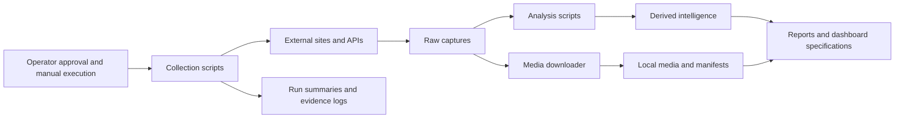
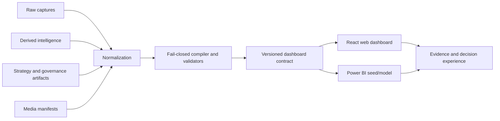
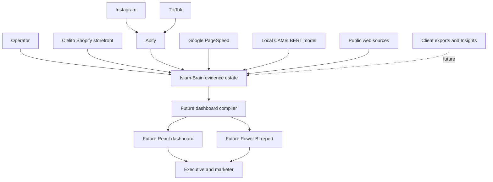
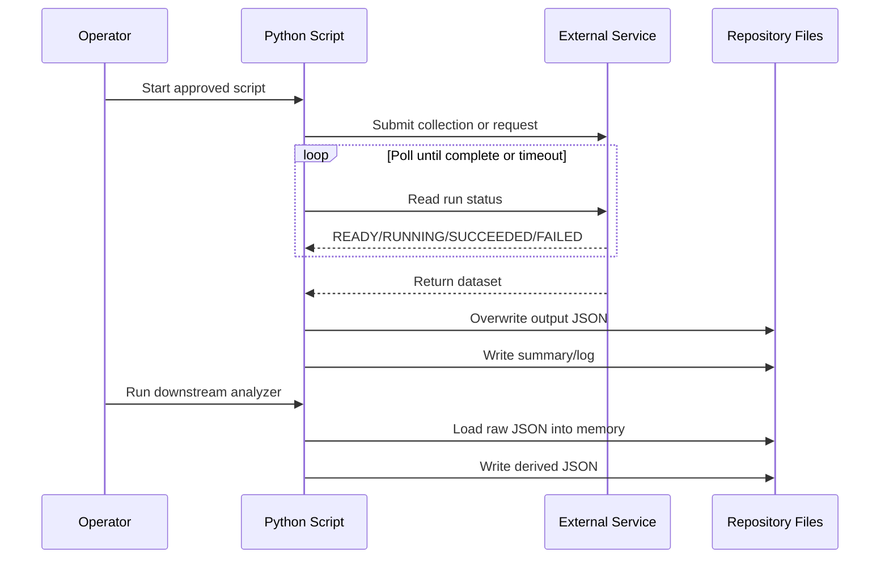
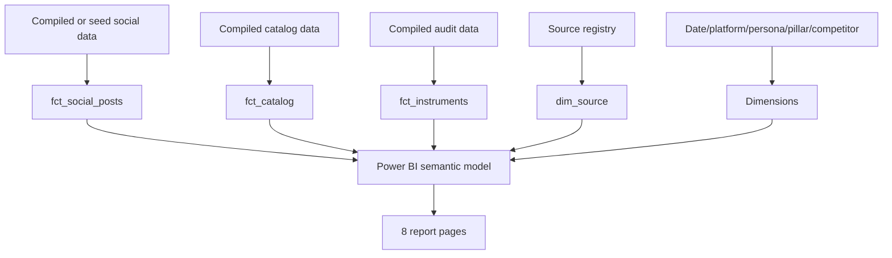
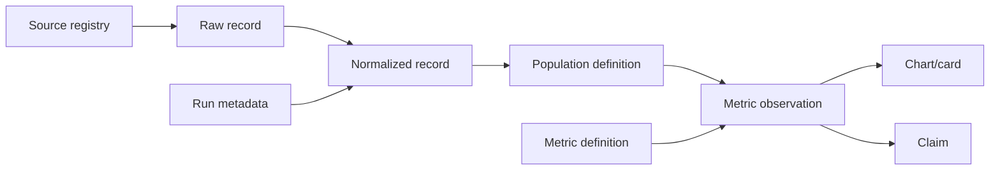
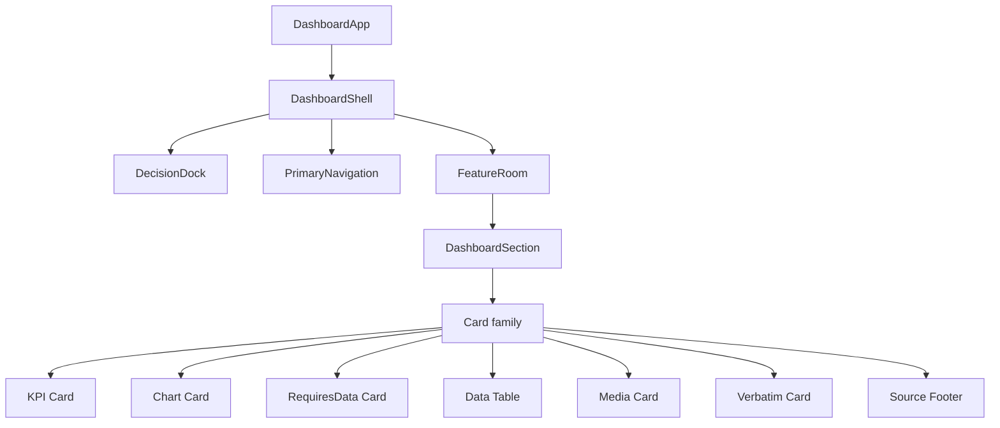
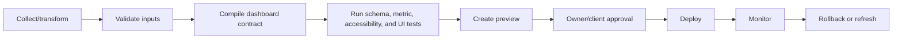

# 04 — System Architecture

> **System:** Dashboard Intelligence Operating System (DIOS)  
> **Repository:** `omarali304ii-byte/Islam-Brain`  
> **Repository baseline:** `44cea987cd42f077cc0f6e448bcdc69f2683ecb1`  
> **DIOS working branch:** `docs/dios-phase-0-inventory`  
> **Architecture date:** 2026-07-12  
> **Phase status:** Phase 4 — Complete, awaiting validation  
> **Previous artifacts:** [`00_Project_Inventory.md`](./00_Project_Inventory.md) · [`01_Understanding.md`](./01_Understanding.md) · [`02_Dashboard_Architecture.md`](./02_Dashboard_Architecture.md) · [`03_Design_System.md`](./03_Design_System.md)  
> **Next phase:** Blocked until this document passes its quality gate

---

## Table of Contents

1. [Phase Entry Decision](#1-phase-entry-decision)
2. [Scope and Evidence Boundary](#2-scope-and-evidence-boundary)
3. [Executive Architecture Verdict](#3-executive-architecture-verdict)
4. [Architecture Status Model](#4-architecture-status-model)
5. [System Context](#5-system-context)
6. [Current As-Is Architecture](#6-current-as-is-architecture)
7. [Specified Future Architecture](#7-specified-future-architecture)
8. [Architecture Layers and Trust Boundaries](#8-architecture-layers-and-trust-boundaries)
9. [Repository and Module Responsibilities](#9-repository-and-module-responsibilities)
10. [Domain Boundaries](#10-domain-boundaries)
11. [Data Architecture](#11-data-architecture)
12. [Identity, Grain, and Canonicality](#12-identity-grain-and-canonicality)
13. [Collection and Ingestion Architecture](#13-collection-and-ingestion-architecture)
14. [Normalization and Transformation Architecture](#14-normalization-and-transformation-architecture)
15. [Analysis and Model Architecture](#15-analysis-and-model-architecture)
16. [Provenance and Evidence Architecture](#16-provenance-and-evidence-architecture)
17. [Compiler and Validation Architecture](#17-compiler-and-validation-architecture)
18. [React Application Architecture](#18-react-application-architecture)
19. [Routing and Navigation Architecture](#19-routing-and-navigation-architecture)
20. [Component Architecture](#20-component-architecture)
21. [State-Management Architecture](#21-state-management-architecture)
22. [Data Access, Services, Hooks, and Utilities](#22-data-access-services-hooks-and-utilities)
23. [Filtering and Query Architecture](#23-filtering-and-query-architecture)
24. [Power BI Architecture](#24-power-bi-architecture)
25. [Client-Data Ingestion Architecture](#25-client-data-ingestion-architecture)
26. [External Integration Architecture](#26-external-integration-architecture)
27. [Error-Handling Architecture](#27-error-handling-architecture)
28. [Reliability, Idempotency, and Concurrency](#28-reliability-idempotency-and-concurrency)
29. [Security, Privacy, and Governance](#29-security-privacy-and-governance)
30. [Performance and Scalability](#30-performance-and-scalability)
31. [Responsive Architecture](#31-responsive-architecture)
32. [Accessibility Architecture](#32-accessibility-architecture)
33. [Deployment and Operations](#33-deployment-and-operations)
34. [Testing and Quality Architecture](#34-testing-and-quality-architecture)
35. [Observability and Auditability](#35-observability-and-auditability)
36. [Architecture Strengths](#36-architecture-strengths)
37. [Architecture Weaknesses and Technical Debt](#37-architecture-weaknesses-and-technical-debt)
38. [Architecture Decision Register](#38-architecture-decision-register)
39. [Alternatives and Professional Practices](#39-alternatives-and-professional-practices)
40. [Traceability Matrix](#40-traceability-matrix)
41. [Unresolved Architecture Questions](#41-unresolved-architecture-questions)
42. [Phase 4 Validation Gate](#42-phase-4-validation-gate)
43. [Glossary](#43-glossary)
44. [Document Control](#44-document-control)

---

## 1. Phase Entry Decision

Phase 3 was complete but awaiting owner validation. On 2026-07-12, the repository owner explicitly instructed the system to proceed with **Phase 4**.

This is recorded as:

- **Phase 3 acceptance:** Accepted by owner with all documented design-token limitations.
- **Authorized work:** Analyze and document the system architecture.
- **Forbidden work:** Do not implement, redesign, deploy, scrape, execute paid routes, or modify production behavior.
- **Evidence limitation:** The React application, dashboard compiler, Power BI file, deployment repository, runtime orchestrator, and several strategy artifacts remain unavailable.

> [!IMPORTANT]
> This phase distinguishes the **current evidence-processing estate** from the **specified future dashboard system**. It does not describe unverified code as if it exists.

---

## 2. Scope and Evidence Boundary

### 2.1 Primary architecture evidence

This document is grounded mainly in:

- `RUN_STATE.json`
- `CIELITO_TAB_DEEPENING_MASTER_PROMPT.md`
- `dashboard/react_dashboard_spec.md`
- `dashboard/powerbi_spec.md`
- `_intel/SOURCE_REGISTRY.md`
- `_intel/data_pass_menu_base360.md`
- `_intel/scraping_evidence_log.yaml`
- `_intel/apify_rest_capture.py`
- `_intel/apify_deep_capture.py`
- `_intel/apify_reviews_capture.py`
- `_intel/download_media.py`
- `_intel/build_cielito_pricing_design.py`
- `_intel/build_cielito_sentiment.py`
- `_intel/build_cielito_verbatims.py`
- Confirmed raw, derived, media, instrument, and deliverable artifacts
- Phase 0 through Phase 3 DIOS documents

### 2.2 Architecture evidence classes

| Class | Meaning |
|---|---|
| **Confirmed current** | Code, data, or behavior exists in the repository. |
| **Specified future** | Explicitly described in a confirmed specification but not implemented here. |
| **Required boundary** | Necessary for the specified system to work safely, but not defined or implemented. |
| **External dependency** | Exists outside the repository or is expected from another system. |
| **Architectural inference** | Strongly implied by the system contract, but not directly confirmed. |
| **Unknown** | Evidence is insufficient and no assumption is promoted to fact. |

### 2.3 Systems not available for direct inspection

- `dashboard/build_cielito_data.py`
- `cielito_360_data.json`
- React source code
- React routes
- React state-management code
- Chart-library implementation
- API routes or backend services
- Authentication and authorization code
- `scripts/banned_vocab.py`
- `strategy.json`
- `gaps.yaml`
- `CONTENT_INTELLIGENCE.md`
- `VOICE_VALIDATION`
- `SOV_BATTLE_MAP`
- `CAMPAIGN_CALENDAR`
- `esm-landing` repository
- Deployment configuration
- CI/CD workflows
- Power BI `.pbix`
- `validate_cielito_pbi.py`
- Power BI seed CSVs
- External Mega Run runtime
- `ESTATE_STATE.json`
- Patch-ledger and watch-register implementations

### 2.4 Consequence

The architecture can be analyzed at three levels:

1. **Current pipeline architecture** — high confidence.
2. **Specified presentation architecture** — high confidence as a contract, low confidence as an implementation.
3. **Operational production architecture** — largely unknown.

---

## 3. Executive Architecture Verdict

The repository currently implements a **local, file-based, batch intelligence pipeline**. It does not implement a web application, backend platform, database, or deployed dashboard.

The intended product is a **compiled, evidence-governed, mostly read-only decision dashboard** with two presentation targets:

- React web dashboard
- Power BI report

The most important missing architectural element is the proposed compiler:

```text
build_cielito_data.py
```

That compiler is intended to transform heterogeneous research files into a validated, client-safe dashboard contract. It is the proposed boundary where:

- schemas become enforceable;
- source IDs become mandatory;
- unsupported claims are blocked;
- missing data becomes an explicit state;
- internal vocabulary is removed;
- media is validated;
- the frontend stops depending directly on research artifacts.

Because the compiler does not exist in the confirmed repository, the system currently has **documented governance but no enforceable application data contract**.

### 3.1 Architecture in one sentence

> A strong evidence-governance concept is sitting on top of a fragile local batch pipeline, waiting for a missing compiler and presentation runtime to turn it into a production system.

### 3.2 Current versus intended state

| Concern | Current repository | Intended system |
|---|---|---|
| Persistence | JSON, Markdown, YAML, HTML, TXT, JPG | Validated compiled dataset plus local media |
| Execution | Manual Python scripts / external runtime | Repeatable compile and dashboard build |
| Database | None confirmed | None explicitly required for the initial read-only dashboard |
| Backend/API | None confirmed | Not specified |
| Frontend | None confirmed | React dashboard at `/dashboard/cielito-360` |
| BI | Specification only | Refreshable Power BI report |
| Validation | Script-specific and documentary | Central fail-closed compiler |
| Authentication | None | Undefined |
| Deployment | None | External `esm-landing` deployment |
| CI/CD | None confirmed | Required but undefined |
| Observability | Logs and summary files | Required but undefined |

---

## 4. Architecture Status Model

### 4.1 Current implemented layers



### 4.2 Specified future layers



### 4.3 Missing production layers

- Canonical schema registry
- Versioned data contracts
- Dependency management
- Environment configuration
- Central execution entry point
- Atomic pipeline orchestration
- Authentication and authorization
- Data access policy
- Deployment workflow
- Monitoring and alerting
- Automated tests
- Rollback strategy

---

## 5. System Context

### 5.1 Actors

| Actor | Role | Confirmed or intended |
|---|---|---|
| Repository operator | Approves routes, runs scripts, controls spend | Confirmed/external runtime |
| Analyst/researcher | Reviews evidence and derived intelligence | Confirmed workflow |
| Executive/owner | Reads verdict, decisions, financial gaps, and KPIs | Intended dashboard user |
| Marketer | Investigates posts, creators, language, content, pricing | Intended dashboard user |
| Evidence reviewer | Challenges claims and opens source records | Intended dashboard user |
| Client-data owner | Supplies Shopify, GA4, Insights, revenue, returns, CAC | External future actor |
| Dashboard developer | Implements compiler and React/Power BI layers | Future actor |

### 5.2 External systems



### 5.3 System-of-record status

There is no single confirmed system of record.

Instead, truth is distributed among:

- raw capture files;
- derived datasets;
- source registry;
- run-state file;
- scraping evidence log;
- final reports;
- specifications;
- external runtime state.

This produces a **multi-authority architecture**. The source registry defines evidence meaning, while raw files preserve captures, derived files define calculations, and narrative files often define business interpretation.

---

## 6. Current As-Is Architecture

### 6.1 Architectural style

The current implementation is:

- batch-oriented;
- local-first;
- script-driven;
- file-persisted;
- mostly single-user;
- manually orchestrated;
- append-by-new-file in some areas;
- overwrite-in-place in other areas;
- externally governed by operator approvals.

### 6.2 Current execution pipeline



### 6.3 Current persistence model

| Format | Role |
|---|---|
| JSON | Raw captures, derived data, manifests, summaries, audits |
| Markdown | Specifications, decisions, research, source registry |
| YAML | Collection evidence log |
| HTML/TXT/XML | Website captures |
| JPG | Local social and product media |
| PDF/PPTX | Client exports |

### 6.4 No confirmed runtime application

The repository does not contain:

- web server;
- API server;
- database process;
- frontend build process;
- package manifest;
- deployment manifest;
- scheduled worker;
- queue;
- cache;
- identity provider.

### 6.5 Orchestration status

`RUN_STATE.json` and `final/NEXT_STEPS.md` reference an external Mega Run runtime. The runtime is not part of this repository. Therefore:

- orchestration rules are not inspectable;
- retries and resumability cannot be verified;
- approval enforcement cannot be verified;
- spend gates cannot be verified in code;
- state reconciliation cannot be verified.

---

## 7. Specified Future Architecture

### 7.1 Intended React path

```mermaid
flowchart TD
    S[strategy.json] --> C[build_cielito_data.py]
    I[_intel/*.json] --> C
    A[instruments/*.json] --> C
    M[media manifests and local assets] --> C
    G[gaps and source registry] --> C
    B[banned vocabulary rules] --> C
    C -->|validate and fail closed| J[cielito_360_data.json]
    J --> R[React feature modules]
    R --> Route[/dashboard/cielito-360]
```

### 7.2 Intended Power BI path



### 7.3 Likely delivery mode

The specification implies a compile-time or build-time data model rather than live browser access to external APIs.

Evidence:

- a compiler emits one dashboard JSON file;
- media must be local;
- no API server is specified;
- no live synchronization contract is specified;
- the initial use case is a pitch and decision command center.

**Confidence:** Medium to high as an architectural inference.

### 7.4 Read-only versus operational product

The initial dashboard appears read-only:

- no edit flows are specified;
- no content scheduling write-back is specified;
- no client-data upload UI is specified;
- no user accounts are specified;
- no annotations or saved views are specified;
- no workflow transitions are specified.

The term “living command center” therefore means refreshable and navigable, not necessarily transactional.

---

## 8. Architecture Layers and Trust Boundaries

### 8.1 Layer model

| Layer | Responsibility | Trust level |
|---|---|---|
| L0 External sources | Shopify, social platforms, web, client exports | Untrusted input |
| L1 Raw evidence | Preserve captured source payloads | Captured, not interpreted |
| L2 Normalization | Convert source-specific fields to canonical records | Required, currently fragmented |
| L3 Analysis | Calculate metrics, model sentiment, code themes | Derived and method-dependent |
| L4 Provenance | Attach source, grade, n, window, run, method | Partially implemented |
| L5 Compiler | Validate, redact, reconcile, and emit dashboard contract | Specified critical trust boundary |
| L6 Presentation | Render decisions, diagnostics, evidence, gaps | Must trust only compiled contract |
| L7 Operations | Deploy, refresh, monitor, authorize, rollback | Missing/undefined |

### 8.2 Critical trust boundary

The frontend must not decide whether a claim is safe.

That decision belongs before presentation, in the compiler/validation layer.

The compiler should be responsible for:

- schema validation;
- source validation;
- evidence-grade validation;
- metric-definition validation;
- dataset-version selection;
- privacy filtering;
- media validation;
- vocabulary filtering;
- gap-state creation;
- claim-to-source mapping;
- deterministic output.

### 8.3 Current trust-boundary defect

Today, derived JSON and final narratives can be consumed without one central validator. Governance rules exist across multiple documents and scripts, but no single execution path proves they were all applied.

---

## 9. Repository and Module Responsibilities

### 9.1 Current repository modules

| Module | Current responsibility | Architectural issue |
|---|---|---|
| Root prompt/state | Defines workflow intent and declared completion | State can become stale relative to later captures |
| `_sources/` | Stores raw and intermediate evidence | No uniform metadata envelope or version manifest |
| `_intel/` scripts | Collection, normalization, analysis, output | Responsibilities are mixed inside standalone scripts |
| `_intel/` datasets | Stores derived intelligence | No canonical precedence contract |
| `_media/` | Stores local assets and manifests | File naming is partly rank/index dependent |
| `instruments/` | Stores audit outputs | Tool versions and raw execution records missing |
| `dashboard/` | Stores React/Power BI specifications | No implementation |
| `final/` | Stores client-facing decisions and reports | Narrative claims can drift from later datasets |
| `deliverables/` | Stores exports | Source-to-export equality not validated |
| `docs/DIOS/` | Stores permanent understanding artifacts | Documentation, not runtime enforcement |

### 9.2 Current script cohesion

Most scripts combine several responsibilities:

- configuration;
- credential discovery;
- transport;
- polling;
- parsing;
- normalization;
- persistence;
- logging.

This creates high coupling and makes isolated testing difficult.

### 9.3 No shared library layer

No confirmed shared modules exist for:

- HTTP client behavior;
- retries/backoff;
- configuration;
- paths;
- logging;
- schema validation;
- atomic writes;
- run metadata;
- canonical IDs;
- source envelopes;
- metric definitions.

---

## 10. Domain Boundaries

The project contains at least eight logical domains.

### 10.1 Evidence Acquisition

Responsibilities:

- obtain public or approved paid data;
- persist source payloads;
- record costs, counts, status, and approval context.

Current files:

- Apify capture scripts
- website captures
- source summaries
- scraping log

### 10.2 Catalog Intelligence

Responsibilities:

- products;
- variants/options;
- availability;
- categories;
- price and compare-at values;
- discount analysis;
- design sample selection.

### 10.3 Social Intelligence

Responsibilities:

- posts;
- captions;
- comments;
- creators;
- engagement;
- ownership classification;
- language classification;
- media references.

### 10.4 Voice and Sentiment

Responsibilities:

- sentiment inference;
- emoji polarity;
- theme classification;
- intent signals;
- verbatim preservation;
- qualitative coding.

### 10.5 Website and Discoverability

Responsibilities:

- performance audits;
- SEO;
- agent readiness;
- site policy and content captures.

### 10.6 Strategy and Decision Intelligence

Responsibilities:

- diagnosis;
- decisions;
- positioning;
- personas;
- content plan;
- KPI covenant;
- missing-data requests.

Several canonical artifacts are missing.

### 10.7 Evidence Governance

Responsibilities:

- source IDs;
- confidence grades;
- claim traceability;
- sample sizes;
- capture windows;
- gaps;
- approval and cost routes.

### 10.8 Presentation

Responsibilities:

- executive story;
- diagnostic rooms;
- chart cards;
- evidence room;
- RequiresData states;
- React and Power BI parity.

This domain is specified but not implemented.

---

## 11. Data Architecture

### 11.1 Current architecture

The current data architecture is a set of independent files rather than a managed data store.

Advantages:

- easy inspection;
- portable snapshots;
- simple Git history;
- low infrastructure cost;
- appropriate for a small research estate.

Limitations:

- weak relational integrity;
- weak queryability;
- difficult incremental updates;
- duplicate and overlapping datasets;
- no transactional writes;
- no schema migration mechanism;
- no canonical lineage graph;
- large diffs for regenerated JSON;
- binary repository growth.

### 11.2 Required canonical entities

A coherent compiled model requires entities such as:

| Entity | Required identity/grain |
|---|---|
| `Source` | One evidence source or capture route |
| `Run` | One collection or transformation execution |
| `Post` | One platform post with stable platform ID |
| `Comment` | One comment with stable platform ID where available |
| `Creator` | One public handle scoped to platform |
| `Product` | One Shopify product |
| `Variant` | One sellable variant/SKU |
| `Collection` | One Shopify collection |
| `AuditMetric` | One metric at one device/time/tool version |
| `MetricDefinition` | One named formula/version |
| `MetricObservation` | One metric value for a window/sample |
| `Claim` | One client-facing statement |
| `EvidenceLink` | Relationship between claim and source records |
| `Gap` | One missing input and its closure route |
| `MediaAsset` | One local asset linked to source record |
| `Decision` | One approved/proposed strategic decision |

These entities are not currently represented through one formal schema.

### 11.3 Required metadata envelope

Every raw and derived artifact should be representable with:

```yaml
schema_version: TBD
artifact_id: TBD
artifact_type: raw_capture | normalized | derived | compiled
created_at: ISO-8601
run_id: stable-run-id
source_ids: [S08]
input_artifacts: []
record_count: 0
capture_window:
  start: null
  end: null
method:
  name: null
  version: null
confidence: null
checksum: null
```

This is a documentation schema, not a claim that the repository already implements it.

### 11.4 Database necessity

A database is not strictly required for the first static/read-only dashboard if:

- data volume remains small;
- refreshes are infrequent;
- one compiler produces a deterministic artifact;
- no multi-user writes exist.

A database becomes more appropriate if the system adds:

- scheduled ingestion;
- historical snapshots;
- live client data;
- multi-client tenancy;
- annotations;
- user accounts;
- write-back workflows;
- larger social datasets;
- frequent refreshes.

---

## 12. Identity, Grain, and Canonicality

### 12.1 Social identity

Current social datasets use overlapping generations:

- initial Instagram capture;
- corrective owned capture;
- deep Instagram capture;
- deep comments;
- TikTok videos;
- TikTok comments;
- derived sentiment and verbatim outputs.

No canonical post identity contract is confirmed.

Required stable identity would normally use:

```text
platform + platform_post_id
```

with URL as a secondary locator, not the primary identity.

### 12.2 Current deduplication behavior

The sentiment script deduplicates comments using:

```text
(handle, text)
```

This can incorrectly collapse two separate comments when the same handle posts the same text on different posts or dates.

The deep-capture script deduplicates post URLs before selecting the top 40 comment targets. This is useful but only local to that script.

### 12.3 Catalog grain defect

The Power BI specification calls `fct_catalog` one row per SKU while the confirmed `catalog_full.json` summary represents 250 products. Products and variants are not interchangeable.

Consequences:

- size/option analysis may be wrong;
- availability can differ by variant;
- price can differ by variant;
- inventory cannot be represented accurately;
- SKU-level sales cannot join safely to product-level rows.

### 12.4 Option semantics defect

The pricing script treats `option1` as a size. Confirmed outputs include colors and `Default Title`, showing that Shopify option positions are not semantically stable across products.

A canonical model must distinguish:

- option name;
- option value;
- variant identity;
- normalized size;
- normalized color;
- product-specific option structure.

### 12.5 Metric identity

Each metric requires:

- stable metric ID;
- formula version;
- numerator;
- denominator;
- aggregation method;
- population;
- filters;
- sample size;
- capture window;
- source IDs.

The `~190×` owned-versus-earned metric currently fails this contract because the React narrative uses earned peak versus owned median while the Power BI formula names median versus median.

### 12.6 Canonical precedence requirement

A machine-readable manifest must eventually identify:

- canonical raw dataset by domain;
- superseded datasets;
- current derived outputs;
- accepted metric definitions;
- dashboard build inputs;
- artifact checksums;
- build timestamp.

---

## 13. Collection and Ingestion Architecture

### 13.1 Current transport

Collection scripts use Python standard-library HTTP requests and Apify REST.

The base capture script:

- loads a token from a local secrets file;
- starts actor runs;
- polls every 15 seconds;
- waits up to a fixed duration;
- downloads the resulting dataset;
- writes JSON;
- writes a summary.

### 13.2 Current strengths

- credentials are not printed intentionally;
- collection costs are captured where returned;
- failed routes are documented as inaccessible rather than absent;
- paid routes have operator-approval context in comments and logs;
- fixed timeouts prevent infinite polling.

### 13.3 Current weaknesses

- token path is hard-coded to one Windows user;
- token is appended to the request URL query string;
- no shared HTTP client exists;
- no exponential backoff;
- no explicit handling for HTTP 429;
- no retry policy for transient failures;
- no actor-version pinning;
- no run ID persisted in summaries;
- no response schema validation;
- no raw response checksum;
- no atomic output write;
- no partial-result quarantine;
- no idempotency key;
- no lock preventing concurrent runs;
- no budget-enforcement code visible in the scripts.

### 13.4 Approval architecture

The data-pass menu defines an important control rule:

- paid routes require explicit approval;
- deferred is a valid decision;
- client-only data must not be scraped;
- costs are estimated before execution.

However, this approval control is documentary and external-runtime based. It is not enforced by the confirmed collector scripts themselves.

### 13.5 Ingestion-state model

A production-grade run state would need states such as:

```text
PLANNED
APPROVAL_REQUIRED
APPROVED
RUNNING
SUCCEEDED
PARTIAL
FAILED_RETRYABLE
FAILED_FINAL
CANCELLED
DROPPED_BY_OPERATOR
SUPERSEDED
```

The repository currently records some of these concepts in prose and logs, but not through one validated state machine.

---

## 14. Normalization and Transformation Architecture

### 14.1 Current pattern

Each analysis script performs its own source-specific normalization.

Examples:

- category inference inside pricing script;
- comment normalization inside sentiment script;
- platform field mapping inside media downloader;
- deduplication inside individual scripts.

### 14.2 Architectural problem

Normalization logic is duplicated and hidden inside downstream analyses. This means two analyses can interpret the same raw source differently.

### 14.3 Required normalization boundary

A coherent pipeline would separate:

```text
Raw source payload
    → Source adapter
    → Canonical normalized record
    → Domain analysis
    → Metric observations
    → Dashboard compilation
```

### 14.4 Source adapters required

Conceptual adapters include:

- Shopify product adapter
- Shopify collection adapter
- Instagram post adapter
- Instagram comment adapter
- TikTok video adapter
- TikTok comment adapter
- PageSpeed adapter
- Agent-readiness adapter
- Search-corpus claim adapter
- Client export adapter

### 14.5 Normalization output requirements

- stable IDs;
- normalized timestamps;
- explicit platform;
- explicit ownership classification;
- explicit language classification method;
- normalized engagement fields without conflating views and reach;
- source record pointer;
- raw payload preservation;
- validation errors collected separately.

---

## 15. Analysis and Model Architecture

### 15.1 Current analysis styles

The repository combines:

- deterministic aggregation;
- heuristic classification;
- machine-learning inference;
- manual visual review;
- qualitative coding;
- secondary research synthesis.

Each method has different confidence and reproducibility characteristics.

### 15.2 Sentiment architecture

The sentiment script:

1. combines Instagram comments, TikTok comments, owned captions, and TikTok captions;
2. deduplicates some comments;
3. separates emoji-only content;
4. uses a local CAMeLBERT model for text;
5. falls back to a rule-based lexicon if model loading fails;
6. applies keyword intent and theme rules;
7. writes aggregate and row-level evidence.

### 15.3 Sentiment architecture strengths

- output records the method;
- emoji-only content is handled separately;
- fallback status changes the reported engine name;
- evidence rows are preserved;
- warning discourages quoting one blended sentiment number.

### 15.4 Sentiment architecture risks

- model version/checksum is absent;
- local model path is hard-coded;
- validation accuracy comes from another dataset;
- captions and comments are mixed in one overall distribution;
- keyword matching can create false positives;
- fallback can substantially change output semantics;
- no run manifest proves which engine produced a committed file;
- no regression fixture exists;
- `strip_pii` is a no-op;
- public handles and comment text remain in output.

### 15.5 Manual-analysis architecture

Product-design analysis downloads a high-price-first sample with category caps. This is a deterministic convenience sample, not a statistically representative catalog sample.

Manual labels require:

- reviewer identity;
- codebook version;
- review date;
- disagreement handling;
- sample-selection method;
- confidence level.

No complete human-review protocol is confirmed.

### 15.6 Formula registry requirement

Metrics should not be calculated independently inside chart components, Power BI measures, and narrative reports.

A formula registry should define each metric once and expose it to both presentation targets.

This is especially important for:

- engagement rate;
- owned-versus-earned ratio;
- discount surface;
- catalog hygiene;
- UGC velocity;
- followers per video;
- sentiment percentages;
- price-band definitions.

---

## 16. Provenance and Evidence Architecture

### 16.1 Current strengths

The source registry defines:

- source IDs;
- source type;
- file path;
- grade ceiling;
- explicit blocked data.

The dashboard contract requires:

- source ID;
- sample size;
- capture window;
- confidence;
- gap route.

### 16.2 Current limitation

Provenance is mostly document-level rather than record-level.

A chart may cite `S08`, but a record-level lineage graph is not confirmed between:

```text
raw post
→ normalized post
→ metric population
→ metric observation
→ chart
→ narrative claim
```

### 16.3 Required lineage model



### 16.4 Evidence-link object

A compiled evidence link should conceptually include:

```json
{
  "claim_id": "TBD",
  "metric_id": "TBD",
  "source_ids": ["S08"],
  "artifact_ids": ["TBD"],
  "record_ids": ["TBD"],
  "sample_size": 0,
  "window": {"start": null, "end": null},
  "grade": "HELD",
  "method_version": "TBD"
}
```

### 16.5 Evidence access policy

The Evidence Room may expose:

- public handles;
- exact comments;
- source URLs;
- local media;
- internal file paths;
- collection costs;
- confidence labels.

The system must decide which of these are:

- client-visible;
- internal-only;
- analyst-only;
- redacted;
- downloadable.

No role-based evidence policy is confirmed.

---

## 17. Compiler and Validation Architecture

### 17.1 Architectural role

`build_cielito_data.py` is the specified system’s most important missing component.

It should be the only supported path from research estate to dashboard data.

### 17.2 Specified validations

- reject banned internal vocabulary;
- reject KPIs without source IDs;
- reject unguarded money numbers;
- reject missing media;
- reject oversized media;
- reject CDN-hotlinked media;
- caveat self-reported and hypothesis-grade content;
- convert unsupported values to GapPlaceholder states;
- never represent unavailable financial values as zero.

### 17.3 Additional required validations

The architecture also requires, but does not explicitly confirm:

- input schema validation;
- output schema validation;
- required capture windows;
- required sample sizes;
- metric-definition IDs;
- duplicate record detection;
- canonical dataset selection;
- product-versus-variant grain checks;
- valid local media path checks;
- source registry referential integrity;
- confidence-grade compatibility;
- route/state reconciliation;
- content-language encoding validation;
- deterministic ordering;
- output checksum;
- build manifest.

### 17.4 Compiler output boundary

The frontend should consume one versioned contract such as:

```text
cielito_360_data.json
```

It should not import raw `_sources` or analysis-specific `_intel` files directly.

### 17.5 Conceptual output sections

```json
{
  "schema_version": "TBD",
  "build": {},
  "client": {},
  "decision_dock": {},
  "command_story": [],
  "rooms": {},
  "metrics": {},
  "evidence": {},
  "gaps": {},
  "media": {},
  "localization": {}
}
```

### 17.6 Fail-closed meaning

Fail-closed should mean the build stops with actionable errors when a required claim is unsafe.

It should not mean:

- silently dropping a chart;
- replacing evidence with zero;
- hiding validation errors;
- rendering stale data without warning;
- falling back to unvalidated narrative copy.

### 17.7 Build report

Every compile should emit a report containing:

- build ID;
- input artifact versions/checksums;
- validation results;
- warnings;
- blocked cards;
- created GapPlaceholder cards;
- media totals;
- source coverage;
- metric-definition versions;
- output checksum.

No such report is confirmed.

---

## 18. React Application Architecture

### 18.1 Confirmed intended route

```text
/dashboard/cielito-360
```

in an external `esm-landing` application.

### 18.2 Intended architectural character

The React application is best understood as a feature-oriented, read-only analytical interface.

Conceptual feature boundaries:

```text
features/
├── command
├── social
├── posts
├── creators
├── sentiment
├── verbatims
├── catalog
├── pricing
├── product-design
├── website
├── competitive
├── audience
├── content
├── strategy
└── evidence
```

This folder structure is a conceptual decomposition, not a confirmed repository structure.

### 18.3 Application shell responsibilities

- load compiled dashboard contract;
- validate compatible schema version;
- render persistent Decision Dock;
- render primary navigation;
- preserve language and filter context;
- provide error boundary;
- provide evidence drawer/modal behavior;
- provide responsive shell;
- expose build timestamp and data freshness.

### 18.4 Feature-module responsibilities

Each feature should own:

- view composition;
- domain-specific selectors;
- domain-specific filters;
- chart configuration;
- empty and RequiresData states;
- evidence links;
- accessible summaries.

### 18.5 Presentation isolation

Charts should receive compiled, presentation-ready data rather than performing domain calculations in React.

This prevents:

- formula drift;
- repeated data cleaning;
- source loss;
- client-side heavy computation;
- inconsistent React versus Power BI values.

### 18.6 Unknown frontend decisions

- framework version;
- Next.js versus plain React;
- server components;
- routing library;
- chart library;
- CSS strategy;
- state library;
- data-fetching library;
- testing library;
- localization library;
- hosting provider;
- authentication model.

---

## 19. Routing and Navigation Architecture

### 19.1 Required routes or route states

The specification requires access to:

- Command
- Social Command Center
- Post Explorer
- Creator Directory
- Sentiment
- Words and Verbatims
- Catalog and Pricing
- Pricing and Value
- Product Design
- Website and Discoverability
- Competitive
- Audience and Personas
- Content Engine
- Strategy
- Evidence

### 19.2 Possible route models

| Model | Benefit | Risk |
|---|---|---|
| One route with internal tabs | Simple pitch experience | Weak deep linking and history |
| Nested routes by room | Shareable and bookmarkable | More routing complexity |
| Hybrid route plus sub-tabs | Balanced | Requires explicit state rules |

No model is confirmed.

### 19.3 Required navigation state

- current room;
- current sub-room;
- selected metric/card;
- selected evidence record;
- global filter state;
- language/direction;
- URL-deep-link state where supported.

### 19.4 Evidence navigation

A source footer should open evidence without destroying analytical context.

Conceptually:

```text
Chart → Evidence drawer/page → Raw/source details → Back to same filtered chart
```

### 19.5 Missing navigation contracts

- browser history behavior;
- breadcrumbs;
- mobile navigation;
- keyboard shortcuts;
- focus restoration after modal close;
- deep links to posts or evidence;
- unauthorized-route behavior.

---

## 20. Component Architecture

### 20.1 Shared component hierarchy



### 20.2 Required card contract

Every analytical card should be able to express:

- stable card ID;
- business question;
- insight-led title;
- data state;
- visualization payload;
- so-what line;
- source IDs;
- sample size;
- capture window;
- confidence;
- caveat;
- evidence target;
- loading/error state if runtime loading exists.

### 20.3 Required data-state variants

```text
AVAILABLE
REQUIRES_DATA
HYPOTHESIS
SELF_REPORTED
ESTIMATE_ONLY
STALE
VALIDATION_ERROR
UNAVAILABLE
```

### 20.4 Chart adapter layer

A chart adapter should translate a generic chart contract into the selected chart library.

This allows:

- consistent colors;
- consistent tooltips;
- accessibility summaries;
- source footers;
- number formatting;
- React/Power BI parity documentation;
- replacement of the chart library without rewriting domain logic.

No chart adapter is confirmed.

### 20.5 Component-boundary risk

If each room directly defines chart options, evidence footers, formats, and missing-data states, the application will drift visually and logically.

---

## 21. State-Management Architecture

### 21.1 State categories

| State category | Examples | Expected owner |
|---|---|---|
| Build data | Compiled metrics, evidence, media | Immutable loaded contract |
| Route state | Current room/sub-room | Router or application shell |
| Global filter state | Platform, date, ownership, language | Shared dashboard state |
| Local interaction state | Sort column, expanded card, tooltip | Feature/component |
| Evidence state | Selected source/claim | Shared drawer/modal state |
| Localization state | Arabic/English, RTL/LTR | Application context |
| User state | Identity, role, preferences | Undefined |
| Refresh state | Build version/freshness | Undefined |

### 21.2 Likely initial approach

Because the specified dashboard is read-only and compiled, it may not need a heavy global state library.

A coherent initial architecture could use:

- route/search parameters for shareable filters;
- context for language and evidence drawer;
- local component state for table sorting and expansion;
- immutable compiled data loaded once.

This is an architectural option, not a confirmed implementation.

### 21.3 State risks

- filters can apply differently across rooms;
- route state can conflict with tab state;
- evidence modal can lose focus/context;
- global date filters may be invalid for datasets with different windows;
- filters can create empty samples without updating `n=`;
- derived ratios must recalculate using valid definitions or remain precompiled.

### 21.4 Filtered-metric rule

Whenever a filter changes the population:

- sample size must update;
- capture window may update;
- evidence links must update;
- metric calculation must use the same registered formula;
- confidence may change;
- empty state must be explicit.

---

## 22. Data Access, Services, Hooks, and Utilities

### 22.1 Confirmed current state

No frontend service layer, hooks, or utilities are present.

### 22.2 Required conceptual boundaries

```text
Data contract loader
Schema compatibility checker
Metric selector layer
Evidence resolver
Media resolver
Formatting utilities
Localization utilities
Filter utilities
Chart adapters
Freshness/staleness utilities
```

### 22.3 Data loader

Responsibilities:

- load only compiled data;
- reject incompatible schema versions;
- expose build metadata;
- provide a typed result;
- distinguish load failure from no data.

### 22.4 Evidence resolver

Responsibilities:

- resolve source IDs;
- resolve claim-to-source links;
- expose grade, path, window, sample, and method;
- apply visibility/redaction policy;
- avoid exposing unsafe local filesystem details to clients.

### 22.5 Media resolver

Responsibilities:

- map media IDs to local public assets;
- provide dimensions and file size;
- provide alt text/caption;
- handle missing media;
- prevent arbitrary URL injection;
- avoid direct CDN hotlinks.

### 22.6 Formatting utilities

Required formats:

- EGP currency;
- percentages;
- compact counts;
- Arabic and English digits policy;
- Cairo-local dates;
- capture windows;
- sample-size notation;
- confidence labels;
- platform-specific metric names.

### 22.7 Hooks risk

Hooks should coordinate presentation state, not contain business formulas or source-normalization logic.

---

## 23. Filtering and Query Architecture

### 23.1 Required filters

Depending on room:

- platform;
- ownership class;
- language;
- content format;
- creator;
- date range;
- sentiment;
- theme;
- category;
- price band;
- availability;
- sale status;
- evidence grade.

### 23.2 Filter compatibility

Not every filter applies to every dataset.

A filter registry should identify:

- supported domains;
- field name;
- allowed values;
- default value;
- whether it changes metric formulas;
- whether it changes evidence/sample/window.

### 23.3 Cross-filter behavior

Power BI naturally supports cross-filtering, while React requires explicit behavior.

React must define whether clicking a chart:

- filters the entire room;
- filters one neighboring chart;
- opens a drill-down;
- only highlights a selection;
- updates the URL.

No cross-filter contract is confirmed.

### 23.4 Query execution location

For the current data size, filtering can occur client-side over compiled arrays.

Server-side querying becomes relevant when:

- data history grows;
- many clients are added;
- comments/media become large;
- permissions restrict row access;
- live refresh is added.

---

## 24. Power BI Architecture

### 24.1 Specified model

Facts:

- `fct_social_posts`
- `fct_catalog`
- `fct_instruments`

Dimensions:

- `dim_date`
- `dim_platform`
- `dim_persona`
- `dim_pillar`
- `dim_competitor`
- `dim_source`

### 24.2 Model defects

- social seed count reflects an earlier generation;
- catalog fact grain is described inconsistently;
- primary/foreign keys are not defined;
- relationship cardinalities are not defined;
- slowly changing dimensions are not addressed;
- historical snapshots are not addressed;
- source-to-metric bridge is not defined;
- row-level security is not defined;
- refresh credentials are not defined;
- deployment workspace is not defined.

### 24.3 Semantic-model requirement

Power BI measures and React metrics must derive from the same formula registry or compiled metric observations.

Otherwise, they can disagree while both appear valid.

### 24.4 Gap measures

The specification correctly requires unavailable financial measures to return blank plus an explanatory label rather than zero.

Power BI implementation must ensure:

- blank is not converted to zero by visuals;
- totals do not imply absent data;
- tooltips explain the gap;
- exports preserve the gap label;
- filters do not hide the reason.

### 24.5 Refresh architecture

The specification mentions manual or scheduled refresh after client access is granted, but does not define:

- gateway;
- source credentials;
- incremental refresh;
- refresh owner;
- failure alerting;
- data-retention policy;
- version rollback.

---

## 25. Client-Data Ingestion Architecture

### 25.1 Required client data

- Shopify order export;
- revenue;
- AOV;
- conversion;
- return rate;
- margin;
- channel attribution;
- GA4 events/funnel;
- Instagram Insights;
- TikTok Insights;
- ad-account data;
- creator costs and conversions.

### 25.2 Current status

No client-data ingestion mechanism exists in the repository.

### 25.3 Required boundary

Client data has a different sensitivity level from public captures. It requires:

- secure transfer;
- explicit schema;
- encryption at rest and transit;
- access controls;
- retention rules;
- organization/client isolation;
- audit log;
- deletion workflow;
- validation and reconciliation;
- secret/credential management.

### 25.4 Upload versus direct integration

Possible architectures:

| Mode | Benefit | Risk |
|---|---|---|
| Manual CSV export | Simple and auditable | Stale, manual errors |
| Shopify/GA4 API integration | Refreshable | Credentials, rate limits, maintenance |
| Managed warehouse | Scalable and historical | Higher infrastructure complexity |

No mode is selected.

### 25.5 Financial-data validation

Before any ROI scenario is displayed, the system must define:

- currency;
- tax and shipping treatment;
- refunds and cancellations;
- order date versus fulfillment date;
- gross versus net revenue;
- channel attribution window;
- unique customer rules;
- time zone;
- missing-period behavior.

---

## 26. External Integration Architecture

### 26.1 Shopify public endpoints

Current use:

- products;
- collections;
- site pages and policies.

Risks:

- public endpoint schema changes;
- no request metadata/checksum;
- product-versus-variant ambiguity;
- pagination assumptions;
- no incremental synchronization.

### 26.2 Apify

Current use:

- Instagram posts;
- TikTok videos;
- Instagram comments;
- TikTok comments;
- attempted review routes.

Risks:

- actor versions unpinned;
- payload schema changes;
- costs can change;
- run IDs absent from summaries;
- query-string token handling;
- no central retry/budget layer.

### 26.3 PageSpeed

Current use:

- single mobile and desktop audit snapshot.

Risks:

- one run is volatile;
- field data unavailable;
- API key handling not documented;
- tool/version metadata absent.

### 26.4 Local ML model

Current use:

- CAMeLBERT sentiment inference.

Risks:

- local-only path;
- model version and checksum missing;
- environment dependencies missing;
- fallback changes semantics.

### 26.5 Social permanent URLs

Permanent public URLs are useful evidence references, but the system must handle:

- deleted posts;
- private accounts;
- changed handles;
- link rot;
- unavailable embedded media;
- platform terms and client-facing display policy.

---

## 27. Error-Handling Architecture

### 27.1 Current collector behavior

Collectors typically:

- catch broad exceptions;
- write error text into summaries;
- print status;
- return empty data on non-success.

### 27.2 Current media behavior

The media downloader catches exceptions and returns `False` or `None` without preserving detailed failure metadata.

Consequences:

- DNS failure, HTTP 404, timeout, and permission failure look similar;
- retryability is unknown;
- missing-media root causes are lost;
- manifest completeness can be hard to diagnose.

### 27.3 Current analysis behavior

The sentiment loader returns `None` for any load exception. Missing, malformed, and unreadable files are therefore collapsed into one condition.

The model stage falls back to a lexicon on any exception.

This improves completion but can conceal:

- broken dependency installation;
- corrupted model files;
- incompatible model/tokenizer;
- out-of-memory errors;
- unexpected code defects.

### 27.4 Required error taxonomy

```text
CONFIGURATION_ERROR
AUTHENTICATION_ERROR
AUTHORIZATION_ERROR
NETWORK_TRANSIENT
RATE_LIMITED
REMOTE_SCHEMA_CHANGED
REMOTE_NOT_FOUND
LOCAL_FILE_MISSING
LOCAL_FILE_INVALID
SCHEMA_VALIDATION_ERROR
MODEL_UNAVAILABLE
MODEL_INFERENCE_ERROR
MEDIA_DOWNLOAD_ERROR
DATA_QUALITY_ERROR
COMPILER_BLOCKED
DEPLOYMENT_ERROR
```

### 27.5 Partial-output rule

A failed or partial run must not overwrite the last known-good canonical artifact without an explicit state and backup.

### 27.6 User-facing dashboard errors

The future dashboard must distinguish:

- application failed to load;
- compiled contract incompatible;
- room unavailable;
- card blocked by validation;
- card requires data;
- filter produced no records;
- evidence asset unavailable;
- data stale.

---

## 28. Reliability, Idempotency, and Concurrency

### 28.1 Current idempotency status

Most scripts write to fixed output paths.

Repeated runs therefore overwrite previous outputs.

No confirmed mechanism exists for:

- run-specific artifact paths;
- immutable snapshots;
- compare-and-swap writes;
- idempotency keys;
- input checksums;
- output deduplication across runs;
- resume checkpoints.

### 28.2 Current concurrency status

No lock files, process locks, or job leases are confirmed.

Concurrent scripts could:

- overwrite the same output;
- read a partially written file;
- duplicate paid runs;
- produce inconsistent summaries;
- exceed spend expectations.

### 28.3 Atomicity

Current writes use direct `write_text` or `write_bytes` operations.

A safer architectural pattern would be:

```text
write temporary file
→ validate
→ fsync where relevant
→ atomic rename
→ update manifest
```

This is not confirmed as implemented.

### 28.4 Run identity

Every collection and transformation should have a stable run ID.

The project has a Base 360 run ID in `RUN_STATE.json`, but later deep captures are not clearly represented as child runs in a central machine-readable registry.

### 28.5 Reconciliation defect

`RUN_STATE.json` records `$0.434`, while later scraping logs contain additional paid captures. This demonstrates that run state and evidence logs can diverge.

A canonical cost ledger should be derived from immutable run records rather than manually maintained summaries.

### 28.6 Reliability classification

| Capability | Status |
|---|---|
| Timeout | Present in collectors |
| Polling | Present |
| Retry/backoff | Not confirmed |
| Rate-limit handling | Not confirmed |
| Atomic writes | Not confirmed |
| Locks | Not confirmed |
| Idempotency | Not confirmed |
| Immutable snapshots | Partial through multiple filenames, not systematic |
| Resume | External runtime referenced, not inspectable |
| Rollback | Not confirmed |

---

## 29. Security, Privacy, and Governance

### 29.1 Security boundary clarification

The agent-readiness audit’s “security clean” result refers to hidden prompt-injection detection on the Cielito website. It is not an application-security audit of this repository or future dashboard.

### 29.2 Secrets architecture

Current scripts read secrets from a local file outside the repository, which is better than hard-coding the token value.

Risks remain:

- absolute user-specific secret path;
- no environment contract;
- token passed in query string;
- no credential rotation procedure;
- no secret scope documentation;
- no redaction middleware;
- no secret scanner or CI.

### 29.3 Authentication and authorization

No dashboard authentication is specified.

Questions include:

- Is the route public?
- Is it client-only?
- Are evidence records internal-only?
- Can external viewers see creator handles and exact comments?
- Can users see collection costs and internal source paths?
- Does Power BI use workspace permissions or public sharing?

### 29.4 Privacy

The sentiment script retains:

- public handles;
- exact comment text;
- source post URLs.

This is not anonymous data.

The `strip_pii` function is a no-op, so the “PII fail-closed” description is stronger than the confirmed implementation.

A governance review is required for:

- lawful use;
- client-facing display;
- retention;
- redaction;
- deletion requests;
- public-handle treatment;
- minors or sensitive content;
- cross-platform terms.

### 29.5 Media governance

Local media exists, but no confirmed policy covers:

- copyright;
- creator permission;
- reuse rights;
- client presentation;
- retention;
- takedown;
- synthetic-media labeling enforcement.

### 29.6 Input security

Future compiler and frontend must treat captions, comments, HTML captures, and source text as untrusted content.

Required protections include:

- safe escaping;
- no raw HTML rendering without sanitization;
- URL allowlisting;
- local media path validation;
- no code execution from content;
- size limits;
- schema validation.

### 29.7 Multi-client future risk

If Islam-Brain becomes a reusable multi-client platform, every artifact and query must be tenant-scoped. The current repository is single-client and file-path scoped.

---

## 30. Performance and Scalability

### 30.1 Current scale

The current data volume is modest enough for local JSON and in-memory processing:

- hundreds of posts;
- approximately one thousand sentiment items;
- 250 products;
- hundreds of media files.

### 30.2 Current script performance

- collectors poll serially;
- media downloads are serial;
- entire JSON files load into memory;
- sentiment inference batches 24 text items;
- outputs rewrite full JSON files;
- no incremental computation is confirmed.

### 30.3 Frontend performance risks

The deepening contract targets at least 20 cards per tab.

Risks:

- large initial JavaScript bundle;
- expensive chart rendering;
- too many mounted visualizations;
- large tables;
- media-heavy cards;
- RTL and localization overhead;
- duplicated data embedded in the compiled artifact;
- mobile memory pressure.

### 30.4 Required presentation strategies

Professional practices include:

- route-level code splitting;
- lazy chart loading;
- lazy media loading;
- table virtualization;
- pagination or windowing;
- precomputed aggregates;
- image dimension and size metadata;
- responsive image formats;
- avoiding repeated copies of evidence text;
- stable memoized selectors;
- progressive disclosure of 20-card rooms.

These are requirements/alternatives, not confirmed implementation.

### 30.5 Compiled-data size

The specification limits oversized media but does not define:

- maximum JSON payload;
- per-room payload;
- compression;
- cache-control;
- immutable asset hashing;
- client cache invalidation.

### 30.6 Scaling threshold

The file-based approach becomes fragile when historical snapshots and multiple clients produce:

- millions of comments;
- frequent refreshes;
- large media libraries;
- per-user filters;
- role-based access;
- write-back workflows.

At that point, a database/object-storage architecture would be more appropriate.

---

## 31. Responsive Architecture

### 31.1 Current status

No responsive implementation is confirmed.

### 31.2 Architectural requirements

Responsive behavior must be defined for:

- persistent Decision Dock;
- primary navigation;
- five-screen story;
- 20-card rooms;
- wide tables;
- charts with dense axes;
- evidence footers;
- source drawers/modals;
- Arabic RTL layouts;
- media galleries;
- filter bars.

### 31.3 Component transformation model

| Desktop component | Small-screen architecture |
|---|---|
| Persistent Decision Dock strip | Collapsible summary or compact sticky header |
| Multi-column card grid | Single-column prioritized sequence |
| Wide data table | Column priority, card rows, or horizontal scroll with controls |
| Side evidence panel | Full-screen sheet/page |
| Paired charts | Stacked sequence |
| Filter toolbar | Filter drawer/sheet |
| 20-card tab | Progressive sections with navigation |

These are conceptual alternatives, not approved redesign decisions.

### 31.4 Data-density rule

Responsive architecture must preserve:

- source ID;
- sample size;
- capture window;
- confidence;
- missing-data explanation.

Evidence must not disappear merely to fit the screen.

---

## 32. Accessibility Architecture

### 32.1 Current status

No accessibility implementation or test results exist for the unbuilt dashboard.

The PageSpeed accessibility scores belong to the Cielito storefront, not the dashboard.

### 32.2 Required structural architecture

- semantic landmarks;
- one logical heading hierarchy;
- skip links;
- keyboard-operable navigation;
- visible focus;
- modal focus trap and restoration;
- accessible table structure;
- chart text summaries;
- data-table alternatives for visualizations;
- color-independent meaning;
- sufficient contrast;
- reduced-motion support;
- RTL-compatible reading order;
- localized accessible names.

### 32.3 Chart accessibility

Every chart should provide:

- descriptive title;
- business question;
- summary insight;
- sample size and window;
- accessible data table or equivalent;
- meaningful series names;
- no reliance on color alone;
- keyboard-accessible tooltip alternative where interaction is essential.

### 32.4 RequiresData accessibility

The dashed-orange design must also include explicit text such as:

```text
Requires client data
Not yet measured
Unlock route: G-01
```

### 32.5 Bilingual accessibility

Arabic and English content must preserve:

- correct `lang` attributes;
- correct `dir` behavior;
- safe mixed-direction numbers and URLs;
- readable transliteration/gloss where needed;
- screen-reader-friendly source labels.

---

## 33. Deployment and Operations

### 33.1 Current deployment status

`RUN_STATE.json` contains an empty deployment array.

The React dashboard is intended for an external `esm-landing` route, but no deployment exists in the confirmed repository.

### 33.2 Missing deployment decisions

- hosting platform;
- application repository;
- build command;
- environment variables;
- asset hosting;
- authentication;
- custom domain;
- cache strategy;
- preview environments;
- production approval;
- rollback;
- monitoring;
- backup;
- retention.

### 33.3 Required delivery pipeline

Conceptually:



### 33.4 Build immutability

A deployed dashboard should identify:

- build ID;
- schema version;
- data capture date;
- compiler version;
- Git commit;
- source coverage;
- freshness state.

### 33.5 Power BI operations

Power BI additionally requires:

- workspace strategy;
- dataset ownership;
- gateway if necessary;
- credentials;
- refresh schedule;
- refresh-failure alerts;
- permissions;
- export policy;
- versioned `.pbix` ownership.

---

## 34. Testing and Quality Architecture

### 34.1 Current status

No confirmed automated test suite exists.

### 34.2 Required data-contract tests

- raw schemas;
- normalized schemas;
- compiled schema;
- source-ID referential integrity;
- metric-definition integrity;
- product/variant grain;
- duplicate IDs;
- capture windows;
- sample sizes;
- media existence;
- no external media URLs;
- unsupported claims blocked;
- GapPlaceholder creation.

### 34.3 Required unit tests

- category normalization;
- option/size normalization;
- language classification;
- ownership classification;
- engagement formulas;
- discount formulas;
- sentiment fallback labeling;
- intent detection;
- evidence resolution;
- formatting.

### 34.4 Required integration tests

- collector → raw output;
- raw → normalized output;
- normalized → derived metrics;
- compiler → dashboard contract;
- dashboard contract → React render;
- dashboard contract → Power BI seed validation.

### 34.5 Required golden fixtures

Small anonymized fixtures should cover:

- Instagram owned post;
- Instagram earned post;
- repeated identical comment on different posts;
- TikTok video with no transcript;
- product with size option;
- product with color as option1;
- product with multiple variants/prices;
- missing media;
- missing client KPI;
- hypothesis claim;
- malformed source record;
- Arabic/English mixed text.

### 34.6 Frontend quality tests

- route smoke tests;
- chart rendering;
- filter consistency;
- source-footer navigation;
- evidence drawer focus;
- responsive layouts;
- RTL layouts;
- accessibility scanning;
- keyboard navigation;
- visual regression;
- empty/error/RequiresData states.

### 34.7 Power BI quality tests

- relationship integrity;
- measure parity;
- blank/gap behavior;
- source IDs non-null;
- row counts;
- refresh success;
- export behavior;
- bilingual labels.

---

## 35. Observability and Auditability

### 35.1 Current observability

Current visibility comes from:

- printed console messages;
- capture summaries;
- scraping evidence log;
- run state;
- output files;
- Git history.

### 35.2 Current weaknesses

- no structured central log;
- no run IDs in every output;
- no actor run IDs in summaries;
- no error taxonomy;
- no duration metrics;
- no retry counts;
- no alerting;
- no data-quality dashboard;
- state files can diverge.

### 35.3 Required run telemetry

- run ID;
- route ID;
- approval ID;
- start/end time;
- status;
- record count;
- bytes written;
- cost;
- external run ID;
- retry count;
- error code;
- input/output checksums;
- canonical promotion status.

### 35.4 Dashboard observability

A deployed dashboard should expose or log:

- build load failure;
- incompatible schema;
- missing media;
- route errors;
- client-side exceptions;
- slow rooms/charts;
- evidence-link failures;
- stale-data warnings.

### 35.5 Audit trail

The data-pass menu and scraping log demonstrate the correct intent: operator decisions should be preserved.

A complete audit trail should connect:

```text
approval → run → cost → artifacts → derived outputs → dashboard build → deployment
```

---

## 36. Architecture Strengths

1. **Evidence-first concept** — raw evidence is preserved separately from interpretation.
2. **Fail-closed ambition** — unsafe claims and missing data are intended to block or become explicit gaps.
3. **Source registry** — source IDs and confidence grades create a useful governance backbone.
4. **Local media policy** — avoids fragile direct CDN hotlinks.
5. **Human-readable estate** — files are easy to inspect and version.
6. **Low infrastructure cost** — appropriate for an initial single-client research package.
7. **Explicit paid-route approval model** — spend and deeper scraping are treated as governed actions.
8. **Client-only data boundary** — revenue and private insights are not treated as scraping targets.
9. **Parallel presentation targets** — React and Power BI share the same evidence philosophy.
10. **Honest unavailable states** — missing data is not represented as zero.
11. **Method disclosure** — sentiment output records engine/fallback identity.
12. **Local Arabic model** — supports Egyptian-language analysis without a paid inference dependency.
13. **Decision-first presentation architecture** — business action remains connected to evidence.

---

## 37. Architecture Weaknesses and Technical Debt

| ID | Debt | Severity | Evidence status |
|---|---|---:|---|
| A-D001 | Dashboard compiler is missing | Critical | Confirmed |
| A-D002 | React and Power BI implementations are missing | Critical | Confirmed |
| A-D003 | No canonical schema registry | Critical | Confirmed missing |
| A-D004 | No canonical dataset precedence manifest | Critical | Confirmed missing |
| A-D005 | Product and variant/SKU grain are conflated | High | Confirmed contradiction |
| A-D006 | Social captures have multiple generations and windows | High | Confirmed |
| A-D007 | Metric definitions can drift across React, Power BI, and reports | Critical | Confirmed through `~190×` defect |
| A-D008 | No shared configuration/path layer | High | Confirmed |
| A-D009 | Scripts contain user-specific absolute Windows paths | High | Confirmed |
| A-D010 | No dependency manifest or reproducible environment | High | Confirmed missing |
| A-D011 | No automated tests | Critical | Not confirmed/presumed missing |
| A-D012 | No atomic writes or locks | High | Not confirmed |
| A-D013 | No idempotency or immutable run snapshots | High | Not confirmed |
| A-D014 | Run state and cost log can diverge | High | Confirmed |
| A-D015 | Apify token is placed in request URL | High | Confirmed |
| A-D016 | Actor versions and run IDs are not persisted centrally | Medium | Confirmed missing |
| A-D017 | Broad exception handling collapses failure types | High | Confirmed |
| A-D018 | Media failures are silently reduced to boolean/null | Medium | Confirmed |
| A-D019 | Sentiment fallback can mask environment failure | High | Confirmed |
| A-D020 | Comment deduplication key can collapse distinct comments | High | Confirmed logic risk |
| A-D021 | `strip_pii` is a no-op | High | Confirmed |
| A-D022 | Public handles/comments/media lack governance policy | High | Confirmed missing |
| A-D023 | No authentication/authorization architecture | Critical for private deployment | Missing |
| A-D024 | No deployment or CI/CD architecture | Critical | Confirmed missing |
| A-D025 | No observability or alerting system | High | Confirmed missing |
| A-D026 | No record-level lineage graph | High | Confirmed missing |
| A-D027 | No metric registry | Critical | Confirmed missing |
| A-D028 | No staleness/freshness policy | High | Confirmed missing |
| A-D029 | No historical snapshot strategy | Medium | Confirmed missing |
| A-D030 | No client-data security architecture | Critical before client ingestion | Confirmed missing |
| A-D031 | No responsive implementation | High | Confirmed missing |
| A-D032 | No accessibility implementation | High | Confirmed missing |
| A-D033 | Twenty-card rooms create payload/rendering risk | Medium | Specified scale risk |
| A-D034 | Power BI relationship and refresh contracts are undefined | High | Confirmed missing |
| A-D035 | External Mega Run runtime is not reproducible from repo | High | Confirmed boundary |

---

## 38. Architecture Decision Register

| ADR | Decision or declared direction | Status | Notes |
|---|---|---|---|
| ADR-001 | Preserve raw evidence separately from derived intelligence | Accepted/current | Strong repository pattern |
| ADR-002 | Use local file persistence for Base 360 | Current | Suitable at current scale, limited for growth |
| ADR-003 | Use a fail-closed compiler before dashboard rendering | Specified, not implemented | Critical architectural seam |
| ADR-004 | Render missing data as GapPlaceholder/RequiresData | Accepted/specification | Must be enforced in compiler and BI |
| ADR-005 | Use local media rather than CDN hotlinks | Accepted/specification | Requires media pipeline and governance |
| ADR-006 | Provide React and Power BI presentation targets | Accepted/specification | Shared metric parity unresolved |
| ADR-007 | Keep executive story primary, marketer drill-down secondary | Accepted/specification | Drives route and component hierarchy |
| ADR-008 | Keep evidence reachable within two clicks | Accepted/specification | Interaction implementation unknown |
| ADR-009 | Require approval before paid collection | Accepted/process | Enforcement is external/documentary |
| ADR-010 | Treat revenue and private Insights as client-only | Accepted/process | Secure ingestion not designed |
| ADR-011 | Use CAMeLBERT with disclosed fallback | Current | Reproducibility and validation incomplete |
| ADR-012 | Keep internal framework vocabulary out of client-facing copy | Accepted/specification | Banned-vocabulary validator missing |
| ADR-013 | Use bilingual Arabic/English presentation | Accepted/specification | Localization architecture missing |
| ADR-014 | Use compiled data rather than direct external calls in browser | Strong inference | Should be confirmed explicitly |
| ADR-015 | Initial dashboard is read-only | Strong inference | No write workflows specified |

---

## 39. Alternatives and Professional Practices

### 39.1 File-only architecture

Best when:

- one client;
- periodic snapshots;
- small datasets;
- read-only dashboard;
- low operational budget.

Requirements for safety:

- immutable run folders;
- schemas;
- manifests;
- checksums;
- deterministic compiler;
- atomic promotion of canonical outputs.

### 39.2 Lightweight database architecture

Suitable when:

- history matters;
- refreshes are scheduled;
- data joins grow;
- multi-client work begins.

Potential pattern:

- relational database for records/metrics/provenance;
- object storage for media/raw payloads;
- compiler/API for dashboard contracts.

### 39.3 Warehouse/BI architecture

Suitable when:

- client data becomes central;
- larger historical analysis is required;
- Power BI is the primary interface;
- scheduled refresh and governance are available.

### 39.4 Static compiled dashboard

Suitable for the current pitch use case:

- deterministic snapshot;
- no backend;
- low hosting cost;
- fast read-only experience;
- strong versioning.

Its main requirement is a trustworthy compiler.

### 39.5 API-driven dashboard

Suitable when:

- filters require large datasets;
- permissions vary;
- data refreshes frequently;
- multiple clients/users exist;
- evidence access is role-scoped.

This adds operational and security complexity not currently justified by confirmed requirements.

### 39.6 Architecture rule

Infrastructure should follow validated product needs. The current evidence does not justify a complex distributed platform yet, but it does justify stronger contracts, reproducibility, and governance.

---

## 40. Traceability Matrix

| Architecture conclusion | Supporting artifact(s) | Confidence |
|---|---|---:|
| Current system is a local batch/file pipeline | Python scripts, `_sources`, `_intel`, `_media` | High |
| No deployed application exists | `RUN_STATE.json` deploys empty | High |
| React route is specified externally | React dashboard spec | High |
| Compiler is intended as fail-closed boundary | React dashboard spec | High |
| Compiler is not confirmed | Phase 0 inventory and repository evidence | High |
| Power BI uses a proposed star schema | Power BI spec | High |
| Product/SKU grain is inconsistent | Power BI spec versus `catalog_full.json` | High |
| Metric parity is unsafe | React versus Power BI owned/earned formula | High |
| Collection approvals are process-controlled | Data-pass menu and scraping log | High |
| Approval enforcement code is unconfirmed | Collector scripts and external runtime boundary | High |
| Secrets are external but path-specific | Collector scripts | High |
| Token is used in URL query | Collector scripts | High |
| Sentiment can fall back to lexicon | Sentiment script | High |
| PII stripping is not implemented | `strip_pii` no-op | High |
| Media errors lose detail | Media downloader | High |
| Run state and later spend diverge | `RUN_STATE.json`, scraping log | High |
| No app auth, CI, tests, deployment config | Repository inventory | High |
| Initial presentation is likely compiled/read-only | Specs and absence of write/API flows | Medium-high |

---

## 41. Unresolved Architecture Questions

1. Where is the `esm-landing` application repository?
2. Was `build_cielito_data.py` ever created outside this repository?
3. What exact schema should `cielito_360_data.json` follow?
4. Is the React dashboard static, server-rendered, or client-rendered?
5. Is the route public or authenticated?
6. Who may access exact comments, handles, media, and internal evidence paths?
7. Is the dashboard strictly read-only?
8. Which dataset generation is canonical for social analysis?
9. What stable IDs exist for posts and comments?
10. Is `catalog_full.json` product-grain or variant-grain by contract?
11. How will variants, sizes, colors, and SKUs be normalized?
12. Which definition of owned-versus-earned ratio is canonical?
13. Where will metric formulas be registered?
14. How will React and Power BI consume identical metric definitions?
15. What is the official staleness policy?
16. How are capture windows reconciled across rooms?
17. How are paid-route approvals enforced technically?
18. What is the cumulative spend source of truth?
19. Are collection outputs immutable or replaceable?
20. How should failed runs preserve the last known-good output?
21. What retry/backoff policy applies to Apify and direct HTTP?
22. How are actor versions pinned?
23. How are secrets configured across environments?
24. Will tokens be moved from query strings to safer transport where supported?
25. What Python version and dependencies are required?
26. How is the local CAMeLBERT model obtained and verified?
27. Is lexicon fallback acceptable in production builds?
28. How will model/fallback changes affect metric versioning?
29. What privacy policy covers public handles and comments?
30. What media usage rights exist?
31. What content must be redacted in client-facing evidence?
32. How will client data be transferred and stored?
33. Is multi-client tenancy planned?
34. What database or object storage threshold triggers migration?
35. What route/filter state belongs in the URL?
36. What chart library will be used?
37. How will charts expose accessible data alternatives?
38. How will twenty-card rooms be loaded and rendered efficiently?
39. What breakpoints and mobile navigation model will be used?
40. How will Arabic/English localization be implemented?
41. What is the CI/CD platform?
42. What preview and approval process precedes deployment?
43. What monitoring and error reporting will be used?
44. What rollback mechanism exists?
45. Who owns Power BI credentials and refresh failures?
46. Does Power BI require row-level security?
47. What automated data-quality gates must pass before deployment?
48. How will build manifests and checksums be preserved?
49. How will source links be handled when posts disappear?
50. Which external runtime artifacts must be imported into this repository for reproducibility?

---

## 42. Phase 4 Validation Gate

### 42.1 Quality checklist

| Quality gate | Result | Evidence/reason |
|---|---|---|
| Were previous DIOS artifacts reviewed? | **Yes** | Phases 0–3 informed boundaries, dashboard architecture, and design-system requirements. |
| Is current architecture separated from future architecture? | **Yes** | As-is and specified-future models are documented separately. |
| Are facts separated from architectural inference? | **Yes** | Status model labels confirmed, specified, required, external, and inferred elements. |
| Are data flow and persistence documented? | **Yes** | Collection, transformation, analysis, provenance, compiler, React, and Power BI flows are mapped. |
| Are component and state boundaries documented? | **Yes** | Application shell, features, components, states, filters, services, and evidence interactions are covered. |
| Are API/integration concerns documented? | **Yes** | Shopify, Apify, PageSpeed, social URLs, local ML, and client data are covered. |
| Are validation and error boundaries documented? | **Yes** | Compiler, schema, error taxonomy, partial output, and fail-closed semantics are covered. |
| Are reliability and idempotency analyzed? | **Yes** | Fixed outputs, concurrency, atomicity, run IDs, and reconciliation are covered. |
| Are security and privacy limitations explicit? | **Yes** | Secrets, query tokens, auth, handles/comments, media, governance, and untrusted content are documented. |
| Are performance and scalability analyzed? | **Yes** | Batch performance, frontend density, compiled payload, and migration thresholds are covered. |
| Are responsiveness and accessibility treated architecturally? | **Yes** | Required transformations, semantic structure, chart alternatives, RTL, and focus behavior are covered. |
| Are deployment, testing, and observability documented? | **Yes** | Missing/current states and required boundaries are covered. |
| Were unsupported implementation details invented? | **No** | Proposed structures are explicitly conceptual and values remain unselected. |
| Are contradictions preserved? | **Yes** | Metric, grain, run-state, and dataset-generation conflicts remain unresolved. |
| Is Phase 5 allowed to begin? | **No** | Phase 4 requires owner validation. |

### 42.2 Phase verdict

> [!WARNING]
> **Phase 4 is complete but not yet approved.** The system architecture is understood well enough to proceed to prompt analysis only after owner authorization. No production architecture was implemented.

---

## 43. Glossary

| Term | Meaning in this project |
|---|---|
| **Adapter** | Converts one source-specific payload into a canonical record. |
| **Atomic write** | Writes a complete validated file without exposing a partial file to readers. |
| **Canonical** | Official source/version chosen when multiple artifacts overlap. |
| **Compiled contract** | Validated dashboard-ready artifact consumed by presentation layers. |
| **Data grain** | What one row represents, such as product, variant, post, or comment. |
| **Domain** | A bounded area of business logic and data responsibility. |
| **Fail-closed** | Blocks unsafe output instead of inventing or silently defaulting it. |
| **Idempotency** | Repeating an operation does not create unintended duplicate effects. |
| **Immutable snapshot** | A versioned artifact that is not overwritten after creation. |
| **Lineage** | Trace from raw record through transformations to metric and claim. |
| **Metric registry** | Canonical definitions and versions for calculated measures. |
| **Normalization** | Converts source-specific fields and values into consistent domain records. |
| **Orchestrator** | Coordinates multi-step runs, dependencies, retries, and states. |
| **Presentation layer** | React or Power BI interface that renders compiled data. |
| **Schema registry** | Versioned definitions for artifact and record structures. |
| **State machine** | Explicit allowed statuses and transitions for a process. |
| **Trust boundary** | Point where untrusted or partially trusted input is validated before use. |

---

## 44. Document Control

| Field | Value |
|---|---|
| Document | `04_System_Architecture.md` |
| DIOS phase | 4 |
| Repository baseline | `44cea987cd42f077cc0f6e448bcdc69f2683ecb1` |
| Working branch | `docs/dios-phase-0-inventory` |
| Status | Complete, awaiting validation |
| Phase 3 acceptance | Recorded from owner instruction to start Phase 4 |
| Production code changed | No |
| Dashboard implemented | No |
| Deployment triggered | No |
| Scraping or paid routes triggered | No |
| Next permitted action | Validate Phase 4 only |