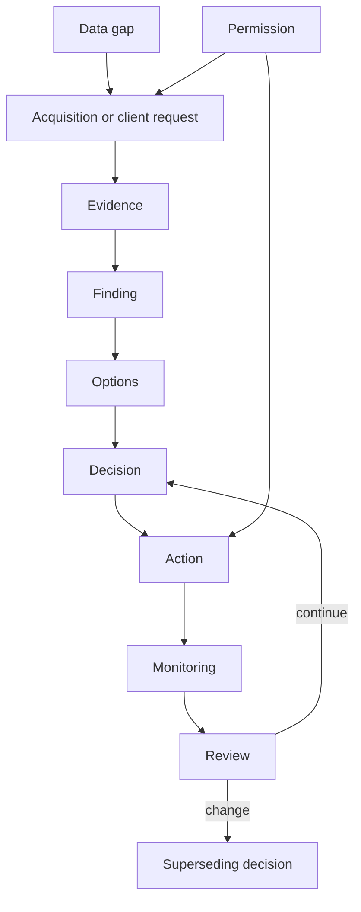

# 06 — Project Decisions

> **System:** Dashboard Intelligence Operating System (DIOS)  
> **Repository:** `omarali304ii-byte/Islam-Brain`  
> **Repository baseline:** `44cea987cd42f077cc0f6e448bcdc69f2683ecb1`  
> **DIOS working branch:** `docs/dios-phase-0-inventory`  
> **Decision-analysis date:** 2026-07-12  
> **Phase status:** Phase 6 — Complete, awaiting validation  
> **Previous artifacts:** [`00_Project_Inventory.md`](./00_Project_Inventory.md) · [`01_Understanding.md`](./01_Understanding.md) · [`02_Dashboard_Architecture.md`](./02_Dashboard_Architecture.md) · [`03_Design_System.md`](./03_Design_System.md) · [`04_System_Architecture.md`](./04_System_Architecture.md) · [`05_Prompt_Analysis.md`](./05_Prompt_Analysis.md)  
> **Next phase:** Blocked until this document passes its quality gate

---

## Table of Contents

1. [Phase Entry Decision](#1-phase-entry-decision)
2. [Scope and Evidence Boundary](#2-scope-and-evidence-boundary)
3. [Executive Decision Verdict](#3-executive-decision-verdict)
4. [Decision Taxonomy](#4-decision-taxonomy)
5. [Decision Authority and Precedence](#5-decision-authority-and-precedence)
6. [Decision System in One View](#6-decision-system-in-one-view)
7. [Executive Business Decision Stack](#7-executive-business-decision-stack)
8. [Strategic Decisions](#8-strategic-decisions)
9. [Customer-Journey and Conversion Decisions](#9-customer-journey-and-conversion-decisions)
10. [Content and Language Decisions](#10-content-and-language-decisions)
11. [Creator and UGC Decisions](#11-creator-and-ugc-decisions)
12. [Catalog, Pricing, and Merchandising Decisions](#12-catalog-pricing-and-merchandising-decisions)
13. [Website and Acquisition Decisions](#13-website-and-acquisition-decisions)
14. [Measurement and KPI Decisions](#14-measurement-and-kpi-decisions)
15. [Evidence and Data-Governance Decisions](#15-evidence-and-data-governance-decisions)
16. [Data-Acquisition Decisions](#16-data-acquisition-decisions)
17. [Client-Data Decisions](#17-client-data-decisions)
18. [Survey and Research Decisions](#18-survey-and-research-decisions)
19. [Dashboard Product Decisions](#19-dashboard-product-decisions)
20. [Dashboard Information-Architecture Decisions](#20-dashboard-information-architecture-decisions)
21. [Visualization Decisions](#21-visualization-decisions)
22. [Design-System Decisions](#22-design-system-decisions)
23. [Media and Creative Decisions](#23-media-and-creative-decisions)
24. [System-Architecture Decisions](#24-system-architecture-decisions)
25. [Prompt and AI-Governance Decisions](#25-prompt-and-ai-governance-decisions)
26. [Security, Privacy, and Permission Decisions](#26-security-privacy-and-permission-decisions)
27. [Operational and Workflow Decisions](#27-operational-and-workflow-decisions)
28. [Deferred Decisions](#28-deferred-decisions)
29. [Pending Decisions](#29-pending-decisions)
30. [Founder-Gated Decisions](#30-founder-gated-decisions)
31. [Dropped, Rejected, and Superseded Decisions](#31-dropped-rejected-and-superseded-decisions)
32. [Unresolved Decision Conflicts](#32-unresolved-decision-conflicts)
33. [Decision Dependency Map](#33-decision-dependency-map)
34. [Decision-to-Evidence Traceability](#34-decision-to-evidence-traceability)
35. [Decision Consequence Map](#35-decision-consequence-map)
36. [Decision Reversibility and Risk](#36-decision-reversibility-and-risk)
37. [Decision Ownership and Accountability](#37-decision-ownership-and-accountability)
38. [Decision Review Cadence](#38-decision-review-cadence)
39. [Decision Record Template](#39-decision-record-template)
40. [Master Decision Ledger](#40-master-decision-ledger)
41. [Decision Debt Register](#41-decision-debt-register)
42. [Unresolved Decision Questions](#42-unresolved-decision-questions)
43. [Phase 6 Validation Gate](#43-phase-6-validation-gate)
44. [Glossary](#44-glossary)
45. [Document Control](#45-document-control)

---

## 1. Phase Entry Decision

Phase 5 was complete but awaiting owner validation. On 2026-07-12, the repository owner explicitly instructed the system to proceed with **Phase 6**.

This is recorded as:

- **Phase 5 acceptance:** Accepted by owner with all documented prompt-system limitations.
- **Authorized work:** Extract, normalize, and document project decisions.
- **Forbidden work:** Do not make unapproved business choices, build the dashboard, execute data routes, deploy, generate creative assets, or modify production behavior.
- **Evidence limitation:** The original stakeholder conversations, external estate runtime, strategy source files, founder interview, client analytics, and some approval records are unavailable.

> [!IMPORTANT]
> This phase records decisions that are evidenced in the repository or owner instructions. It does not convert recommendations, hypotheses, placeholders, or model-generated conclusions into approved decisions.

---

## 2. Scope and Evidence Boundary

### 2.1 Primary decision evidence

This document is grounded mainly in:

- `final/DECISION_DOCK.md`
- `final/NEXT_STEPS.md`
- `final/EXECUTIVE_BRIEF.md`
- `final/MEGA_360_REPORT.md`
- `RUN_STATE.json`
- `_intel/data_pass_menu_base360.md`
- `_intel/SOURCE_REGISTRY.md`
- `_intel/scraping_evidence_log.yaml`
- `CIELITO_TAB_DEEPENING_MASTER_PROMPT.md`
- `dashboard/react_dashboard_spec.md`
- `dashboard/powerbi_spec.md`
- `creative/IMAGE_GENERATION_BRIEFS.md`
- Confirmed collection and analysis scripts
- Phase 0 through Phase 5 DIOS artifacts
- Explicit owner instructions during the DIOS sequence

### 2.2 What counts as a decision

A statement is classified as a decision when at least one of the following is true:

1. An operator or owner explicitly approved, rejected, deferred, dropped, or sequenced an action.
2. A final decision artifact states a chosen course of action.
3. A build specification commits the intended dashboard to a behavior or architecture.
4. A governing contract prohibits or requires a behavior.
5. A later instruction clearly supersedes an earlier instruction.

### 2.3 What does not count as an accepted decision

The following remain separate:

- Analytical finding
- Recommendation without approval evidence
- Hypothesis
- Founder-gated question
- Client-data request
- Placeholder
- Proposed paid route
- Referenced but unavailable strategy field
- Model-generated interpretation
- DIOS recommendation for future governance

### 2.4 Confidence classes

| Confidence | Meaning |
|---|---|
| **High** | Explicitly stated by the owner/operator or in a final decision artifact. |
| **Medium** | Clearly required by a confirmed specification, but implementation/approval is unavailable. |
| **Low** | Inferred from context or referenced by a missing artifact. |

---

## 3. Executive Decision Verdict

The project’s core decision is not “build more marketing.” It is:

> **Repair an existing demand-and-brand engine before spending to amplify it.**

The accepted executive sequence is:

1. Capture existing high-intent demand through WhatsApp.
2. Repair catalog hygiene and switch the owned content system toward Arabic-first execution.
3. Formalize the creator/UGC engine that is already producing stronger public response.
4. Improve mobile performance before scaling paid acquisition.
5. Use client data to baseline financial impact rather than inventing ROI.

The dashboard is intended to operationalize those decisions, not merely report metrics.

### 3.1 Decision-system strengths

- Decisions are connected to evidence.
- Missing financial data is acknowledged.
- Data-acquisition routes require explicit approval.
- Deferred and dropped actions are recorded.
- The project favors low-cost repair before high-cost expansion.
- The dashboard is designed around action and monitoring.

### 3.2 Decision-system weaknesses

- Decision ownership is often implicit.
- Dates, expiry conditions, and review cadences are incomplete.
- Some decisions are embedded inside prompts instead of a ledger.
- Some recommendations appear stronger than their evidence supports.
- Dataset and metric contradictions weaken decision confidence.
- “Buildable,” “queued,” and “approved” are sometimes used without clear implementation states.

---

## 4. Decision Taxonomy

### 4.1 Status vocabulary

| Status | Meaning |
|---|---|
| **ACCEPTED** | Chosen and authorized as the current direction. |
| **IMPLEMENTED** | Evidence confirms the action or rule exists in the current estate. |
| **SPECIFIED** | Committed in a design/build contract but not confirmed implemented. |
| **DEFERRED** | Intentionally postponed; not rejected. |
| **PENDING_APPROVAL** | Requires an explicit future approval. |
| **CLIENT_REQUIRED** | Cannot be settled without client-owned data or access. |
| **SURVEY_REQUIRED** | Requires primary research. |
| **FOUNDER_GATED** | Requires founder confirmation. |
| **DROPPED** | Explicitly removed from the active plan. |
| **REJECTED** | An alternative was explicitly not chosen. |
| **SUPERSEDED** | A later decision replaced an earlier one. |
| **UNRESOLVED** | Contradictory or insufficient evidence prevents a binding decision. |
| **UNKNOWN** | The decision state is not recorded. |

### 4.2 Decision domains

- Business and strategy
- Conversion and customer journey
- Content and language
- Creator/UGC
- Catalog and pricing
- Website and acquisition
- Measurement
- Evidence and data
- Dashboard product
- Design and creative
- Architecture and operations
- Prompt and AI governance
- Security, privacy, and permissions

### 4.3 Decision ID scheme

```text
DEC-BIZ-###   Business/strategy
DEC-CNV-###   Conversion
DEC-CNT-###   Content/language
DEC-UGC-###   Creator/UGC
DEC-CAT-###   Catalog/pricing
DEC-WEB-###   Website/acquisition
DEC-KPI-###   Measurement
DEC-DATA-###  Evidence/data
DEC-DASH-###  Dashboard
DEC-DES-###   Design/creative
DEC-ARCH-###  Architecture
DEC-AI-###    Prompt/AI governance
DEC-OPS-###   Operations
DEC-PRIV-###  Privacy/permissions
DEC-DIOS-###  DIOS documentation governance
```

---

## 5. Decision Authority and Precedence

### 5.1 Authority order

When records conflict, the working precedence is:

1. Explicit later owner/operator instruction
2. Explicit client/founder approval
3. Final decision artifact
4. Recorded data-pass decision
5. Current run state
6. Build specification
7. Master prompt
8. Analytical report
9. Derived dataset
10. Raw evidence
11. Inference

This ordering does not make a high-authority statement factually correct. It determines which instruction controls action while factual claims still require evidence.

### 5.2 Time precedence

A later explicit decision supersedes an earlier action note when both address the same choice.

Example:

```text
Earlier: retry Noon reviews with another actor
Later: operator says “forget about Noon — do not retry”
Current decision: DROPPED
```

### 5.3 Negative decisions are first-class

The following are valid decisions:

- Do not fabricate financial metrics.
- Do not run paid routes without approval.
- Do not treat blocked data as zero.
- Do not hotlink media.
- Do not silently retry the dropped Noon route.
- Do not publish synthetic imagery without disclosure.

---

## 6. Decision System in One View



The current estate is strongest at evidence, finding, and strategic recommendation. It is weaker at ownership, implementation proof, monitoring history, and formal supersession records.

---

## 7. Executive Business Decision Stack

### DEC-BIZ-001 — Repair the engine; do not rebuild the brand

- **Status:** ACCEPTED
- **Decision:** Treat Cielito as a brand with real audience and demand signals but a weak owned conversion/content engine. Repair the engine rather than starting over.
- **Evidence basis:** Large audience, weak owned-post performance, stronger earned/creator performance, catalog and conversion gaps.
- **Rationale:** Existing equity reduces the need for an expensive rebrand.
- **Rejected alternative:** Full brand rebuild as the first intervention.
- **Tradeoff:** The existing positioning may contain unresolved drift that still needs founder input.
- **Reversibility:** Medium. A later repositioning remains possible.
- **Owner:** Executive/client decision; recorded in the Decision Dock.
- **Validation:** Owned engagement, conversion-path capture, catalog hygiene, creator output, and mobile performance should improve after intervention.

### DEC-BIZ-002 — Use a sequenced three-decision turnaround

- **Status:** ACCEPTED
- **Sequence:** WhatsApp bridge → catalog cleanup and Arabic-first content → creator system.
- **Rationale:** Start with the lowest-cost demand capture, then repair owned surfaces, then scale the strongest existing external engine.
- **Tradeoff:** The sequence assumes creator outreach works better after the conversion/catalog foundation improves.
- **Dependency:** Client execution capacity.

### DEC-BIZ-003 — Keep financial impact unclaimed until baselined

- **Status:** ACCEPTED
- **Decision:** Revenue, AOV, conversion, and uplift remain “To be baselined.”
- **Rationale:** No client transaction or attribution data is available.
- **Rejected alternative:** Estimate or invent ROI for the pitch.
- **Consequence:** Financial pages initially contain placeholders.

### DEC-BIZ-004 — Preserve one north star

- **Status:** ACCEPTED
- **Decision:** Owned engagement-rate recovery is the primary operating north star.
- **Caveat:** “Healthy account” target is not numerically defined.
- **Risk:** Engagement is not equivalent to revenue.
- **Dependency:** It should eventually be paired with WhatsApp and sales conversion metrics.

---

## 8. Strategic Decisions

### DEC-BIZ-005 — Masri-first market execution

- **Status:** ACCEPTED as strategic doctrine
- **Decision:** Prioritize Egyptian context, Egyptian Arabic, local seasonal demand, and local creator/product evidence.
- **Rationale:** The brand operates in an Egyptian women’s fashion/footwear market while recent owned captions are overwhelmingly English.
- **Risk:** “Masri-first” must not become simplistic cultural stereotyping.

### DEC-BIZ-006 — WhatsApp is the conversion bridge

- **Status:** ACCEPTED
- **Decision:** Treat WhatsApp as the immediate bridge between social/product interest and ordering conversation.
- **First move:** Add `wa.me` access to bio, site, and posts.
- **Cost class:** Near-zero.
- **Validation:** WhatsApp chats per week and downstream order attribution.

### DEC-BIZ-007 — Seasonal calendar is strategically material

- **Status:** ACCEPTED as planning doctrine; implementation unconfirmed
- **Seasons:** Ramadan, Eid, Sahel/summer, winter boots.
- **Rationale:** Category demand is locally seasonal.
- **Missing:** Canonical campaign calendar is referenced but unavailable.

### DEC-BIZ-008 — Price should be framed through desire and value, not only discount

- **Status:** ACCEPTED as category doctrine
- **Rationale:** The project positions product appeal, craft, design, and emotional desire as stronger long-term value drivers than constant discounting.
- **Risk:** No client margin, sell-through, or price-elasticity data validates the exact commercial effect.

### DEC-BIZ-009 — Positioning changes require founder confirmation

- **Status:** FOUNDER_GATED
- **Scope:** Fruit-leather story, tagline selection, second-domain intent, and potentially founder narrative.
- **Rationale:** These are identity and truth claims, not merely campaign tactics.

---

## 9. Customer-Journey and Conversion Decisions

### DEC-CNV-001 — Install the WhatsApp bridge first

- **Status:** ACCEPTED
- **Why first:** It captures existing intent before more demand is generated.
- **Alternative considered:** Increase posting or paid traffic first.
- **Why not chosen first:** Additional traffic may leak through the same missing conversion path.
- **Consequence:** WhatsApp instrumentation becomes required.

### DEC-CNV-002 — Represent the funnel gap honestly

- **Status:** SPECIFIED
- **Decision:** Show the missing ordering/conversion stage as a gap, not as measured funnel performance.
- **Reason:** No event-level funnel data exists.
- **Consequence:** The dashboard may use a conceptual funnel only when labeled as such.

### DEC-CNV-003 — Request order and traffic data instead of scraping it

- **Status:** ACCEPTED
- **Decision:** Revenue, orders, AOV, conversion, attribution, GA4, and platform Insights must come from the client.
- **Reason:** These are private client systems and cannot be legitimately inferred from public scraping.

### DEC-CNV-004 — Attribute WhatsApp performance before claiming ROI

- **Status:** CLIENT_REQUIRED
- **Needed fields:** Chat starts, source link/campaign, assisted orders, completed orders, revenue, time window.
- **Current state:** No implementation or tracking plan is confirmed.

---

## 10. Content and Language Decisions

### DEC-CNT-001 — Switch owned content toward Arabic-first execution

- **Status:** ACCEPTED
- **Evidence:** 16 of 17 recent owned captions were fully English; the selected Arabic owned example was strongest in its small sample.
- **Rationale:** Better alignment with the local market and existing evidence.
- **Caveat:** The language effect is not yet isolated from format, ownership, creator, timing, and post quality.
- **Tradeoff:** Arabic-first does not mean English must disappear.

### DEC-CNT-002 — Preserve bilingual capability

- **Status:** SPECIFIED
- **Decision:** React and Power BI should support Arabic and English labels and RTL content.
- **Rationale:** Executive/client communication may be bilingual while customer language is Masri-first.

### DEC-CNT-003 — Use insight-led content rather than generic posting volume

- **Status:** ACCEPTED as dashboard/content doctrine
- **Decision:** Content planning should connect format, language, creator, theme, timing, and performance.
- **Rejected alternative:** Increase posting volume without diagnostic evidence.

### DEC-CNT-004 — Treat content pillars and feed mix as frameworks, not fake charts

- **Status:** ACCEPTED in the deepening contract
- **Reason:** Qualitative strategy should not be disguised as measured quantitative performance.

### DEC-CNT-005 — Keep one question per chart

- **Status:** SPECIFIED
- **Reason:** Prevent visually dense cards from combining unrelated decisions.

---

## 11. Creator and UGC Decisions

### DEC-UGC-001 — Turn creators into a repeatable operating system

- **Status:** ACCEPTED
- **First move:** Contact top creators and secure usage rights.
- **Rationale:** Earned/creator content visibly outperforms the selected owned baseline.
- **Risk:** The flagship ratio is not canonically defined.
- **Consequence:** Creator roster, rights, cadence, cost, and conversion tracking become required data.

### DEC-UGC-002 — Use real creator content before synthetic substitutes

- **Status:** ACCEPTED
- **Rationale:** Authentic creator evidence is strategically central.
- **Dependency:** Permission and usage rights.

### DEC-UGC-003 — Expand creator data only through an approved route

- **Status:** PENDING_APPROVAL
- **Route:** P5 UGC creator roster expansion.
- **Current decision:** Do not execute automatically.

### DEC-UGC-004 — Do not claim creator economics without client and creator data

- **Status:** ACCEPTED
- **Missing:** Gifting cost, contracts, exclusivity, CAC, tracked conversion, audience geography, follower quality.

### DEC-UGC-005 — Preserve handles only where possible

- **Status:** SPECIFIED but incomplete
- **Intent:** Minimize exported personal data.
- **Gap:** Current evidence still contains handles, exact text, and URLs; retention and consent rules are undefined.

---

## 12. Catalog, Pricing, and Merchandising Decisions

### DEC-CAT-001 — Clean catalog structure before scaling acquisition

- **Status:** ACCEPTED
- **Scope:** Product typing, collections, duplication, availability, naming, and discoverability.
- **Rationale:** Catalog hygiene affects user discovery, analysis quality, and campaign execution.

### DEC-CAT-002 — Treat catalog hygiene as broader than one formula

- **Status:** DIOS NORMALIZATION DECISION
- **Reason:** The Power BI formula based only on untyped products cannot represent all hygiene dimensions.
- **Current metric status:** The named “Catalog Hygiene %” is not fully canonical.

### DEC-CAT-003 — Do not conflate products with SKUs

- **Status:** REQUIRED, unresolved in source specs
- **Reason:** `catalog_full.json` appears product-grained while specifications call 250 rows SKUs.
- **Consequence:** Fact-table grain must be settled before implementation.

### DEC-CAT-004 — Do not treat every Shopify `option1` as size

- **Status:** REQUIRED correction
- **Reason:** Values include colors and `Default Title`.
- **Consequence:** Size-availability decisions are not reliable until option semantics are normalized.

### DEC-CAT-005 — Keep discount discipline as a monitored operational metric

- **Status:** ACCEPTED
- **Reason:** Approximately 38% sale surface is treated as a strategic concern.
- **Caveat:** No margin or sell-through data determines the optimal discount level.

### DEC-CAT-006 — Do not claim price elasticity without client or survey evidence

- **Status:** ACCEPTED
- **Routes:** Client sell-through/margin data and Van Westendorp survey.

### DEC-CAT-007 — Competitive price pulls require approval

- **Status:** PENDING_APPROVAL
- **Route:** P3.

---

## 13. Website and Acquisition Decisions

### DEC-WEB-001 — Improve mobile performance before paid traffic

- **Status:** ACCEPTED
- **Baseline:** Mobile PageSpeed 55; desktop 98.
- **Target mentioned:** 80 mobile.
- **Rationale:** Do not pay to send traffic into a weak mobile experience.
- **Caveat:** One lab snapshot is not sufficient for long-term monitoring.

### DEC-WEB-002 — Preserve SEO and discoverability as strengths

- **Status:** ACCEPTED as current finding, not a new action
- **Evidence:** SEO score 100 and strong structured/meta signals in the audit.

### DEC-WEB-003 — Treat agent-readiness “security clean” narrowly

- **Status:** REQUIRED labeling decision
- **Meaning:** No detected hidden prompt-injection instructions in the scanned surface.
- **Not equivalent to:** Full application security, privacy, or penetration testing.

### DEC-WEB-004 — Do not run paid acquisition until foundational repair

- **Status:** Strategic implication; approval status not explicitly recorded as a campaign freeze
- **Interpretation:** Repair conversion, catalog, content, and mobile performance before major paid scaling.
- **Caution:** Do not claim a formal paid-media pause without client confirmation.

---

## 14. Measurement and KPI Decisions

### DEC-KPI-001 — Use owned engagement-rate recovery as north star

- **Status:** ACCEPTED
- **Baseline:** 0.006% in the selected owned sample.
- **Missing:** Formal target, formula registry, follower-base timing, and qualifying format definition.

### DEC-KPI-002 — Watch eight vital signs

- **Status:** ACCEPTED as monitoring covenant
- **KPIs:**
  1. Owned engagement rate
  2. Owned-vs-earned ratio
  3. WhatsApp chats per week
  4. TikTok followers per video
  5. Mobile PageSpeed
  6. Catalog hygiene
  7. UGC velocity
  8. Discount discipline

### DEC-KPI-003 — Every KPI must include source, sample size, and window

- **Status:** ACCEPTED/SPECIFIED
- **Reason:** Prevent timeless or source-free numbers.

### DEC-KPI-004 — Missing metrics are not zero

- **Status:** ACCEPTED/SPECIFIED
- **Representation:** `RequiresData`, `GapPlaceholder`, label, or `BLANK()` in Power BI.

### DEC-KPI-005 — The `~190×` metric is not canonical

- **Status:** UNRESOLVED
- **Conflict:** Peak-earned/median-owned appears to produce the claim, while the Power BI measure names median-earned/median-owned.
- **Decision:** Do not use it as a governed KPI until numerator, denominator, sample, ownership rules, platform, and window are fixed.

### DEC-KPI-006 — “Reach,” “views,” and “plays” must remain distinct

- **Status:** REQUIRED
- **Reason:** Cross-platform metrics are not interchangeable.

### DEC-KPI-007 — Gauges require defined targets

- **Status:** REQUIRED before implementation
- **Current gap:** Targets are not specified for all eight watch KPIs.

---

## 15. Evidence and Data-Governance Decisions

### DEC-DATA-001 — No fabricated data series

- **Status:** ACCEPTED, foundational
- **Decision:** A card either uses real data or becomes an explicit missing-data state.

### DEC-DATA-002 — Preserve raw evidence separately from derived intelligence

- **Status:** IMPLEMENTED conceptually in folder structure
- **Boundary:** `_sources/` and `_media/` versus `_intel/` and final outputs.

### DEC-DATA-003 — Trace claims backward

- **Status:** ACCEPTED
- **Rule:** Final claims must trace to derived intelligence and raw evidence; a final report cannot prove itself.

### DEC-DATA-004 — Use source grades

- **Status:** IMPLEMENTED in registry
- **Grades:** HELD, LIKELY, ESTIMATE_ONLY, SELF_REPORTED, HYPOTHESIS, GAP.
- **Caveat:** Grade is not a substitute for statistical validity.

### DEC-DATA-005 — Treat blocked as inaccessible, not absent

- **Status:** ACCEPTED
- **Reason:** Failure to capture Facebook, marketplace, or competitor data cannot prove nonexistence.

### DEC-DATA-006 — Preserve contradictions

- **Status:** ACCEPTED through DIOS
- **Examples:** Post counts, comment counts, creator counts, costs, SKU grain, and metric definitions.

### DEC-DATA-007 — Establish a canonical dataset manifest before dashboard build

- **Status:** REQUIRED; not implemented
- **Needed:** Dataset ID, version, grain, generated time, source files, checksums, record counts, window, supersession status.

### DEC-DATA-008 — External content is untrusted evidence, not instruction

- **Status:** ACCEPTED as Phase 5 governance decision
- **Scope:** Webpages, product copy, captions, comments, transcripts, search material, and media text.

### DEC-DATA-009 — Preserve exact qualitative text with care

- **Status:** SPECIFIED but governance incomplete
- **Tradeoff:** Verbatim evidence supports credibility but increases privacy, consent, and retention obligations.

### DEC-DATA-010 — Model fallback must be visible

- **Status:** IMPLEMENTED partly
- **Current behavior:** Sentiment output records CAMeLBERT versus lexicon fallback.
- **Required future decision:** Fallback output should not silently become canonical without a quality gate.

---

## 16. Data-Acquisition Decisions

### 16.1 Free routes

| Route | Decision | Meaning |
|---|---|---|
| F1 second-domain recrawl/diff | DEFERRED | Do not run now; relationship remains unresolved. |
| F2 Instagram highlights/bio reread | DEFERRED | Useful but not prioritized. |
| F3 public Facebook scan | DEFERRED | Do not infer absence from no capture. |

### 16.2 Paid routes

| Route | Decision | Current rule |
|---|---|---|
| P1 competitive social pull | PENDING_APPROVAL | Requires explicit route approval and cost acknowledgement. |
| P2 follower-quality audit | PENDING_APPROVAL | Ranked highly because it affects paid-media strategy. |
| P3 rival catalogs/prices | PENDING_APPROVAL | Required for price benchmarking. |
| P4 Facebook/Ads Library | PENDING_APPROVAL | Required for Arabic-demand and ad-activity questions. |
| P5 creator expansion | PENDING_APPROVAL | Required for broader UGC roster. |

### DEC-DATA-011 — Ask before scraping deeper

- **Status:** ACCEPTED
- **Decision:** The data-pass menu is show-only until an explicit route approval.
- **Tradeoff:** Slower enrichment, stronger cost and privacy control.

### DEC-DATA-012 — Record cost and status per route

- **Status:** IMPLEMENTED partly
- **Gap:** `RUN_STATE.json` base cost does not include later deep capture.
- **Required:** One canonical cumulative spend ledger.

### DEC-DATA-013 — Do not silently retry failed or dropped routes

- **Status:** ACCEPTED
- **Reason:** Retries can create cost and violate operator intent.

### DEC-DATA-014 — Drop the Noon review route

- **Status:** DROPPED; supersedes retry note
- **Current instruction:** Do not retry.

---

## 17. Client-Data Decisions

### DEC-DATA-015 — Client data is the highest-leverage next evidence source

- **Status:** ACCEPTED recommendation; client action pending
- **Requested:** Shopify export, GA4, Instagram/TikTok Insights, order data, conversion, returns, CAC, repeat rate, attribution.

### DEC-DATA-016 — Private business data is requested, never publicly scraped

- **Status:** ACCEPTED
- **Reason:** Legitimacy, accuracy, and privacy.

### DEC-DATA-017 — Financial scenarios remain locked until client data arrives

- **Status:** ACCEPTED/SPECIFIED
- **UI result:** Placeholder cards or blank measures with explanatory labels.

### DEC-DATA-018 — Platform audience demographics require client Insights

- **Status:** CLIENT_REQUIRED
- **Decision:** Do not infer age, gender, or geography from comments.

---

## 18. Survey and Research Decisions

### DEC-DATA-019 — Keep the Era-28 survey armed but unfielded

- **Status:** SURVEY_REQUIRED
- **Scope:** Brand funnel, awareness, perception, attribute mapping, NPS, and price elasticity.
- **Target population proposed:** Egyptian women 18–45, Cairo/Alex first.
- **Current decision:** Present as roadmap; do not claim survey results.

### DEC-DATA-020 — Use Van Westendorp only with real respondent data

- **Status:** SURVEY_REQUIRED
- **Reason:** Willingness-to-pay cannot be inferred from catalog prices alone.

### DEC-DATA-021 — Market-size estimates remain banded and estimate-only

- **Status:** ACCEPTED
- **Reason:** Source conflicts and lack of bottom-up client sales data.

---

## 19. Dashboard Product Decisions

### DEC-DASH-001 — Build a living command center, not a static report deck

- **Status:** SPECIFIED
- **Rationale:** Executives need rapid verdict and action; marketers need drill-down and evidence.
- **Implementation:** Not confirmed.

### DEC-DASH-002 — Support two presentation targets

- **Status:** SPECIFIED
- **Targets:** React web dashboard and Power BI report.
- **Reason:** Different client preferences.
- **Risk:** Metric and visual parity can drift.

### DEC-DASH-003 — Keep the dashboard primarily read-only

- **Status:** Architectural inference, strongly implied
- **Reason:** Current system compiles research evidence into presentation views.
- **Unknown:** Whether future editing, approval, upload, or workflow features are required.

### DEC-DASH-004 — Do not expose internal operating vocabulary to clients

- **Status:** SPECIFIED
- **Examples:** ATLAS, MIDAS, era codes, internal lens and L-level labels.
- **Tradeoff:** Evidence depth remains available in the evidence layer.

### DEC-DASH-005 — Evidence must be reachable quickly

- **Status:** SPECIFIED
- **Target:** Evidence Room within two clicks.

### DEC-DASH-006 — No production dashboard claim until implementation is verified

- **Status:** ACCEPTED through DIOS
- **Reason:** Specs exist, but React code, `.pbix`, compiler, and deployment are unavailable.

---

## 20. Dashboard Information-Architecture Decisions

### DEC-DASH-007 — Use progressive disclosure from verdict to evidence

- **Status:** SPECIFIED
- **Path:** Verdict → Why → Decision → Diagnosis → Evidence.

### DEC-DASH-008 — Use four conceptual levels

- **Status:** SPECIFIED
- **Levels:**
  - L0 Persistent Decision Dock
  - L1 Five-screen executive story
  - L2 Diagnostic rooms
  - L3 Evidence Room

### DEC-DASH-009 — Keep a persistent Decision Dock

- **Status:** SPECIFIED
- **Purpose:** Preserve verdict, three decisions, financial honesty, north star, and watch metrics.
- **Risk:** Mobile space and stale decisions.
- **Missing:** Version/date/approval state behavior.

### DEC-DASH-010 — Use the five-screen executive story

- **Status:** SPECIFIED
- **Screens:** What is happening, Why, Financial impact, Decide, Watch.

### DEC-DASH-011 — Maintain diagnostic rooms

- **Status:** SPECIFIED
- **Rooms:** Social, Catalog/Pricing, Website, Competitive, Audience, Content, Strategy, Evidence.

### DEC-DASH-012 — Expand tabs to at least 20 evidence-aware cards

- **Status:** SPECIFIED by master prompt
- **Guardrail:** Real card or RequiresData card; never fabricated series.
- **Risk:** Optimizing card count over decision quality.
- **Decision interpretation:** Twenty is a completeness target, not permission to create low-value charts.

---

## 21. Visualization Decisions

### DEC-DASH-013 — Use log or broken scale for large order-of-magnitude gaps

- **Status:** SPECIFIED
- **Primary example:** Owned-versus-earned comparison.

### DEC-DASH-014 — Use insight-led titles and a “So what?” line

- **Status:** SPECIFIED
- **Purpose:** Connect visual evidence to business action.

### DEC-DASH-015 — Use semantic color, not arbitrary series color

- **Status:** SPECIFIED
- **Assignments:** Owned grey, earned terracotta, positive green, negative red, RequiresData dashed orange.

### DEC-DASH-016 — Keep permanent URLs and local thumbnails in the leaderboard

- **Status:** SPECIFIED
- **Reason:** Traceability and no CDN hotlinking.

### DEC-DASH-017 — Use blank/label states for unavailable financial measures

- **Status:** SPECIFIED
- **React:** GapPlaceholder.
- **Power BI:** `BLANK()` plus label.

### DEC-DASH-018 — Do not represent a conceptual funnel as measured conversion

- **Status:** REQUIRED labeling rule

### DEC-DASH-019 — Avoid treating one snapshot as a trend

- **Status:** REQUIRED analytical rule
- **Examples:** PageSpeed and agent-readiness audits.

---

## 22. Design-System Decisions

### DEC-DES-001 — Keep the design decision-first and evidence-visible

- **Status:** ACCEPTED/SPECIFIED
- **Reason:** Visual polish must not hide uncertainty or provenance.

### DEC-DES-002 — Use semantic color roles

- **Status:** SPECIFIED
- **Exact token values:** UNRESOLVED.

### DEC-DES-003 — Keep warm tan, cream, terracotta, and charcoal provisional

- **Status:** PROVISIONAL
- **Reason:** No approved brand kit is available.
- **Decision:** Do not treat directional colors as canonical hex values.

### DEC-DES-004 — Support Arabic, English, and RTL structurally

- **Status:** SPECIFIED
- **Missing:** Fonts, bidi behavior, truncation, number/date/currency formatting, responsive tests.

### DEC-DES-005 — Do not invent missing design tokens

- **Status:** ACCEPTED through Phase 3
- **Values left TBD:** Colors, type scale, spacing, radius, shadow, breakpoints, icon system.

### DEC-DES-006 — Keep React and Power BI semantically aligned

- **Status:** REQUIRED; not implemented
- **Need:** Shared metric, color, label, number-format, and evidence-state contracts.

---

## 23. Media and Creative Decisions

### DEC-DES-007 — Prefer real product, creator, and founder media

- **Status:** ACCEPTED
- **Reason:** Product truth and authenticity.

### DEC-DES-008 — Synthetic media may fill concept gaps only

- **Status:** ACCEPTED
- **Condition:** Must be labeled and must not imply verified product, founder, workshop, or sustainability facts.

### DEC-DES-009 — Synthetic-media labels must survive exports

- **Status:** REQUIRED
- **Risk:** Disclosure may disappear in PDF, PowerPoint, crop, thumbnail, or repost.

### DEC-DES-010 — Founder imagery should use real founder photography for real claims

- **Status:** ACCEPTED in creative brief
- **Synthetic founder concept:** Placeholder only.

### DEC-DES-011 — Fruit-leather creative remains concept/synthetic and founder-gated

- **Status:** FOUNDER_GATED
- **Reason:** Current product status and positioning intent are unverified.

### DEC-DES-012 — UGC reuse requires creator credit and rights

- **Status:** ACCEPTED as first-move requirement
- **Missing:** Consent storage, license duration, territories, paid usage, revocation, and deletion process.

### DEC-DES-013 — Store media locally; do not hotlink CDN assets

- **Status:** SPECIFIED
- **Reason:** Reliability, compliance, and dashboard control.
- **Missing:** Rights and retention governance.

---

## 24. System-Architecture Decisions

### DEC-ARCH-001 — Keep the current estate file-based until a product runtime exists

- **Status:** IMPLEMENTED current reality, not necessarily permanent choice
- **Storage:** JSON, Markdown, YAML, HTML/TXT/XML, JPG, PDF/PPTX.

### DEC-ARCH-002 — Introduce a compiler as the dashboard trust boundary

- **Status:** SPECIFIED; critical and missing
- **Artifact:** `dashboard/build_cielito_data.py`.
- **Responsibilities:** Normalize, validate, block unsupported claims, enforce source IDs, validate media, emit a frontend contract.

### DEC-ARCH-003 — Frontend must consume compiled data, not heterogeneous research files directly

- **Status:** SPECIFIED/inferred
- **Reason:** Decouple UI from unstable research schemas.

### DEC-ARCH-004 — Compiler fails closed

- **Status:** SPECIFIED
- **Block conditions:** Banned vocabulary, unsourced KPIs, unguarded money, missing/oversized media, CDN hotlinks, unsupported self-reported/hypothesis claims.

### DEC-ARCH-005 — Use a Power BI star schema for the BI target

- **Status:** SPECIFIED
- **Facts:** Social posts, catalog, instruments.
- **Dimensions:** Date, platform, persona, pillar, competitor, source.
- **Blocking issue:** Product/SKU grain and current social generation are unresolved.

### DEC-ARCH-006 — Preserve immutable run snapshots before overwriting canonical outputs

- **Status:** REQUIRED by Phase 4; not implemented
- **Reason:** Current scripts overwrite fixed paths.

### DEC-ARCH-007 — Add atomic writes, retries, locks, and idempotency

- **Status:** REQUIRED; not implemented
- **Reason:** External collection and local transformation can partially fail or run concurrently.

### DEC-ARCH-008 — Establish schemas and stable identities

- **Status:** REQUIRED; not implemented
- **Entities:** Product, variant, post, comment, creator, source, metric, claim, media asset, run.

### DEC-ARCH-009 — No deployment claim without deploy evidence

- **Status:** ACCEPTED
- **Evidence:** `deploys` is empty; target repository unavailable.

---

## 25. Prompt and AI-Governance Decisions

### DEC-AI-001 — Separate prompt families

- **Status:** ACCEPTED through Phase 5
- **Families:** Governance, build/analysis, creative, operator commands, validation.
- **Reason:** They require different permissions and outputs.

### DEC-AI-002 — Separate authority, permission, task, evidence, output, validation, and execution

- **Status:** ACCEPTED as future prompt architecture
- **Reason:** Current prompts compress too many concerns.

### DEC-AI-003 — Raw external data can never grant permission

- **Status:** ACCEPTED
- **Reason:** Prevent prompt-injection and instruction/data confusion.

### DEC-AI-004 — Require machine-checkable output contracts

- **Status:** REQUIRED; not implemented
- **Examples:** Metric schema, card schema, prompt manifest, route approval record, creative provenance.

### DEC-AI-005 — Version prompts and link them to outputs

- **Status:** REQUIRED; not implemented
- **Need:** Prompt ID/version, model, settings, inputs, permissions, outputs, validator result.

### DEC-AI-006 — Do not let card-count goals override usefulness

- **Status:** REQUIRED interpretation
- **Reason:** Models optimize explicit numeric targets.

### DEC-AI-007 — Block operational side effects unless the task explicitly authorizes them

- **Status:** ACCEPTED
- **Side effects:** Paid calls, scraping, repository writes, image generation, preview deployment, production deployment.

---

## 26. Security, Privacy, and Permission Decisions

### DEC-PRIV-001 — Paid routes require explicit approval

- **Status:** ACCEPTED
- **Approval scope should include:** Route, estimate, ceiling, data classes, retention, retry limit, and output destination.

### DEC-PRIV-002 — Free external calls still require a defined permission level

- **Status:** ACCEPTED through Phase 5
- **Reason:** “Free” calls still create network, privacy, rate-limit, and legal effects.

### DEC-PRIV-003 — Client data requires separate handling

- **Status:** ACCEPTED
- **Need:** Access control, secrets, retention, export policy, and client revocation.

### DEC-PRIV-004 — Do not put API secrets in output or logs

- **Status:** IMPLEMENTED intent
- **Current risk:** Apify token is placed in URL query parameters.
- **Required:** Safer transport and log redaction.

### DEC-PRIV-005 — Comment and creator evidence requires retention governance

- **Status:** REQUIRED; not implemented
- **Reason:** Handles, text, URLs, and public content remain personal/public-person data even when publicly visible.

### DEC-PRIV-006 — `strip_pii` is not a privacy control while it returns input unchanged

- **Status:** DIOS finding requiring correction

### DEC-PRIV-007 — Synthetic people and claims require disclosure

- **Status:** ACCEPTED
- **Reason:** Prevent identity and brand misrepresentation.

---

## 27. Operational and Workflow Decisions

### DEC-OPS-001 — Base 360 is closed as a run, not finished as a product

- **Status:** ACCEPTED interpretation
- **Reason:** Run state says closed and specs done, while dashboard build and internal backfill remain pending.

### DEC-OPS-002 — Hero dashboard is the next product build

- **Status:** QUEUED/SPECIFIED; not implemented
- **Command referenced:** `Mega Run cielito-egypt wave hero`.

### DEC-OPS-003 — Era backfill is internal, not client-critical

- **Status:** DEFERRED/QUEUED
- **Reason:** Pitch-critical outputs are complete; internal coverage remains partial.

### DEC-OPS-004 — Long-form strategy prose is secondary to binding structured strategy

- **Status:** QUEUED
- **Caveat:** `strategy.json` is declared schema-pass but unavailable in the repository.

### DEC-OPS-005 — GIS wave is skipped

- **Status:** REJECTED/SKIPPED
- **Reason:** Online D2C brand with no branch network.

### DEC-OPS-006 — Maintain an audit record of approvals and decisions

- **Status:** Partly implemented in logs and menus; no unified ledger.

### DEC-OPS-007 — Phase progression requires owner authorization

- **Status:** IMPLEMENTED in DIOS sequence
- **Meaning:** Each subsequent phase records the previous phase as accepted when the owner instructs progression.

---

## 28. Deferred Decisions

| ID | Decision | Why deferred | Reopen condition |
|---|---|---|---|
| DEC-DEF-001 | Diff `mycielito.com` and `cielitoeg.com` | Lower immediate leverage | Founder/domain question becomes urgent |
| DEC-DEF-002 | Deep-read Instagram highlights and bio | Not decision-critical now | Profile redesign execution begins |
| DEC-DEF-003 | Public Facebook scan | Not prioritized | Arabic-channel allocation question remains open |
| DEC-DEF-004 | Internal era fan-out backfill | Pitch outputs already complete | Runtime capacity/credit available |
| DEC-DEF-005 | Long-form strategy prose | Structured strategy declared binding | Client or handoff needs narrative version |
| DEC-DEF-006 | Exact design tokens | No approved brand kit/UI implementation | Brand assets and UI build begin |

Deferred does not mean invalid. It means the action is intentionally outside the current critical path.

---

## 29. Pending Decisions

### 29.1 Paid route approvals

- P1 Competitive social
- P2 Follower quality
- P3 Rival catalog/pricing
- P4 Facebook and Ads Library
- P5 Creator roster expansion

### 29.2 Client requests

- Shopify export
- GA4
- Instagram/TikTok Insights
- Orders and revenue
- AOV and conversion
- Returns and repeat rate
- CAC and attribution

### 29.3 Implementation choices

- Actual React framework/repository structure
- Chart library
- State management
- Hosting/deployment
- Authentication
- Data refresh model
- Power BI refresh gateway
- Responsive behavior
- Accessibility target
- Exact design tokens

### 29.4 Metric decisions

- Canonical owned-vs-earned formula
- Healthy owned engagement target
- UGC velocity definition
- Catalog hygiene composite
- Discount-discipline threshold
- WhatsApp attribution model

---

## 30. Founder-Gated Decisions

### FGD-001 — Fruit-leather positioning

Questions:

- Is fruit-leather still an active product or roadmap?
- Is it a current differentiator or historical press story?
- Can it be used in client-facing claims?
- What evidence supports material and sustainability language?

Current decision: **Do not present as verified active truth.**

### FGD-002 — Tagline lock

The estate references multiple taglines. One must be selected or rejected by founder/client authority.

### FGD-003 — Founder story and imagery

Real founder story, portrait, and claims require founder approval and real media.

### FGD-004 — Second-domain purpose

The relationship between `cielitoeg.com` and `mycielito.com` remains unresolved.

### FGD-005 — Positioning target

The exact target positioning, white-space axes, and founder appetite for change are not confirmed.

---

## 31. Dropped, Rejected, and Superseded Decisions

### 31.1 Noon reviews

| Record | Status |
|---|---|
| Initial actor attempt failed with 404 | Historical fact |
| Earlier note suggested retry with another actor | SUPERSEDED |
| Later operator instruction: forget Noon, do not retry | DROPPED and current |

### 31.2 Full rebuild first

- **Alternative:** Rebuild/rebrand before operational repair.
- **Decision:** REJECTED as first move.
- **Chosen:** Repair the existing engine.

### 31.3 Fabricated financial scenarios

- **Alternative:** Use illustrative ROI numbers in the pitch.
- **Decision:** REJECTED.
- **Chosen:** Baseline after client data.

### 31.4 Hidden missing data

- **Alternative:** Render zero, none, or empty chart.
- **Decision:** REJECTED.
- **Chosen:** Explicit RequiresData/Gap state.

### 31.5 GIS wave

- **Decision:** SKIPPED.
- **Reason:** No branch network.

### 31.6 Automatic deeper scraping

- **Alternative:** Run all useful routes automatically.
- **Decision:** REJECTED.
- **Chosen:** Data-pass approvals.

---

## 32. Unresolved Decision Conflicts

### CONFLICT-001 — `~190×` metric

- React: earned peak versus owned median.
- Power BI: earned median versus owned median.
- Decision state: UNRESOLVED.

### CONFLICT-002 — Social dataset generation

- Initial 120-post model.
- Later 210-post/deepened contract.
- Decision state: Canonical generation not selected.

### CONFLICT-003 — Comment corpus

- 254 comments in original spec.
- 964 qualitative comments in verbatims.
- 1,050 total sentiment items.
- Decision state: Each may be valid for a different corpus, but labels and lineage are incomplete.

### CONFLICT-004 — Creator count

- 12 highlighted handles.
- 34 captured tagged/UGC posts.
- 63 creators in later prompt.
- Decision state: Entity versus post versus highlighted subset is unclear.

### CONFLICT-005 — Product versus SKU

- 250 product rows are called 250 SKUs.
- Decision state: Grain unresolved.

### CONFLICT-006 — 60-day versus 90-day plan

- Decision Dock/React story references 60 days.
- Content calendar references 90 days.
- Decision state: Could be nested horizons, but relationship is undocumented.

### CONFLICT-007 — Build status

- Specs describe buildable and “already in the build” styling.
- Run state has no deploy; app/compiler are missing.
- Decision state: Specified, not implemented.

### CONFLICT-008 — Strategy availability

- Run state says `strategy.json` schema-pass.
- Repository inventory does not confirm the file.
- Decision state: External/missing dependency; cannot validate.

### CONFLICT-009 — Cost ledger

- Base state records $0.434.
- Later deep routes add materially more cost.
- Decision state: No canonical current total.

### CONFLICT-010 — Palette status

- Creative direction repeatedly uses warm tan/cream/terracotta.
- Brief says palette is provisional.
- Decision state: Direction accepted; exact palette unapproved.

---

## 33. Decision Dependency Map

```mermaid
flowchart TD
    W[WhatsApp bridge] --> WA[WhatsApp tracking]
    WA --> F[Financial baseline]

    C[Catalog cleanup] --> CH[Catalog hygiene metric]
    C --> AR[Arabic-first owned content]

    AR --> ER[Owned ER recovery]
    U[Creator system] --> UV[UGC velocity]
    U --> R[Rights and consent]
    U --> CA[Creator attribution]

    M[Mobile speed repair] --> P[Paid acquisition readiness]

    CD[Client data] --> F
    CD --> ST[Sell-through and margin]
    CD --> DEM[Audience demographics]

    P1[Competitive route approval] --> COMP[Competitive room]
    P2[Follower-quality approval] --> PM[Paid-media decision]
    P3[Rival catalog approval] --> PB[Price benchmark]

    FC[Founder confirmation] --> FL[Fruit-leather decision]
    FC --> TL[Tagline lock]
    FC --> SD[Second-domain meaning]
```



### 33.1 Critical path

The shortest decision-unblocking path is:

```text
WhatsApp instrumentation
→ catalog/language repair
→ creator rights and repeatability
→ client analytics
→ financial validation
```

The dashboard compiler and canonical metrics are the technical critical path for a trustworthy product implementation.

---

## 34. Decision-to-Evidence Traceability

| Decision | Main evidence | Confidence | Main caveat |
|---|---|---:|---|
| Repair, do not rebuild | Decision Dock + social/catalog/site findings | High | Founder strategy not directly inspected |
| WhatsApp first | Missing bridge + intent comments + Decision Dock | High | No measured conversion funnel |
| Arabic-first | Owned-caption language distribution + selected performance | Medium | Small/unbalanced sample |
| Creator system | Earned/creator outperformance | Medium | Ratio definition unstable |
| Catalog cleanup | Untyped and structural catalog findings | High | Hygiene composite undefined |
| Mobile speed before paid | PageSpeed mobile 55 | Medium | Single lab snapshot |
| No invented finance | Missing client data + explicit contract | High | Limits initial ROI storytelling |
| Client data request | Data-pass menu and gaps | High | Client participation unknown |
| Paid routes require approval | Data-pass menu | High | Approval record format incomplete |
| Noon dropped | Later operator instruction/log | High | Earlier retry note remains historical |
| Real media first | Creative briefs and dashboard spec | High | Rights governance missing |
| Compiler as trust boundary | React spec + Phase 4 analysis | High as specification | Compiler absent |

---

## 35. Decision Consequence Map

### 35.1 Positive consequences

- Lower-cost turnaround path
- Stronger evidence credibility
- Clear client asks
- Reduced fabrication risk
- Better traceability
- More disciplined external spend
- Clear dashboard narrative
- Better separation of fact and gap

### 35.2 Negative or costly consequences

- Dashboard initially shows many missing-data cards
- Financial impact remains unquantified
- Client cooperation becomes a dependency
- More governance work is required before coding
- Some attractive claims must be weakened or removed
- Two presentation targets increase parity cost
- Creator strategy creates rights and attribution overhead
- Arabic/RTL support increases design and testing scope

### 35.3 Unintended-consequence risks

- Card-count targets create dashboard bloat.
- Engagement optimization may distract from conversion.
- Creator dependence may weaken owned brand capability.
- Arabic-first may be implemented as translation rather than culturally native content.
- A persistent Decision Dock may freeze stale strategy.
- Provisional colors may accidentally become permanent.
- Public-comment analysis may create privacy concerns.

---

## 36. Decision Reversibility and Risk

| Decision class | Reversibility | Typical risk |
|---|---:|---|
| Dashboard navigation | High | Rework cost |
| Chart choice | High | Misinterpretation |
| Semantic color assignments | Medium | Cross-product inconsistency |
| Arabic-first content mix | Medium | Audience/brand response |
| WhatsApp bridge | High | Operational load and attribution |
| Creator contracts/rights | Medium | Legal and cost obligations |
| Paid data route | Low after execution | Cost/privacy collection |
| Public claim about sustainability | Low | Reputation and compliance |
| Canonical data model | Medium | Migration cost |
| Deployment architecture | Medium | Operational lock-in |
| Full rebrand | Low | High cost and equity risk |

### 36.1 High-risk decisions requiring explicit approval

- Paid scraping/data routes
- Production deployment
- Client-data ingestion
- Public founder/sustainability claims
- Creator paid-usage rights
- Financial scenario publication
- Rebrand/positioning shift

---

## 37. Decision Ownership and Accountability

### 37.1 Known or implied owners

| Decision type | Owner |
|---|---|
| Business priority and turnaround sequence | Client executive/founder |
| Data-pass approval and spending | Operator/authorized owner |
| Client-data access | Client system owner |
| Founder story, fruit leather, tagline | Founder |
| Evidence grading and metric definitions | Analyst/data owner |
| Dashboard architecture | Product/engineering owner |
| Visual tokens and brand approval | Brand/design owner |
| Creator rights | Marketing/legal/client owner |
| Deployment | Engineering/operations owner |

### 37.2 Ownership gaps

No named person is confirmed for:

- Metric registry
- Canonical dataset manifest
- Compiler ownership
- React implementation
- Power BI implementation
- Design-system approval
- Privacy and retention policy
- Creator licensing
- Accessibility acceptance
- Production deployment approval

### 37.3 Required decision record fields

Every future binding decision should include:

- Decision ID
- Date
- Owner
- Approver
- Status
- Statement
- Evidence
- Alternatives
- Rationale
- Consequences
- Dependencies
- Reopen/expiry condition
- Implementation proof
- Monitoring metric

---

## 38. Decision Review Cadence

### 38.1 Suggested event-driven reviews

Review a decision when:

- New client data arrives
- A paid data route completes
- A founder interview occurs
- A metric definition changes
- A dashboard compiler version changes
- A major campaign/season ends
- An implementation contradicts the specification
- Evidence becomes stale
- A privacy or rights request occurs

### 38.2 Suggested periodic reviews

These are governance recommendations, not existing commitments:

| Cadence | Review |
|---|---|
| Weekly during implementation | Blockers, permissions, data quality, decision changes |
| Monthly after launch | KPI covenant and action effectiveness |
| Quarterly | Strategy, positioning, target metrics, dashboard relevance |
| Per campaign | Content, creator, conversion, and seasonal decisions |

### 38.3 Expiry-sensitive decisions

- Social baselines
- Follower counts
- PageSpeed scores
- Competitor comparisons
- Price and discount surface
- Creator rankings
- Campaign calendar
- Market estimates

---

## 39. Decision Record Template

```yaml
decision_id: DEC-XXX-000
title: ""
date: YYYY-MM-DD
status: ACCEPTED | IMPLEMENTED | SPECIFIED | DEFERRED | PENDING_APPROVAL | CLIENT_REQUIRED | SURVEY_REQUIRED | FOUNDER_GATED | DROPPED | REJECTED | SUPERSEDED | UNRESOLVED
owner: ""
approver: ""
statement: ""
context: ""
evidence:
  - source_id: ""
    artifact: ""
    window: ""
    sample_size: null
alternatives:
  - option: ""
    outcome: "chosen | rejected | deferred"
rationale: ""
tradeoffs: []
risks: []
dependencies: []
implementation:
  status: "not_started | in_progress | complete | unknown"
  proof: []
monitoring:
  metric_ids: []
review:
  next_date: null
  reopen_condition: ""
supersedes: []
superseded_by: null
```

---

## 40. Master Decision Ledger

| ID | Decision | Status | Confidence | Implementation |
|---|---|---|---:|---|
| DEC-BIZ-001 | Repair, do not rebuild | ACCEPTED | High | Not confirmed |
| DEC-BIZ-002 | Three-decision sequence | ACCEPTED | High | Not confirmed |
| DEC-BIZ-003 | Financial impact stays unbaselined | ACCEPTED | High | Specified |
| DEC-BIZ-004 | Owned ER recovery north star | ACCEPTED | High | Monitoring absent |
| DEC-BIZ-005 | Masri-first execution | ACCEPTED | Medium | Not confirmed |
| DEC-BIZ-006 | WhatsApp conversion bridge | ACCEPTED | High | Not confirmed |
| DEC-BIZ-007 | Local seasonal calendar | SPECIFIED | Medium | Canonical calendar missing |
| DEC-BIZ-008 | Desire/value over discount-only framing | ACCEPTED doctrine | Medium | Not confirmed |
| DEC-BIZ-009 | Positioning identity requires founder | FOUNDER_GATED | High | Pending |
| DEC-CNV-001 | WhatsApp first | ACCEPTED | High | Not confirmed |
| DEC-CNV-002 | Funnel gap is conceptual | SPECIFIED | High | App absent |
| DEC-CNV-003 | Request private funnel data | ACCEPTED | High | Pending client |
| DEC-CNV-004 | Track WhatsApp attribution | CLIENT_REQUIRED | Medium | Not defined |
| DEC-CNT-001 | Arabic-first owned content | ACCEPTED | High | Not confirmed |
| DEC-CNT-002 | Bilingual/RTL dashboard | SPECIFIED | High | Not implemented |
| DEC-CNT-003 | Insight-led content system | ACCEPTED | Medium | Not confirmed |
| DEC-CNT-004 | Qualitative frameworks stay qualitative | ACCEPTED | High | Specified |
| DEC-CNT-005 | One question per chart | SPECIFIED | High | App absent |
| DEC-UGC-001 | Creators become repeatable system | ACCEPTED | High | Not confirmed |
| DEC-UGC-002 | Real creator content first | ACCEPTED | High | Rights unknown |
| DEC-UGC-003 | P5 requires approval | PENDING_APPROVAL | High | Not run |
| DEC-UGC-004 | No creator economics without data | ACCEPTED | High | Gaps visible |
| DEC-UGC-005 | Minimize creator identity export | SPECIFIED | Medium | Incomplete |
| DEC-CAT-001 | Clean catalog before scale | ACCEPTED | High | Not confirmed |
| DEC-CAT-002 | Hygiene is broader than typing | REQUIRED | High | Metric unresolved |
| DEC-CAT-003 | Separate product and SKU grain | REQUIRED | High | Unresolved |
| DEC-CAT-004 | Do not assume option1=size | REQUIRED | High | Script issue exists |
| DEC-CAT-005 | Monitor discount discipline | ACCEPTED | High | Target absent |
| DEC-CAT-006 | Price elasticity needs data | ACCEPTED | High | Pending |
| DEC-CAT-007 | P3 requires approval | PENDING_APPROVAL | High | Not run |
| DEC-WEB-001 | Mobile speed before paid scale | ACCEPTED | High | Not confirmed |
| DEC-WEB-002 | Preserve discoverability strengths | ACCEPTED finding | Medium | Monitoring absent |
| DEC-WEB-003 | Narrow security-clean label | REQUIRED | High | Not verified in UI |
| DEC-WEB-004 | Foundational repair before paid scale | STRATEGIC IMPLICATION | Medium | Client policy unknown |
| DEC-KPI-001 | Owned ER north star | ACCEPTED | High | Formula/target incomplete |
| DEC-KPI-002 | Eight KPI covenant | ACCEPTED | High | Targets incomplete |
| DEC-KPI-003 | Source+n+window on KPIs | SPECIFIED | High | Compiler absent |
| DEC-KPI-004 | Missing is not zero | ACCEPTED | High | Specified |
| DEC-KPI-005 | 190× not canonical | UNRESOLVED | High | Must block publication as governed KPI |
| DEC-KPI-006 | Distinguish reach/views/plays | REQUIRED | High | Schema absent |
| DEC-KPI-007 | Gauge targets required | REQUIRED | High | Missing |
| DEC-DATA-001 | No fabricated series | ACCEPTED | High | Governance only |
| DEC-DATA-002 | Separate raw and derived | IMPLEMENTED | High | Folder-based |
| DEC-DATA-003 | Trace claims backward | ACCEPTED | High | Machine map missing |
| DEC-DATA-004 | Use evidence grades | IMPLEMENTED | High | Registry exists |
| DEC-DATA-005 | Blocked ≠ absent | ACCEPTED | High | Used in docs |
| DEC-DATA-006 | Preserve contradictions | ACCEPTED | High | DIOS implemented |
| DEC-DATA-007 | Canonical dataset manifest | REQUIRED | High | Missing |
| DEC-DATA-008 | External content untrusted | ACCEPTED | High | Runtime enforcement absent |
| DEC-DATA-009 | Preserve verbatims carefully | SPECIFIED | Medium | Privacy policy absent |
| DEC-DATA-010 | Expose model fallback | PARTLY_IMPLEMENTED | High | Canonical gate absent |
| DEC-DATA-011 | Ask before deeper scraping | ACCEPTED | High | Menu exists |
| DEC-DATA-012 | Record route cost/status | PARTLY_IMPLEMENTED | High | Totals conflict |
| DEC-DATA-013 | No silent retries | ACCEPTED | High | Runtime unknown |
| DEC-DATA-014 | Drop Noon route | DROPPED | High | Current instruction |
| DEC-DATA-015 | Client pack is highest leverage | PENDING_CLIENT | High | Not received |
| DEC-DATA-016 | Private data never scraped | ACCEPTED | High | Governance |
| DEC-DATA-017 | Lock finance until data | ACCEPTED | High | Specified |
| DEC-DATA-018 | Demographics require Insights | CLIENT_REQUIRED | High | Missing |
| DEC-DATA-019 | Era-28 survey armed | SURVEY_REQUIRED | High | Not fielded |
| DEC-DATA-020 | Van Westendorp requires respondents | SURVEY_REQUIRED | High | Not fielded |
| DEC-DATA-021 | Market numbers estimate-only | ACCEPTED | High | Specified |
| DEC-DASH-001 | Living command center | SPECIFIED | High | Not implemented |
| DEC-DASH-002 | React + Power BI targets | SPECIFIED | High | Neither confirmed |
| DEC-DASH-003 | Primarily read-only presentation | INFERRED | Medium | Product scope unresolved |
| DEC-DASH-004 | Client-safe vocabulary | SPECIFIED | High | Compiler absent |
| DEC-DASH-005 | Evidence within two clicks | SPECIFIED | High | App absent |
| DEC-DASH-006 | Do not claim build exists | ACCEPTED | High | DIOS enforced |
| DEC-DASH-007 | Progressive disclosure | SPECIFIED | High | App absent |
| DEC-DASH-008 | L0–L3 structure | SPECIFIED | High | App absent |
| DEC-DASH-009 | Persistent Decision Dock | SPECIFIED | High | App absent |
| DEC-DASH-010 | Five-screen story | SPECIFIED | High | App absent |
| DEC-DASH-011 | Diagnostic rooms | SPECIFIED | High | App absent |
| DEC-DASH-012 | ≥20 evidence-aware cards/tab | SPECIFIED | High | App absent |
| DEC-DASH-013 | Log/broken scale for extreme gaps | SPECIFIED | High | App absent |
| DEC-DASH-014 | Insight title + So-What | SPECIFIED | High | App absent |
| DEC-DASH-015 | Semantic colors | SPECIFIED | High | Exact tokens missing |
| DEC-DASH-016 | Permanent URLs/local thumbnails | SPECIFIED | High | App absent |
| DEC-DASH-017 | Blank/label missing finance | SPECIFIED | High | App absent |
| DEC-DASH-018 | Label conceptual funnels | REQUIRED | High | App absent |
| DEC-DASH-019 | Snapshot not trend | REQUIRED | High | Monitoring absent |
| DEC-DES-001 | Decision-first/evidence-visible design | ACCEPTED | High | Tokens absent |
| DEC-DES-002 | Semantic color roles | SPECIFIED | High | Exact values absent |
| DEC-DES-003 | Palette remains provisional | PROVISIONAL | High | Brand approval absent |
| DEC-DES-004 | Arabic/English/RTL support | SPECIFIED | High | Not implemented |
| DEC-DES-005 | Do not invent tokens | ACCEPTED | High | Phase 3 implemented in docs |
| DEC-DES-006 | React/PBI semantic parity | REQUIRED | High | Contract absent |
| DEC-DES-007 | Real media first | ACCEPTED | High | Rights unknown |
| DEC-DES-008 | Synthetic fills concepts only | ACCEPTED | High | Enforcement absent |
| DEC-DES-009 | Disclosure survives export | REQUIRED | High | Unknown |
| DEC-DES-010 | Real founder media for real claims | ACCEPTED | High | Pending |
| DEC-DES-011 | Fruit leather founder-gated | FOUNDER_GATED | High | Pending |
| DEC-DES-012 | UGC credit and rights | ACCEPTED | High | Process absent |
| DEC-DES-013 | Local media, no hotlink | SPECIFIED | High | App absent |
| DEC-ARCH-001 | Current file-based estate | IMPLEMENTED | High | Local/manual |
| DEC-ARCH-002 | Compiler trust boundary | SPECIFIED | High | Missing |
| DEC-ARCH-003 | UI consumes compiled contract | SPECIFIED | High | Missing |
| DEC-ARCH-004 | Fail-closed compiler | SPECIFIED | High | Missing |
| DEC-ARCH-005 | Power BI star schema | SPECIFIED | High | `.pbix` absent |
| DEC-ARCH-006 | Immutable run snapshots | REQUIRED | High | Missing |
| DEC-ARCH-007 | Atomicity/retries/locks/idempotency | REQUIRED | High | Missing |
| DEC-ARCH-008 | Stable schemas and identities | REQUIRED | High | Missing |
| DEC-ARCH-009 | No deploy claim without evidence | ACCEPTED | High | No deploy confirmed |
| DEC-AI-001 | Separate prompt families | ACCEPTED | High | Architecture not implemented |
| DEC-AI-002 | Separate permission/task/evidence layers | ACCEPTED | High | Not implemented |
| DEC-AI-003 | Raw data cannot grant authority | ACCEPTED | High | Runtime enforcement absent |
| DEC-AI-004 | Machine-checkable outputs | REQUIRED | High | Missing |
| DEC-AI-005 | Prompt manifest/versioning | REQUIRED | High | Missing |
| DEC-AI-006 | Usefulness over card count | REQUIRED | High | Evaluation absent |
| DEC-AI-007 | Explicit side-effect authorization | ACCEPTED | High | Runtime unknown |
| DEC-PRIV-001 | Paid approval envelope | ACCEPTED | High | Format incomplete |
| DEC-PRIV-002 | Free calls also permissioned | ACCEPTED | High | Runtime unknown |
| DEC-PRIV-003 | Separate client-data handling | ACCEPTED | High | Controls absent |
| DEC-PRIV-004 | Secret redaction | ACCEPTED | High | URL-token risk |
| DEC-PRIV-005 | Retention governance | REQUIRED | High | Missing |
| DEC-PRIV-006 | `strip_pii` no-op is insufficient | REQUIRED | High | Code unchanged |
| DEC-PRIV-007 | Disclose synthetic people/claims | ACCEPTED | High | Enforcement absent |
| DEC-OPS-001 | Closed run ≠ finished product | ACCEPTED interpretation | High | DIOS documents distinction |
| DEC-OPS-002 | Hero dashboard next build | QUEUED | High | Not built |
| DEC-OPS-003 | Era backfill internal | DEFERRED | High | Pending runtime capacity |
| DEC-OPS-004 | Strategy prose secondary | QUEUED | Medium | Binding file unavailable |
| DEC-OPS-005 | Skip GIS | REJECTED/SKIPPED | High | Recorded |
| DEC-OPS-006 | Unified approval audit | REQUIRED | High | Fragmented |
| DEC-OPS-007 | Owner authorizes DIOS phase progression | IMPLEMENTED | High | Current workflow |

---

## 41. Decision Debt Register

| # | Decision debt | Impact |
|---:|---|---|
| 1 | No single machine-readable decision ledger | Decisions remain fragmented. |
| 2 | No named owner for many decisions | Accountability is weak. |
| 3 | No decision expiry dates | Stale strategy may persist. |
| 4 | No implementation-proof field | “Accepted” can be mistaken for “done.” |
| 5 | No formal supersession links | Older instructions can be accidentally revived. |
| 6 | `~190×` formula unresolved | Flagship narrative is unstable. |
| 7 | Social dataset generation unresolved | KPI outputs may differ by build. |
| 8 | Product/SKU grain unresolved | Catalog model and measures are unsafe. |
| 9 | Size option semantics invalid | Size decisions can be misleading. |
| 10 | Healthy owned-ER target undefined | North-star gauge lacks destination. |
| 11 | WhatsApp attribution undefined | Conversion decision cannot be evaluated. |
| 12 | UGC velocity undefined | Creator monitoring lacks formula. |
| 13 | Catalog hygiene composite undefined | Metric name overstates one input. |
| 14 | Discount-discipline threshold undefined | Watch state cannot be evaluated. |
| 15 | No canonical cumulative spend | Approval context may be inaccurate. |
| 16 | No creator-rights workflow | Reuse creates legal/brand risk. |
| 17 | No client-data governance | Private data onboarding is not ready. |
| 18 | No retention policy for social evidence | Privacy exposure persists. |
| 19 | No prompt execution manifest | AI-generated decisions lack provenance. |
| 20 | No deployment approval model | Build commands can imply too much authority. |
| 21 | No React/Power BI parity owner | Metrics can drift. |
| 22 | No approved design token set | Provisional direction may harden accidentally. |
| 23 | No founder decision record | Identity claims remain blocked. |
| 24 | 60-day/90-day horizons unclear | Execution planning can conflict. |
| 25 | No accessibility acceptance criteria | Product readiness cannot be signed off. |
| 26 | No decision review cadence implemented | Evidence changes may not update action. |
| 27 | No client acceptance criteria | “Success” is undefined. |
| 28 | No formal alternative analysis for some decisions | Choices may appear inevitable. |
| 29 | No explicit paid-media freeze decision | Strategic implication may be overstated. |
| 30 | No metrics linking actions to outcomes | Recommendations may remain untestable. |
| 31 | Deferred items lack owner and date | They may be forgotten indefinitely. |
| 32 | Pending paid routes lack expiry | Cost estimates and relevance can stale. |
| 33 | Strategy source is unavailable | Decision lineage is incomplete. |
| 34 | Original stakeholder conversation unavailable | Approval context cannot be reconstructed. |
| 35 | Decision Dock has no version/date in UI contract | Persistent strategy may become stale. |
| 36 | No issue/ADR integration | Engineering decisions may diverge from docs. |
| 37 | No change-notification mechanism | Downstream artifacts may not update. |
| 38 | No rollback criteria | Harmful decisions may persist too long. |
| 39 | No evidence freshness thresholds | Old data may drive current action. |
| 40 | No legal review checkpoint | Claims and content rights remain exposed. |

---

## 42. Unresolved Decision Questions

### Business and strategy

1. Who formally owns the turnaround sequence?
2. Has the client accepted “repair, do not rebuild”?
3. Is Arabic-first a channel-specific rule or a global brand rule?
4. What percentage of content should be Arabic, bilingual, or English?
5. Is paid media actually paused until mobile repair, or merely deprioritized?
6. What is the approved 60-day versus 90-day execution horizon?
7. What exact business outcome defines turnaround success?
8. What decisions can the agency make without founder approval?

### Conversion

9. Who operates the WhatsApp inbox?
10. What hours and SLA apply?
11. Which number/account is used?
12. How are chats attributed to campaign and post?
13. How is consent managed?
14. How are chats converted into orders?
15. What is the current baseline of chats and conversion?
16. What happens if message volume exceeds capacity?

### Content and creators

17. What is the canonical Arabic-first content standard?
18. Which creator subset is “top” and by which metric?
19. Who owns creator outreach?
20. What rights are required?
21. Are creators paid, gifted, affiliate, or organic?
22. How is creator conversion tracked?
23. What is UGC velocity?
24. What is the repeat-creator target?
25. How are founder posts classified?
26. Can public creator content be shown in a client dashboard without additional permission?

### Catalog and pricing

27. Is the canonical grain product or variant?
28. Which Shopify options are sizes versus colors?
29. What is the approved product taxonomy?
30. What fields define catalog hygiene?
31. What discount threshold is healthy?
32. What margin floor applies?
33. What is the approved price-tier model?
34. Which competitor set is decision-relevant?
35. Is fruit leather currently sold, planned, historical, or abandoned?

### Metrics

36. What is the exact owned engagement-rate formula?
37. Which follower base and date apply?
38. What is the exact owned-vs-earned formula?
39. Are comparisons platform-specific?
40. Are peaks allowed in executive KPIs?
41. What is a healthy target for each watch KPI?
42. What is the minimum sample/window?
43. How often are baselines refreshed?
44. What confidence threshold blocks publication?

### Data and research

45. Which dataset generation is canonical?
46. What is the current total estate cost?
47. Who can approve P1–P5?
48. What is the approval spend ceiling?
49. What retention applies to scraped/public data?
50. Which routes are still relevant after time passes?
51. Will the client provide Shopify/GA4/Insights?
52. Who owns survey design and fieldwork?
53. What sample size and quota are required?
54. Are handles and verbatims permitted in deliverables?

### Dashboard and design

55. Is React, Power BI, or both the launch requirement?
56. Which is the system of record?
57. Is the Decision Dock editable?
58. Who approves decision updates?
59. Does the dashboard require authentication?
60. Is it public, private, or client-only?
61. What responsive breakpoints apply?
62. What accessibility standard applies?
63. What brand palette and fonts are approved?
64. Should evidence grades be visible to clients or translated?
65. Is ≥20 cards per tab still desired after usability testing?
66. What is the minimum viable dashboard scope?

### Architecture and operations

67. Who owns `build_cielito_data.py`?
68. What schema language is used?
69. What blocks a build?
70. What blocks a deploy?
71. How are canonical artifacts promoted?
72. How are runs versioned?
73. How are retries and idempotency handled?
74. What CI checks are mandatory?
75. What is the rollback process?
76. Where is the production app hosted?
77. How are secrets stored?
78. How is client data isolated?

### Governance

79. Where will the decision ledger live permanently?
80. Who can supersede a decision?
81. How are stakeholders notified?
82. How often are decisions reviewed?
83. Which decisions need legal review?
84. Which decisions need founder signature?
85. Which decisions expire automatically?
86. What constitutes implementation proof?
87. What constitutes successful validation?
88. How are decisions linked to roadmap tasks?

---

## 43. Phase 6 Validation Gate

### 43.1 Completeness gate

- [x] Executive decisions extracted.
- [x] Strategic decisions separated from findings.
- [x] Business, data, dashboard, design, architecture, prompt, privacy, and operational decisions covered.
- [x] Accepted, specified, implemented, deferred, pending, founder-gated, dropped, rejected, superseded, and unresolved states distinguished.
- [x] Alternatives and tradeoffs documented for load-bearing decisions.
- [x] Contradictions and supersession preserved.
- [x] Decision dependencies mapped.
- [x] Master ledger created.
- [x] Decision debt documented.
- [x] Unresolved questions documented.

### 43.2 Evidence gate

- [x] Decisions are grounded in confirmed project artifacts or owner instructions.
- [x] Recommendations are not silently promoted to accepted decisions.
- [x] Missing stakeholder records are disclosed.
- [x] Founder/client-required decisions remain gated.
- [x] Implementation is not inferred from acceptance.

### 43.3 Safety gate

- [x] No paid route executed.
- [x] No scrape executed.
- [x] No dashboard built or deployed.
- [x] No founder, client, or creator approval invented.
- [x] No financial impact invented.
- [x] No dropped route revived.
- [x] No production decision changed.

### 43.4 Quality result

**Phase 6 result:** PASS WITH OPEN DECISIONS.

The project’s current decision system is now understandable, but it is not yet operationally complete. The highest-priority unresolved decisions are:

1. Canonical metric and dataset definitions
2. Client-data access
3. Founder-gated positioning
4. Creator rights and attribution
5. Compiler and implementation ownership
6. Dashboard launch target and acceptance criteria
7. Privacy, retention, and permission governance

### 43.5 Phase transition

Phase 7 (`07_Project_Brain.md`) remains blocked until the repository owner validates or explicitly advances beyond Phase 6.

---

## 44. Glossary

| Term | Meaning |
|---|---|
| **Accepted** | Chosen direction, not necessarily implemented. |
| **Implemented** | Evidence proves the decision exists in the current system. |
| **Specified** | Required by a design/build contract but not proven implemented. |
| **Deferred** | Intentionally postponed. |
| **Pending approval** | Cannot proceed without a future explicit authorization. |
| **Founder-gated** | Requires founder confirmation because it affects identity or truth claims. |
| **Superseded** | Replaced by a later decision. |
| **Decision debt** | Missing ownership, rationale, proof, monitoring, or review structure that weakens a decision. |
| **Decision Dock** | Persistent executive summary of verdict, actions, financial honesty, north star, and watch metrics. |
| **RequiresData** | Honest dashboard state showing that a metric cannot yet be populated. |
| **Canonical** | Formally selected as the authoritative definition or dataset. |
| **Implementation proof** | Code, deployment, process record, screenshot, dataset, or other evidence showing a decision is actually in effect. |

---

## 45. Document Control

| Field | Value |
|---|---|
| Document | `docs/DIOS/06_Project_Decisions.md` |
| Phase | 6 |
| Created | 2026-07-12 |
| Authoring system | DIOS analysis through connected GitHub workflow |
| Repository | `omarali304ii-byte/Islam-Brain` |
| Working branch | `docs/dios-phase-0-inventory` |
| Production code changed | No |
| External collection executed | No |
| Decisions changed | No; documented and normalized only |
| Previous phase accepted | Phase 5, through owner instruction to proceed |
| Next artifact | `07_Project_Brain.md` after validation |
