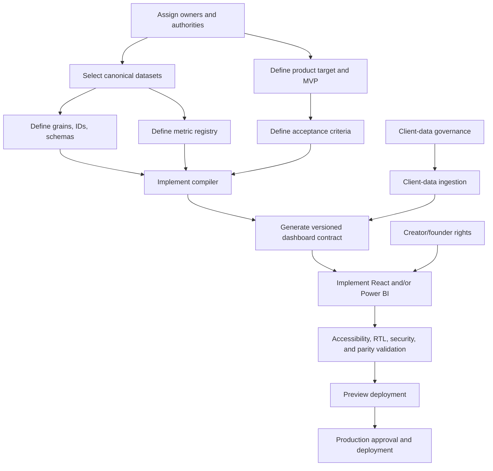
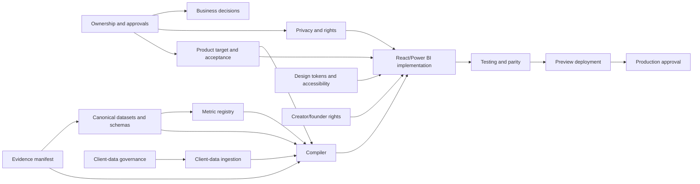

# 08 — Gap Report

> **System:** Dashboard Intelligence Operating System (DIOS)  
> **Repository:** `omarali304ii-byte/Islam-Brain`  
> **Repository baseline:** `44cea987cd42f077cc0f6e448bcdc69f2683ecb1`  
> **DIOS working branch:** `docs/dios-phase-0-inventory`  
> **Gap-analysis date:** 2026-07-12  
> **Phase status:** Phase 8 — Complete, awaiting validation  
> **Previous artifacts:** [`00_Project_Inventory.md`](./00_Project_Inventory.md) · [`01_Understanding.md`](./01_Understanding.md) · [`02_Dashboard_Architecture.md`](./02_Dashboard_Architecture.md) · [`03_Design_System.md`](./03_Design_System.md) · [`04_System_Architecture.md`](./04_System_Architecture.md) · [`05_Prompt_Analysis.md`](./05_Prompt_Analysis.md) · [`06_Project_Decisions.md`](./06_Project_Decisions.md) · [`07_Project_Brain.md`](./07_Project_Brain.md)  
> **Next phase:** Blocked until this document passes its quality gate

---

## Table of Contents

1. [Phase Entry Decision](#1-phase-entry-decision)
2. [Purpose and Scope](#2-purpose-and-scope)
3. [Executive Gap Verdict](#3-executive-gap-verdict)
4. [What Counts as a Gap](#4-what-counts-as-a-gap)
5. [Gap Taxonomy](#5-gap-taxonomy)
6. [Severity, Priority, and Status Model](#6-severity-priority-and-status-model)
7. [Readiness Overview](#7-readiness-overview)
8. [P0 Stop-Ship Gaps](#8-p0-stop-ship-gaps)
9. [Critical Path](#9-critical-path)
10. [Business and Strategy Gaps](#10-business-and-strategy-gaps)
11. [Ownership and Governance Gaps](#11-ownership-and-governance-gaps)
12. [Conversion and Client-Data Gaps](#12-conversion-and-client-data-gaps)
13. [Evidence and Provenance Gaps](#13-evidence-and-provenance-gaps)
14. [Canonical Data Gaps](#14-canonical-data-gaps)
15. [Metric and Analytical Gaps](#15-metric-and-analytical-gaps)
16. [Social-Data Gaps](#16-social-data-gaps)
17. [Catalog and Pricing Gaps](#17-catalog-and-pricing-gaps)
18. [Sentiment and Language-Analysis Gaps](#18-sentiment-and-language-analysis-gaps)
19. [Competitive, Market, and Survey Gaps](#19-competitive-market-and-survey-gaps)
20. [Dashboard Product Gaps](#20-dashboard-product-gaps)
21. [Information-Architecture and UX Gaps](#21-information-architecture-and-ux-gaps)
22. [Design-System Gaps](#22-design-system-gaps)
23. [Accessibility, RTL, and Responsive Gaps](#23-accessibility-rtl-and-responsive-gaps)
24. [React Implementation Gaps](#24-react-implementation-gaps)
25. [Power BI Implementation Gaps](#25-power-bi-implementation-gaps)
26. [Compiler and Data-Contract Gaps](#26-compiler-and-data-contract-gaps)
27. [Pipeline and Reliability Gaps](#27-pipeline-and-reliability-gaps)
28. [Security and Secret-Handling Gaps](#28-security-and-secret-handling-gaps)
29. [Privacy, Retention, and Client-Data Gaps](#29-privacy-retention-and-client-data-gaps)
30. [Media, Creator-Rights, and Claim Gaps](#30-media-creator-rights-and-claim-gaps)
31. [Prompt and AI-Governance Gaps](#31-prompt-and-ai-governance-gaps)
32. [Testing and Quality-Assurance Gaps](#32-testing-and-quality-assurance-gaps)
33. [Deployment, Operations, and Observability Gaps](#33-deployment-operations-and-observability-gaps)
34. [Documentation and Handoff Gaps](#34-documentation-and-handoff-gaps)
35. [Gap Dependency Map](#35-gap-dependency-map)
36. [What Each Gap Blocks](#36-what-each-gap-blocks)
37. [Closure Evidence Standard](#37-closure-evidence-standard)
38. [Owner and Approver Matrix](#38-owner-and-approver-matrix)
39. [Quick Wins](#39-quick-wins)
40. [Sequenced Gap-Closure Plan](#40-sequenced-gap-closure-plan)
41. [Work That Must Remain Blocked](#41-work-that-must-remain-blocked)
42. [Intentional Boundaries That Are Not Gaps](#42-intentional-boundaries-that-are-not-gaps)
43. [Master Gap Register](#43-master-gap-register)
44. [Open Questions Required to Close Gaps](#44-open-questions-required-to-close-gaps)
45. [Phase 8 Validation Gate](#45-phase-8-validation-gate)
46. [Glossary](#46-glossary)
47. [Document Control](#47-document-control)

---

## 1. Phase Entry Decision

Phase 7 was complete but awaiting owner validation. On 2026-07-12, the repository owner explicitly instructed the system to proceed with **Phase 8**.

This is recorded as:

- **Phase 7 acceptance:** Accepted by owner with all documented Project Brain limitations and open questions.
- **Authorized work:** Consolidate and prioritize all known project gaps.
- **Forbidden work:** Do not close gaps by inventing facts, selecting canonical datasets without authority, redefining metrics, executing data routes, ingesting client data, building or deploying software, generating media, or granting business approvals.
- **Evidence limitation:** Several source files, stakeholder records, runtime systems, implementation artifacts, legal permissions, and private datasets remain unavailable.

> [!IMPORTANT]
> A documented gap is not a failure. It is a controlled statement that the project cannot yet make a claim, execute an action, or pass a readiness gate safely.

---

## 2. Purpose and Scope

The Gap Report converts the scattered missing-information, debt, contradiction, risk, and unresolved-question registers from Phases 0–7 into one operational view.

It answers:

1. What is missing?
2. Why does it matter?
3. What does it block?
4. Who should own it?
5. What dependencies come first?
6. What evidence proves closure?
7. Which work can continue safely while the gap remains open?

### 2.1 Sources consolidated

This phase consolidates:

- Inventory gaps and unconfirmed artifacts from Phase 0
- Understanding boundaries from Phase 1
- Dashboard data, metric, state, and interaction gaps from Phase 2
- Design debt and unresolved token questions from Phase 3
- Architecture debt and production-readiness gaps from Phase 4
- Prompt debt, permission gaps, and AI-safety gaps from Phase 5
- Decision debt, ownership gaps, and unresolved decisions from Phase 6
- Brain contradiction, gap, risk, queue, and priority registers from Phase 7
- Confirmed source registry, run state, evidence log, data-pass menu, specifications, scripts, and final decision artifacts

### 2.2 This phase does not

- Select canonical data generations
- Fix the `~190×` formula
- Approve a paid route
- Request or ingest client data
- Choose React or Power BI as the launch target
- Invent design tokens
- Write the compiler
- Implement tests or CI/CD
- Resolve creator rights
- Confirm founder or sustainability claims
- Claim that any specified system exists

---

## 3. Executive Gap Verdict

The project is **analysis-rich but implementation-blocked**.

The evidence estate is substantial. The strategic narrative is coherent. The dashboard architecture, semantic design language, intended system architecture, prompt governance, and decision structure are all well documented.

However, the project is not yet ready for trustworthy dashboard implementation because five foundational systems remain unresolved:

1. **Canonical truth system** — authoritative datasets, grains, IDs, formulas, lineage, freshness, and spend.
2. **Ownership and permission system** — named owners, approvers, client-data authority, paid-route limits, legal/rights decisions, and deployment authority.
3. **Product contract** — launch target, MVP scope, user flows, editability, privacy model, and acceptance criteria.
4. **Compiler and validation system** — schemas, `build_cielito_data.py`, fail-closed rules, tests, and promotion of canonical artifacts.
5. **Production system** — React/Power BI implementation, accessibility, authentication, CI/CD, deployment, monitoring, rollback, and support.

### 3.1 Gap system in one sentence

> The project knows what a trustworthy dashboard should mean, but it does not yet possess the canonical contracts, ownership, implementation, and validation proof required to make that dashboard real.

### 3.2 Highest-risk mistake

The highest-risk mistake would be to start implementing the presentation layer directly against the current research files.

That would hard-code unresolved:

- dataset generations;
- metric definitions;
- product/SKU assumptions;
- sample windows;
- claim language;
- provisional design choices;
- privacy and media-rights behavior.

### 3.3 Correct implementation order

```text
Truth normalization
→ Ownership and permission resolution
→ Product scope and acceptance criteria
→ Compiler and validated data contract
→ Presentation implementation
→ Deployment and operational validation
```

---

## 4. What Counts as a Gap

A **gap** is a missing, contradictory, unowned, unimplemented, unvalidated, stale, or permission-blocked condition that prevents a reliable decision, claim, feature, workflow, or release.

### 4.1 Gap classes

| Gap class | Meaning |
|---|---|
| Missing artifact | A required file, system, record, or output is unavailable. |
| Contradiction | Two or more project artifacts disagree. |
| Undefined contract | A term, formula, schema, state, interface, or acceptance condition is not specified precisely enough. |
| Missing authority | No owner, approver, or permission is confirmed. |
| Unimplemented specification | Required behavior is documented but no implementation proof exists. |
| Unvalidated implementation | Code or data may exist, but no acceptance evidence proves correctness. |
| Freshness gap | A snapshot may no longer support a current claim. |
| Privacy/rights gap | Use, retention, access, publication, or attribution authority is unresolved. |
| Operational gap | Deployment, monitoring, rollback, support, or maintenance is absent. |
| Research gap | Evidence requires client data, external collection, survey, interview, or validation. |

### 4.2 A gap is not automatically a defect

Examples:

- Revenue being unavailable is not a software defect; it is a client-data gap.
- Power BI being absent is not a defect if it has not been selected as the launch target.
- A RequiresData card is not a defect; it is the correct representation of an unresolved data gap.
- A read-only initial dashboard is not a gap if read-only scope is explicitly accepted.

---

## 5. Gap Taxonomy

Gap IDs use the following families:

```text
GAP-BIZ-###   Business and strategy
GAP-GOV-###   Ownership and governance
GAP-CNV-###   Conversion and client data
GAP-EVD-###   Evidence and provenance
GAP-DAT-###   Canonical data and schemas
GAP-MET-###   Metrics and analysis
GAP-ANA-###   Social, catalog, sentiment, and research analysis
GAP-PRD-###   Dashboard product and UX
GAP-DES-###   Design, accessibility, RTL, responsive behavior
GAP-ENG-###   Compiler, architecture, implementation, reliability
GAP-SEC-###   Security, privacy, retention, rights
GAP-OPS-###   Prompt governance, testing, deployment, operations
```

---

## 6. Severity, Priority, and Status Model

### 6.1 Severity

| Severity | Meaning |
|---|---|
| **Critical** | Can make executive claims materially misleading, expose private/rights-sensitive data, or invalidate the entire build. |
| **High** | Blocks a major capability, safe implementation, or launch acceptance. |
| **Medium** | Causes inconsistency, rework, poor usability, or weak maintainability. |
| **Low** | Improves clarity, efficiency, polish, or long-term governance but does not block initial safe work. |

### 6.2 Priority

| Priority | Meaning |
|---|---|
| **P0 — Stop ship** | Must close before trustworthy implementation, publication, ingestion, or deployment in the affected area. |
| **P1 — Before MVP acceptance** | Must close before the initial product can be signed off. |
| **P2 — Before scale** | Can remain open during bounded MVP work but must close before wider use, refresh automation, or operational scale. |
| **P3 — Enhancement** | Valuable improvement that does not block an explicitly bounded initial delivery. |

### 6.3 Gap status

| Status | Meaning |
|---|---|
| **OPEN** | Confirmed gap with no approved closure. |
| **BLOCKED_CLIENT** | Requires client-owned data, access, or decision. |
| **BLOCKED_FOUNDER** | Requires founder confirmation. |
| **BLOCKED_APPROVAL** | Requires explicit permission or cost authorization. |
| **DEFERRED** | Intentionally postponed. |
| **PARTIAL** | Some controls exist but closure proof is incomplete. |
| **SPECIFIED_NOT_IMPLEMENTED** | Desired behavior is documented only. |
| **UNVERIFIED** | Implementation may exist elsewhere but is not confirmed. |
| **DROPPED** | Route or feature is intentionally not active; do not treat as open work. |
| **CLOSED** | Closure evidence exists and downstream records were updated. |

---

## 7. Readiness Overview

No synthetic score is assigned. Readiness is expressed by evidence state.

| Capability | Readiness | Reason |
|---|---|---|
| Raw evidence preservation | **PARTIAL-STRONG** | Major public captures exist; canonical generations and retention remain unresolved. |
| Source registry | **PARTIAL-STRONG** | Source IDs and grades exist; claim-level machine linkage is missing. |
| Strategic diagnosis | **DOCUMENTED** | Coherent narrative exists; some flagship metrics and founder claims remain unstable. |
| Decision system | **DOCUMENTED-PARTIAL** | Decisions are normalized in Phase 6; named owners and implementation proof are often absent. |
| Dashboard architecture | **SPECIFIED** | Page, component, and evidence behavior are documented; no runtime implementation is confirmed. |
| Design system | **CONCEPTUAL** | Semantic rules exist; tokens, responsive contracts, and accessibility validation are missing. |
| Canonical data model | **BLOCKED** | Product/SKU grain, generations, stable IDs, and formulas are unresolved. |
| Compiler | **MISSING** | Critical trust boundary is specified but absent. |
| React dashboard | **UNVERIFIED/NOT CONFIRMED** | Specification exists; application code and deployed route are unavailable. |
| Power BI report | **UNVERIFIED/NOT CONFIRMED** | Star-schema specification exists; `.pbix`, seed package, and validator are absent. |
| Client-data ingestion | **BLOCKED** | No data supplied and no governance contract exists. |
| Security/privacy | **BLOCKED FOR PRIVATE DATA** | No authentication, retention, deletion, tenant-isolation, or incident model is confirmed. |
| Testing/CI/CD | **MISSING** | No automated validation or release pipeline is confirmed. |
| Deployment/operations | **MISSING** | No environment, hosting, monitoring, rollback, or support proof exists. |
| Business activation | **BLOCKED/PARTIAL** | Strategic actions are accepted in documents but implementation and ownership are not confirmed. |

---

## 8. P0 Stop-Ship Gaps

The following gaps must block affected implementation or publication.

| ID | P0 gap | Why it is stop-ship | Closure proof |
|---|---|---|---|
| `GAP-DAT-001` | No canonical dataset manifest | Different input generations can produce different claims. | Versioned manifest selecting each canonical input, checksum, grain, window, and owner. |
| `GAP-MET-001` | `~190×` formula is not canonical | Flagship executive claim may compare peak earned views with owned median views while another spec names median-to-median. | Approved metric record, reproducible calculation, test fixture, updated copy, React measure, and PBI measure. |
| `GAP-DAT-002` | Product versus variant/SKU grain unresolved | Pricing, inventory, size, and availability measures can be structurally wrong. | Approved domain model and migration/normalization rules with tests. |
| `GAP-DAT-003` | Stable IDs and schemas absent | Deduplication, lineage, joins, and incremental refresh are unsafe. | Schema registry, stable identity rules, validation suite, and versioning policy. |
| `GAP-ENG-001` | `build_cielito_data.py` compiler missing | Evidence governance cannot be enforced before UI consumption. | Compiler implementation, fail-closed tests, versioned output, and build report. |
| `GAP-MET-002` | No canonical metric registry | React, Power BI, reports, and decisions can drift. | Machine-readable registry with formula, grain, filters, source, caveat, owner, and parity tests. |
| `GAP-PRD-001` | Launch target and MVP scope unresolved | Engineering cannot know what product to build or what to omit. | Approved product brief naming React/PBI/both, users, pages, capabilities, exclusions, and release boundary. |
| `GAP-PRD-002` | Acceptance criteria absent | “Done,” “validated,” and “ready” cannot be proven. | Testable acceptance criteria for evidence, UX, accessibility, performance, security, and business behavior. |
| `GAP-GOV-001` | No named product/data/compiler owners | Critical decisions and defects have no accountable authority. | Approved RACI or ownership register with named people and escalation path. |
| `GAP-SEC-001` | Client-data governance absent | Private Shopify/GA4/Insights data cannot be ingested safely. | Data-processing agreement or internal policy covering purpose, access, storage, encryption, retention, deletion, export, incident response, and isolation. |
| `GAP-SEC-002` | Authentication/exposure model unresolved | A dashboard containing evidence, handles, or private metrics may be exposed incorrectly. | Approved access model and tested authorization implementation. |
| `GAP-SEC-003` | Creator content rights unresolved | Public creator media may not be reusable in a public/client product. | Rights/consent record, attribution rules, duration, territory, modification, revocation, and audit trail. |
| `GAP-BIZ-001` | Founder-gated identity and sustainability claims unresolved | Public claims may misrepresent the founder, product materials, or brand position. | Founder-approved record with source material, allowed wording, expiry/review rule, and asset approval. |
| `GAP-OPS-001` | Build and deployment permissions are not formally separated | A build instruction may be interpreted as production authorization. | Permission model with explicit code-write, preview-deploy, and production-deploy approvals. |
| `GAP-EVD-001` | Required compile dependencies are unavailable | `strategy.json`, `gaps.yaml`, banned-vocabulary rules, or referenced source artifacts may be necessary for the specified compiler. | Confirmed files or approved replacement contracts with provenance. |

### 8.1 Publication block

Until `GAP-MET-001` is closed, the `~190×` claim must remain caveated, excluded from governed KPI surfaces, or replaced with a directly reproducible comparison whose numerator and denominator are explicitly named.

### 8.2 Private-data block

Until `GAP-SEC-001` and `GAP-SEC-002` are closed, no private client export should be stored, transformed, displayed, or sent to external models.

### 8.3 Build block

UI prototyping may proceed against synthetic schema fixtures only if clearly labeled. Production dashboard development against current heterogeneous research files should remain blocked until `GAP-DAT-001` through `GAP-ENG-001` have approved contracts.

---

## 9. Critical Path



### 9.1 Parallel tracks

The critical path contains six parallel workstreams:

1. **Truth track** — canonical data, identities, formulas, provenance, freshness.
2. **Authority track** — owners, approvers, permission levels, rights, legal and privacy decisions.
3. **Product track** — users, launch target, MVP, editing model, acceptance criteria.
4. **Compiler track** — schemas, validators, media checks, fail-closed output.
5. **Presentation track** — React/Power BI implementation, design, accessibility, RTL, responsiveness.
6. **Operations track** — tests, CI/CD, environments, deployment, monitoring, rollback, support.

---

## 10. Business and Strategy Gaps

### `GAP-BIZ-001` — Founder-gated identity and sustainability truth

- **Severity/Priority:** Critical / P0
- **Status:** `BLOCKED_FOUNDER`
- **Missing:** Confirmed status of fruit leather, approved founder narrative, final tagline, and second-domain purpose.
- **Blocks:** Public sustainability claims, founder-story content, positioning lock, synthetic founder concepts, certain strategy pages.
- **Closure:** Signed or recorded founder decision linked to evidence and approved wording.

### `GAP-BIZ-002` — Client acceptance of “repair, do not rebuild” is not confirmed

- **Severity/Priority:** High / P1
- **Status:** `OPEN`
- **Missing:** Stakeholder acceptance record.
- **Blocks:** Treating the turnaround thesis as a client-approved mandate.
- **Closure:** Client decision record, alternatives considered, owner, date, review condition.

### `GAP-BIZ-003` — Turnaround success is undefined

- **Severity/Priority:** High / P1
- **Missing:** Business outcome, baseline, target, horizon, and success/failure conditions.
- **Blocks:** Roadmap prioritization and post-launch evaluation.
- **Closure:** Approved objective tree and measurable outcome covenant.

### `GAP-BIZ-004` — Arabic-first operating standard is undefined

- **Severity/Priority:** High / P1
- **Missing:** Channel coverage, content percentage, dialect/tone, bilingual rules, approval workflow.
- **Blocks:** Consistent content execution and evaluation.
- **Closure:** Brand/content standard plus examples and QA checklist.

### `GAP-BIZ-005` — 60-day versus 90-day horizon conflict

- **Severity/Priority:** Medium / P1
- **Status:** `UNRESOLVED`
- **Blocks:** Calendar, sequencing, KPI checkpoints, and executive narrative.
- **Closure:** One approved horizon or explicit nested plan relationship.

### `GAP-BIZ-006` — Paid-media policy is implied, not decided

- **Severity/Priority:** High / P1
- **Missing:** Whether paid media is paused, capped, or merely deprioritized before mobile repair.
- **Blocks:** Acquisition planning and agency commitments.
- **Closure:** Explicit paid-media decision with conditions and owner.

### `GAP-BIZ-007` — Creator-program business model is undefined

- **Severity/Priority:** High / P1
- **Missing:** Paid, gifted, affiliate, ambassador, organic, exclusivity, performance, and rights model.
- **Blocks:** Creator outreach, economics, attribution, and contracts.
- **Closure:** Approved operating model and contract templates.

### `GAP-BIZ-008` — Agency-versus-client product objective can conflict

- **Severity/Priority:** Medium / P2
- **Missing:** Priority when WOM pitch value conflicts with Cielito decision usefulness.
- **Blocks:** Scope tradeoffs and card-count decisions.
- **Closure:** Product principle stating client value precedence and acceptable agency showcase needs.

---

## 11. Ownership and Governance Gaps

### `GAP-GOV-001` — No named owner for product, data, metrics, compiler, and launch

Critical decisions are assigned to roles conceptually but not to named accountable people.

### `GAP-GOV-002` — No canonical decision system of record

Phase 6 provides a documentation ledger, but no machine-readable, actively maintained decision registry exists.

### `GAP-GOV-003` — No decision expiry or review automation

Volatile decisions and metrics can remain active after evidence becomes stale.

### `GAP-GOV-004` — No formal supersession workflow

The Brain documents precedence, but tools do not enforce updates when a later instruction replaces an earlier one.

### `GAP-GOV-005` — No legal-review checkpoint

Sustainability, creator reuse, public-comment presentation, founder identity, and client-data use have no confirmed legal review process.

### `GAP-GOV-006` — No stakeholder notification mechanism

Changes to formulas, decisions, canonical datasets, or published claims may not propagate to every affected owner.

### `GAP-GOV-007` — No implementation-proof registry

Accepted or specified decisions can still be mistaken for completed work.

---

## 12. Conversion and Client-Data Gaps

### `GAP-CNV-001` — WhatsApp owner, account, and SLA are undefined

The strategic decision exists, but operational responsibility, phone/account, working hours, response SLA, escalation, and overflow behavior are missing.

### `GAP-CNV-002` — WhatsApp attribution is undefined

No UTM, link, conversation-source, post, creator, campaign, or order-attribution contract exists.

### `GAP-CNV-003` — WhatsApp consent and privacy behavior are undefined

No approved consent, retention, opt-out, export, or deletion process is confirmed.

### `GAP-CNV-004` — Chat-to-order operating process is undefined

The conversion bridge does not define how chats become orders, who confirms availability, or how fulfillment systems receive the order.

### `GAP-CNV-005` — Current conversion baselines are unavailable

Revenue, AOV, orders, channel attribution, conversion, CAC, returns, repeat rate, and margin are client-owned gaps.

### `GAP-CNV-006` — Client export format and data dictionary are undefined

No accepted Shopify/GA4/Insights export schemas, timezone, currency, identifiers, or field mappings exist.

### `GAP-CNV-007` — Financial scenario methodology is undefined

Even after data arrives, assumptions, sensitivity bands, attribution, and confidence rules must be defined before ROI publication.

### `GAP-CNV-008` — Capacity risk after WhatsApp activation is unmodeled

The project does not define staffing, automation, queueing, SLA alerts, or fallback if demand increases.

---

## 13. Evidence and Provenance Gaps

### `GAP-EVD-001` — Referenced compile dependencies are absent

Confirmed missing or unavailable dependencies include `strategy.json`, `gaps.yaml`, `banned_vocab.py`, several framework outputs, and the external Mega Run runtime.

### `GAP-EVD-002` — No machine-readable claim-to-source map

Narrative claims are not centrally linked to source IDs, exact rows, formulas, windows, and transformations.

### `GAP-EVD-003` — Final deliverables are not fully traceable automatically

A reviewer must manually work backward from report copy to datasets and raw captures.

### `GAP-EVD-004` — Evidence freshness thresholds are undefined

No rule says when follower counts, PageSpeed, prices, availability, creator rankings, competitor metrics, or market estimates expire.

### `GAP-EVD-005` — Capture timestamps and windows are inconsistent across outputs

Some artifacts contain windows; others expose only snapshot values or prose.

### `GAP-EVD-006` — Source-grade changes do not propagate automatically

Upgrading or downgrading evidence can leave old narrative and card states unchanged.

### `GAP-EVD-007` — No immutable evidence manifest

The repository lacks one versioned manifest of raw files, checksums, capture method, source ID, cost, and privacy class.

### `GAP-EVD-008` — Binary deliverables were not fully visually validated during DIOS analysis

PDF/PPTX existence is confirmed, but full layout, embedded claims, synthetic labels, and accessibility were not validated here.

### `GAP-EVD-009` — Public-source accessibility is not archival proof

Permanent URLs may change or disappear; rights and retention behavior remain undefined.

### `GAP-EVD-010` — The “security clean” evidence label is too broad

The underlying audit appears narrower than a complete security assessment.

### `GAP-EVD-011` — No evidence-deletion and correction process

There is no formal path to remove a creator comment, correct a source, or rebuild affected outputs.

### `GAP-EVD-012` — Original stakeholder conversation is unavailable

Approval context and intent cannot be reconstructed fully.

---

## 14. Canonical Data Gaps

### `GAP-DAT-001` — No canonical dataset manifest

A build cannot reliably select between initial, corrective, deep, temporary, normalized, or final data generations.

### `GAP-DAT-002` — Product/variant/SKU grain unresolved

The Power BI concept says one row per SKU while confirmed source descriptions often speak in products.

### `GAP-DAT-003` — Stable entity IDs absent

Posts, comments, creators, products, variants, sources, metrics, claims, and media lack a confirmed cross-system identity policy.

### `GAP-DAT-004` — Social generations conflict

Counts include 60-item platform pulls, a 120-row BI concept, 150 deep Instagram posts, and a 210-post deepening claim.

### `GAP-DAT-005` — Voice generations conflict

The estate references 254 comments, 964 qualitative items, and 1,050 sentiment items with different inclusion logic.

### `GAP-DAT-006` — Creator definitions conflict

Twelve handles, 34 earned/founder items, and 63 creators are not interchangeable populations.

### `GAP-DAT-007` — Catalog untyped definitions conflict

Raw blank product type and normalized Other/untyped counts represent different concepts.

### `GAP-DAT-008` — TikTok media count conflict

The reported number of covers and file-index range require manifest verification.

### `GAP-DAT-009` — Canonical cumulative spend is absent

Base run state and later deep-capture logs imply different totals.

### `GAP-DAT-010` — Canonical locale, timezone, and currency rules are absent

Dates, EGP formatting, Cairo time, and bilingual strings lack a shared data contract.

### `GAP-DAT-011` — No data-version promotion workflow

There is no staging → validated → canonical transition with owner approval.

### `GAP-DAT-012` — No backward-compatibility policy

Schema changes can break the future React app, Power BI model, exports, and historical snapshots.

---

## 15. Metric and Analytical Gaps

### `GAP-MET-001` — `~190×` definition conflict

The flagship ratio appears to use earned peak views divided by owned median views in one artifact, while another names earned median divided by owned median.

### `GAP-MET-002` — No canonical metric registry

Metric definitions are distributed among specs, prose, scripts, datasets, and DAX examples.

### `GAP-MET-003` — Owned engagement-rate formula and denominator require lock

Follower base date, included interactions, post sample, aggregation, and platform scope are incomplete.

### `GAP-MET-004` — “Healthy” owned engagement target is undefined

The north-star gauge has a baseline but no approved destination.

### `GAP-MET-005` — UGC velocity is undefined

No formula, period, unique-creator logic, repeat threshold, or target exists.

### `GAP-MET-006` — Catalog hygiene composite is undefined

Typed share alone does not prove catalog hygiene, yet some language implies a broader score.

### `GAP-MET-007` — Discount discipline threshold is undefined

The watch KPI lacks category, season, depth, duration, margin, and sell-through rules.

### `GAP-MET-008` — Reach, impressions, views, plays, and video views are not normalized

Cross-platform comparisons can become misleading.

### `GAP-MET-009` — Gauge and bullet-chart targets are missing

Several specified gauges cannot communicate status without thresholds.

### `GAP-MET-010` — Snapshot-versus-trend semantics are incomplete

Single captures may be presented in trend-like visual forms without historical series.

---

## 16. Social-Data Gaps

- Owned versus earned classification rules need a stable taxonomy.
- Founder posts require explicit classification.
- Language detection and bilingual-post rules are not formalized.
- Post format normalization across Instagram and TikTok is incomplete.
- Deleted/private/unavailable post behavior is undefined.
- Deep comment pulls are biased toward top-comment posts and should not be represented as a random population.
- Platform-native metrics unavailable from public scraping must remain client-required.
- Creator follower and audience-quality data remain pending paid routes.
- Social refresh cadence and historical snapshot policy are missing.
- Public post and comment retention/deletion behavior is unresolved.

---

## 17. Catalog and Pricing Gaps

- Product versus variant/SKU grain is unresolved.
- Shopify `option1` cannot safely be treated as size.
- Color, size, material, style, heel type, and collection taxonomies are not approved.
- Availability semantics at product and variant levels are not defined.
- Catalog hygiene fields and weighting are undefined.
- Duplicate-collection logic requires a canonical rule.
- Price tiers and category bands lack formal ownership and refresh behavior.
- Margin, sell-through, stock turn, returns, and repeat purchase require client data.
- Rival pricing requires paid or approved public collection.
- Product-image rights and approved use in dashboard exports remain unconfirmed.

---

## 18. Sentiment and Language-Analysis Gaps

- CAMeLBERT validation was performed on another dataset, not Cielito ground truth.
- Model fallback can silently change methodology unless publication is blocked or labeled.
- Emoji polarity rules are heuristic and should not be merged invisibly with model output.
- Neutral threshold is a modeling choice without Cielito-specific validation.
- Purchase-intent matching uses substrings and can generate Arabic false positives.
- Comment deduplication based on handle and text can collapse distinct events.
- `strip_pii` is a no-op.
- Exact comments and handles remain in output.
- Sentiment sample selection is praise-heavy and biased by public engagement patterns.
- No manual validation sample, confusion matrix, or reviewer agreement is confirmed for this project.

---

## 19. Competitive, Market, and Survey Gaps

- Competitive social coverage beyond limited Dejavu context is missing.
- Rival catalog and pricing comparison remain pending approval.
- Facebook and Ads Library data remain pending approval.
- Market-size values are estimate-only and source-conflicted.
- TAM/SAM/SOM cannot be made decision-grade without client sales and market assumptions.
- Search trends and marketplace share are incomplete.
- Brand awareness, funnel, perception, NPS, and price elasticity require primary research.
- Era-28 survey is armed but not fielded.
- Survey sample size, quotas, instrument owner, fieldwork method, and analysis plan are absent.
- Noon reviews are explicitly dropped and must not be revived as an open gap without a new owner decision.

---

## 20. Dashboard Product Gaps

### `GAP-PRD-001` — Launch target unresolved

React, Power BI, or both are specified, but launch priority and system of record are not approved.

### `GAP-PRD-002` — MVP and acceptance criteria absent

No signed-off page set, feature boundary, release conditions, or exclusion list exists.

### `GAP-PRD-003` — Read-only versus operational scope unresolved

The initial architecture appears read-only, but editing, annotations, decision updates, comments, exports, and workflow actions are not decided.

### `GAP-PRD-004` — Audience and access model incomplete

Public pitch, client-only portal, internal agency tool, and executive export have different security and UX needs.

### `GAP-PRD-005` — Decision Dock update model undefined

The Dock could become stale without owner, timestamp, edit path, approval, and expiry.

### `GAP-PRD-006` — Card-count target risks product bloat

At least 20 cards per tab is a completeness contract, not validated usability.

### `GAP-PRD-007` — Evidence interaction is conceptual

Drawer/modal/deep-link behavior, source access, media preview, and unavailable-source states are not implemented.

### `GAP-PRD-008` — Export behavior undefined

PDF, PowerPoint, CSV, image, and print outputs have no approved scope or evidence/synthetic-label requirements.

### `GAP-PRD-009` — Localization behavior incomplete

UI language switching, mixed-direction strings, number/date/currency formatting, and untranslated source text are not defined.

### `GAP-PRD-010` — Product analytics absent

No telemetry plan exists to validate executive comprehension, drill-down use, search, filters, or decision outcomes.

---

## 21. Information-Architecture and UX Gaps

- The L0–L3 model is specified but not usability-tested.
- Five-screen executive story and tab-based diagnostic model may overlap.
- Persistent Decision Dock height and mobile behavior are undefined.
- Maximum navigation depth is specified conceptually but not tested.
- Deep links and browser-history behavior are undefined.
- Global versus page-local filters are not fully mapped.
- Cross-filtering rules are not defined.
- Filter persistence and reset behavior are undefined.
- Empty, loading, error, partial, stale, and permission-denied states are incomplete.
- Dense tables lack approved pagination, search, sort, column, export, and mobile behavior.
- Evidence footers may overload compact cards.
- RequiresData cards need route, permission, cost, owner, and status interaction rules.
- A conceptual funnel must not look like measured stage conversion.
- Decision cards need implementation and status proof, not only recommendation copy.
- No user-research or comprehension testing is confirmed.

---

## 22. Design-System Gaps

- Exact palette is absent.
- Typography family, scale, weight, line height, and language pairing are absent.
- Spacing, grid, gutters, container widths, and density rules are absent.
- Radius, border, elevation, and shadow tokens are absent.
- Icon library and icon semantics are absent.
- Motion duration, easing, state transitions, and reduced-motion behavior are absent.
- Component measurements and variants are absent.
- Loading, empty, error, stale, warning, locked, and disabled visual states are incomplete.
- Chart palette is not accessibility-tested.
- Brand colors and analytical semantic colors can collide.
- Terracotta may represent both brand accent and earned content.
- Green may represent positive sentiment and a botanical concept.
- Orange must remain reserved for data gaps or receive a conflict rule.
- React and Power BI have no shared token dictionary.
- No design-system owner, version, review process, or approval proof exists.

---

## 23. Accessibility, RTL, and Responsive Gaps

- No target accessibility standard is approved.
- No contrast validation exists.
- Color-independent encoding is specified conceptually but not tested.
- Keyboard navigation is undefined.
- Focus order and focus-visible behavior are undefined.
- Screen-reader labels and chart alternatives are undefined.
- Table accessibility is undefined.
- Reduced-motion behavior is undefined.
- Responsive breakpoints are absent.
- Chart reflow, truncation, scroll, and small-screen alternatives are absent.
- RTL component mirroring is undefined.
- Mixed Arabic/English direction behavior is undefined.
- Arabic font rendering and line-height choices are absent.
- Numeric, currency, date, and percentage localization is undefined.
- Evidence URLs and handles in RTL contexts are not tested.
- Accessibility acceptance testing and ownership are absent.

---

## 24. React Implementation Gaps

- React source repository is not confirmed.
- Framework version and package manifest are unknown.
- Route `/dashboard/cielito-360` is not confirmed.
- Component tree is conceptual only.
- State-management approach is undefined.
- Data-loading method is undefined.
- Runtime versus build-time validation behavior is undefined.
- Chart library and wrappers are undefined.
- Error boundaries are undefined.
- Loading and stale states are undefined.
- URL filter synchronization is undefined.
- Evidence drawers/modals are undefined.
- Authentication and authorization are undefined.
- Asset bundling and local-media strategy are undefined.
- Performance budgets are undefined.
- Telemetry and error reporting are undefined.
- Unit, integration, accessibility, and end-to-end tests are absent.
- Preview and production environments are absent.
- Deployment proof is absent.

---

## 25. Power BI Implementation Gaps

- `.pbix` file is absent.
- Seed CSVs are absent.
- `validate_cielito_pbi.py` is absent.
- Data-source paths and refresh parameters are undefined.
- Gateway and scheduled-refresh model are undefined.
- Incremental refresh is undefined.
- Row-level security is undefined.
- Workspace ownership and licensing are undefined.
- React/Power BI formula parity is not enforced.
- Arabic/English labels and RTL behavior are untested.
- Blank-plus-label behavior for missing financial metrics is not proven.
- Evidence drill-through and permanent URL behavior are not implemented.
- Export behavior and synthetic-media labels are unverified.
- Visual accessibility and theme are absent.
- Deployment and handoff acceptance are undefined.

---

## 26. Compiler and Data-Contract Gaps

### `GAP-ENG-001` — Compiler missing

The intended trust boundary is documented but not implemented.

### Additional compiler gaps

- Input file manifest is undefined.
- Required versus optional inputs are undefined.
- Input schema validation is absent.
- Version negotiation is absent.
- Stable output schema is absent.
- Claim and metric registries are absent.
- Banned-vocabulary dependency is unavailable.
- Money-number guard rules are not formalized.
- Hypothesis/self-reported/GAP transformation rules are not machine-enforced.
- Media size, format, rights, existence, and hotlink checks are not implemented centrally.
- Source ID, sample, window, confidence, and formula requirements are not enforced centrally.
- Duplicate and identity handling is undefined.
- Atomic output promotion is absent.
- Previous-good output retention is absent.
- Build report and diagnostics format are undefined.
- React/PBI output parity is undefined.
- Compiler versioning and changelog are absent.
- Determinism and reproducibility tests are absent.
- Failure classification and exit codes are undefined.

---

## 27. Pipeline and Reliability Gaps

- Current orchestration is manual and external.
- Retry policy is script-specific or absent.
- Exponential backoff and jitter are not standardized.
- Rate-limit handling is not standardized.
- Network timeout behavior differs by script.
- Fixed output files may be overwritten.
- Atomic writes are not guaranteed.
- Immutable run snapshots are absent.
- Locks and concurrent-run protection are absent.
- Idempotency keys are absent.
- Partial-run recovery is undefined.
- Checkpoint and resume semantics are external/unverified.
- Dependency versions are not pinned in a confirmed environment.
- Hardcoded Windows/Eslam paths reduce portability.
- Secrets location is hardcoded.
- Model fallback can produce materially different outputs.
- Cost ceilings are not enforced in the visible scripts.
- Cost reconciliation is absent.
- Scheduled refresh is absent.
- Pipeline health monitoring is absent.

---

## 28. Security and Secret-Handling Gaps

- Apify token is placed in URL query parameters.
- URL and exception logging could expose secrets.
- No central secret manager is confirmed.
- No secret rotation process is defined.
- No least-privilege token model is confirmed.
- No dependency or vulnerability scanning is confirmed.
- “Security clean” represents a narrow audit, not a complete security review.
- No application threat model exists.
- No authentication or authorization exists in the confirmed repository.
- No audit log for privileged actions is confirmed.
- No secure configuration validation exists.
- No incident-response plan is confirmed.
- No production network or hosting model is confirmed.
- No backup and recovery plan exists.

---

## 29. Privacy, Retention, and Client-Data Gaps

- No public-data retention policy.
- No client-data retention policy.
- No deletion or correction workflow.
- No purpose-limitation register.
- No access-control matrix.
- No encryption policy.
- No tenant isolation model.
- No export-control model.
- No data-processing inventory.
- No lawful/contractual basis record for private data.
- Handles, exact text, and URLs remain in sentiment evidence.
- `strip_pii` is a no-op.
- Public comments may still carry privacy expectations.
- No age/minor-handling policy is confirmed.
- No deletion-request process is confirmed.
- No model-provider/data-sharing policy exists for client data.
- No privacy review owner is named.
- No audit trail is confirmed.

---

## 30. Media, Creator-Rights, and Claim Gaps

- Creator-content reuse rights are not confirmed.
- Attribution format is not approved.
- Paid usage, duration, territory, modification, and revocation rules are missing.
- Real founder imagery is not supplied or approved.
- Synthetic founder concepts can be misinterpreted.
- Product truth is not guaranteed in generated footwear images.
- Workshop imagery may imply actual manufacturing conditions.
- Fruit-leather imagery may imply unverified product/material claims.
- Palette and wordmark are provisional.
- Synthetic labels may be lost in exports.
- Image-generation model version/settings are not recorded.
- Prompt-to-output provenance is absent.
- Local downloaded media rights and retention are unresolved.
- Media checksum and duplicate handling are absent.
- Alt text and accessibility metadata are absent.

---

## 31. Prompt and AI-Governance Gaps

- DIOS governing prompt is external and not versioned in the repository.
- Prompt manifest is absent.
- Prompt versions are not linked to outputs.
- Model/version/temperature/tool permissions are not recorded.
- Build, paid collection, and deployment permission scopes are not machine-separated.
- Raw external content is not technically sandboxed as untrusted data.
- Output schemas are mostly prose.
- Evaluation datasets and expected outputs are absent.
- Context packs are documented but not automated.
- Hidden Mega Run command semantics are unavailable.
- Missing dependencies can encourage model improvisation.
- The 20-card objective can encourage quantity optimization.
- No independent checker validates agent output before mutation.
- No prompt-injection test corpus exists.
- No token/cost budget is attached to tasks.
- No safe blocked-result schema is implemented.
- No AI execution audit record is confirmed.

---

## 32. Testing and Quality-Assurance Gaps

- No central test suite is confirmed.
- No schema-validation tests are confirmed.
- No canonical metric fixtures are confirmed.
- No React unit tests are confirmed.
- No React integration tests are confirmed.
- No end-to-end tests are confirmed.
- No Power BI validation script is confirmed.
- No cross-platform parity tests are confirmed.
- No accessibility tests are confirmed.
- No RTL visual-regression tests are confirmed.
- No responsive visual-regression tests are confirmed.
- No data-freshness tests are confirmed.
- No privacy or secret-leak tests are confirmed.
- No media-rights manifest check is confirmed.
- No compiler fail-closed test matrix is confirmed.
- No user acceptance test plan is confirmed.
- No executive comprehension testing is confirmed.
- No load/performance testing is confirmed.
- No rollback test is confirmed.

---

## 33. Deployment, Operations, and Observability Gaps

- Hosting platform is unknown.
- Environment model is unknown.
- Preview and production separation is absent.
- Deployment approval is not formalized.
- CI/CD workflows are absent.
- Build artifacts are not versioned.
- Data version and application version are not bound together.
- Configuration management is absent.
- Runtime health checks are absent.
- Error monitoring is absent.
- Structured logs are absent.
- Data-pipeline monitoring is absent.
- Cost monitoring is absent.
- Usage analytics are absent.
- Alert ownership is absent.
- Backup and restore are absent.
- Rollback target and process are absent.
- Support and incident SLA are absent.
- Release notes and change notification are absent.
- Production deployment proof is absent.

---

## 34. Documentation and Handoff Gaps

- The Project Brain owner is unnamed.
- Several specialist references point to unavailable artifacts.
- There is no machine-readable project manifest.
- There is no machine-readable gap ledger.
- There is no machine-readable metric registry.
- There is no machine-readable decision ledger.
- There is no machine-readable permission ledger.
- There is no machine-readable prompt manifest.
- There is no artifact lineage graph.
- There is no canonical changelog across evidence, decisions, data, prompts, and deployment.
- Original stakeholder context is incomplete.
- Runbook and operational support docs are absent.
- Onboarding is documented conceptually but not automated.
- PR merge does not automatically update Brain status.
- No stale-link or missing-file validation is confirmed.

---

## 35. Gap Dependency Map



### 35.1 Dependency rule

A downstream gap must not be marked closed merely because a prototype bypassed an upstream contract.

Example:

- A chart rendering successfully does not close the metric-definition gap.
- A CSV importing into Power BI does not close the canonical-grain gap.
- A deployed preview does not close the authentication or deployment-approval gap.
- A public Instagram URL does not close creator-rights or retention gaps.

---

## 36. What Each Gap Blocks

| Gap family | Blocks |
|---|---|
| Business/strategy | Approved roadmap, campaign commitments, positioning and success evaluation |
| Ownership/governance | Decisions, escalation, approvals, reviews, accountability |
| Conversion/client data | Financial baselines, ROI, funnel, attribution, operational WhatsApp launch |
| Evidence/provenance | Defensible claims, audits, corrections, refreshes, evidence drill-down |
| Canonical data | Reproducible compiler output, stable charts, joins, comparisons, refresh |
| Metrics | Executive KPIs, gauge states, React/PBI parity, monitoring |
| Product/UX | Scope, implementation plan, release acceptance, access model |
| Design/accessibility | Production UI, bilingual quality, legal accessibility expectations |
| Compiler/engineering | Safe data handoff, fail-closed governance, deterministic builds |
| Security/privacy/rights | Private data, public launch, creator media, founder and sustainability claims |
| Testing/operations | Release confidence, deployment, rollback, support, scale |

---

## 37. Closure Evidence Standard

A gap is not closed by a verbal statement alone unless the gap itself is an owner decision and the decision is recorded.

### 37.1 Minimum closure record

```yaml
gap_id: GAP-XXX-000
status: CLOSED
closed_at: YYYY-MM-DD
owner: ""
approver: ""
resolution: ""
evidence:
  - artifact: ""
    version_or_commit: ""
    validation_result: ""
downstream_updates:
  - ""
remaining_limitations: []
review_or_expiry: null
```

### 37.2 Closure proof by gap type

| Gap type | Required proof |
|---|---|
| Missing decision | Approved decision record with owner, rationale, alternatives, date, and review rule |
| Data conflict | Canonical manifest, reproducible transformation, checksums, and migration notes |
| Metric conflict | Formula contract, test fixture, parity checks, and updated copy |
| Missing implementation | Code, commit, build output, tests, and environment evidence |
| Privacy/security | Approved policy, implemented control, test evidence, and accountable owner |
| Rights | Permission or license record plus attribution and revocation rules |
| Design | Approved token/component artifact and accessibility validation |
| Deployment | Environment, URL, commit, data/compiler version, approval, monitoring, and rollback proof |
| Research | Instrument/method, sample, raw data, analysis, limitations, and source registration |

### 37.3 Downstream update requirement

Closure is incomplete until affected artifacts are updated according to the Project Brain change-propagation rules.

---

## 38. Owner and Approver Matrix

Named people are not confirmed; the following required roles must be assigned.

| Gap domain | Required owner | Required approver |
|---|---|---|
| Business strategy | Client strategy owner | Founder/executive |
| Product scope | Product owner | Client/agency sponsor |
| Metric registry | Analytics owner | Product/data authority |
| Canonical datasets | Data owner | Analytics/product owner |
| Compiler | Engineering owner | Product/data authority |
| React | Frontend owner | Product owner |
| Power BI | BI owner | Product/data owner |
| Design system | Design owner | Brand owner |
| Accessibility | Accessibility/QA owner | Product owner |
| Privacy/client data | Privacy/security owner | Client data owner/legal |
| Creator rights | Marketing/legal owner | Client/founder/legal |
| Paid routes | Research operator | Budget approver |
| Deployment | Operations owner | Production approver |
| Brain and DIOS | Knowledge/governance owner | Repository owner |

### 38.1 Escalation gap

No escalation policy exists when business, data, design, legal, and engineering owners disagree.

---

## 39. Quick Wins

These actions reduce risk without requiring full implementation.

1. Freeze or caveat `~190×` in all client-facing governed surfaces.
2. Create a canonical dataset manifest selecting current source generations.
3. Create a metric registry for the eight watch KPIs.
4. Reconcile the cumulative spend ledger.
5. Define product versus variant/SKU grain.
6. Replace the `option1=size` assumption with typed option parsing.
7. Name owners for product, data, metrics, compiler, privacy, and deployment.
8. Decide React, Power BI, or both as the first release.
9. Define MVP pages and explicit exclusions.
10. Define acceptance criteria before implementation.
11. Persist the DIOS governing prompt and prompt manifest.
12. Convert gaps, decisions, and permissions into machine-readable records.
13. Add snapshot/captured-at labels to volatile metrics.
14. Mark conceptual funnels and gauges explicitly.
15. Remove broad “security clean” wording or narrow it to the tested scope.
16. Replace URL token transport before any new external collection.
17. Add a real PII-removal policy before describing output as anonymized.
18. Keep Noon route marked `DROPPED` in all queues.
19. Define creator-content rights before media implementation.
20. Create a compile-dependency checklist for missing referenced files.

---

## 40. Sequenced Gap-Closure Plan

### Stage 0 — Governance lock

Close or progress:

- `GAP-GOV-001`
- `GAP-OPS-001`
- product/data/privacy/rights ownership
- approval and escalation paths

**Exit condition:** Every P0 gap has an owner and approver.

### Stage 1 — Truth normalization

Close:

- canonical dataset manifest;
- product/variant grain;
- stable IDs and schemas;
- metric registry;
- `~190×` decision;
- spend ledger;
- evidence manifest and freshness policy.

**Exit condition:** A reviewer can reproduce every MVP metric from versioned inputs.

### Stage 2 — Product contract

Close:

- React/PBI launch target;
- MVP scope;
- users and access model;
- read-only/editing boundary;
- acceptance criteria;
- evidence interactions;
- export scope.

**Exit condition:** Engineering can estimate and build without inventing product behavior.

### Stage 3 — Privacy, rights, and client-data readiness

Close:

- client-data governance;
- authentication/exposure model;
- creator rights;
- founder claims;
- retention/deletion;
- secret handling.

**Exit condition:** Approved data and media can enter the system safely.

### Stage 4 — Compiler foundation

Implement:

- schemas;
- input manifest;
- normalizers;
- validators;
- fail-closed rules;
- versioned output;
- tests;
- build report;
- previous-good rollback.

**Exit condition:** One deterministic dashboard contract passes all P0 data and evidence gates.

### Stage 5 — Presentation MVP

Implement the selected target with:

- approved page scope;
- design tokens;
- evidence states;
- RTL/bilingual behavior;
- accessibility;
- responsive behavior;
- metric parity;
- error/loading/stale states.

**Exit condition:** MVP acceptance suite passes in preview.

### Stage 6 — Operational release

Implement:

- CI/CD;
- environment separation;
- authentication;
- monitoring;
- audit logs;
- backups;
- rollback;
- support ownership;
- production approval.

**Exit condition:** Production deployment proof and rollback target are recorded.

### Stage 7 — Business activation

Execute only after relevant approvals:

- WhatsApp bridge operations;
- catalog cleanup;
- Arabic-first content standard;
- creator program;
- client-data financial baselines;
- approved data passes;
- founder-gated positioning.

**Exit condition:** Actions have owners, baselines, monitoring, and review dates.

---

## 41. Work That Must Remain Blocked

Until specific gaps close, do not:

- Publish `~190×` as a canonical median-to-median KPI.
- Treat any one social/comment/creator generation as canonical without a manifest.
- Build production metrics directly from heterogeneous research files.
- Ingest client data without governance and access controls.
- Deploy a client dashboard without an approved exposure model.
- Reuse creator media without rights review.
- Publish founder or fruit-leather claims without confirmation.
- Describe comment evidence as fully anonymized.
- Execute P1–P5 without explicit route approval and cost ceiling.
- Execute a free route merely because it has no monetary cost.
- Retry the dropped Noon route without a new owner decision.
- Treat a build instruction as production-deployment authorization.
- Invent visual tokens to fill design gaps.
- Claim responsive, accessible, secure, or production-ready behavior without tests.
- Treat a static snapshot as a historical trend.
- Treat “security clean” as a complete security certification.

---

## 42. Intentional Boundaries That Are Not Gaps

The following are acceptable when explicit:

- **RequiresData cards:** Correct representation of unavailable data.
- **Read-only MVP:** Acceptable if selected and documented.
- **No database:** Acceptable for a compile-time snapshot product if requirements support it.
- **Manual refresh:** Acceptable for a bounded pitch MVP if freshness and ownership are explicit.
- **Banded market estimates:** Acceptable when labeled `ESTIMATE_ONLY` with sources and limitations.
- **Hypothesis exclusion:** Fruit-leather and similar claims should remain excluded until confirmed.
- **Deferred data routes:** Deferral is a valid decision.
- **Dropped Noon route:** Not a gap unless the owner reopens the research question.
- **Provisional design direction:** Acceptable for documentation, not for production token claims.
- **Two presentation specifications:** Not a gap until launch priority requires implementation.

---

## 43. Master Gap Register

The normalized register below contains **100 project gaps**. Detailed sections above may describe additional sub-gaps, but these 100 records are the controlled planning set for Phase 8.

| ID | Gap | Severity | Priority | Status | Primary block |
|---|---|---|---|---|---|
| GAP-BIZ-001 | Founder-gated identity/sustainability truth unresolved | Critical | P0 | BLOCKED_FOUNDER | Public claims and positioning |
| GAP-BIZ-002 | Client acceptance of repair-not-rebuild unconfirmed | High | P1 | OPEN | Mandate and roadmap |
| GAP-BIZ-003 | Turnaround success criteria undefined | High | P1 | OPEN | Business evaluation |
| GAP-BIZ-004 | Arabic-first standard undefined | High | P1 | OPEN | Content execution |
| GAP-BIZ-005 | 60-day versus 90-day horizon unresolved | Medium | P1 | OPEN | Plan sequencing |
| GAP-BIZ-006 | Paid-media policy not explicitly decided | High | P1 | OPEN | Acquisition commitments |
| GAP-BIZ-007 | Creator-program business model undefined | High | P1 | OPEN | Creator activation |
| GAP-BIZ-008 | Agency showcase versus client-value precedence undefined | Medium | P2 | OPEN | Scope tradeoffs |
| GAP-GOV-001 | Named product/data/metric/compiler owners absent | Critical | P0 | OPEN | Accountability |
| GAP-GOV-002 | No canonical decision system of record | High | P1 | PARTIAL | Decision governance |
| GAP-GOV-003 | No decision expiry/review automation | Medium | P2 | OPEN | Freshness |
| GAP-GOV-004 | No formal supersession workflow | High | P1 | PARTIAL | Contradictory instructions |
| GAP-GOV-005 | No legal-review checkpoint | High | P1 | OPEN | Claims, rights, privacy |
| GAP-GOV-006 | No stakeholder change notification | Medium | P2 | OPEN | Propagation |
| GAP-GOV-007 | No implementation-proof registry | High | P1 | OPEN | Status truth |
| GAP-CNV-001 | WhatsApp owner/account/SLA undefined | High | P1 | OPEN | Conversion launch |
| GAP-CNV-002 | WhatsApp attribution undefined | High | P1 | OPEN | ROI measurement |
| GAP-CNV-003 | WhatsApp consent/retention undefined | Critical | P0 | OPEN | Privacy-safe launch |
| GAP-CNV-004 | Chat-to-order process undefined | High | P1 | OPEN | Operations |
| GAP-CNV-005 | Financial/funnel baselines unavailable | High | P1 | BLOCKED_CLIENT | ROI and scenarios |
| GAP-CNV-006 | Client export schemas/data dictionary undefined | High | P1 | OPEN | Data ingestion |
| GAP-CNV-007 | Financial scenario methodology undefined | High | P1 | OPEN | Publication |
| GAP-CNV-008 | WhatsApp capacity/overflow unmodeled | Medium | P2 | OPEN | Scale |
| GAP-EVD-001 | Required compile dependencies unavailable | Critical | P0 | OPEN | Compiler contract |
| GAP-EVD-002 | No machine claim-to-source map | High | P1 | OPEN | Auditability |
| GAP-EVD-003 | Deliverable lineage is manual | High | P1 | PARTIAL | Reproducibility |
| GAP-EVD-004 | Freshness thresholds undefined | High | P1 | OPEN | Current claims |
| GAP-EVD-005 | Capture windows inconsistent | Medium | P1 | OPEN | Interpretation |
| GAP-EVD-006 | Grade changes do not propagate | Medium | P2 | OPEN | Consistency |
| GAP-EVD-007 | No immutable evidence manifest | High | P1 | OPEN | Rebuild/audit |
| GAP-EVD-008 | Binary deliverables not fully visually validated | Medium | P2 | UNVERIFIED | Handoff quality |
| GAP-EVD-009 | URL permanence/archival policy absent | Medium | P2 | OPEN | Evidence durability |
| GAP-EVD-010 | Security-clean label overbroad | High | P1 | OPEN | Claim accuracy |
| GAP-EVD-011 | No evidence correction/deletion workflow | High | P1 | OPEN | Privacy and accuracy |
| GAP-EVD-012 | Original stakeholder context unavailable | Medium | P2 | OPEN | Approval lineage |
| GAP-DAT-001 | No canonical dataset manifest | Critical | P0 | OPEN | Deterministic build |
| GAP-DAT-002 | Product/variant/SKU grain unresolved | Critical | P0 | OPEN | Catalog model |
| GAP-DAT-003 | Stable IDs and schemas absent | Critical | P0 | OPEN | Joins/versioning |
| GAP-DAT-004 | Social dataset generations conflict | Critical | P0 | OPEN | Social metrics |
| GAP-DAT-005 | Voice dataset generations conflict | High | P1 | OPEN | Sentiment/VoC |
| GAP-DAT-006 | Creator population definitions conflict | High | P1 | OPEN | UGC metrics |
| GAP-DAT-007 | Untyped catalog definitions conflict | High | P1 | OPEN | Hygiene metric |
| GAP-DAT-008 | TikTok media count conflict | Medium | P2 | OPEN | Media manifest |
| GAP-DAT-009 | Canonical spend total absent | High | P1 | OPEN | Approval context |
| GAP-DAT-010 | Locale/timezone/currency contract absent | High | P1 | OPEN | Bilingual consistency |
| GAP-DAT-011 | No canonical promotion workflow | Critical | P0 | OPEN | Data authority |
| GAP-DAT-012 | No schema compatibility policy | Medium | P2 | OPEN | Maintainability |
| GAP-MET-001 | `~190×` formula conflict | Critical | P0 | OPEN | Flagship KPI |
| GAP-MET-002 | No canonical metric registry | Critical | P0 | OPEN | Cross-platform truth |
| GAP-MET-003 | Owned ER formula incomplete | High | P1 | OPEN | North-star KPI |
| GAP-MET-004 | Healthy ER target undefined | High | P1 | OPEN | Gauge and success |
| GAP-MET-005 | UGC velocity undefined | High | P1 | OPEN | Creator monitoring |
| GAP-MET-006 | Catalog hygiene composite undefined | High | P1 | OPEN | Catalog monitoring |
| GAP-MET-007 | Discount discipline threshold undefined | High | P1 | OPEN | Pricing monitoring |
| GAP-MET-008 | Reach/views/plays normalization absent | High | P1 | OPEN | Platform comparison |
| GAP-MET-009 | Gauge thresholds absent | Medium | P1 | OPEN | Status visuals |
| GAP-MET-010 | Snapshot/trend semantics incomplete | High | P1 | OPEN | Honest visualization |
| GAP-ANA-001 | Owned/earned/founder classification incomplete | High | P1 | OPEN | Social model |
| GAP-ANA-002 | Language/format normalization incomplete | Medium | P1 | OPEN | Content analysis |
| GAP-ANA-003 | Deep-comment sample bias not encoded | High | P1 | OPEN | Sentiment claims |
| GAP-ANA-004 | `option1=size` parsing invalid | Critical | P0 | OPEN | Size analytics |
| GAP-ANA-005 | Catalog taxonomy unapproved | High | P1 | OPEN | Category analysis |
| GAP-ANA-006 | Sentiment model not Cielito-validated | High | P1 | OPEN | Polarity claims |
| GAP-ANA-007 | Sentiment fallback not gated | High | P1 | PARTIAL | Canonical outputs |
| GAP-ANA-008 | Arabic intent substring false positives | High | P1 | OPEN | Purchase-intent claims |
| GAP-ANA-009 | Competitive coverage incomplete | High | P2 | BLOCKED_APPROVAL | Benchmarks |
| GAP-ANA-010 | Survey design/fieldwork absent | High | P2 | BLOCKED_APPROVAL | Awareness/elasticity |
| GAP-PRD-001 | React/PBI launch target unresolved | Critical | P0 | OPEN | Product build |
| GAP-PRD-002 | MVP and acceptance criteria absent | Critical | P0 | OPEN | Definition of done |
| GAP-PRD-003 | Read-only/editing scope unresolved | High | P1 | OPEN | Architecture and UX |
| GAP-PRD-004 | Audience/access model incomplete | Critical | P0 | OPEN | Security/product |
| GAP-PRD-005 | Decision Dock update model undefined | High | P1 | OPEN | Strategy freshness |
| GAP-PRD-006 | 20-card target untested | Medium | P2 | OPEN | Usability |
| GAP-PRD-007 | Evidence interaction conceptual only | High | P1 | SPECIFIED_NOT_IMPLEMENTED | Audit UX |
| GAP-PRD-008 | Export scope/behavior undefined | Medium | P2 | OPEN | Client handoff |
| GAP-PRD-009 | Localization contract incomplete | High | P1 | OPEN | Arabic/English UX |
| GAP-PRD-010 | Product telemetry absent | Medium | P2 | OPEN | Learning/optimization |
| GAP-DES-001 | Exact design tokens absent | High | P1 | OPEN | UI implementation |
| GAP-DES-002 | Typography system absent | High | P1 | OPEN | Bilingual UI |
| GAP-DES-003 | Component state specs incomplete | High | P1 | OPEN | Robust UX |
| GAP-DES-004 | Semantic color collisions unresolved | High | P1 | OPEN | Interpretation |
| GAP-DES-005 | Accessibility standard/tests absent | Critical | P0 | OPEN | Product acceptance |
| GAP-DES-006 | Responsive contracts absent | High | P1 | OPEN | Mobile use |
| GAP-DES-007 | RTL/mixed-direction rules absent | Critical | P0 | OPEN | Arabic usability |
| GAP-DES-008 | Chart accessibility unvalidated | High | P1 | OPEN | Inclusive interpretation |
| GAP-DES-009 | React/PBI theme parity absent | High | P1 | OPEN | Cross-target consistency |
| GAP-DES-010 | Design-system owner/version absent | Medium | P2 | OPEN | Governance |
| GAP-ENG-001 | Compiler missing | Critical | P0 | OPEN | Trust boundary |
| GAP-ENG-002 | Input/output schemas absent | Critical | P0 | OPEN | Validation |
| GAP-ENG-003 | Fail-closed validator implementation absent | Critical | P0 | SPECIFIED_NOT_IMPLEMENTED | Evidence safety |
| GAP-ENG-004 | React application unconfirmed | High | P1 | UNVERIFIED | Web target |
| GAP-ENG-005 | Power BI package unconfirmed | High | P1 | UNVERIFIED | BI target |
| GAP-ENG-006 | Atomicity/immutable runs absent | High | P1 | OPEN | Reliability |
| GAP-ENG-007 | Retry/locking/idempotency absent | High | P1 | OPEN | Safe automation |
| GAP-ENG-008 | Hardcoded paths/environment portability | Medium | P2 | OPEN | Reproducibility |
| GAP-ENG-009 | Dependency/runtime versions unpinned | High | P1 | OPEN | Reproducibility |
| GAP-ENG-010 | No cross-target parity enforcement | Critical | P0 | OPEN | Metric consistency |
| GAP-SEC-001 | Client-data governance absent | Critical | P0 | OPEN | Private data |
| GAP-SEC-002 | Authentication/authorization model absent | Critical | P0 | OPEN | Safe access |
| GAP-SEC-003 | Creator/media rights unresolved | Critical | P0 | OPEN | Media publication |
| GAP-SEC-004 | Retention/deletion policy absent | Critical | P0 | OPEN | Privacy compliance |
| GAP-SEC-005 | PII stripping insufficient | High | P1 | OPEN | Anonymization claims |
| GAP-SEC-006 | Secret transport/rotation weak | Critical | P0 | OPEN | External integrations |
| GAP-OPS-001 | Permission levels not machine-enforced | Critical | P0 | OPEN | Side-effect safety |
| GAP-OPS-002 | Prompt/version/execution manifest absent | High | P1 | OPEN | AI provenance |
| GAP-OPS-003 | Automated test and CI/CD system absent | Critical | P0 | OPEN | Release confidence |
| GAP-OPS-004 | Deployment/monitoring/rollback absent | Critical | P0 | OPEN | Production readiness |

### 43.1 Register count and interpretation

The 100 records are not 100 equally urgent tasks.

- P0 records define the stop-ship boundary.
- P1 records define MVP acceptance.
- P2 records define safe scale and maintainability.
- Several records can close through one foundational artifact, such as a canonical manifest, product brief, privacy policy, or compiler test suite.

---

## 44. Open Questions Required to Close Gaps

### P0 authority and product questions

1. Who is the named product owner?
2. Who owns canonical datasets?
3. Who owns metric definitions?
4. Who owns and approves the compiler?
5. Who approves production deployment?
6. Which target launches first: React, Power BI, or both?
7. Is the first release public, client-only, agency-internal, or export-only?
8. What is the exact MVP page and feature boundary?
9. What acceptance criteria define release readiness?
10. Is the Decision Dock editable, and by whom?

### P0 truth questions

11. Which exact source generations are canonical?
12. What is the exact `~190×` numerator, denominator, population, platform, and aggregation?
13. Should the `~190×` claim be removed if median-to-median cannot be reproduced?
14. Is canonical catalog grain product, variant, SKU, or a related pair?
15. What stable ID is used for every core entity?
16. What is the canonical current spend total?
17. Which referenced compile dependencies must be recovered versus replaced?
18. What freshness threshold applies to each volatile evidence class?

### P0 privacy and rights questions

19. What client data will be provided?
20. Where may it be stored?
21. Who can access it?
22. What retention and deletion rules apply?
23. What authentication model is required?
24. Are creator handles and verbatims permitted in the dashboard?
25. What creator-content rights are required?
26. What founder and sustainability wording is approved?
27. Who performs legal/privacy review?

### P1 metric questions

28. What is the owned ER formula and target?
29. What is UGC velocity?
30. What is catalog hygiene?
31. What is discount discipline?
32. How are views, plays, reach, and impressions normalized?
33. What thresholds power every gauge?
34. What minimum sample size and capture window are required?
35. What confidence grade blocks publication?

### P1 implementation questions

36. What schema language and versioning policy are used?
37. What blocks compilation?
38. What blocks preview deployment?
39. What blocks production deployment?
40. How are previous-good datasets and builds retained?
41. What React framework and chart library are approved?
42. What Power BI workspace, license, refresh, and RLS model apply?
43. What accessibility standard applies?
44. What responsive breakpoints and RTL rules apply?
45. What CI checks are mandatory?
46. What monitoring and rollback process is required?

### Business activation questions

47. Who runs WhatsApp and at what SLA?
48. How are chats attributed and converted to orders?
49. Has the client approved the turnaround sequence?
50. What defines turnaround success?
51. What is the approved Arabic-first operating standard?
52. What creator-program model is approved?
53. Is paid media paused or only deprioritized?
54. Is the plan 60 days, 90 days, or both?
55. Will the client provide Shopify, GA4, and Insights data?
56. Will the founder confirm product/material and brand-story questions?

---

## 45. Phase 8 Validation Gate

### 45.1 Completeness gate

- [x] Gaps from Phases 0–7 consolidated.
- [x] Business, data, metric, product, design, engineering, privacy, rights, prompt, testing, and operations domains covered.
- [x] Missing artifacts distinguished from unresolved decisions.
- [x] Contradictions preserved.
- [x] Intentional boundaries distinguished from gaps.
- [x] P0 stop-ship gaps identified.
- [x] Critical path and dependencies mapped.
- [x] What each gap blocks documented.
- [x] Closure-proof standard defined.
- [x] Owner roles identified without inventing names.
- [x] Quick wins and sequenced closure plan documented.
- [x] Master register normalized to 100 records.

### 45.2 Evidence gate

- [x] No gap was marked closed without proof.
- [x] No missing implementation was described as existing.
- [x] No stakeholder approval was invented.
- [x] No metric contradiction was silently resolved.
- [x] No current external fact was assumed from a stale snapshot.
- [x] No client-private data was inferred.
- [x] Dropped Noon work was not revived.

### 45.3 Safety gate

- [x] No scraping or paid route executed.
- [x] No client data ingested.
- [x] No media generated or reused.
- [x] No business decision changed.
- [x] No production code changed.
- [x] No build or deployment executed.
- [x] No security, privacy, rights, founder, or financial gap was bypassed.

### 45.4 Quality result

**Phase 8 result:** PASS — GAPS NORMALIZED, PRIORITIZED, AND CLOSURE-GATED.

The project is not production-ready. The report establishes a safe route toward readiness and a clear rule: implementation progress cannot be used as a substitute for closing upstream truth, authority, product, privacy, and validation gaps.

### 45.5 Phase transition

Phase 9 (`09_Learning_Guide.md`) remains blocked until the repository owner validates or explicitly advances beyond Phase 8.

---

## 46. Glossary

| Term | Meaning |
|---|---|
| **Gap** | Missing or unresolved condition that blocks reliable work or proof. |
| **P0** | Stop-ship gap for the affected capability. |
| **P1** | Must close before MVP acceptance. |
| **P2** | Must close before scale or broader operation. |
| **Canonical manifest** | Versioned declaration of authoritative datasets, schemas, windows, checksums, and owners. |
| **Metric registry** | Authoritative definitions, formulas, grains, sources, caveats, targets, and owners. |
| **Closure proof** | Evidence demonstrating resolution and downstream updates. |
| **Intentional boundary** | Explicitly accepted limitation, not an accidental omission. |
| **RequiresData** | Honest product state for unavailable data. |
| **Stop ship** | Work may not safely publish, ingest, implement, or deploy in the affected area. |
| **Critical path** | Dependency sequence that determines when trustworthy implementation can progress. |
| **Downstream propagation** | Required updates to all artifacts affected by a changed fact, formula, decision, design token, or permission. |

---

## 47. Document Control

| Field | Value |
|---|---|
| Document | `docs/DIOS/08_Gap_Report.md` |
| Phase | 8 |
| Created | 2026-07-12 |
| Authoring system | DIOS analysis through connected GitHub workflow |
| Repository | `omarali304ii-byte/Islam-Brain` |
| Working branch | `docs/dios-phase-0-inventory` |
| Master gaps | 100 |
| Production code changed | No |
| External actions executed | No |
| Next phase | `09_Learning_Guide.md`, pending owner validation |
