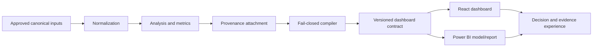
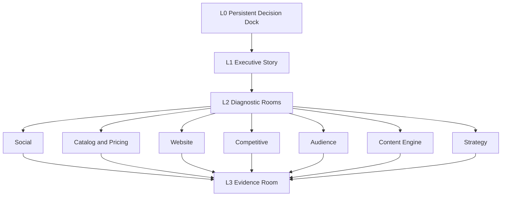

# 12 — Dashboard Bible

> **System:** Dashboard Intelligence Operating System (DIOS)  
> **Repository:** `omarali304ii-byte/Islam-Brain`  
> **Repository baseline:** `44cea987cd42f077cc0f6e448bcdc69f2683ecb1`  
> **DIOS working branch:** `docs/dios-phase-0-inventory`  
> **Bible date:** 2026-07-12  
> **Phase status:** Phase 12 — Complete, awaiting validation  
> **Previous artifacts:** [`00_Project_Inventory.md`](./00_Project_Inventory.md) · [`01_Understanding.md`](./01_Understanding.md) · [`02_Dashboard_Architecture.md`](./02_Dashboard_Architecture.md) · [`03_Design_System.md`](./03_Design_System.md) · [`04_System_Architecture.md`](./04_System_Architecture.md) · [`05_Prompt_Analysis.md`](./05_Prompt_Analysis.md) · [`06_Project_Decisions.md`](./06_Project_Decisions.md) · [`07_Project_Brain.md`](./07_Project_Brain.md) · [`08_Gap_Report.md`](./08_Gap_Report.md) · [`09_Learning_Guide.md`](./09_Learning_Guide.md) · [`10_Design_Principles.md`](./10_Design_Principles.md) · [`11_Best_Practices.md`](./11_Best_Practices.md)  
> **Next phase:** Blocked until this document passes its quality gate

---

## Table of Contents

1. [Phase Entry Decision](#1-phase-entry-decision)
2. [Purpose of the Dashboard Bible](#2-purpose-of-the-dashboard-bible)
3. [Authority, Precedence, and Conflict Rules](#3-authority-precedence-and-conflict-rules)
4. [Status Vocabulary](#4-status-vocabulary)
5. [Executive Product Definition](#5-executive-product-definition)
6. [Product Mission and Outcomes](#6-product-mission-and-outcomes)
7. [Product Non-Goals](#7-product-non-goals)
8. [Current Reality and Intended Product](#8-current-reality-and-intended-product)
9. [Users, Roles, and Decision Jobs](#9-users-roles-and-decision-jobs)
10. [Product Doctrine](#10-product-doctrine)
11. [Scope and Release Tiers](#11-scope-and-release-tiers)
12. [Information Architecture in One View](#12-information-architecture-in-one-view)
13. [Persistent Application Shell](#13-persistent-application-shell)
14. [L0 Decision Dock](#14-l0-decision-dock)
15. [L1 Executive Story](#15-l1-executive-story)
16. [Screen 1 — What Is Happening](#16-screen-1--what-is-happening)
17. [Screen 2 — Why It Is Happening](#17-screen-2--why-it-is-happening)
18. [Screen 3 — Financial Relevance](#18-screen-3--financial-relevance)
19. [Screen 4 — What Must Be Decided](#19-screen-4--what-must-be-decided)
20. [Screen 5 — What Happens Next](#20-screen-5--what-happens-next)
21. [Social Command Center](#21-social-command-center)
22. [Post Explorer](#22-post-explorer)
23. [Creator Directory](#23-creator-directory)
24. [Sentiment, Words, and Verbatims](#24-sentiment-words-and-verbatims)
25. [Catalog and Pricing Room](#25-catalog-and-pricing-room)
26. [Pricing and Value](#26-pricing-and-value)
27. [Product Design Room](#27-product-design-room)
28. [Website and Discoverability Room](#28-website-and-discoverability-room)
29. [Competitive Room](#29-competitive-room)
30. [Audience and Personas Room](#30-audience-and-personas-room)
31. [Content Engine Room](#31-content-engine-room)
32. [Strategy Room](#32-strategy-room)
33. [Evidence Room](#33-evidence-room)
34. [Power BI Page Contract](#34-power-bi-page-contract)
35. [Shared Component Catalog](#35-shared-component-catalog)
36. [Metric and KPI Card Contract](#36-metric-and-kpi-card-contract)
37. [Chart Card Contract](#37-chart-card-contract)
38. [Tables, Lists, and Detail Views](#38-tables-lists-and-detail-views)
39. [Evidence Controls](#39-evidence-controls)
40. [RequiresData and GapPlaceholder Contract](#40-requiresdata-and-gapplaceholder-contract)
41. [Application-State Model](#41-application-state-model)
42. [Navigation and Wayfinding](#42-navigation-and-wayfinding)
43. [Filters and Comparison Controls](#43-filters-and-comparison-controls)
44. [Interactions, Drill-Downs, and Modals](#44-interactions-drill-downs-and-modals)
45. [URL, Share, Export, and Print Behavior](#45-url-share-export-and-print-behavior)
46. [Responsive Design Contract](#46-responsive-design-contract)
47. [Arabic, English, RTL, and Mixed-Direction Contract](#47-arabic-english-rtl-and-mixed-direction-contract)
48. [Accessibility Contract](#48-accessibility-contract)
49. [Visual Design System](#49-visual-design-system)
50. [Color Semantics](#50-color-semantics)
51. [Typography, Spacing, Layout, Icons, and Motion](#51-typography-spacing-layout-icons-and-motion)
52. [Media and Creative Contract](#52-media-and-creative-contract)
53. [Content and Microcopy Contract](#53-content-and-microcopy-contract)
54. [Evidence and Confidence Model](#54-evidence-and-confidence-model)
55. [Data-Domain Model](#55-data-domain-model)
56. [Metric Contract Model](#56-metric-contract-model)
57. [Canonicality, Versioning, and Freshness](#57-canonicality-versioning-and-freshness)
58. [Compiler and Dashboard-Data Contract](#58-compiler-and-dashboard-data-contract)
59. [React Presentation Contract](#59-react-presentation-contract)
60. [Power BI Presentation Contract](#60-power-bi-presentation-contract)
61. [Security, Privacy, Access, and Rights](#61-security-privacy-access-and-rights)
62. [Permission and Side-Effect Model](#62-permission-and-side-effect-model)
63. [Performance and Technical Quality](#63-performance-and-technical-quality)
64. [Testing and Acceptance Strategy](#64-testing-and-acceptance-strategy)
65. [Observability, Freshness, and Incident Behavior](#65-observability-freshness-and-incident-behavior)
66. [Build, Release, and Deployment Contract](#66-build-release-and-deployment-contract)
67. [Governance, Ownership, and Change Propagation](#67-governance-ownership-and-change-propagation)
68. [Definition of Ready](#68-definition-of-ready)
69. [Definition of Done](#69-definition-of-done)
70. [Unresolved Product Decisions](#70-unresolved-product-decisions)
71. [Forbidden Shortcuts and Anti-Patterns](#71-forbidden-shortcuts-and-anti-patterns)
72. [Traceability Matrix](#72-traceability-matrix)
73. [Dashboard Bible Validation Gate](#73-dashboard-bible-validation-gate)
74. [Glossary](#74-glossary)
75. [Document Control](#75-document-control)

---

## 1. Phase Entry Decision

Phase 11 was complete but awaiting owner validation. On 2026-07-12, the repository owner explicitly instructed DIOS to proceed with **Phase 12**.

This is recorded as:

- **Phase 11 acceptance:** Accepted by owner with all documented best-practice limitations and the truthful maturity placement at the documented stage.
- **Authorized work:** Consolidate the complete dashboard product specification into one authoritative Dashboard Bible.
- **Forbidden work:** Do not build or redesign the dashboard, choose React or Power BI launch priority, select canonical datasets, resolve metric formulas, invent design tokens, ingest client data, reuse media, scrape, spend, generate production creative, or deploy.
- **Evidence limitation:** The confirmed repository still does not contain a runnable React dashboard, Power BI file, compiler, authentication implementation, deployment configuration, or production validation proof.

> [!IMPORTANT]
> The Bible defines what the dashboard must mean and how it must behave when implemented. It is not evidence that the dashboard currently exists.

---

## 2. Purpose of the Dashboard Bible

The Dashboard Bible is the product-level source of truth for future dashboard design, implementation, review, and prompt generation.

It consolidates:

- Product purpose and user decisions
- Information architecture
- React surfaces
- Power BI page mapping
- Page and room contracts
- Shared components
- Metrics and evidence behavior
- Data and compiler boundaries
- Design semantics
- Accessibility, RTL, responsive, and content requirements
- Privacy, rights, permission, and release rules
- Acceptance criteria
- Known unresolved decisions

### 2.1 What it replaces

It reduces the need to reconstruct dashboard intent from many separate files.

### 2.2 What it does not replace

It does not replace:

- Raw evidence
- Canonical dataset manifest
- Source Registry
- Metric Registry
- Project Decisions
- Gap Report
- Project Brain
- React source code
- Power BI semantic model or `.pbix`
- Compiler schemas and implementation
- Stakeholder approvals
- Test and deployment evidence

### 2.3 Intended consumers

- Product owner
- Executive sponsor
- Analyst
- Dashboard/UX designer
- Frontend engineer
- Power BI developer
- Data/compiler engineer
- AI coding agent
- Prompt engineer
- Privacy/security reviewer
- QA/accessibility reviewer
- Future Phase 13 Master Prompt

---

## 3. Authority, Precedence, and Conflict Rules

The Bible is the authoritative **product specification**, but it cannot overrule higher-authority truth, decisions, law, rights, or permissions.

### 3.1 Precedence

```text
Law, privacy, rights, and explicit permission
→ Latest owner-approved decision
→ Canonical raw/derived evidence and approved definitions
→ Phase 6 Project Decisions
→ Phase 10 Design Principles
→ Phase 11 Best Practices
→ Phase 12 Dashboard Bible
→ Specialist implementation specifications
→ Design or engineering preference
```

### 3.2 Conflict resolution

When the Bible conflicts with:

- **Raw evidence:** evidence governs factual claims.
- **Approved decision:** the decision governs and the Bible must be updated.
- **Metric Registry:** the approved registry governs formulas and targets.
- **Canonical manifest:** the manifest governs dataset versions.
- **Privacy or rights requirement:** the stricter lawful requirement governs.
- **React or Power BI limitation:** semantic meaning must remain stable; implementation technique may differ.

### 3.3 No silent resolution

The Bible preserves contradictions rather than selecting the most convenient answer.

---

## 4. Status Vocabulary

Every surface, component, metric, and behavior must use one of these statuses.

| Status | Meaning |
|---|---|
| **CONFIRMED_CURRENT** | Direct implementation or artifact is confirmed in the repository. |
| **SPECIFIED** | Required or described by approved documentation; implementation is not confirmed. |
| **DATA_SUPPORTED** | Relevant data exists, subject to canonicality and quality limitations. |
| **PARTIAL** | Some data or specification exists, but important capability is missing. |
| **REQUIRES_DATA** | Cannot show a real value until an identified input is acquired. |
| **REQUIRES_DECISION** | Product behavior depends on an unresolved owner/client/founder decision. |
| **REQUIRES_PERMISSION** | Action or data requires explicit approval. |
| **FOUNDER_GATED** | Claim or media depends on founder confirmation. |
| **CLIENT_GATED** | Requires client-owned data or approval. |
| **UNVERIFIED** | May exist elsewhere but is not confirmed. |
| **NOT_IMPLEMENTED** | Specification exists; implementation proof does not. |
| **DROPPED** | Explicitly not active; must not be revived silently. |
| **FORBIDDEN** | Must not be implemented under current rules. |

### 4.1 Status display rule

Client-facing surfaces should use plain-language labels. Operator and evidence surfaces may show controlled status codes.

---

## 5. Executive Product Definition

The intended product is:

> An evidence-governed, mostly read-only decision command center that helps Cielito leadership and WOM move from business verdict to diagnosis, action, monitoring, and source evidence without hiding uncertainty or missing data.

### 5.1 Product category

- Decision-intelligence dashboard
- Executive command center
- Diagnostic analytical product
- Evidence browser
- Client-facing agency capability showcase

### 5.2 Product form

Two presentation targets are specified:

1. React web dashboard
2. Power BI report

Launch priority remains unresolved.

### 5.3 Delivery model

The available architecture implies a compile-time or build-time snapshot product rather than a live transactional platform.

### 5.4 Transactional status

No confirmed write-back, order management, content scheduling, annotation, client upload, or workflow transition is specified for the initial dashboard.

“Living” therefore means refreshable, evidence-linked, decision-aware, and versioned—not necessarily transactional.

---

## 6. Product Mission and Outcomes

### 6.1 Product mission

Give leadership a reliable understanding of:

- What is happening
- Why it is happening
- What must be decided
- What evidence supports the conclusion
- What data is missing
- What action happens next
- What must be monitored

### 6.2 Business mission

Help Cielito convert existing brand equity, audience attention, creator activity, catalog strength, and customer interest into a stronger owned growth and conversion engine.

### 6.3 Accepted decision sequence

1. Install a WhatsApp ordering bridge.
2. Clean catalog information and use Arabic-first owned content.
3. Formalize creators into a repeatable system.
4. Improve mobile performance before scaling paid acquisition.
5. Use client data to establish financial baselines.

### 6.4 Trust outcome

A user must be able to distinguish:

- Measured fact
- Derived value
- Interpretation
- Recommendation
- Approved decision
- Hypothesis
- Missing data
- Unverified implementation

### 6.5 Agency outcome

Demonstrate that WOM can deliver an evidence-linked operating system rather than a generic report.

### 6.6 Success is not yet fully defined

Business and product acceptance targets remain unresolved and require owner/client decisions.

---

## 7. Product Non-Goals

Unless separately approved, the first product is not:

- A CRM
- An order-management system
- A content scheduler
- A social publishing platform
- A live scraping console
- A creator-contract platform
- A customer-data warehouse
- A financial accounting system
- A real-time attribution platform
- A multi-tenant SaaS product
- A public sustainability-claim portal
- A replacement for source evidence
- A place where AI may autonomously approve spending or deployment

### 7.1 Non-goal rule

A capability does not enter scope merely because the architecture could support it later.

---

## 8. Current Reality and Intended Product

### 8.1 Current confirmed reality

- Local file-based evidence estate
- Python collection and analysis scripts
- JSON, Markdown, YAML, HTML, TXT, XML, JPG, PDF, and PPTX artifacts
- Source registry and evidence logs
- Derived intelligence
- Executive reports and dashboard specifications
- Manual/external orchestration references

### 8.2 Not confirmed

- React application
- Power BI `.pbix`
- `build_cielito_data.py`
- Central schema registry
- Canonical manifest
- Metric Registry
- Backend/API
- Database
- Authentication
- CI/CD
- Hosting
- Monitoring
- Rollback

### 8.3 Intended product flow



### 8.4 Trust boundary

The presentation layer must not decide whether a claim is safe. That decision belongs to canonical definitions and the compiler.

---

## 9. Users, Roles, and Decision Jobs

### 9.1 Executive / founder / sponsor

**Primary questions:**

- What is the verdict?
- What must be decided now?
- Why?
- What is the financial relevance?
- What remains unknown?
- Who owns the next action?

**Needs:**

- Fast orientation
- Limited but meaningful KPIs
- Clear caveats
- Decision status
- Next actions

### 9.2 Marketer / operator

**Primary questions:**

- Which platforms, formats, languages, creators, and themes work?
- What should owned content do differently?
- Which products, prices, or catalog issues matter?
- What should be activated next?

### 9.3 Analyst / evidence reviewer

**Primary questions:**

- What is the source?
- What population and grain are used?
- What is the formula?
- What is the sample and window?
- How confident is the claim?
- Can it be reproduced?

### 9.4 Product owner

**Primary questions:**

- Which user decision does the feature support?
- Is it in scope?
- What blocks it?
- What proves acceptance?

### 9.5 Developer / BI engineer

**Primary questions:**

- What contract is authoritative?
- What states must be implemented?
- What can fail?
- What is allowed to be calculated in presentation?
- What parity is required?

### 9.6 Privacy / legal / rights reviewer

**Primary questions:**

- What personal or client data is displayed?
- Is reuse permitted?
- What claims require authority?
- What retention and deletion rules apply?

---

## 10. Product Doctrine

The dashboard must follow these rules:

1. Truth before polish.
2. Decisions before dashboards.
3. Definitions before calculations.
4. Canonical contracts before implementation.
5. Missing data remains visible.
6. Evidence travels with claims.
7. One question per chart.
8. Progressive disclosure over chart dumping.
9. Real media requires real rights.
10. Permission before side effects.
11. Validation before publication or deployment.
12. Implementation proof before status claims.
13. Executive simplicity must not erase evidence.
14. React and Power BI may differ visually but not semantically.
15. The dashboard must not make unsupported financial, founder, sustainability, security, or legal claims.

---

## 11. Scope and Release Tiers

This section describes specification tiers, not an approved release plan.

### 11.1 Tier A — Executive decision spine

- Persistent Decision Dock
- Five-screen executive story
- Financial honesty / RequiresData
- Priority decisions
- Watch-list metrics
- Evidence access

**Status:** Specified. Inclusion in first release is likely central but still requires approved MVP scope.

### 11.2 Tier B — Data-supported diagnostic rooms

- Social Command Center
- Post Explorer
- Sentiment and Verbatims
- Catalog and Pricing
- Website and Discoverability
- Evidence Room

**Status:** Specified and materially data-supported, subject to canonicality, metric, rights, and model-quality gaps.

### 11.3 Tier C — Partial or gap-heavy rooms

- Creator Directory
- Product Design
- Competitive
- Audience and Personas
- Content Engine
- Strategy

**Status:** Specified but partial, missing core artifacts, or RequiresData.

### 11.4 Tier D — Future operational capabilities

- Live refresh
- Editing Decision Dock
- Saved views
- Alerts
- Client upload
- Workflow actions
- Content scheduling
- Order/CRM operations
- Multi-user collaboration

**Status:** Not approved for initial product.

### 11.5 Release rule

No tier becomes MVP scope until the product owner approves target, pages, users, access, exclusions, and acceptance criteria.

---

## 12. Information Architecture in One View



### 12.1 User journey

```text
Verdict → Why → Decision → Diagnosis → Evidence
```

### 12.2 Layer contract

| Layer | Purpose | Primary user | Evidence density |
|---|---|---|---|
| L0 | Persistent orientation and decision truth | Executive, marketer | Compact |
| L1 | Complete business story | Executive | Moderate |
| L2 | Domain diagnosis | Marketer, analyst, operator | High |
| L3 | Proof, sources, caveats, gaps | Analyst, reviewer, developer | Maximum |

### 12.3 Maximum-depth rule

A load-bearing claim should reach its evidence within two meaningful interactions.

---

## 13. Persistent Application Shell

### 13.1 Required shell regions

- Application identity / Cielito 360 label
- Decision Dock
- Primary navigation
- Current room title
- Global context controls where approved
- Main content canvas
- Evidence/detail layer
- Build/data freshness metadata

### 13.2 Shell status

The exact navigation form, layout measurements, and coded behavior are unresolved.

### 13.3 Shell responsibilities

- Preserve orientation
- Show current location
- Expose active filters
- Provide direct evidence access
- Show stale/blocked/system states
- Support Arabic/English direction
- Avoid consuming excessive mobile space

### 13.4 Shell anti-patterns

- Hidden global filter state
- Decision Dock with no version or review date
- Navigation labels that reflect internal file names
- Evidence buried in a separate unrelated application
- Mobile layout that simply shrinks desktop

---

## 14. L0 Decision Dock

### 14.1 Purpose

Keep the operating thesis visible while users move through analytical rooms.

### 14.2 Required content

- Verdict headline
- Three load-bearing decisions
- Financial honesty chip
- North-star metric or unresolved state
- Watch-list metrics
- Decision version/date
- Decision status

### 14.3 Current specified decisions

1. WhatsApp ordering bridge
2. Catalog cleanup and Arabic-first content
3. Repeatable creator system

Additional sequence items:

- Mobile repair before paid scale
- Client-data financial baselining

### 14.4 Required states

- Current
- Review due
- Superseded
- Partially implemented
- Blocked
- Requires owner/client/founder action

### 14.5 Evidence behavior

Clicking the verdict or a decision should open:

- Supporting evidence
- Decision record
- Owner/approver if known
- Dependencies
- Implementation status
- Review condition

### 14.6 Unresolved behavior

- Editable versus read-only
- Who may edit
- Approval workflow
- Whether dock is persistent on mobile
- Exact north-star metric

### 14.7 Acceptance

The dock must never imply that an accepted decision is implemented unless implementation proof is linked.

---

## 15. L1 Executive Story

The executive story is a five-screen narrative.

| Screen | Core question | Primary outcome |
|---|---|---|
| 1 | What is happening? | Establish audience strength and owned/earned performance problem |
| 2 | Why is it happening? | Explain language, conversion, identity, and operational gaps |
| 3 | What is the financial relevance? | Show honest missing financial baselines and unlock path |
| 4 | What must be decided? | Present priority choices and dependencies |
| 5 | What happens next? | Show sequenced actions, owners, gaps, and monitoring |

### 15.1 Story rules

- Every screen must have one executive question.
- Every claim must disclose evidence state.
- Every screen must end with a decision or next-step meaning.
- No screen should depend on reading all diagnostic rooms.
- No dramatic metric may bypass the Metric Registry.

---

## 16. Screen 1 — What Is Happening

### 16.1 Question

Why does a brand with meaningful audience and earned attention show weak owned-channel performance?

### 16.2 Intended widgets

- Instagram audience snapshot
- Owned-post baseline
- Owned-versus-earned comparison
- Source/sample/window footer
- Caveat or metric-gap banner where required

### 16.3 Required evidence

- Canonical owned population
- Canonical earned population
- Defined aggregation
- Platform scope
- Capture window
- Source IDs
- Sample size

### 16.4 `~190×` rule

The `~190×` claim must not appear as a canonical median-to-median KPI until numerator, denominator, aggregation, population, platform, and window are approved and reproducible.

Allowed interim behaviors:

- Exclude the ratio
- Show a caveated peak-versus-median comparison with explicit labels
- Show distributions without a governed ratio
- Render a metric-definition gap

### 16.5 Visual guidance

If values span orders of magnitude:

- Use a clearly labeled logarithmic scale
- Use a distribution plot
- Use a callout with explicit aggregation
- Avoid a misleading linear bar that makes smaller values unreadable

### 16.6 Acceptance

A user must understand both the performance contrast and exactly how the comparison was calculated.

---

## 17. Screen 2 — Why It Is Happening

### 17.1 Intended diagnostic themes

- Language-performance split
- Conversion-path gap
- Owned identity/voice drift
- Creator/earned-content strength
- Website/mobile friction
- Supporting verbatims

### 17.2 Language contract

The current evidence suggests English-heavy owned content and at least one strong Arabic example. This is not enough to establish a universal causal language effect.

The dashboard must show:

- Sample by language
- Classification rule
- Platform
- Format/creator confounders
- Capture window
- Caveat

### 17.3 Funnel contract

Without real event data, the audience-to-purchase sequence is a **conceptual diagnostic funnel**, not a measured funnel.

It must be labeled accordingly.

### 17.4 Identity-drift contract

Narrative diagnosis must link to:

- Caption examples
- Language mix
- Brand/positioning artifacts
- Founder-gated unknowns

### 17.5 Acceptance

The screen may explain plausible drivers but must not claim causality without controlled evidence.

---

## 18. Screen 3 — Financial Relevance

### 18.1 Purpose

Connect the strategy to financial questions without fabricating revenue impact.

### 18.2 Initial state

The following are client-data dependent:

- Revenue
- Orders
- Average order value
- Conversion rate
- Return rate
- Customer acquisition cost
- Repeat purchase rate
- Margin
- WhatsApp-to-order rate

### 18.3 Required presentation

Each unavailable metric must show:

- “To be baselined” or equivalent
- Required source
- Why it matters
- Data owner/request status
- Privacy/access status
- Decision it unlocks

### 18.4 Scenario contract

A scenario must not be shown until methodology defines:

- Baseline
- Assumptions
- Time horizon
- Conversion logic
- Costs
- Sensitivity
- Confidence
- Owner approval

### 18.5 Forbidden behavior

- Unknown as zero
- Invented revenue range
- ROI inferred from social attention alone
- Scenario presented as forecast

---

## 19. Screen 4 — What Must Be Decided

### 19.1 Purpose

Convert diagnosis into a bounded decision agenda.

### 19.2 Required decision card fields

- Decision title
- Status
- Why now
- Evidence
- Alternatives
- Dependencies
- Owner
- Approver
- Cost/permission level
- Risks
- Reopen/review condition
- Implementation state

### 19.3 Decision categories

- Accepted
- Pending approval
- Client required
- Founder gated
- Deferred
- Dropped
- Superseded
- Unresolved

### 19.4 Priority sequence

The accepted sequence may be shown, but each item must display whether it is:

- Accepted only
- In progress
- Implemented
- Validated
- Blocked

### 19.5 Acceptance

A user must not confuse “recommended,” “approved,” and “implemented.”

---

## 20. Screen 5 — What Happens Next

### 20.1 Purpose

Show the executable path from decision to monitored action.

### 20.2 Required elements

- Sequenced action groups
- Owners and approvers where known
- Dependencies
- Gap IDs
- Data requirements
- Permission level
- Timing/horizon state
- Monitoring metric
- Review condition

### 20.3 Horizon conflict

The 60-day versus 90-day conflict must remain visible until resolved or structured as nested plans.

### 20.4 Roadmap status

Phase 14 will define the final roadmap. This screen may display existing sequence and controlled next steps, not invent Phase 14 outcomes.

### 20.5 Acceptance

Every action must have a measurable exit condition or be clearly marked as awaiting definition.

---

## 21. Social Command Center

### 21.1 Purpose

Diagnose owned and earned social performance across platform, language, format, creator, content, and customer response.

### 21.2 Core questions

- How does owned performance compare with earned/creator performance?
- Which formats and languages perform best?
- Which creators and posts drive attention?
- What does customer language reveal?
- Is the signal current and representative?

### 21.3 Required modules

- Social overview KPIs
- Owned versus earned distribution
- Platform comparison
- Language split
- Format/content analysis
- Top and bottom posts
- Creator contribution
- Sentiment and intent summary
- Data quality/sample panel

### 21.4 Filters

Potential filters:

- Platform
- Ownership class
- Language
- Format
- Creator
- Date/capture window
- Content pillar
- Sentiment

Exact filter set remains subject to canonical schemas and MVP scope.

### 21.5 Critical gaps

- Conflicting post populations
- Views/reach/plays normalization
- Owned engagement-rate definition
- UGC velocity definition
- Creator population definitions
- Sentiment model quality

### 21.6 Acceptance

No social metric may combine platforms or generations without explicit normalization and disclosure.

---

## 22. Post Explorer

### 22.1 Purpose

Allow row-level inspection of individual social posts and their evidence.

### 22.2 Required columns/fields where available

- Post ID
- Platform
- Ownership class
- Creator/handle
- Date
- Caption excerpt
- Language
- Format
- Views/plays/reach/impressions as separate fields
- Likes
- Comments
- Engagement measure
- Product/theme/pillar tags
- Media thumbnail
- Public URL
- Source ID
- Capture window
- Model/classification metadata

### 22.3 Interactions

- Sort
- Filter
- Search
- Open post detail
- Open source/evidence
- Compare selected posts
- Export only if approved

### 22.4 Media rule

A thumbnail may appear only when local asset provenance and display rights are acceptable.

### 22.5 Acceptance

The explorer must disclose the exact source population and active filters so screenshots cannot be misread out of context.

---

## 23. Creator Directory

### 23.1 Purpose

Understand creator contribution, relationship type, content impact, and program opportunity.

### 23.2 Current status

Partial. Creator population definitions conflict and economics/rights data are incomplete.

### 23.3 Required fields

- Stable creator ID
- Public handle/name subject to privacy policy
- Platform
- Relationship classification
- Number of captured posts
- Performance distributions
- Product/theme relevance
- Rights/permission status
- Attribution status
- Cost/economic fields only when approved data exists
- Source and window

### 23.4 Relationship categories require approval

Possible categories include organic, gifted, paid, affiliate, ambassador, or unknown. The Bible does not approve these values as current truth.

### 23.5 Forbidden behavior

- Ranking creators as commercial partners from public performance alone
- Displaying contact/private data without authority
- Reusing content without rights
- Treating 12, 34, or 63 creator references as canonical without a manifest

---

## 24. Sentiment, Words, and Verbatims

### 24.1 Purpose

Expose customer language, sentiment, purchase-intent signals, objections, compliments, and product themes.

### 24.2 Required separation

- Raw verbatim
- Normalized text
- Model sentiment
- Fallback sentiment
- Rule-based intent
- Human-coded theme
- Derived aggregate

### 24.3 Required metadata

- Source ID
- Platform/content context
- Capture window
- Dataset generation
- Engine/model/version
- Fallback state
- Confidence
- Language
- PII/handle handling state

### 24.4 Current caveats

- Conflicting populations: 254, 964, and 1,050
- Validation context may reference another brand
- Arabic substring rules can produce false positives
- Handles and exact comments are not fully anonymized

### 24.5 Display rules

- Do not present model scores as direct customer truth.
- Label small samples.
- Preserve Arabic verbatim accurately.
- Provide English gloss only when useful and clearly translated.
- Minimize or pseudonymize identifiers for client-facing surfaces.

### 24.6 Acceptance

A reviewer must be able to identify whether every aggregate came from model, rule, fallback, or human coding.

---

## 25. Catalog and Pricing Room

### 25.1 Purpose

Understand assortment, product structure, price architecture, discounts, availability, sizes/options, and catalog hygiene.

### 25.2 Core questions

- What is sold?
- At what prices?
- How broadly is discounting used?
- What is available?
- Are product and option definitions reliable?
- Which catalog issues harm conversion or analysis?

### 25.3 Required modules

- Catalog overview
- Price distribution
- Product-type/category mix
- Discount distribution
- Availability state
- Product/variant/SKU model
- Option/type data-quality panel
- Hygiene gap list
- Product explorer

### 25.4 P0 grain rule

Product, variant, and SKU must not be used interchangeably.

Every table must state its grain.

### 25.5 Option rule

Generic `option1` values must not be treated as sizes without typed parsing and validation.

### 25.6 Catalog hygiene

No composite hygiene score may appear until its components, weights, thresholds, source, and owner are approved.

### 25.7 Acceptance

Counts, prices, availability, and discount measures must identify whether they apply to products, variants, or SKUs.

---

## 26. Pricing and Value

### 26.1 Purpose

Explain Cielito’s price architecture, discount behavior, value communication, and competitive positioning.

### 26.2 Required modules

- Price bands
- Median/percentile distribution
- Discount depth and prevalence
- Category/product-type comparison
- Full-price versus discounted mix
- Value-story evidence
- Competitive price comparison when approved
- Client-only margin or profitability RequiresData

### 26.3 Metric requirements

- Currency contract
- Capture date
- Product/SKU grain
- List versus sale price definition
- Outlier handling
- Availability filter
- Category normalization

### 26.4 Forbidden behavior

- Calling high price “premium” without positioning evidence
- Treating discount share as harmful without context
- Publishing margin or profitability from storefront prices alone

---

## 27. Product Design Room

### 27.1 Purpose

Analyze product visual language, material cues, silhouettes, colors, construction, and merchandising presentation.

### 27.2 Current status

Partially data-supported. Exact design taxonomy and rights-safe media use remain incomplete.

### 27.3 Possible modules

- Product imagery grid
- Silhouette/type distribution
- Color/material themes
- Seasonal/contextual grouping
- Craft/detail examples
- Design-language narrative
- Evidence links

### 27.4 Rules

- Real media first with rights/provenance.
- Do not infer unconfirmed materials from appearance alone.
- Founder/material/sustainability claims remain gated.
- Synthetic concept images must be labeled and separated from actual catalog evidence.

---

## 28. Website and Discoverability Room

### 28.1 Purpose

Diagnose mobile performance, technical readiness, search/discoverability, and conversion friction.

### 28.2 Data-supported modules

- PageSpeed/mobile snapshot
- Core performance measures where captured
- Agent-readiness audit
- SEO/discoverability findings
- Conversion-path observations
- Technical issue list

### 28.3 Snapshot rule

A PageSpeed or audit capture is a point-in-time observation, not a persistent current state.

### 28.4 Mobile decision

The accepted strategy says mobile performance should improve before paid scale. The dashboard must distinguish:

- Accepted decision
- Current measured baseline
- Target if approved
- Implementation status
- Validation date

### 28.5 Forbidden behavior

- “Security clean” as broad certification
- Trend language from one audit
- Generic target such as 55→80 unless the metric and target are approved in the Metric Registry

---

## 29. Competitive Room

### 29.1 Purpose

Place Cielito’s pricing, content, creator activity, website, product, and positioning in competitive context.

### 29.2 Current status

Mostly RequiresData and route-dependent.

### 29.3 Required controls

- Approved competitor set
- Comparable time window
- Comparable platform/metric definitions
- Source and rights treatment
- Cost and permission state
- Evidence-grade labels

### 29.4 Data routes

Pending routes include competitive social, follower-quality, catalog/price, Facebook/Ads Library, and creator expansion. No route is approved merely because it appears in this Bible.

### 29.5 Dropped route

Noon review collection is dropped and must not be represented as active work.

### 29.6 Acceptance

Blocked or uncollected competitive evidence must display as a gap, not as competitor absence.

---

## 30. Audience and Personas Room

### 30.1 Purpose

Describe audience needs, contexts, language, motivations, objections, and market segments.

### 30.2 Current status

Partly referenced; several core persona/market artifacts are unavailable or client/survey dependent.

### 30.3 Evidence levels

Personas must distinguish:

- Observed behavior
- Verbatim-supported need
- Derived segment
- Research hypothesis
- Client-declared audience
- Survey result

### 30.4 Forbidden behavior

- Inventing demographic percentages
- Presenting persona fiction as measured population
- Inferring private audience data from public posts

---

## 31. Content Engine Room

### 31.1 Purpose

Turn evidence into content pillars, formats, language rules, creator integration, calendar concepts, and measurement.

### 31.2 Current status

Referenced and partially specified; core artifacts and final operating standard are incomplete.

### 31.3 Required modules

- Content pillars
- Language strategy
- Format mix
- Creator/UGC integration
- Product focus
- Seasonal moments
- Idea backlog
- Calendar view
- Measurement rules
- Rights and asset state

### 31.4 Arabic-first rule

Arabic-first is accepted direction, but exact percentage, channels, dialect, bilingual pattern, and approval workflow remain unresolved.

### 31.5 Calendar rule

A proposed calendar is not operational commitment until owners, assets, rights, dates, and approval exist.

---

## 32. Strategy Room

### 32.1 Purpose

Show positioning, diagnosis, objectives, decision sequence, risks, and strategic unknowns.

### 32.2 Current status

Specified, but `strategy.json` is not confirmed.

### 32.3 Required modules

- Strategic verdict
- Accepted decisions
- Positioning statement/status
- Message house/status
- Objectives and monitoring
- Founder-gated questions
- Client-gated questions
- Risks and assumptions
- Decision history/supersession

### 32.4 Founder-gated content

- Fruit-leather status
- Founder narrative
- Final tagline
- Second-domain purpose
- Final positioning wording

These must remain visibly gated.

---

## 33. Evidence Room

### 33.1 Purpose

Allow skeptical review of every governed claim.

### 33.2 Required objects

- Source record
- Dataset record
- Metric record
- Claim record
- Gap record
- Decision record
- Collection route record
- Media provenance record
- Build/validation record

### 33.3 Required source fields

- Source ID
- Source class
- Location/URL/path
- Capture date/window
- Dataset/run version
- Grade/confidence
- Rights/privacy state
- Owner
- Notes/limitations
- Related claims

### 33.4 Required interactions

- Search by ID, file, claim, metric, or room
- Open source detail
- Open related claim
- Open related gap
- Open decision supported
- View generation/version
- View correction/supersession status

### 33.5 Client-safe layering

Client surfaces may use plain-language evidence labels. Full operator metadata should be available only to authorized users.

### 33.6 Acceptance

A claim without valid evidence linkage must not render as governed truth.

---

## 34. Power BI Page Contract

Power BI compresses the React navigation model into eight pages.

| Power BI page | React/Bible coverage |
|---|---|
| Executive Summary | Decision Dock + five-screen executive spine |
| Social Command Center | Social overview, posts, creators, language, sentiment |
| Content & Calendar | Content Engine and creator activation |
| Catalog & Pricing | Catalog, pricing, value, design |
| Website & Discoverability | Website, performance, SEO, agent readiness |
| Competitive | Competitive room |
| Audience & Market | Audience, personas, market context |
| Evidence & Confidence | Evidence Room, gaps, source and confidence |

### 34.1 Semantic parity

Power BI and React must share:

- Metric IDs and formulas
- Dataset versions
- Source IDs
- Evidence states
- Missing-data states
- Decision status meaning
- Color semantics
- Caveat language

### 34.2 Allowed differences

- Navigation pattern
- Interaction depth
- Visual layout
- Tooltips
- Export behavior
- Target-specific chart implementation

### 34.3 Unresolved

- Which target launches first
- Workspace/licensing
- Refresh model
- RLS
- Export policy
- Theme implementation

---

## 35. Shared Component Catalog

### 35.1 Executive components

- Decision Dock
- Verdict banner
- Decision card
- Financial honesty chip
- Watch-list strip
- Action sequence

### 35.2 Analytical components

- KPI card
- Chart card
- Comparison card
- Distribution card
- Table/explorer
- Source snippet
- Verbatim card
- Media card
- Filter bar
- Detail drawer/modal

### 35.3 Governance components

- Evidence footer
- Confidence badge
- Sample/window label
- Status chip
- RequiresData card
- GapPlaceholder
- Permission/cost card
- Stale-data banner
- Build/data-version panel

### 35.4 Required states for every applicable component

- Loading
- Ready
- Zero
- Missing
- RequiresData
- Blocked
- Partial
- Stale
- Error
- Unauthorized
- Superseded
- Unverified

### 35.5 Component rule

A component is not complete when only its ideal-data state is designed.

---

## 36. Metric and KPI Card Contract

Every governed metric card should include:

```yaml
metric_id: ""
label: ""
value: null
unit: ""
status: "available | requires_data | blocked | stale | invalid | unverified"
comparison: null
aggregation: ""
population: ""
grain: ""
sample_size: null
capture_window: ""
source_ids: []
confidence: ""
caveat: ""
target: null
owner: ""
updated_at: ""
```

### 36.1 Visible anatomy

- Insight-led label
- Value or honest state
- Unit
- Comparison only when defined
- Source/sample/window/confidence footer
- Caveat or gap control

### 36.2 Gauge rule

A gauge requires an approved target and threshold logic. Otherwise use a neutral value card or distribution.

### 36.3 Zero rule

Zero is allowed only when the source measured zero. Unknown, missing, blocked, and not applicable are separate states.

---

## 37. Chart Card Contract

Every chart card must answer one business question.

### 37.1 Required anatomy

- Insight title
- Business question or subtitle
- Chart
- Explanation / “So what?”
- Source/sample/window/confidence
- Caveat
- Evidence interaction

### 37.2 Required metadata

- Metric IDs
- Dimension IDs
- Filters
- Aggregation
- Dataset version
- Chart status

### 37.3 Chart-selection rules

- Time change → line/area only with true time series
- Category comparison → bar/dot
- Distribution → histogram/box/violin where supported
- Relationship → scatter
- Composition → stacked bar; limited use of donut
- Flow → funnel only with measured stages; otherwise conceptual diagram
- Precise inspection → table

### 37.4 Forbidden chart behaviors

- Unlabeled log scale
- Truncated axis used to exaggerate
- Donut for many precise comparisons
- Trend language from snapshots
- Decorative color without meaning
- Peak-versus-median labeled as equivalent aggregation

---

## 38. Tables, Lists, and Detail Views

### 38.1 Table requirements

- Declared grain
- Stable row identity
- Sort state
- Filter state
- Pagination/virtualization decision
- Empty/missing/error states
- Accessible headers
- Mobile alternative
- Source/evidence access

### 38.2 Detail view requirements

- Entity identity
- Key metrics
- Context
- Source/version
- Related evidence
- Related decisions/gaps
- Rights/privacy treatment

### 38.3 Export rule

Exports must preserve active filters, dataset/metric versions, capture window, evidence metadata, and caveats.

---

## 39. Evidence Controls

### 39.1 Evidence footer

Minimum visible fields:

- Source or source count
- `n`
- Window/date
- Confidence/evidence state

### 39.2 Evidence detail

May include:

- Source IDs
- Dataset version
- Method
- Formula
- Model/fallback
- Rights/privacy
- Limitations
- Related gap

### 39.3 Confidence display

Color alone is insufficient. Use text and optionally icon/pattern.

### 39.4 Evidence interaction

Evidence controls must be keyboard reachable and should preserve the chart/filter context that led to the claim.

---

## 40. RequiresData and GapPlaceholder Contract

### 40.1 Purpose

Represent unavailable information honestly and provide a route forward.

### 40.2 Required fields

```yaml
state: "requires_data | requires_decision | requires_permission | blocked"
missing_item: ""
why_it_matters: ""
required_source: ""
route_id: null
permission_status: ""
estimated_cost: null
owner: ""
blocks: []
next_action: ""
```

### 40.3 Visual treatment

- Distinct from zero and error
- Orange/dashed semantic direction
- Text label required
- Action route only when authorized

### 40.4 Forbidden behavior

- Realistic fake series
- “No data” when collection failed
- Auto-running a route from a client-facing card
- Hiding cost, privacy, or permission requirements

---

## 41. Application-State Model

### 41.1 Data states

- Available
- Zero
- Missing
- Partial
- Stale
- Invalid
- Superseded
- RequiresData

### 41.2 System states

- Loading
- Ready
- Error
- Offline/unavailable
- Build failed
- Unauthorized
- Maintenance

### 41.3 Governance states

- Approved
- Pending
- Blocked
- Founder gated
- Client gated
- Deferred
- Dropped
- Superseded
- Unverified

### 41.4 State priority

Safety and truth states override visual completeness. Example: stale or invalid data must not render as a normal available metric.

---

## 42. Navigation and Wayfinding

### 42.1 Specified destinations

- Command
- Social
- Catalog & Pricing
- Website
- Competitive
- Audience
- Content Engine
- Strategy
- Evidence

### 42.2 Required behavior

- Current location visible
- Direct room access
- Back/history behavior
- Deep links where appropriate
- Evidence within two interactions
- Active filter visibility
- Bilingual labels when enabled

### 42.3 Exact component unresolved

- Sidebar
- Top navigation
- Tabs
- Hybrid

### 42.4 Mobile rule

The persistent shell may collapse, but verdict, active context, and evidence access must remain available.

---

## 43. Filters and Comparison Controls

### 43.1 Filter levels

- Global
- Room-level
- Component-level
- Comparison selection

### 43.2 Global candidates

- Language
- Platform
- Date/capture window
- Dataset generation if operator-only

### 43.3 Filter disclosure

Every chart/table must reveal the active population. Hidden filters are forbidden for exported or screenshotted analytical views.

### 43.4 Reset and persistence

- Reset behavior must be explicit.
- Route changes should preserve only meaningful context.
- Shareable URL state is desirable if security permits.

### 43.5 Unsupported comparison

The UI must block incompatible metrics, grains, or platforms rather than compare them silently.

---

## 44. Interactions, Drill-Downs, and Modals

### 44.1 Core interactions

- Open evidence
- Drill from KPI to contributing rows
- Filter from chart selection
- Compare selected entities
- Open decision/gap details
- Expand definitions/caveats

### 44.2 Modal/drawer requirements

- Clear title and context
- Focus trap
- Keyboard close
- Return focus
- Mobile full-screen alternative
- Deep-link or share behavior decision
- No hidden critical evidence only available through hover

### 44.3 Hover rule

Hover may enrich but must not be the only way to access essential values or explanations.

---

## 45. URL, Share, Export, and Print Behavior

### 45.1 Shareable state

Where implemented, a shared view should preserve:

- Route/page
- Filters
- Comparison state
- Dataset/build version

### 45.2 Security rule

Private filters, handles, client metrics, or evidence must not become public through guessable URLs.

### 45.3 Export requirements

- Export timestamp
- Build/data version
- Active filters
- Metric definitions or IDs
- Source/caveat footer
- Synthetic-media disclosure
- Privacy/rights-safe content

### 45.4 Print/PDF

Printed output must not lose meaning encoded only by color, hover, animation, or hidden drawers.

---

## 46. Responsive Design Contract

Exact breakpoints remain unresolved, but behavior must be task-based.

### 46.1 Desktop

- Persistent context may remain visible
- Multi-column analytical layouts
- Detailed tables
- Side-by-side comparisons

### 46.2 Tablet

- Reduced density
- Collapsible context
- Fewer simultaneous columns
- Touch-safe controls

### 46.3 Mobile

- Verdict first
- Decisions and next action prioritized
- Charts simplified or stacked
- Wide tables become cards, horizontal scrollers, or focused detail views
- Decision Dock collapses without disappearing conceptually
- Evidence remains reachable

### 46.4 Testing content extremes

- Long Arabic labels
- English URLs
- Large numbers
- Long verbatims
- Missing-data messages
- Many filter chips
- Narrow screens
- Zoom/reflow

---

## 47. Arabic, English, RTL, and Mixed-Direction Contract

### 47.1 Product direction

Masri/Arabic-first context is structural, not decorative.

### 47.2 Requirements

- RTL layout support
- Mixed Arabic/English strings
- Numeric and currency readability
- Handles and URLs maintain correct direction
- Arabic verbatims preserve original text
- Translation/gloss is clearly labeled
- Navigation and chart labels support both languages where approved

### 47.3 Not simple mirroring

Some data visualizations, timelines, numeric axes, and platform conventions may retain logical direction. Each component requires intentional review.

### 47.4 Language strategy unresolved

Exact bilingual mode, defaults, translation source, and content percentages remain decisions.

---

## 48. Accessibility Contract

The exact standard must be selected, but the implementation must include at least:

### 48.1 Keyboard

- All controls reachable
- Logical focus order
- Visible focus
- Skip links where useful
- Modal focus management

### 48.2 Screen readers

- Semantic headings
- Accessible labels
- Table headers
- Status announcements
- Chart summaries or data alternatives

### 48.3 Visual

- Contrast validation
- Meaning not carried by color alone
- Zoom/reflow support
- Reduced-motion support
- Readable focus/error states

### 48.4 Charts

- Descriptive title
- Summary of insight
- Accessible data table or equivalent
- Keyboard-accessible evidence

### 48.5 Acceptance

Accessibility is part of Definition of Ready and Done, not a post-launch enhancement.

---

## 49. Visual Design System

### 49.1 Current maturity

Semantic design system; pre-token implementation stage.

### 49.2 Confirmed meaning

- Decision-first hierarchy
- Evidence inside components
- Designed missing-data states
- Semantic ownership/sentiment/gap colors
- Real-media preference
- Arabic/Egyptian context

### 49.3 Missing implementation values

- Exact colors
- Font families
- Type scale
- Spacing
- Grid
- Radius
- Shadows
- Icons
- Motion
- Responsive tokens
- Power BI theme

### 49.4 Rule

No exact visual value becomes canonical until approved against real brand assets and accessibility tests.

---

## 50. Color Semantics

| Meaning | Direction | Status |
|---|---|---|
| Owned content | Grey family | Confirmed semantic role |
| Earned/creator content | Terracotta family | Confirmed semantic role |
| Positive sentiment | Green family | Confirmed semantic role |
| Negative sentiment | Red family | Confirmed semantic role |
| RequiresData/gap | Orange + dashed treatment | Confirmed semantic role |
| Brand canvas/surface | Warm tan/cream | Provisional |
| Text/accent | Charcoal | Provisional |
| Botanical sustainability | Green accent | Concept-specific/founder-gated |

### 50.1 Collision rules

- Terracotta as general accent may weaken earned-content meaning.
- Green cannot ambiguously mean positive sentiment and sustainability.
- Red needs labels to distinguish sentiment from operational failure.
- Orange should not automatically become generic primary action color.

### 50.2 Non-color cues

Use text, icons, patterns, line styles, and position.

---

## 51. Typography, Spacing, Layout, Icons, and Motion

### 51.1 Required typography roles

- Verdict display
- Page title
- Section title
- Insight title
- KPI value
- KPI label
- Body
- Table text
- Evidence metadata
- Arabic verbatim
- English gloss
- Status chip

Exact font and scale remain TBD.

### 51.2 Layout principles

- Strong hierarchy
- Executive whitespace
- Dense evidence only where needed
- Consistent card anatomy
- Responsive reflow
- Stable alignment for comparisons

### 51.3 Icons

Icons must clarify status/action and include labels where ambiguity is possible.

### 51.4 Motion

Motion may explain transitions or focus attention but must not:

- Hide state changes
- Delay critical content
- imply live data when the product is a snapshot
- ignore reduced-motion preference

---

## 52. Media and Creative Contract

### 52.1 Priority

1. Rights-approved real product media
2. Rights-approved creator media
3. Approved founder media
4. Clearly labeled synthetic concept media
5. No media

### 52.2 Required provenance

- Asset ID/path
- Source
- Creator/owner
- Permission/license
- Attribution
- Scope
- Duration
- Territory
- Modification rights
- Revocation
- Synthetic disclosure

### 52.3 Founder and sustainability

No image may imply real founder identity, manufacturing process, material composition, or fruit-leather status without confirmation.

### 52.4 Local media

The specified product prefers local validated media rather than CDN hotlinks.

### 52.5 Acceptance

Media validation must occur before compilation/publication, not inside the UI.

---

## 53. Content and Microcopy Contract

### 53.1 Tone

- Clear
- Executive
- Evidence-aware
- Client-safe
- Plain language
- Masri-aware where appropriate
- Not inflated

### 53.2 Status copy

Use precise words:

- Measured
- Derived
- Estimated
- Hypothesis
- Requires data
- Pending approval
- Accepted
- Implemented
- Validated
- Stale
- Blocked

### 53.3 Avoid

- “Proven” without proof
- “Real-time” for snapshots
- “Anonymized” when handles/verbatims remain
- “Secure” as broad certification
- “Done” for specified/coded/previewed work
- Internal framework vocabulary on client surface unless explained

### 53.4 Insight title

A chart title should state the finding only when the finding is supported; otherwise state the question or neutral description.

---

## 54. Evidence and Confidence Model

### 54.1 Evidence classes

- Repository fact
- Captured fact
- Derived fact
- Declared state
- Interpretation
- Hypothesis
- Unknown

### 54.2 Project evidence grades

- HELD
- LIKELY
- ESTIMATE_ONLY
- SELF_REPORTED
- HYPOTHESIS
- GAP

Exact visual mapping remains unapproved.

### 54.3 Required disclosure

Every load-bearing claim requires:

- Source
- Sample
- Window
- Method
- Evidence class/grade
- Caveat

### 54.4 Claim lifecycle

```text
Candidate observation
→ Validated evidence
→ Derived metric or interpretation
→ Reviewed recommendation
→ Approved decision
→ Implemented action
→ Validated outcome
```

No step should be skipped in status language.

---

## 55. Data-Domain Model

### 55.1 Core entities

- Source
- Capture run
- Dataset
- Social post
- Creator
- Comment/verbatim
- Product
- Variant
- SKU
- Website audit
- Metric
- Claim
- Decision
- Gap
- Collection route
- Media asset
- Build/release

### 55.2 Required identity rule

Every entity needs a stable identity that does not depend solely on rank, display text, mutable filename, or array position.

### 55.3 Required grain statements

Every dataset/table must declare:

```text
One row represents ________.
```

### 55.4 Relationship examples

- Product → many variants
- Variant → many SKUs
- Creator → many posts
- Post → many comments
- Source → many claims
- Metric → many rendered cards, one governed definition/version
- Decision → evidence, gaps, actions, review conditions

### 55.5 No final schema selected

Schema language, IDs, and exact relations remain implementation decisions gated by canonical-data work.

---

## 56. Metric Contract Model

Every metric requires:

```yaml
metric_id: ""
name: ""
business_question: ""
formula: ""
aggregation: ""
numerator: ""
denominator: ""
grain: ""
population: ""
filters: []
unit: ""
source_ids: []
dataset_version: ""
capture_window: ""
minimum_sample: null
confidence_rule: ""
target: null
thresholds: null
caveat: ""
owner: ""
approver: ""
version: ""
```

### 56.1 Watch-list metrics requiring definition or validation

- Owned engagement rate
- Owned-versus-earned performance
- WhatsApp conversations/conversion
- TikTok efficiency
- Mobile performance
- Catalog hygiene
- UGC velocity
- Discount discipline

### 56.2 Cross-target rule

React and Power BI consume the same metric definition and fixture.

### 56.3 Metric status

A metric can be:

- Draft
- Pending approval
- Approved
- Implemented
- Validated
- Deprecated
- Superseded
- Blocked

---

## 57. Canonicality, Versioning, and Freshness

### 57.1 Canonical manifest

A governed build must select exact versions of:

- Social posts
- Voice/comments
- Creators
- Catalog
- Website audits
- Media
- Strategy/decisions
- Source registry
- Gaps
- Metric Registry

### 57.2 Required manifest fields

- Dataset ID
- Version
- Path
- Checksum
- Grain
- Window
- Schema
- Owner/approver
- Promotion date
- Supersedes

### 57.3 Freshness

Freshness is decision-dependent. Each evidence class requires a threshold or explicit snapshot label.

### 57.4 Conflicts preserved

- Social: 120/150/210
- Voice: 254/964/1,050
- Creators: 12/34/63
- Spend totals
- Product/SKU interpretations

The Bible does not select among them.

---

## 58. Compiler and Dashboard-Data Contract

### 58.1 Role

The compiler is the central trust boundary between research artifacts and presentation.

### 58.2 Intended input classes

- Canonical manifest
- Source registry
- Raw/derived intelligence
- Instruments/audits
- Metric Registry
- Project Decisions
- Gap records
- Strategy artifacts where available
- Media manifest
- Vocabulary rules
- Permission/privacy rules

### 58.3 Required compiler stages

1. Verify input existence and checksums.
2. Validate schemas.
3. Validate stable IDs and grain.
4. Normalize fields.
5. Compute approved metrics.
6. Attach provenance and confidence.
7. Create RequiresData/gap states.
8. Filter unsafe/internal content.
9. Validate media and rights.
10. Validate claim-to-source links.
11. Validate output schema.
12. Produce build report.
13. Promote atomically.
14. Preserve last known good.

### 58.4 Fail-closed conditions

- Missing required canonical input
- Invalid schema
- Duplicate or broken identity
- Undefined governed metric
- Unsourced load-bearing claim
- Unapproved financial value
- Invalid/missing media rights
- Secret/PII leak
- Permission violation
- React/PBI parity failure where required

### 58.5 Conceptual output

```yaml
dashboard_contract:
  build:
  decisions:
  metrics:
  rooms:
  entities:
  evidence:
  gaps:
  media:
  permissions:
  validation:
```

This is conceptual documentation, not an implemented schema.

---

## 59. React Presentation Contract

### 59.1 Role

Deliver the story-oriented, custom command-center experience.

### 59.2 Required boundaries

- Consume compiled contract only
- No independent metric logic in components
- No raw `_intel` parsing in presentation
- No autonomous source safety decisions
- No secret or external collection logic in browser

### 59.3 Recommended feature domains

- Command
- Social
- Catalog
- Website
- Competitive
- Audience
- Content
- Strategy
- Evidence
- Shared governance components

### 59.4 Required implementation states

- Loading
- Error
- Empty
- Zero
- RequiresData
- Blocked
- Partial
- Stale
- Unauthorized
- Superseded

### 59.5 Unresolved technology choices

- Framework/version
- Chart library
- State management
- Styling/token implementation
- Hosting
- Authentication
- Static versus server rendering

### 59.6 Route

`/dashboard/cielito-360` is specified, not confirmed deployed.

---

## 60. Power BI Presentation Contract

### 60.1 Role

Deliver a familiar analytical report using a controlled semantic model.

### 60.2 Required model principles

- Fact grain defined first
- Conformed dimensions
- Metric Registry to DAX mapping
- Source dimension
- Evidence/confidence fields
- Missing-data labels
- Controlled relationships
- Parity tests

### 60.3 Proposed facts

- Social posts
- Catalog
- Instruments/audits

Exact grain remains gated.

### 60.4 Proposed dimensions

- Date
- Platform
- Creator
- Product/category
- Language
- Content pillar
- Competitor
- Source
- Evidence state

### 60.5 Operational requirements unresolved

- Workspace
- License
- Gateway
- Refresh
- RLS
- Export
- Distribution
- Theme

---

## 61. Security, Privacy, Access, and Rights

### 61.1 Private-data block

No client export may enter the dashboard until governance covers:

- Purpose
- Access
- Storage
- Encryption
- Retention
- Deletion
- Isolation
- Export
- Audit
- Incident response

### 61.2 Access model unresolved

The first release may be public, client-only, agency-internal, or export-only. This must be decided before deployment.

### 61.3 PII/public-personal-data rules

- Minimize handles and verbatims
- Do not claim full anonymization when contextual identifiers remain
- Restrict row-level evidence as needed
- Support correction/suppression/deletion policy

### 61.4 Rights rules

Creator, founder, product, and synthetic media require provenance and approved usage terms.

### 61.5 Secret rules

Secrets must not appear in URLs, code, prompts, logs, screenshots, exports, or PR descriptions.

---

## 62. Permission and Side-Effect Model

The dashboard itself should be read-only unless an approved feature says otherwise.

### 62.1 Permission levels

1. Read
2. Local analysis/derive
3. Documentation write
4. Code write
5. Free external call
6. Paid external call
7. Client-data handling
8. Creative generation
9. Preview deployment
10. Production deployment
11. Decision mutation

### 62.2 Dashboard-triggered actions

A future card must not directly run scraping, paid collection, client-data ingestion, generation, or deployment unless a separate approved workflow enforces:

- Identity
- Route
- Scope
- Cost
- PII/data category
- Retention
- Retry
- Approval
- Audit

### 62.3 Preview versus production

Preview authorization does not authorize production.

---

## 63. Performance and Technical Quality

### 63.1 User-experience performance

Targets remain unresolved, but acceptance should cover:

- Initial load
- Route transition
- Filter response
- Table responsiveness
- Media loading
- Mobile behavior
- Large dataset behavior

### 63.2 Build quality

- Deterministic build
- Pinned dependencies
- Portable paths/config
- Atomic output
- Idempotent rerun
- Previous-good retention

### 63.3 Data performance

The dashboard should not load unnecessary raw evidence into the main experience. Detail is progressively disclosed.

### 63.4 No invented threshold

Exact budgets require product/engineering approval.

---

## 64. Testing and Acceptance Strategy

### 64.1 Data tests

- Schema
- Grain
- Uniqueness
- Referential integrity
- Missingness
- Deduplication
- Generation/version
- Freshness

### 64.2 Metric tests

- Formula fixtures
- Aggregation
- Population/filter context
- Edge cases
- Target/threshold
- React/PBI parity

### 64.3 Compiler tests

- Fail-closed conditions
- Safe partial states
- Claim/source linkage
- Media/rights
- Privacy/PII
- Vocabulary filtering
- Determinism
- Last known good

### 64.4 React tests

- Component states
- Navigation
- Filters
- Drill-down/evidence
- URL state
- Accessibility
- RTL
- Responsive
- Visual regression

### 64.5 Power BI tests

- Relationships
- DAX measures
- Filter context
- RLS where applicable
- Missing-data labels
- Export
- Refresh
- Parity

### 64.6 Release tests

- Smoke
- Access
- Build/data version
- Critical metrics
- Evidence links
- Media
- Monitoring
- Rollback

---

## 65. Observability, Freshness, and Incident Behavior

A future operational product should monitor five layers:

1. Application availability
2. Build/compiler health
3. Data freshness and validation
4. Metric parity and anomalies
5. Permission/privacy/rights state

### 65.1 Stale truth

The dashboard must be capable of showing stale-data and review-due states even when the application is technically online.

### 65.2 Incident record

An incident should include:

- Impact
- Start/end
- Detection
- Root cause
- Build/data/metric versions
- Privacy/permission impact
- Resolution
- Rollback
- Downstream claim corrections

### 65.3 Semantic rollback

A wrong metric or wrong dataset generation is a valid rollback reason even if the UI has no runtime error.

---

## 66. Build, Release, and Deployment Contract

### 66.1 Release record

```yaml
environment: ""
url: ""
commit: ""
build_artifact: ""
data_manifest: ""
compiler_version: ""
metric_registry_version: ""
validation_result: ""
approver: ""
deployed_at: ""
rollback_target: ""
```

### 66.2 Release gates

- Product scope approved
- P0 affected gaps closed
- Tests passed
- Data/metrics validated
- Accessibility passed
- RTL/responsive passed
- Security/access approved
- Privacy/rights approved
- Performance accepted
- Monitoring and rollback ready
- Explicit production approval

### 66.3 Immutable release

Deploy the exact validated artifact, not a new build from moving inputs.

### 66.4 Status rule

Coded, merged, built, previewed, deployed, and validated are different states.

---

## 67. Governance, Ownership, and Change Propagation

### 67.1 Required owners

- Product
- Data/canonical manifest
- Metrics
- Compiler
- React
- Power BI
- Design system
- Accessibility
- Privacy/security
- Media rights
- Deployment/operations
- Project Brain/DIOS

Named people remain unresolved.

### 67.2 Change triggers

Update the Bible when:

- Product scope changes
- Page/room contract changes
- Metric definition changes
- Canonical datasets change
- Decision Dock changes
- Design semantics/tokens change
- Privacy/access model changes
- Creator/founder rights change
- React/PBI parity changes
- Deployment state changes

### 67.3 Propagation examples

**Metric change:** Metric Registry → compiler → fixtures → React → Power BI → Decision Dock → Evidence → Bible → tests.

**Decision change:** Decision Ledger → Decision Dock → executive story → room actions → roadmap → Brain → Bible.

**Dataset change:** Manifest → compiler → build → samples/windows → charts → evidence → exports → Brain/Bible.

### 67.4 Deviation

A deviation requires principle/practice IDs, reason, evidence, owner, approver, risk, mitigation, scope, expiry, and validation.

---

## 68. Definition of Ready

Dashboard implementation is not ready until applicable items pass.

### 68.1 Product readiness

- [ ] Launch target selected: React, Power BI, or both.
- [ ] First-release audience and access model approved.
- [ ] MVP pages and exclusions approved.
- [ ] Read-only/editing boundary approved.
- [ ] Acceptance criteria approved.

### 68.2 Truth readiness

- [ ] Canonical manifest exists.
- [ ] Grain and stable IDs are defined.
- [ ] Schemas exist.
- [ ] Metric Registry exists.
- [ ] `~190×` is resolved, caveated, or excluded.
- [ ] Samples/windows/freshness are known.

### 68.3 Safety readiness

- [ ] Client-data governance exists where needed.
- [ ] Access/authentication is defined.
- [ ] Creator/media rights are resolved.
- [ ] Founder claims are resolved or excluded.
- [ ] Secrets are handled safely.

### 68.4 Technical readiness

- [ ] Compiler input/output contracts approved.
- [ ] Missing compile dependencies recovered or replaced.
- [ ] Test plan exists.
- [ ] Approved design tokens/components exist or temporary scope is explicit.
- [ ] Accessibility, RTL, responsive, and performance criteria exist.

### 68.5 Current result

The project is not ready for production dashboard implementation against live research files. Bounded prototype work may use clearly labeled synthetic fixtures if separately approved.

---

## 69. Definition of Done

A dashboard release is done only when:

### 69.1 Product

- [ ] Approved pages and features exist.
- [ ] Non-goals remain excluded.
- [ ] User decision tasks pass.
- [ ] Decision Dock is current and versioned.

### 69.2 Data and metrics

- [ ] Compiled contract is versioned and reproducible.
- [ ] Every KPI maps to an approved metric.
- [ ] Source/sample/window/confidence are exposed.
- [ ] Missing-data states are correct.
- [ ] React/PBI parity passes where applicable.

### 69.3 Experience

- [ ] All component states work.
- [ ] Evidence is reachable.
- [ ] Keyboard/screen-reader criteria pass.
- [ ] RTL/mixed direction pass.
- [ ] Responsive tasks pass.
- [ ] Media and content are rights/factuality safe.

### 69.4 Engineering and release

- [ ] Tests pass.
- [ ] Exact artifact is deployed.
- [ ] Release record exists.
- [ ] Smoke test passes.
- [ ] Monitoring is active.
- [ ] Rollback is verified.
- [ ] Brain, Decisions, Gaps, Bible, and handoff are updated.

“Documentation complete” and “code merged” are not equivalent to dashboard done.

---

## 70. Unresolved Product Decisions

### P0 product decisions

1. React, Power BI, or both for first release?
2. Public, client-only, agency-internal, or export-only?
3. Exact MVP pages/features and exclusions?
4. Read-only or editable Decision Dock?
5. Authentication and authorization model?
6. Acceptance criteria and performance targets?

### P0 truth decisions

7. Canonical dataset generations?
8. Product/variant/SKU grain and IDs?
9. `~190×` definition or removal?
10. Metric Registry formulas and targets?
11. Canonical spend total?
12. Missing compile dependencies?

### P0 privacy/rights decisions

13. Client-data handling policy?
14. Creator handles/verbatims display policy?
15. Creator-media rights?
16. Founder and sustainability wording/media?
17. Retention/deletion/correction policy?

### P1 experience decisions

18. Exact navigation pattern?
19. Global filters?
20. Bilingual mode and default language?
21. Design tokens and typography?
22. Breakpoints and mobile behavior?
23. Accessibility standard?
24. Export/share policy?
25. Workspace/RLS/refresh for Power BI?

### Business decisions

26. 60-day, 90-day, or nested roadmap?
27. Arabic-first operating standard?
28. Creator-program model?
29. Paid-media policy?
30. Turnaround success definition?

---

## 71. Forbidden Shortcuts and Anti-Patterns

The dashboard must not:

1. Read raw heterogeneous research files directly in production UI.
2. Select the newest/largest dataset silently.
3. Treat product and SKU as the same grain.
4. Treat generic option fields as size.
5. Display unknown as zero.
6. Use a metric label without a formula contract.
7. Publish `~190×` as median-to-median without proof.
8. Show a gauge without an approved target.
9. Describe a snapshot as a trend.
10. Hide sample/window/confidence.
11. Use polished final reports as primary evidence.
12. Treat recommendations as decisions.
13. Treat accepted decisions as implemented.
14. Treat specifications as software.
15. Treat local build as deployment.
16. Treat uptime as complete dashboard health.
17. Treat public content as rights-free.
18. Call retained handles/verbatims fully anonymized.
19. Let raw external text instruct an AI agent.
20. Let client-facing controls trigger unapproved external actions.
21. Use synthetic founder/material/sustainability realism as fact.
22. Invent design tokens from provisional direction.
23. Add accessibility after visual completion.
24. Treat RTL as mechanical mirroring.
25. Allow React and Power BI to define metrics independently.
26. Close a gap because one document says fixed.
27. Revive the dropped Noon route silently.
28. Deploy production using preview approval.
29. Hide stale or invalid data behind normal styling.
30. Optimize for number of cards rather than decision value.

---

## 72. Traceability Matrix

| Bible domain | Primary supporting artifacts |
|---|---|
| Product purpose/users | Phases 1, 6, 7 |
| Information architecture/pages | Phase 2, React/PBI specifications |
| Design semantics/components | Phases 3 and 10 |
| Current/target architecture | Phase 4 |
| AI/prompt behavior | Phase 5 |
| Decisions/statuses | Phase 6 |
| Task routing/authority | Phase 7 |
| Gaps/readiness | Phase 8 |
| Professional concepts | Phase 9 |
| Governing principles | Phase 10 |
| Procedures/DoR/DoD | Phase 11 |
| Raw claims and data | Source Registry, evidence logs, canonical inputs when approved |

### 72.1 Gap coverage

The Bible does not close gaps. It makes the product impact of the following visible:

- `GAP-BIZ-*`
- `GAP-GOV-*`
- `GAP-CNV-*`
- `GAP-EVD-*`
- `GAP-DAT-*`
- `GAP-MET-*`
- `GAP-ANA-*`
- `GAP-PRD-*`
- `GAP-DES-*`
- `GAP-ENG-*`
- `GAP-SEC-*`
- `GAP-OPS-*`

### 72.2 Phase 13 dependency

The Dashboard Master Prompt must consume this Bible while retaining permissions, unresolved decisions, input schemas, and validation rules.

---

## 73. Dashboard Bible Validation Gate

### 73.1 Completeness

- [x] Product definition, mission, outcomes, users, and non-goals documented.
- [x] Current and intended states separated.
- [x] L0–L3 information architecture documented.
- [x] Five-screen executive story documented.
- [x] Every specified diagnostic room documented.
- [x] React and Power BI contracts documented.
- [x] Shared components and states documented.
- [x] Metrics, charts, evidence, RequiresData, filters, interactions, and exports documented.
- [x] Responsive, RTL, accessibility, visual, media, and content rules documented.
- [x] Data model, metric contract, canonicality, compiler, testing, release, and operations documented.
- [x] Privacy, rights, permissions, ownership, readiness, done, unresolved decisions, and anti-patterns documented.

### 73.2 Alignment

- [x] Phase 6 decision statuses preserved.
- [x] Phase 7 truth and authority model preserved.
- [x] Phase 8 stop-ship gaps preserved.
- [x] Phase 10 principles applied.
- [x] Phase 11 practices and readiness rules applied.
- [x] React and Power BI semantic parity preserved.

### 73.3 Evidence and safety

- [x] No canonical dataset was selected.
- [x] No metric formula or target was invented.
- [x] No launch target or MVP scope was approved.
- [x] No exact design tokens were invented.
- [x] No client/founder/creator right or approval was invented.
- [x] No missing implementation was described as existing.
- [x] No production code changed.
- [x] No collection, paid action, ingestion, media generation, build, or deployment occurred.

### 73.4 Quality result

**Phase 12 result:** PASS — DASHBOARD PRODUCT BIBLE ESTABLISHED.

The repository now has one comprehensive product specification that can guide human teams and the Phase 13 Dashboard Master Prompt while preserving all unresolved truth, product, privacy, rights, permission, and implementation boundaries.

### 73.5 Phase transition

Phase 13 (`13_Dashboard_Master_Prompt.md`) remains blocked until the repository owner validates or explicitly advances beyond Phase 12.

---

## 74. Glossary

| Term | Meaning |
|---|---|
| Dashboard Bible | Authoritative product-level specification for the intended dashboard |
| Decision command center | Product connecting verdict, diagnosis, decisions, actions, monitoring, and evidence |
| L0–L3 | Persistent decision, executive story, diagnostic rooms, and evidence layers |
| Semantic parity | Equivalent meaning across React, Power BI, exports, and documentation |
| Product contract | Approved users, scope, behavior, non-goals, and acceptance criteria |
| Data contract | Structure and behavior guaranteed between data producer and consumer |
| RequiresData | Honest state for information unavailable until a defined source is acquired |
| GapPlaceholder | Product representation of a controlled gap |
| Evidence footer | Source, sample, window, and confidence metadata attached to a component |
| Compiled contract | Validated versioned dashboard-ready data artifact |
| Current state | What is confirmed to exist now |
| Intended state | What is specified for future implementation |
| Governed claim | Claim that passed evidence, metric, permission, and validation rules |
| Semantic rollback | Reverting because data or meaning is wrong, even if software remains online |
| Definition of Ready | Conditions required before implementation begins |
| Definition of Done | Evidence required before the product may be called complete |

---

## 75. Document Control

| Field | Value |
|---|---|
| Document | `docs/DIOS/12_Dashboard_Bible.md` |
| Phase | 12 |
| Created | 2026-07-12 |
| Authoring system | DIOS analysis through connected GitHub workflow |
| Repository | `omarali304ii-byte/Islam-Brain` |
| Working branch | `docs/dios-phase-0-inventory` |
| Product surfaces covered | Executive spine plus all specified React/PBI rooms |
| Production code changed | No |
| External actions executed | No |
| Next phase | `13_Dashboard_Master_Prompt.md`, pending owner validation |
