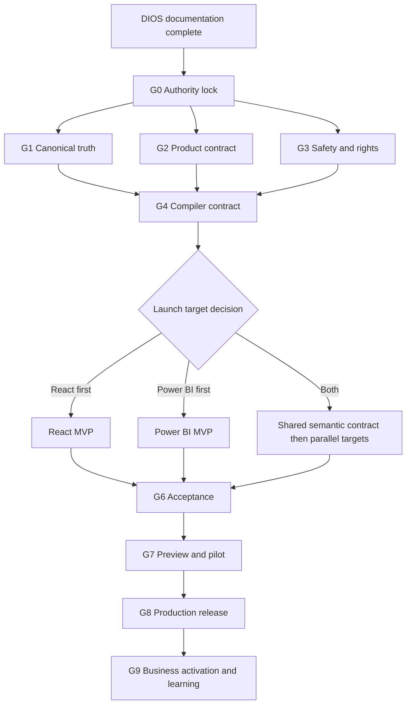
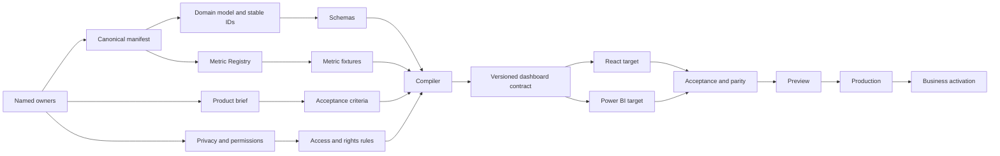

# 14 — Roadmap

> **System:** Dashboard Intelligence Operating System (DIOS)  
> **Repository:** `omarali304ii-byte/Islam-Brain`  
> **Repository baseline:** `44cea987cd42f077cc0f6e448bcdc69f2683ecb1`  
> **DIOS working branch:** `docs/dios-phase-0-inventory`  
> **Roadmap date:** 2026-07-12  
> **Phase status:** Phase 14 — Complete, awaiting validation  
> **Previous artifacts:** [`00_Project_Inventory.md`](./00_Project_Inventory.md) · [`01_Understanding.md`](./01_Understanding.md) · [`02_Dashboard_Architecture.md`](./02_Dashboard_Architecture.md) · [`03_Design_System.md`](./03_Design_System.md) · [`04_System_Architecture.md`](./04_System_Architecture.md) · [`05_Prompt_Analysis.md`](./05_Prompt_Analysis.md) · [`06_Project_Decisions.md`](./06_Project_Decisions.md) · [`07_Project_Brain.md`](./07_Project_Brain.md) · [`08_Gap_Report.md`](./08_Gap_Report.md) · [`09_Learning_Guide.md`](./09_Learning_Guide.md) · [`10_Design_Principles.md`](./10_Design_Principles.md) · [`11_Best_Practices.md`](./11_Best_Practices.md) · [`12_Dashboard_Bible.md`](./12_Dashboard_Bible.md) · [`13_Dashboard_Master_Prompt.md`](./13_Dashboard_Master_Prompt.md)  
> **DIOS documentation sequence:** Phase 14 is the final planned DIOS foundation artifact in the current series

---

## Table of Contents

1. [Phase Entry Decision](#1-phase-entry-decision)
2. [Roadmap Purpose](#2-roadmap-purpose)
3. [What This Roadmap Does Not Authorize](#3-what-this-roadmap-does-not-authorize)
4. [Roadmap Authority and Precedence](#4-roadmap-authority-and-precedence)
5. [Current Baseline](#5-current-baseline)
6. [Target End State](#6-target-end-state)
7. [Roadmap Doctrine](#7-roadmap-doctrine)
8. [Roadmap Status Vocabulary](#8-roadmap-status-vocabulary)
9. [Priority and Gate Model](#9-priority-and-gate-model)
10. [Roadmap in One View](#10-roadmap-in-one-view)
11. [Critical Dependency Graph](#11-critical-dependency-graph)
12. [Workstream Model](#12-workstream-model)
13. [Release Strategy Decision Fork](#13-release-strategy-decision-fork)
14. [MVP Boundary Model](#14-mvp-boundary-model)
15. [Stage 0 — Governance and Authority Lock](#15-stage-0--governance-and-authority-lock)
16. [Stage 1 — Canonical Truth Foundation](#16-stage-1--canonical-truth-foundation)
17. [Stage 2 — Product and Acceptance Contract](#17-stage-2--product-and-acceptance-contract)
18. [Stage 3 — Privacy, Rights, and Client-Data Readiness](#18-stage-3--privacy-rights-and-client-data-readiness)
19. [Stage 4 — Compiler and Validation Foundation](#19-stage-4--compiler-and-validation-foundation)
20. [Stage 5 — Presentation Foundation](#20-stage-5--presentation-foundation)
21. [Stage 6 — Domain-Room Delivery](#21-stage-6--domain-room-delivery)
22. [Stage 7 — Quality, Security, and Release Hardening](#22-stage-7--quality-security-and-release-hardening)
23. [Stage 8 — Preview and Pilot](#23-stage-8--preview-and-pilot)
24. [Stage 9 — Production Release](#24-stage-9--production-release)
25. [Stage 10 — Business Activation and Learning](#25-stage-10--business-activation-and-learning)
26. [Shared Foundation Batches](#26-shared-foundation-batches)
27. [React Delivery Batches](#27-react-delivery-batches)
28. [Power BI Delivery Batches](#28-power-bi-delivery-batches)
29. [Dual-Target Delivery Rules](#29-dual-target-delivery-rules)
30. [Business Activation Batches](#30-business-activation-batches)
31. [Work-Package Record Contract](#31-work-package-record-contract)
32. [Master Work-Package Ledger](#32-master-work-package-ledger)
33. [P0 Stop-Ship Closure Plan](#33-p0-stop-ship-closure-plan)
34. [P1 MVP-Acceptance Plan](#34-p1-mvp-acceptance-plan)
35. [P2 Scale-Readiness Plan](#35-p2-scale-readiness-plan)
36. [P3 Enhancement Plan](#36-p3-enhancement-plan)
37. [Roles and Accountability](#37-roles-and-accountability)
38. [Decision Calendar and Review Triggers](#38-decision-calendar-and-review-triggers)
39. [Artifact Creation Map](#39-artifact-creation-map)
40. [Branch, PR, and Commit Strategy](#40-branch-pr-and-commit-strategy)
41. [Agent Execution Model](#41-agent-execution-model)
42. [Batch Activation Template](#42-batch-activation-template)
43. [Batch Definition of Ready](#43-batch-definition-of-ready)
44. [Batch Definition of Done](#44-batch-definition-of-done)
45. [Validation and Promotion Gates](#45-validation-and-promotion-gates)
46. [Risk-Based Sequencing](#46-risk-based-sequencing)
47. [Dependencies That Must Not Be Parallelized](#47-dependencies-that-must-not-be-parallelized)
48. [Safe Parallel Work](#48-safe-parallel-work)
49. [Blocked, Deferred, and Dropped Work](#49-blocked-deferred-and-dropped-work)
50. [Prototype Policy](#50-prototype-policy)
51. [Client-Data Introduction Plan](#51-client-data-introduction-plan)
52. [Metric and Dataset Change Plan](#52-metric-and-dataset-change-plan)
53. [Design-System Maturation Plan](#53-design-system-maturation-plan)
54. [Testing Maturation Plan](#54-testing-maturation-plan)
55. [Security and Privacy Maturation Plan](#55-security-and-privacy-maturation-plan)
56. [Deployment and Operations Maturation Plan](#56-deployment-and-operations-maturation-plan)
57. [Business Outcome Monitoring](#57-business-outcome-monitoring)
58. [Roadmap Health Indicators](#58-roadmap-health-indicators)
59. [Roadmap Failure Signals](#59-roadmap-failure-signals)
60. [Replanning Rules](#60-replanning-rules)
61. [First Safe Actions](#61-first-safe-actions)
62. [Actions That Remain Forbidden](#62-actions-that-remain-forbidden)
63. [Roadmap Traceability](#63-roadmap-traceability)
64. [Phase 14 Validation Gate](#64-phase-14-validation-gate)
65. [Glossary](#65-glossary)
66. [Document Control](#66-document-control)

---

## 1. Phase Entry Decision

Phase 13 was complete but awaiting owner validation. On 2026-07-12, the repository owner explicitly instructed DIOS to proceed with **Batch/Phase 14**.

This is recorded as:

- **Phase 13 acceptance:** Accepted by owner with the Master Prompt’s permission defaults, readiness gates, fail-closed behavior, unresolved product decisions, and non-execution status preserved.
- **Authorized work:** Produce the final dependency-driven roadmap from the present documentation-rich state to a governed product, operational release, and business activation.
- **Forbidden work:** Do not execute roadmap batches, assign real people without approval, select React or Power BI, choose canonical data, resolve formulas, ingest client data, approve rights, write production code, call external services, generate production media, build, deploy, or mark gaps closed.
- **Current permission:** Documentation write only.

> [!IMPORTANT]
> This roadmap sequences work. It is not approval to perform every work package it describes.

---

## 2. Roadmap Purpose

The Roadmap converts the project’s decisions, gaps, principles, product Bible, best practices, and Master Prompt into an ordered execution system.

It answers:

- What must happen first?
- What may happen in parallel?
- Which work remains blocked?
- What artifact or proof ends each stage?
- Which gaps does each work package address?
- Which Master Prompt mode and permission level apply?
- When may presentation work begin?
- When may client data enter?
- When may preview or production deployment occur?
- How should React and Power BI share truth?
- How does business activation begin without confusing activity with outcomes?

### 2.1 Primary roadmap objective

Move the estate through these maturity transitions:

```text
Documented understanding
→ Controlled authority
→ Canonical truth
→ Approved product contract
→ Enforced compiler contract
→ Validated presentation
→ Governed release
→ Measured business activation
→ Learning system
```

### 2.2 Roadmap unit of progress

Progress is not measured by documents written, cards designed, files changed, or code volume.

Progress is measured by **validated capability gates** and **gap-closure proof**.

---

## 3. What This Roadmap Does Not Authorize

This document does not itself authorize:

- Selecting a canonical social, voice, creator, catalog, or media generation.
- Publishing the `~190×` claim as canonical.
- Treating product, variant, and SKU as one grain.
- Choosing React, Power BI, or dual delivery.
- Approving MVP pages or access model.
- Naming owners without their acceptance.
- Requesting or ingesting client exports.
- Running free or paid external data routes.
- Reviving the dropped Noon route.
- Reusing creator content.
- Confirming founder or sustainability claims.
- Inventing exact design tokens.
- Writing the compiler or presentation application.
- Deploying preview or production.
- Marking any Phase 8 gap closed.

---

## 4. Roadmap Authority and Precedence

The roadmap follows:

```text
Law, privacy, rights, and explicit permission
→ Latest owner-approved instruction
→ Approved decisions, definitions, and canonical evidence
→ Phase 6 Project Decisions
→ Phase 7 Project Brain
→ Phase 8 Gap Report
→ Phase 10 Design Principles
→ Phase 11 Best Practices
→ Phase 12 Dashboard Bible
→ Phase 13 Dashboard Master Prompt
→ Phase 14 Roadmap
→ Work-package preference
```

### 4.1 Conflict rule

When a roadmap item conflicts with a later approved decision:

1. The approved decision governs.
2. The affected work package is paused.
3. Dependencies and downstream batches are reviewed.
4. The Roadmap, Brain, Decisions, Gaps, Bible, and Master Prompt are updated as applicable.

### 4.2 No calendar authority

This roadmap intentionally avoids invented dates and duration commitments because confirmed team capacity, owner availability, vendor lead times, legal review, client-data access, and engineering estimates do not exist.

Calendar estimates may be added only after:

- Named owners accept work.
- Scope is approved.
- Dependencies are confirmed.
- Complexity is estimated by the responsible implementers.
- External approval lead times are known.

---

## 5. Current Baseline

### 5.1 Current truthful maturity

The project is strongly **documented**, partially evidence-controlled, and not yet a governed implementation.

### 5.2 Confirmed strengths

- Extensive evidence estate.
- Source Registry and evidence grades.
- Coherent strategic diagnosis.
- Normalized decision ledger.
- 100-gap controlled register.
- Project Brain and task router.
- Design principles and best practices.
- Complete Dashboard Bible.
- Versioned Dashboard Master Prompt.
- React and Power BI specifications.
- Explicit no-fabrication and RequiresData doctrine.

### 5.3 Confirmed blockers

- No canonical dataset manifest.
- No stable schema/ID system.
- Product/variant/SKU grain unresolved.
- No approved Metric Registry.
- `~190×` unresolved.
- Launch target and MVP unresolved.
- No named accountable owners.
- Client-data/privacy/access model unresolved.
- Creator and founder rights unresolved.
- Compiler missing.
- React and Power BI implementations unconfirmed.
- No automated acceptance suite.
- No CI/CD, deployment, monitoring, or rollback proof.

### 5.4 Current release verdict

```text
Research use: available with caveats
Documentation use: strong
Prototype use: possible only with explicit fixture labeling and permission
Production data contract: not ready
Production presentation: not ready
Private client-data handling: blocked
Preview deployment: not ready
Production deployment: blocked
Business activation: partially documented, not operationally proven
```

---

## 6. Target End State

The roadmap’s intended end state is a controlled system where:

### 6.1 Truth

- Canonical inputs are selected by versioned manifest.
- Raw evidence remains immutable.
- Stable IDs and schemas exist.
- Every governed metric has an approved definition and fixture.
- Source, sample, window, method, confidence, and caveat travel with claims.

### 6.2 Product

- Launch target and MVP are approved.
- Users and access are defined.
- Decision Dock and room behavior are versioned.
- RequiresData and stale states are first-class.
- React and/or Power BI meet the same semantic contract.

### 6.3 Engineering

- A fail-closed compiler emits one deterministic dashboard contract.
- Presentation code does not parse heterogeneous research files.
- Automated tests verify data, metrics, evidence, product behavior, accessibility, RTL, security, and release integrity.

### 6.4 Safety

- Client data has purpose, access, retention, deletion, isolation, export, audit, and incident controls.
- Creator/founder/media rights are documented.
- Secrets are handled safely.
- Permissions are separated from task intent.

### 6.5 Operations

- Preview and production are distinct environments.
- Immutable artifacts are released.
- Monitoring includes application, compiler, data freshness, metric validity, privacy, and rights state.
- Rollback includes semantic truth failures.

### 6.6 Business

- Accepted actions have owners, baselines, targets, review dates, and outcome measurements.
- The dashboard supports decisions rather than becoming the business action itself.

---

## 7. Roadmap Doctrine

1. **Truth before presentation.**
2. **Owners before execution.**
3. **Definitions before calculations.**
4. **Product scope before engineering estimates.**
5. **Privacy and rights before data/media ingestion.**
6. **Compiler before production UI.**
7. **One shared semantic contract before two presentation targets.**
8. **Preview before production.**
9. **Validation proof before status promotion.**
10. **Business activation after operational responsibility exists.**
11. **Safe partial completion over fabricated completion.**
12. **Gates over arbitrary dates.**

---

## 8. Roadmap Status Vocabulary

| Status | Meaning |
|---|---|
| `NOT_STARTED` | Approved work package has not begun. |
| `READY` | Definition of Ready passes and permission exists. |
| `IN_PROGRESS` | Bounded authorized execution is active. |
| `PARTIAL` | Safe output exists but closure criteria are incomplete. |
| `BLOCKED_DECISION` | Requires approved product/business/metric decision. |
| `BLOCKED_DATA` | Required evidence or canonical input is absent. |
| `BLOCKED_CLIENT` | Requires client-owned information or authority. |
| `BLOCKED_FOUNDER` | Requires founder confirmation. |
| `BLOCKED_RIGHTS` | Rights, consent, attribution, or legal basis unresolved. |
| `BLOCKED_PERMISSION` | Required side-effect permission is absent. |
| `DEFERRED` | Intentionally postponed. |
| `DROPPED` | Intentionally inactive and not part of the queue. |
| `VALIDATING` | Implementation exists; acceptance proof is in progress. |
| `READY_FOR_PROMOTION` | Required validation passed; approval is pending. |
| `COMPLETE` | Work-package proof exists and downstream records are updated. |
| `SUPERSEDED` | Replaced by a later approved work package or decision. |

---

## 9. Priority and Gate Model

### 9.1 Priority

- **P0:** Stop ship for affected implementation, publication, ingestion, or release.
- **P1:** Must close before MVP acceptance.
- **P2:** Must close before broader scale or automated refresh.
- **P3:** Enhancement after a bounded safe release.

### 9.2 Gate levels

| Gate | Meaning |
|---|---|
| `G0 Authority` | Owners, approvers, permission model, and escalation exist. |
| `G1 Truth` | Canonical inputs, grains, schemas, metrics, lineage, and freshness pass. |
| `G2 Product` | Target, users, access, MVP, non-goals, and acceptance are approved. |
| `G3 Safety` | Privacy, rights, client-data, secrets, and exposure controls pass. |
| `G4 Compiler` | Deterministic compiled contract and fail-closed validation pass. |
| `G5 Presentation` | Selected React/PBI scope works against the compiled contract. |
| `G6 Acceptance` | Data, UX, accessibility, RTL, security, parity, and performance pass. |
| `G7 Preview` | Approved preview artifact, users, monitoring, and rollback exist. |
| `G8 Production` | Explicit P10 approval, immutable release, smoke test, and operations pass. |
| `G9 Activation` | Business action owners, baselines, targets, and review loop exist. |

### 9.3 Gate invariant

A later gate cannot compensate for an earlier failed gate.

A polished UI does not compensate for non-canonical data. Uptime does not compensate for a wrong metric. Client excitement does not compensate for missing rights.

---

## 10. Roadmap in One View



### 10.1 No-presentation shortcut

Production presentation must not begin directly from current raw/derived research files.

A bounded prototype may begin earlier only when:

- Explicitly approved.
- Uses synthetic or frozen fixture data.
- Displays a prototype banner.
- Makes no client-facing factual claim.
- Has no production deployment.
- Has a deletion/supersession plan.

---

## 11. Critical Dependency Graph



### 11.1 The three earliest decisions

Before implementation planning can become estimable, the owner group must decide:

1. Who owns product, data, metrics, compiler, privacy/rights, and release?
2. Which presentation target is first?
3. What exact MVP and access boundary are being accepted?

---

## 12. Workstream Model

The roadmap runs through eight coordinated workstreams.

### WS-1 — Governance and authority

Owners, approvers, RACI, permissions, decision system, supersession, proof registry.

### WS-2 — Evidence and canonical truth

Manifests, source lineage, canonical generations, stable IDs, schemas, freshness, spend.

### WS-3 — Metrics and analysis

Metric Registry, fixtures, cross-platform definitions, sentiment validation, catalog semantics.

### WS-4 — Product and experience

Launch target, MVP, users, access, Decision Dock, IA, states, accessibility, RTL, responsive behavior.

### WS-5 — Privacy, security, rights, and client data

Purpose limitation, access, retention, deletion, isolation, rights, attribution, founder approvals, secret handling.

### WS-6 — Compiler and engineering

Adapters, normalizers, validators, deterministic build, last-known-good, tests, dependency recovery.

### WS-7 — Presentation and release

React/Power BI implementation, parity, QA, CI/CD, preview, production, observability, rollback.

### WS-8 — Business activation

WhatsApp, catalog cleanup, Arabic-first operations, creator system, mobile remediation, client financial baselines.

---

## 13. Release Strategy Decision Fork

### 13.1 Option A — React first

Best when the priority is:

- Custom executive storytelling.
- Strong L0–L3 navigation.
- Bespoke evidence interactions.
- Public/client web delivery.
- Full RTL/responsive control.

Requires:

- Frontend engineering.
- Hosting and access model.
- Custom analytics/filter implementation.
- Strong accessibility and operational ownership.

### 13.2 Option B — Power BI first

Best when the priority is:

- Fast analytical report delivery.
- Familiar enterprise filters.
- Strong semantic modeling and DAX.
- Controlled client workspace distribution.

Requires:

- Licensing/workspace decisions.
- Gateway/refresh approach.
- RLS and export governance.
- Acceptance of more constrained bespoke storytelling.

### 13.3 Option C — Shared foundation, dual target

Best when both experiences are materially required.

Non-negotiable rule:

```text
Canonical manifest + schemas + Metric Registry + compiler contract first
→ one validated seed/semantic contract
→ React and Power BI implementation in parallel
→ parity validation before release
```

### 13.4 Decision record required

The launch choice must record:

- Decision ID.
- Primary users.
- Business reason.
- First-release pages.
- Access model.
- Cost and capability assumptions.
- Explicit exclusions.
- Reopen condition.
- Approver.

---

## 14. MVP Boundary Model

The roadmap does not approve the MVP, but recommends defining it through four tiers.

### Tier 0 — Truth demonstrator

- Compiled contract.
- Evidence panel.
- RequiresData states.
- Version/freshness display.
- One verified metric fixture.
- No client data.
- No production claims.

### Tier 1 — Executive spine

- Persistent/collapsible Decision Dock.
- Five-screen executive story.
- Social, Catalog, Website, and Evidence core views.
- Approved metrics only.
- Explicit gaps for financial, competitive, audience, and unapproved rooms.

### Tier 2 — Diagnostic MVP

- Post Explorer.
- Creator Directory.
- Sentiment/Verbatims.
- Pricing/Value.
- Domain filters and evidence drill-down.
- Approved export/share behavior.

### Tier 3 — Operational product

- Governed client data.
- Refresh automation.
- Access control.
- Monitoring and incident behavior.
- Broader rooms and business outcome tracking.

### 14.1 MVP anti-bloat rule

No room or card enters the MVP merely because it was specified earlier. It must support an approved user decision and pass data/metric readiness.

---

## 15. Stage 0 — Governance and Authority Lock

### Objective

Make every P0 capability accountable and every side effect explicitly authorized.

### Required work packages

- `RM-GOV-001` Ownership register.
- `RM-GOV-002` RACI and escalation.
- `RM-GOV-003` Decision system of record.
- `RM-GOV-004` Permission model adoption.
- `RM-GOV-005` Implementation-proof registry.
- `RM-GOV-006` Legal/privacy/rights review checkpoints.
- `RM-GOV-007` Prompt and execution manifest persistence.

### Required outputs

- Named product owner.
- Named data/canonical owner.
- Named metric owner.
- Named compiler owner.
- Named React and/or Power BI owner after target decision.
- Named privacy/security owner.
- Named media-rights owner.
- Named release/operations owner.
- Named Project Brain/DIOS owner.

### Exit gate — `G0 Authority`

- Every P0 gap has an owner and approver.
- Escalation path exists.
- P1–P11 permissions are accepted.
- Preview and production authority are separate.
- Decision and proof records have stable locations.

### Must remain blocked

No client data, paid routes, code implementation, media reuse, preview, or production should be inferred from completing governance documents.

---

## 16. Stage 1 — Canonical Truth Foundation

### Objective

Create one reproducible evidence and metric system.

### Required work packages

- `RM-DAT-001` Canonical dataset manifest.
- `RM-DAT-002` Evidence manifest/checksums.
- `RM-DAT-003` Product/variant/SKU domain model.
- `RM-DAT-004` Stable ID strategy.
- `RM-DAT-005` Schema registry.
- `RM-DAT-006` Social generation reconciliation.
- `RM-DAT-007` Voice generation reconciliation.
- `RM-DAT-008` Creator population reconciliation.
- `RM-DAT-009` Catalog option/type normalization.
- `RM-DAT-010` Locale/timezone/currency contract.
- `RM-DAT-011` Canonical promotion and supersession workflow.
- `RM-DAT-012` Spend ledger reconciliation.
- `RM-MET-001` Metric Registry foundation.
- `RM-MET-002` `~190×` decision and fixture.
- `RM-MET-003` Eight watch-KPI contracts.
- `RM-MET-004` Platform view/reach/play normalization.
- `RM-MET-005` Snapshot/trend policy.
- `RM-EVD-001` Claim-to-source mapping model.
- `RM-EVD-002` Freshness policy.

### Exit gate — `G1 Truth`

A reviewer can reproduce every MVP metric from:

- Exact versioned inputs.
- Declared grain.
- Approved formula.
- Source IDs.
- Capture window.
- Validation fixture.
- Transformation lineage.

### Failure behavior

Any unresolved flagship metric remains blocked or excluded. The UI must not become the place where ambiguity is resolved.

---

## 17. Stage 2 — Product and Acceptance Contract

### Objective

Define exactly what will be built, for whom, and how completion is proven.

### Required work packages

- `RM-PRD-001` Launch-target decision.
- `RM-PRD-002` Product brief.
- `RM-PRD-003` MVP scope and exclusions.
- `RM-PRD-004` Primary users and decision jobs.
- `RM-PRD-005` Access/exposure decision.
- `RM-PRD-006` Read-only/editing boundary.
- `RM-PRD-007` Decision Dock update model.
- `RM-PRD-008` Navigation and filter contract.
- `RM-PRD-009` Export/share/print contract.
- `RM-PRD-010` Acceptance criteria.
- `RM-PRD-011` Performance targets.
- `RM-PRD-012` Accessibility standard.
- `RM-PRD-013` Bilingual/RTL operating model.
- `RM-PRD-014` Product telemetry decision.

### Exit gate — `G2 Product`

Engineering can estimate work without inventing:

- Target technology.
- Users.
- Pages.
- Access.
- Editing.
- Filters.
- Exports.
- Performance.
- Acceptance.

### Product freeze rule

After product scope enters implementation, changes require:

- Decision record.
- Dependency impact review.
- Updated acceptance criteria.
- Roadmap and Bible propagation.

---

## 18. Stage 3 — Privacy, Rights, and Client-Data Readiness

### Objective

Make all planned data and media use lawful, proportionate, and controlled.

### Required work packages

- `RM-SEC-001` Client-data purpose and processing policy.
- `RM-SEC-002` Authentication and authorization design.
- `RM-SEC-003` Retention/deletion/correction policy.
- `RM-SEC-004` Environment and client isolation design.
- `RM-SEC-005` Export and evidence-access policy.
- `RM-SEC-006` PII/handle/verbatim display policy.
- `RM-SEC-007` Creator-media rights process.
- `RM-SEC-008` Founder and sustainability approval record.
- `RM-SEC-009` Synthetic-media disclosure policy.
- `RM-SEC-010` Secret transport and storage correction.
- `RM-SEC-011` Incident-response model.
- `RM-CNV-001` WhatsApp consent and retention.
- `RM-CNV-002` Client export data dictionary and transfer process.

### Exit gate — `G3 Safety`

Approved data and media can enter the system with:

- Defined purpose.
- Authorized access.
- Retention and deletion.
- Rights and attribution.
- Safe secrets.
- Auditable processing.
- Incident path.

### Private-data block

No Shopify, GA4, Meta Insights, order, revenue, return, CAC, customer, or private audience export enters before the applicable gate passes.

---

## 19. Stage 4 — Compiler and Validation Foundation

### Objective

Create the enforceable trust boundary between research artifacts and presentation.

### Required work packages

- `RM-ENG-001` Recover or replace missing compile dependencies.
- `RM-ENG-002` Compiler architecture decision.
- `RM-ENG-003` Input adapters.
- `RM-ENG-004` Normalizers.
- `RM-ENG-005` Schema validators.
- `RM-ENG-006` Metric engine.
- `RM-ENG-007` Evidence attachment.
- `RM-ENG-008` RequiresData/gap-state generator.
- `RM-ENG-009` Privacy and rights filters.
- `RM-ENG-010` Media validation.
- `RM-ENG-011` Client-safe vocabulary validation.
- `RM-ENG-012` Output schema.
- `RM-ENG-013` Build report.
- `RM-ENG-014` Atomic promotion.
- `RM-ENG-015` Last-known-good retention.
- `RM-ENG-016` Idempotency, locks, and rerun behavior.
- `RM-ENG-017` Compiler test suite.

### Required compiler output metadata

- Build ID.
- Commit.
- Manifest version.
- Schema version.
- Metric Registry version.
- Source Registry version.
- Generated timestamp.
- Validation results.
- Warnings/blocked claims.
- Previous-good reference.

### Exit gate — `G4 Compiler`

One deterministic dashboard contract:

- Uses approved canonical inputs.
- Passes schemas and metric fixtures.
- Contains source/sample/window/confidence.
- Creates correct missing states.
- Blocks unsupported claims.
- Validates rights/media/privacy.
- Promotes atomically.
- Retains last known good.

---

## 20. Stage 5 — Presentation Foundation

### Objective

Implement only the approved shell and semantic component system against the compiled contract.

### Shared work packages

- `RM-DES-001` Approved design tokens.
- `RM-DES-002` Typography and layout system.
- `RM-DES-003` Semantic status and evidence visuals.
- `RM-DES-004` Component-state matrix.
- `RM-DES-005` RTL/mixed-direction patterns.
- `RM-DES-006` Responsive task patterns.
- `RM-DES-007` Accessibility component standards.
- `RM-PRD-015` Shell/navigation implementation contract.
- `RM-PRD-016` Decision Dock implementation contract.
- `RM-PRD-017` Evidence interaction contract.

### Exit gate — `G5 Foundation`

- Approved shell works with fixtures/compiled contract.
- Version and freshness are visible.
- Required states exist.
- Evidence can be reached.
- Keyboard and mixed-direction basics pass.
- No domain room computes its own metric.

---

## 21. Stage 6 — Domain-Room Delivery

### Objective

Deliver approved domain rooms in decision-value order rather than specification order.

### Recommended priority order

1. Executive spine.
2. Evidence Room.
3. Social Command Center.
4. Catalog and Pricing.
5. Website and Discoverability.
6. Post Explorer.
7. Sentiment/Words/Verbatims.
8. Creator Directory.
9. Pricing and Value.
10. Strategy/Content/Audience only when required inputs are approved.
11. Competitive only when a valid route and canonical benchmark exist.
12. Financial/funnel surfaces only after governed client data exists.

### Room acceptance rule

A room is ready only when:

- Primary decision is approved.
- Canonical data exists or RequiresData is intentional.
- Metrics are registered.
- States are specified.
- Evidence is linked.
- Accessibility/RTL/mobile behaviors are testable.
- Rights/privacy rules are satisfied.

### Exit gate — `G5 Presentation`

All approved MVP rooms satisfy their room contracts without direct raw-file access or local formula drift.

---

## 22. Stage 7 — Quality, Security, and Release Hardening

### Objective

Prove the product is correct, usable, safe, and releasable.

### Required work packages

- `RM-QA-001` Data-contract tests.
- `RM-QA-002` Metric fixtures and parity.
- `RM-QA-003` Compiler fail-closed tests.
- `RM-QA-004` UI component-state tests.
- `RM-QA-005` Navigation/filter/evidence tests.
- `RM-QA-006` Accessibility tests.
- `RM-QA-007` RTL/mixed-direction tests.
- `RM-QA-008` Responsive task tests.
- `RM-QA-009` Visual regression.
- `RM-QA-010` Security/access tests.
- `RM-QA-011` Privacy/rights validation.
- `RM-QA-012` Performance tests.
- `RM-QA-013` Export/print tests.
- `RM-QA-014` Narrative and status-language review.
- `RM-QA-015` Independent critical-claim review.
- `RM-OPS-001` CI pipeline.
- `RM-OPS-002` Preview environment.
- `RM-OPS-003` Build artifact retention.

### Exit gate — `G6 Acceptance`

The accepted MVP suite passes with reproducible evidence and no unresolved P0 gap affecting the release.

---

## 23. Stage 8 — Preview and Pilot

### Objective

Expose the exact release candidate to an approved bounded audience.

### Required work packages

- `RM-REL-001` Immutable preview artifact.
- `RM-REL-002` Preview access list.
- `RM-REL-003` Pilot task script.
- `RM-REL-004` Executive/marketer/analyst usability review.
- `RM-REL-005` Data and narrative sign-off.
- `RM-REL-006` Privacy/rights sign-off.
- `RM-REL-007` Monitoring and freshness dashboard.
- `RM-REL-008` Rollback rehearsal.
- `RM-REL-009` Defect triage and closure.

### Pilot questions

- Can the executive identify the verdict and decisions?
- Can the marketer diagnose social/catalog/website issues?
- Can the analyst reproduce load-bearing claims?
- Are RequiresData states understood rather than perceived as broken?
- Can users distinguish snapshots, trends, estimates, and hypotheses?
- Are Arabic, English, handles, currency, and evidence readable?
- Does the product avoid overstating implementation, security, or financial impact?

### Exit gate — `G7 Preview`

- Pilot acceptance passes.
- Critical defects are closed.
- Release artifact is immutable.
- Monitoring and rollback work.
- Production approval package is complete.

---

## 24. Stage 9 — Production Release

### Objective

Release only the exact validated artifact with explicit production authority.

### Preconditions

- P10 production permission.
- Named approver and valid expiry.
- Exact artifact, environment, data manifest, compiler, and metric versions.
- Access/privacy/rights approval.
- Smoke-test plan.
- Monitoring active.
- Rollback target verified.

### Release record

```yaml
release:
  environment: ""
  url: ""
  commit: ""
  artifact_id: ""
  data_manifest: ""
  schema_version: ""
  compiler_version: ""
  metric_registry_version: ""
  validation_report: ""
  privacy_rights_approval: ""
  approver: ""
  deployed_at: ""
  smoke_test: ""
  monitoring: ""
  rollback_target: ""
```

### Exit gate — `G8 Production`

- Exact artifact deployed.
- Smoke test passes.
- Data/metric/build versions match approval.
- Monitoring is active.
- Rollback is ready.
- Brain, Decisions, Gaps, Bible, Master Prompt, Roadmap, and handoff reflect production truth.

---

## 25. Stage 10 — Business Activation and Learning

### Objective

Turn accepted strategy into owned operations and measured outcomes.

### Activation order

1. WhatsApp ownership, consent, SLA, capacity, and attribution.
2. Catalog cleanup and product/variant normalization in the operating system.
3. Arabic-first content standard and measurement.
4. Creator rights and repeatable creator operating model.
5. Mobile remediation before paid-traffic scale.
6. Client-data financial baselines.
7. Approved acquisition/research routes.
8. Founder-gated positioning only after confirmation.

### Exit gate — `G9 Activation`

Every activated initiative has:

- Owner.
- Baseline.
- Target.
- Operational process.
- Data source.
- Review date.
- Decision rule.
- Privacy/rights basis.
- Learning loop.

### Business outcome rule

The dashboard is a decision and monitoring system. It is not proof that WhatsApp, catalog, content, creator, mobile, or paid-media work was executed successfully.

---

## 26. Shared Foundation Batches

These batches precede any production presentation work.

| Batch | Mode | Permission | Output | Primary gaps |
|---|---|---:|---|---|
| `B00` | `PLAN` | P3 docs | Approved ownership/RACI proposal | GOV-001, OPS-001 |
| `B01` | `DATA_CONTRACT` | P3/P4 | Canonical manifest contract | DAT-001, DAT-011 |
| `B02` | `DATA_CONTRACT` | P3/P4 | Domain model, grain, stable IDs | DAT-002, DAT-003, ANA-004 |
| `B03` | `DATA_CONTRACT` | P3/P4 | Schema Registry | DAT-003, DAT-012 |
| `B04` | `METRIC_CONTRACT` | P3/P4 | Metric Registry base | MET-002 |
| `B05` | `METRIC_CONTRACT` | P3/P4 | `~190×` resolution package | MET-001 |
| `B06` | `PLAN` | P3 | Product brief and launch-choice package | PRD-001, PRD-002 |
| `B07` | `PLAN` | P3 | Access/privacy/rights package | SEC-001/002/003, BIZ-001 |
| `B08` | `COMPILER` | P4 | Compiler skeleton and contracts | ENG-001, EVD-001 |
| `B09` | `COMPILER` | P4 | Adapters/normalizers/validators | DAT/EVD/ENG |
| `B10` | `COMPILER` | P4 | Metric/evidence/missing-state engine | MET/EVD/ENG |
| `B11` | `QA` | P4 | Compiler acceptance suite | ENG/OPS |
| `B12` | `RELEASE_PREP` | P3/P4 | Validated compiled-contract candidate | ENG-001 |

### Batch dependency

```text
B00
├── B01 → B02 → B03
├── B04 → B05
├── B06
└── B07

B03 + B04/B05 + B06 + B07
→ B08 → B09 → B10 → B11 → B12
```

---

## 27. React Delivery Batches

Only active after React is approved.

| Batch | Output |
|---|---|
| `R00` | React architecture, dependency, route, state, and test decision record |
| `R01` | Theme/token implementation and semantic component primitives |
| `R02` | Application shell, navigation, version/freshness controls |
| `R03` | Decision Dock and executive Screen 1 |
| `R04` | Executive Screens 2–5 |
| `R05` | Evidence Room and evidence drawers |
| `R06` | Social Command Center |
| `R07` | Catalog and Pricing |
| `R08` | Website and Discoverability |
| `R09` | Post Explorer and Creator Directory |
| `R10` | Sentiment, Words, and Verbatims |
| `R11` | Approved secondary rooms or RequiresData states |
| `R12` | Responsive/RTL/accessibility hardening |
| `R13` | React acceptance, visual regression, performance, and security |
| `R14` | Immutable preview artifact |

### React invariant

React receives one compiled contract and approved media. It does not read `_sources/`, `_intel/`, raw client exports, or research Markdown at runtime.

---

## 28. Power BI Delivery Batches

Only active after Power BI is approved.

| Batch | Output |
|---|---|
| `P00` | Power BI architecture, workspace, licensing, refresh, export, and RLS decision record |
| `P01` | Approved fact/dimension schema and seed contracts |
| `P02` | Semantic model and controlled relationships |
| `P03` | DAX measures mapped to Metric Registry IDs |
| `P04` | Executive Summary page |
| `P05` | Social Command Center page |
| `P06` | Content and Calendar page or approved gap state |
| `P07` | Catalog and Pricing page |
| `P08` | Website and Discoverability page |
| `P09` | Competitive page or RequiresData state |
| `P10` | Audience and Market page or RequiresData state |
| `P11` | Evidence and Confidence page |
| `P12` | Theme, RTL/bilingual, accessibility, and export hardening |
| `P13` | DAX/filter/RLS/refresh/parity validation |
| `P14` | Immutable preview artifact |

### Power BI invariant

DAX does not create alternative business definitions. Every governed measure maps to an approved Metric Registry record and shared fixture.

---

## 29. Dual-Target Delivery Rules

When both targets are approved:

1. Shared foundation batches complete first.
2. Shared metric fixtures are immutable for the release candidate.
3. React and Power BI may implement in parallel after `G4 Compiler`.
4. Page layout may differ; semantic meaning may not.
5. Source/sample/window/confidence remain equivalent.
6. Missing states remain equivalent.
7. Targets and thresholds remain equivalent.
8. Any metric divergence blocks promotion.
9. Exported screenshots/PDFs include build and data versions.
10. One target cannot be called production-ready while the joint release promise requires parity and the other fails.

---

## 30. Business Activation Batches

| Batch | Purpose | Preconditions |
|---|---|---|
| `A00` | WhatsApp owner, account, SLA, capacity, consent | Business + privacy approvals |
| `A01` | WhatsApp attribution and chat-to-order process | Event/data contract |
| `A02` | Catalog cleanup operating backlog | Product/variant model approved |
| `A03` | Arabic-first content standard | Language metric and owner |
| `A04` | Creator rights and program model | Rights + economics + owner |
| `A05` | Mobile remediation plan | Technical audit + success target |
| `A06` | Client financial baseline request | Client-data governance |
| `A07` | Scenario methodology | Approved baseline and assumptions |
| `A08` | Paid-media policy | Financial truth + mobile readiness |
| `A09` | Approved research/data-pass execution | Route-specific approval and ceilings |
| `A10` | Founder positioning activation | Founder-approved claims/assets |

---

## 31. Work-Package Record Contract

Every roadmap package should use:

```yaml
work_package:
  id: "RM-XXX-000"
  title: ""
  workstream: ""
  stage: 0
  priority: "P0 | P1 | P2 | P3"
  status: "NOT_STARTED"
  objective: ""
  owner_role: ""
  owner: null
  approver_role: ""
  approver: null
  master_prompt_mode: ""
  permission_level: ""
  inputs: []
  dependencies: []
  related_decisions: []
  related_gaps: []
  deliverables: []
  excluded_actions: []
  acceptance_criteria: []
  validation: []
  risks: []
  evidence_of_completion: []
  downstream_updates: []
  next_review_trigger: ""
```

---

## 32. Master Work-Package Ledger

### Governance

| ID | Title | Stage | Priority | Dependency | Gate |
|---|---|---:|---:|---|---|
| RM-GOV-001 | Ownership register | 0 | P0 | Owner approval | G0 |
| RM-GOV-002 | RACI and escalation | 0 | P0 | RM-GOV-001 | G0 |
| RM-GOV-003 | Decision system of record | 0 | P1 | RM-GOV-001 | G0 |
| RM-GOV-004 | Permission model adoption | 0 | P0 | RM-GOV-001 | G0 |
| RM-GOV-005 | Implementation-proof registry | 0 | P1 | RM-GOV-003 | G0 |
| RM-GOV-006 | Legal/privacy/rights review checkpoints | 0 | P1 | RM-GOV-001 | G0/G3 |
| RM-GOV-007 | Prompt/execution manifest persistence | 0 | P1 | Phase 13 | G0 |

### Truth and evidence

| ID | Title | Stage | Priority | Dependency | Gate |
|---|---|---:|---:|---|---|
| RM-DAT-001 | Canonical dataset manifest | 1 | P0 | RM-GOV-001 | G1 |
| RM-DAT-002 | Evidence checksums/manifest | 1 | P1 | RM-DAT-001 | G1 |
| RM-DAT-003 | Product/variant/SKU model | 1 | P0 | Product evidence | G1 |
| RM-DAT-004 | Stable ID strategy | 1 | P0 | Domain models | G1 |
| RM-DAT-005 | Schema Registry | 1 | P0 | RM-DAT-003/004 | G1 |
| RM-DAT-006 | Social generation reconciliation | 1 | P0 | RM-DAT-001 | G1 |
| RM-DAT-007 | Voice generation reconciliation | 1 | P1 | RM-DAT-001 | G1 |
| RM-DAT-008 | Creator population reconciliation | 1 | P1 | RM-DAT-001 | G1 |
| RM-DAT-009 | Catalog type/option normalization | 1 | P0 | RM-DAT-003 | G1 |
| RM-DAT-010 | Locale/timezone/currency contract | 1 | P1 | Product decision | G1/G2 |
| RM-DAT-011 | Canonical promotion workflow | 1 | P0 | RM-DAT-001/005 | G1 |
| RM-DAT-012 | Spend ledger | 1 | P1 | Evidence logs | G1 |
| RM-EVD-001 | Claim-to-source model | 1 | P1 | Source Registry | G1 |
| RM-EVD-002 | Freshness policy | 1 | P1 | Source classes | G1 |
| RM-EVD-003 | Evidence correction/deletion workflow | 3 | P1 | Privacy policy | G3 |

### Metrics

| ID | Title | Stage | Priority | Dependency | Gate |
|---|---|---:|---:|---|---|
| RM-MET-001 | Metric Registry base | 1 | P0 | Owners + schemas | G1 |
| RM-MET-002 | `~190×` decision/fixture | 1 | P0 | Canonical social generation | G1 |
| RM-MET-003 | Eight watch-KPI contracts | 1 | P1 | RM-MET-001 | G1/G2 |
| RM-MET-004 | Cross-platform unit normalization | 1 | P1 | Platform data | G1 |
| RM-MET-005 | Snapshot/trend policy | 1 | P1 | Freshness policy | G1 |
| RM-MET-006 | Sentiment and intent validation | 1/7 | P1 | Canonical voice data | G1/G6 |
| RM-MET-007 | Catalog hygiene definition | 1 | P1 | Catalog domain model | G1 |
| RM-MET-008 | Targets and thresholds approval | 2 | P1 | Product outcomes | G2 |

### Product and design

| ID | Title | Stage | Priority | Dependency | Gate |
|---|---|---:|---:|---|---|
| RM-PRD-001 | Launch-target decision | 2 | P0 | Owners | G2 |
| RM-PRD-002 | Product brief | 2 | P0 | RM-PRD-001 | G2 |
| RM-PRD-003 | MVP scope/exclusions | 2 | P0 | RM-PRD-002 | G2 |
| RM-PRD-004 | User/decision contract | 2 | P1 | Product brief | G2 |
| RM-PRD-005 | Access/exposure decision | 2/3 | P0 | Privacy review | G2/G3 |
| RM-PRD-006 | Read-only/editing boundary | 2 | P1 | Product brief | G2 |
| RM-PRD-007 | Decision Dock governance | 2 | P1 | Decision owner | G2 |
| RM-PRD-008 | Navigation/filter contract | 2 | P1 | MVP pages | G2 |
| RM-PRD-009 | Export/share/print contract | 2/3 | P2 | Access/privacy | G2/G3 |
| RM-PRD-010 | Acceptance criteria | 2 | P0 | Product + truth | G2 |
| RM-PRD-011 | Performance targets | 2 | P1 | Target platform | G2 |
| RM-PRD-012 | Accessibility standard | 2 | P1 | Product owner | G2 |
| RM-PRD-013 | Bilingual/RTL model | 2 | P1 | Product/brand | G2 |
| RM-PRD-014 | Telemetry decision | 2/3 | P2 | Privacy/access | G2/G3 |
| RM-DES-001 | Approved tokens | 5 | P1 | Brand assets + accessibility | G5 |
| RM-DES-002 | Component system | 5 | P1 | RM-DES-001 | G5 |
| RM-DES-003 | Responsive/RTL/accessibility patterns | 5 | P1 | Product criteria | G5/G6 |

### Privacy, rights, and access

| ID | Title | Stage | Priority | Dependency | Gate |
|---|---|---:|---:|---|---|
| RM-SEC-001 | Client-data policy | 3 | P0 | Privacy owner | G3 |
| RM-SEC-002 | Authentication/authorization design | 3 | P0 | Access decision | G3 |
| RM-SEC-003 | Retention/deletion/correction | 3 | P0/P1 | Purpose policy | G3 |
| RM-SEC-004 | Isolation/environment design | 3 | P1 | Access architecture | G3 |
| RM-SEC-005 | Evidence/export policy | 3 | P1 | Privacy + product | G3 |
| RM-SEC-006 | Handle/verbatim display policy | 3 | P1 | Legal/privacy review | G3 |
| RM-SEC-007 | Creator-rights workflow | 3 | P0 | Rights owner | G3 |
| RM-SEC-008 | Founder-claim approval | 3 | P0 | Founder | G3 |
| RM-SEC-009 | Synthetic disclosure | 3 | P1 | Media policy | G3 |
| RM-SEC-010 | Secret handling | 3 | P0 | Security owner | G3 |
| RM-SEC-011 | Incident response | 3/7 | P1 | Operations owner | G3/G6 |

### Compiler and operations

| ID | Title | Stage | Priority | Dependency | Gate |
|---|---|---:|---:|---|---|
| RM-ENG-001 | Compile dependency recovery | 4 | P0 | Artifact decisions | G4 |
| RM-ENG-002 | Compiler architecture | 4 | P0 | Schemas/product | G4 |
| RM-ENG-003 | Adapters/normalizers | 4 | P0 | Canonical manifest | G4 |
| RM-ENG-004 | Validators and metric engine | 4 | P0 | Schemas/metrics | G4 |
| RM-ENG-005 | Evidence/missing/privacy/media processing | 4 | P0/P1 | Policies | G4 |
| RM-ENG-006 | Output/build report/promotion | 4 | P0 | Validators | G4 |
| RM-ENG-007 | Idempotency/locks/last-known-good | 4 | P1 | Build process | G4 |
| RM-ENG-008 | Compiler test suite | 4 | P0 | All compiler units | G4 |
| RM-OPS-001 | CI validation | 7 | P1 | Tests | G6 |
| RM-OPS-002 | Environment separation | 7 | P1 | Target architecture | G6/G7 |
| RM-OPS-003 | Monitoring and freshness | 7 | P1 | Runtime | G6/G7 |
| RM-OPS-004 | Rollback and incident rehearsal | 7/8 | P1 | Preview | G7 |
| RM-OPS-005 | Production release process | 9 | P0 | All gates | G8 |

### Business activation

| ID | Title | Stage | Priority | Dependency | Gate |
|---|---|---:|---:|---|---|
| RM-ACT-001 | WhatsApp ownership/SLA/consent | 10 | P1/P0 privacy | Business/privacy | G9 |
| RM-ACT-002 | Attribution/chat-to-order | 10 | P1 | RM-ACT-001 | G9 |
| RM-ACT-003 | Catalog cleanup | 10 | P1 | Domain model | G9 |
| RM-ACT-004 | Arabic-first standard | 10 | P1 | Metric + owner | G9 |
| RM-ACT-005 | Creator program | 10 | P1 | Rights + model | G9 |
| RM-ACT-006 | Mobile remediation | 10 | P1 | Target + owner | G9 |
| RM-ACT-007 | Financial baselines | 10 | P1 | Client-data gate | G9 |
| RM-ACT-008 | Paid-media policy | 10 | P1 | Baselines + mobile | G9 |

---

## 33. P0 Stop-Ship Closure Plan

| P0 gap area | Roadmap package | Closure proof |
|---|---|---|
| Canonical datasets | RM-DAT-001/006/011 | Approved manifest, checksums, grain, owner, promotion record |
| `~190×` | RM-MET-002 | Approved formula/label or exclusion, fixture, copy and parity updates |
| Product/SKU grain | RM-DAT-003/009 | Approved model, schemas, migration/normalization, tests |
| Stable IDs/schemas | RM-DAT-004/005 | Registry, compatibility rules, validation suite |
| Compiler | RM-ENG-001–008 | Deterministic output, fail-closed tests, build report, last known good |
| Metric Registry | RM-MET-001 | Machine-readable definitions and owner/approval/version fields |
| Launch target/MVP | RM-PRD-001–003 | Approved product brief and exclusions |
| Acceptance criteria | RM-PRD-010–012 | Testable product/data/UX/security/accessibility criteria |
| Owners | RM-GOV-001/002 | Named accepted RACI and escalation |
| Client-data governance | RM-SEC-001–005 | Approved policy and tested controls |
| Authentication/exposure | RM-PRD-005 + RM-SEC-002 | Approved model and authorization tests |
| Creator rights | RM-SEC-007 | Rights records and enforcement workflow |
| Founder truth | RM-SEC-008 | Approved wording/assets and review rules |
| Build/deploy permissions | RM-GOV-004 | P4/P9/P10 separation and audit record |
| Missing compile dependencies | RM-ENG-001 | Confirmed artifacts or approved replacements |
| WhatsApp privacy | RM-ACT-001 | Consent/retention/accountability contract before activation |

---

## 34. P1 MVP-Acceptance Plan

P1 work must be selected by approved MVP scope. Typical P1 closure includes:

- Decision expiry and supersession.
- Source lineage and freshness.
- Owned ER and watch-KPI definitions.
- UGC velocity and catalog hygiene.
- Social/language/content normalization.
- Sentiment/intent validation.
- Decision Dock governance.
- Evidence interaction.
- Localization and accessibility.
- Responsive behavior.
- Testing, preview, access, monitoring, and rollback.
- WhatsApp operations and financial methodology where included.

### P1 rule

A P1 gap outside the approved MVP may be explicitly deferred. A P1 gap affecting an included feature cannot be hidden behind visual completeness.

---

## 35. P2 Scale-Readiness Plan

P2 items include:

- Automated refresh.
- Schema evolution.
- Long-term URL/evidence archival.
- Product telemetry.
- Wider competitive coverage.
- Survey fieldwork.
- Enhanced exports.
- Broader rooms.
- Multi-client isolation where required.
- Higher-volume table/media performance.
- Decision-review automation.
- Change notifications.
- Support and service-level maturity.

### Scale gate

Do not automate a manual process that is not yet canonically defined and operationally owned.

---

## 36. P3 Enhancement Plan

Possible enhancements after controlled release:

- Saved views.
- Annotations.
- Collaboration.
- Workflow transitions.
- Content-calendar write-back.
- Automated recommendations.
- Scenario simulation.
- Expanded creator economics.
- Additional platform connectors.
- Advanced causal or forecast modeling.
- Personalized role views.

Every enhancement requires a new product decision and permission review. The Master Prompt does not make these features automatically in scope.

---

## 37. Roles and Accountability

### Required role owners

- Executive sponsor.
- Product owner.
- Data/canonical owner.
- Metric/analytics owner.
- Compiler/data-engineering owner.
- React owner, if selected.
- Power BI owner, if selected.
- Design-system owner.
- Accessibility/RTL reviewer.
- Privacy/security owner.
- Media-rights/legal reviewer.
- Release/operations owner.
- Business activation owners.
- Project Brain/DIOS custodian.

### RACI rule

Every P0 work package must have:

- One accountable owner.
- One approver or explicitly the same approved accountable actor.
- Contributors.
- Reviewers.
- Escalation route.

“AI agent” may be a responsible executor but cannot replace human accountability for business, legal, privacy, rights, spend, or production approval.

---

## 38. Decision Calendar and Review Triggers

This roadmap uses event-driven review rather than invented calendar dates.

### Review immediately when

- Canonical generation changes.
- Metric formula or target changes.
- MVP scope changes.
- Launch target changes.
- Client data is introduced.
- Access model changes.
- Creator/founder rights change.
- Major source freshness expires.
- A critical claim is challenged.
- Preview exposes a major usability or interpretation failure.
- Security/privacy incident occurs.
- Release is rolled back.

### Periodic review to define later

Named owners should approve frequencies for:

- Decision Dock review.
- Metric Registry review.
- Evidence freshness review.
- Rights/permission expiry.
- Access review.
- Incident exercises.
- Business outcome review.

No frequency is invented here.

---

## 39. Artifact Creation Map

Expected future artifacts include:

```text
/governance
  ownership_register.yaml
  raci.md
  permission_register.yaml
  implementation_proof_register.yaml

/data
  canonical_manifest.yaml
  evidence_manifest.yaml
  schema_registry/
  identity_rules.md
  promotion_log.yaml
  spend_ledger.yaml

/metrics
  metric_registry.yaml
  fixtures/
  parity_report.md

/product
  product_brief.md
  mvp_scope.md
  acceptance_criteria.md
  access_model.md

/privacy-rights
  client_data_policy.md
  retention_deletion.md
  creator_rights_register.yaml
  founder_claims_approval.md
  media_manifest.yaml

/dashboard
  compiler/
  schemas/
  build_reports/
  compiled/
  react/          # if selected
  powerbi/        # if selected

/qa
  validation_matrix.md
  accessibility_report.md
  rtl_report.md
  security_report.md
  release_report.md

/releases
  preview/
  production/
  rollback/
```

Exact paths remain implementation decisions. Existing repository conventions should be reviewed before creating them.

---

## 40. Branch, PR, and Commit Strategy

### 40.1 DIOS documentation PR

PR #2 currently contains Phases 5–14. It should be reviewed and merged as documentation separately from future implementation work unless the owner deliberately chooses otherwise.

### 40.2 Future implementation branches

Use one bounded branch per work package or coherent batch.

Examples:

```text
feat/canonical-manifest
feat/metric-registry
feat/dashboard-compiler
feat/react-dashboard-shell
feat/powerbi-semantic-model
chore/dashboard-ci
fix/metric-parity
```

### 40.3 PR rules

Every implementation PR should include:

- Work-package ID.
- Master Prompt activation record.
- Permission level.
- Scope and exclusions.
- Related decisions/gaps.
- Files changed.
- Validation evidence.
- Privacy/rights/security impact.
- Screenshots or report artifacts where useful.
- Remaining blockers.
- No automatic deployment unless separately authorized.

### 40.4 Commit rules

- Keep commits bounded by capability.
- Do not mix canonical-data selection with unrelated UI polish.
- Do not hide generated data changes inside component commits.
- Record schema/metric versions when affected.

---

## 41. Agent Execution Model

Every batch should use `DIOS-CIELITO-DASHBOARD-MASTER` with:

- One mode.
- One maximum permission.
- One bounded objective.
- Exact allowed paths.
- Exact required inputs.
- Explicit exclusions.
- Testable acceptance criteria.
- Structured handoff.

### 41.1 Recommended agent sequence

1. Planning/review agent.
2. Implementing agent where authorized.
3. Independent validation agent for critical work.
4. Human approver for product, privacy, rights, spend, and release.

### 41.2 Context rule

Load the minimum relevant context pack. Do not send the complete raw estate to every agent.

### 41.3 No hidden background authority

An agent may continue safe work within an approved batch. It may not infer approval for the next gate.

---

## 42. Batch Activation Template

```yaml
activation:
  task_id: "B00"
  roadmap_work_packages: []
  requested_by: ""
  requested_at: ""
  repository: omarali304ii-byte/Islam-Brain
  branch: ""
  base_commit: ""
  pull_request: null
  mode: "PLAN"
  objective: ""
  deliverables: []
  allowed_paths: []
  prohibited_paths: []
  permission_level: "P3_DOCUMENTATION_WRITE"
  allowed_tools: []
  external_network: prohibited
  paid_route_id: null
  maximum_cost: 0
  maximum_records: 0
  maximum_retries: 0
  client_data: prohibited
  creative_generation: prohibited
  preview_deployment: prohibited
  production_deployment: prohibited
  decision_mutation: prohibited
  required_inputs:
    - docs/DIOS/07_Project_Brain.md
    - docs/DIOS/08_Gap_Report.md
    - docs/DIOS/12_Dashboard_Bible.md
    - docs/DIOS/13_Dashboard_Master_Prompt.md
    - docs/DIOS/14_Roadmap.md
  optional_inputs: []
  excluded_actions: []
  acceptance_criteria: []
  approver: null
  approval_expiry: null
```

---

## 43. Batch Definition of Ready

Before a batch begins:

- [ ] Work-package ID exists.
- [ ] Objective is bounded.
- [ ] Owner and approver are known for required authority.
- [ ] Mode and permission are explicit.
- [ ] Branch and base commit are confirmed.
- [ ] Allowed/prohibited paths are explicit.
- [ ] Inputs and versions are known.
- [ ] Related gaps and decisions are reviewed.
- [ ] Dependencies are complete or intentionally mocked for prototype mode.
- [ ] Acceptance criteria are testable.
- [ ] Privacy/rights/cost/external actions are resolved.
- [ ] Stop conditions are explicit.

A batch failing readiness may produce planning or a blocked report, not governed implementation.

---

## 44. Batch Definition of Done

A batch is done only when:

- [ ] Deliverables exist at approved paths.
- [ ] Scope and exclusions were respected.
- [ ] Acceptance criteria pass.
- [ ] Required validation evidence exists.
- [ ] No unsupported assumption was hidden.
- [ ] Gaps were not marked closed without proof.
- [ ] Decisions and contracts were updated where approved.
- [ ] Brain, Bible, Master Prompt, Roadmap, and PR were updated if state changed.
- [ ] Handoff records commits, files, versions, costs, side effects, blockers, and next action.
- [ ] Promotion approval is separate from implementation completion.

---

## 45. Validation and Promotion Gates

### Artifact promotion states

```text
DRAFT
→ REVIEWED
→ APPROVED
→ IMPLEMENTED
→ VALIDATED
→ PREVIEWED
→ PRODUCTION
→ MONITORED
→ SUPERSEDED/ROLLED_BACK
```

### Promotion rules

- Documentation approval does not equal implementation.
- Implementation does not equal validation.
- Validation does not equal deployment.
- Preview does not equal production.
- Production does not equal business success.

### Independent validation

Independent review is required for:

- Canonical-generation selection.
- Flagship metrics.
- Product/SKU modeling.
- Client-data controls.
- Rights-sensitive media.
- Authentication/access.
- Compiler fail-closed behavior.
- Release candidate.

---

## 46. Risk-Based Sequencing

### Highest-risk-first sequence

1. Owners and permissions.
2. Canonical truth and metric definitions.
3. Product/access scope.
4. Client-data and rights controls.
5. Compiler trust boundary.
6. Presentation.
7. Release operations.
8. Business scale.

### Why visual-first is rejected

Visual-first work risks making unstable claims appear authoritative and creates rework when data, formulas, access, or rights change.

### Why client-data-first is rejected

Private data without governance creates avoidable contractual, privacy, and security exposure.

### Why dual-target-first is rejected

Building React and Power BI before shared metrics and compiler contracts doubles ambiguity and parity debt.

---

## 47. Dependencies That Must Not Be Parallelized

Do not parallelize these in a way that permits independent assumptions:

- Product/SKU metric implementation before domain model approval.
- `~190×` UI/DAX implementation before metric approval.
- Compiler output schema before core domain/metric contracts.
- Production UI against raw research files.
- React and Power BI business-logic definitions independently.
- Private-data ingestion before governance/access.
- Creator-media implementation before rights.
- Founder positioning before confirmation.
- Production deployment before preview validation.
- Paid route execution before route approval and ceiling.

---

## 48. Safe Parallel Work

After owners are assigned, these may proceed in parallel with coordination:

### During Stage 1

- Canonical social reconciliation.
- Catalog domain modeling.
- Metric Registry structure.
- Evidence freshness policy.
- Spend ledger reconciliation.

They converge before compiler implementation.

### During Stages 2–3

- Product brief.
- Accessibility/RTL criteria.
- Privacy policy.
- Rights process.
- Access architecture.

They converge before presentation/release.

### After `G4 Compiler`

- React and Power BI implementation, if dual target is approved.
- Domain-room teams using the same contract.
- Test automation and component implementation.

### After preview

- Production release preparation.
- Business activation preparation without executing blocked actions.

---

## 49. Blocked, Deferred, and Dropped Work

### Blocked client

- Financial/funnel baselines.
- Private audience details.
- Revenue/AOV/conversion/returns/CAC/repeat rate.
- Client export integration.

### Blocked founder

- Founder identity/story/images.
- Fruit-leather or sustainability claims.
- Approved positioning language where founder-gated.

### Blocked approval

- P1–P5 paid routes.
- Free external routes not explicitly approved.
- Survey fieldwork.
- Competitive expansion.
- Creative generation.
- Preview and production deployment.

### Deferred

- F1–F3 routes remain deferred unless reopened.
- P2/P3 enhancements remain outside bounded MVP unless approved.

### Dropped

- Noon review route remains `DROPPED`.
- It must not reappear in a queue merely because a future agent discovers the old instruction.

---

## 50. Prototype Policy

A prototype may be useful to test:

- Navigation.
- Information hierarchy.
- Component states.
- RTL/mobile behavior.
- Evidence interactions.
- User comprehension.

It must:

- Use approved frozen fixtures or synthetic data.
- Display `PROTOTYPE — NOT CLIENT TRUTH` visibly.
- Avoid real private data.
- Avoid unsupported creator/founder media.
- Avoid production URL/exposure.
- Avoid claims that the compiler, metrics, or access controls are final.
- Have a planned deletion or migration path.

Prototype output cannot close production gaps.

---

## 51. Client-Data Introduction Plan

### Step 1 — Purpose

Define why each field is required and which decision/metric uses it.

### Step 2 — Minimum dataset

Request only fields required for approved MVP metrics.

### Step 3 — Transfer

Approve secure transfer and reject secrets in URLs, prompts, chat logs, or PRs.

### Step 4 — Storage/access

Define environment, encryption, roles, isolation, logging, and export.

### Step 5 — Data contract

Define schema, grain, IDs, date/currency/timezone, null handling, and validation.

### Step 6 — Retention/deletion

Define retention, deletion, correction, and offboarding.

### Step 7 — Controlled ingestion

Use P7 permission and an execution record.

### Step 8 — Validation

Verify completeness, quality, privacy, metric correctness, and access.

### Step 9 — Publication approval

Financial cards move from RequiresData only after approved metrics and evidence pass.

---

## 52. Metric and Dataset Change Plan

When a canonical dataset changes:

1. Create a candidate manifest version.
2. Preserve previous inputs.
3. Re-run normalization and tests.
4. Recompute metrics.
5. Compare deltas.
6. Review narrative and decisions.
7. Update samples/windows/freshness.
8. Validate React/PBI parity.
9. Approve promotion.
10. Preserve rollback.

When a metric changes:

1. Version the Metric Registry record.
2. Record rationale and approver.
3. Add/update fixture.
4. Update compiler.
5. Update React and Power BI consumers.
6. Update copy, Decision Dock, Evidence, Bible, and tests.
7. Run semantic regression.
8. Promote or roll back.

---

## 53. Design-System Maturation Plan

### Level 0 — Semantic rules

Current state: meaning exists; exact implementation values do not.

### Level 1 — Approved foundations

- Brand assets reviewed.
- Accessible palette approved.
- Typography approved.
- Spacing/layout/grid defined.
- RTL and responsive foundations defined.

### Level 2 — Components

- KPI, chart, evidence, gap, decision, table, filter, modal, navigation, and status components.
- All states documented.

### Level 3 — Cross-target themes

- React token implementation.
- Power BI theme mapping.
- Export/print mapping.

### Level 4 — Governance

- Versioning.
- Owner.
- Change process.
- Accessibility tests.
- Usage documentation.

---

## 54. Testing Maturation Plan

### T0 — Documentary

Acceptance criteria and test plan exist.

### T1 — Contract

Schemas and metric fixtures run.

### T2 — Compiler

Fail-closed, deterministic, last-known-good, and privacy/media tests run.

### T3 — Presentation

Components, navigation, filters, evidence, accessibility, RTL, responsive, and visual tests run.

### T4 — Integration

React/PBI parity, exports, refresh, access, and monitoring run.

### T5 — Release

Smoke, rollback, immutable artifact, incident, and pilot acceptance run.

### T6 — Operational learning

Production anomalies, stale data, metric drift, and user outcomes feed back into decisions.

---

## 55. Security and Privacy Maturation Plan

### S0 — No private data

Current safest state.

### S1 — Policy

Purpose, access, retention, deletion, isolation, export, incident, and rights are approved.

### S2 — Implementation

Authentication, authorization, secret management, environment controls, logging, and deletion workflows exist.

### S3 — Validation

Access tests, privacy review, threat review, rights checks, and incident rehearsal pass.

### S4 — Operations

Periodic access review, retention enforcement, incident monitoring, and correction/deletion response operate.

---

## 56. Deployment and Operations Maturation Plan

### O0 — Local/documented

Current state.

### O1 — Deterministic build

Pinned dependencies, portable config, compiler, tests, artifact ID.

### O2 — Preview

Separate environment, bounded access, monitoring, rollback.

### O3 — Production

P10 approval, immutable release, smoke test, monitoring, support owner.

### O4 — Reliable operations

Freshness alerts, metric anomaly checks, incident response, rollback exercises, backups, audit.

### O5 — Learning system

Operational and business evidence automatically or reliably updates decisions and roadmap state.

---

## 57. Business Outcome Monitoring

The business watch system should eventually distinguish:

### Leading indicators

- WhatsApp conversations and qualified inquiries.
- Owned Arabic content cadence.
- Creator-content velocity.
- Catalog completeness/hygiene.
- Mobile performance.

### Lagging indicators requiring client data

- Conversion.
- Revenue.
- AOV.
- Returns.
- Repeat purchase.
- CAC and payback.
- Gross margin impact.

### Interpretation rule

A dashboard usage metric is not a business outcome. More dashboard sessions do not prove better marketing, conversion, or revenue.

---

## 58. Roadmap Health Indicators

Roadmap health should be monitored through evidence, not a synthetic score.

Healthy signals:

- P0 gaps close with proof.
- Owners accept accountability.
- Canonical manifests are stable and versioned.
- Metrics pass fixtures and parity.
- Scope changes are explicit.
- Blocked work remains visibly blocked.
- Compiler rejects unsafe output.
- Preview defects produce controlled replanning.
- Release records match deployed artifacts.
- Business actions have baselines and review loops.

---

## 59. Roadmap Failure Signals

Stop and review when:

- UI coding begins against raw files.
- The latest/largest dataset is silently selected.
- An agent resolves product/SKU semantics alone.
- `~190×` reappears without a contract.
- The number of cards becomes the success metric.
- Private data appears before governance.
- Creator media appears without rights records.
- Founder/sustainability concepts look documentary.
- React and Power BI disagree.
- A preview is described as production.
- “Done” means merged code without acceptance proof.
- A blocked or dropped route is quietly retried.
- Roadmap dates are promised without owner estimates.
- The Roadmap, Brain, Decisions, and Gap Report drift apart.

---

## 60. Replanning Rules

Replan when:

- Launch target changes.
- MVP changes materially.
- A canonical dataset is unavailable or invalid.
- A metric cannot be approved.
- Privacy or rights block a planned feature.
- Client data is delayed or changes scope.
- Pilot evidence invalidates IA or comprehension.
- Performance/accessibility requires architecture change.
- Release target or environment changes.
- Business priorities change.

Replanning must preserve:

- Completed proof.
- Open blockers.
- Superseded decisions.
- Dependencies.
- Cost and side-effect history.
- Rollback options.

---

## 61. First Safe Actions

The first recommended execution sequence after Phase 14 approval is:

1. Review and merge DIOS documentation PR separately from implementation.
2. Activate `B00` in `PLAN` mode with documentation-write permission.
3. Produce an ownership/RACI proposal.
4. Obtain owner acceptance for accountable roles.
5. Activate product-target decision package `B06`.
6. In parallel, begin documentation-only contracts for canonical manifest, domain model, and Metric Registry.
7. Keep all code, external calls, client data, media generation, preview, and production blocked until their activation envelopes exist.

### 61.1 First technical action after readiness

The first production-oriented technical implementation should be the canonical contract/compiler foundation—not React cards or Power BI pages.

---

## 62. Actions That Remain Forbidden

Until relevant approvals and gates exist, do not:

1. Build production UI directly from research files.
2. Select canonical generations silently.
3. Publish unstable flagship metrics.
4. Infer product/SKU grain.
5. Invent targets, thresholds, or design tokens.
6. Ingest private client data.
7. Expose handles/verbatims without policy.
8. Reuse creator media without rights.
9. Publish founder/sustainability claims without confirmation.
10. Trigger free or paid collection without approval.
11. Revive Noon reviews.
12. Generate production creative without P8 permission.
13. Deploy preview without P9.
14. Deploy production without P10.
15. Change approved business decisions without P11.
16. Call a specification implemented.
17. Call a local build deployed.
18. Call an online product correct when data/metrics are invalid.
19. Mark a gap closed without closure proof and propagation.

---

## 63. Roadmap Traceability

| Roadmap domain | Primary source |
|---|---|
| Current truth | Phases 0, 1, 4, 7 |
| Product architecture | Phases 2, 12 |
| Design semantics | Phases 3, 10 |
| Prompt and agent controls | Phases 5, 13 |
| Approved/unresolved decisions | Phase 6 |
| Gaps and critical path | Phase 8 |
| Concepts and terminology | Phase 9 |
| Operating procedures | Phase 11 |
| Roadmap work packages | Phase 14 |

### 63.1 Gap traceability

Every work package should cite exact Phase 8 gap IDs. Phase 14 groups gaps into dependencies but does not replace the 100-gap register.

### 63.2 Decision traceability

Product, data, metric, rights, access, and release decisions must update Phase 6 and propagate through Brain, Bible, Master Prompt, and Roadmap.

### 63.3 Final DIOS sequence

```text
Inventory
→ Understanding
→ Dashboard Architecture
→ Design System
→ System Architecture
→ Prompt Analysis
→ Project Decisions
→ Project Brain
→ Gap Report
→ Learning Guide
→ Design Principles
→ Best Practices
→ Dashboard Bible
→ Dashboard Master Prompt
→ Roadmap
```

---

## 64. Phase 14 Validation Gate

### 64.1 Completeness

- [x] Current baseline and target end state documented.
- [x] Authority and no-authorization boundary documented.
- [x] Gate, status, priority, and maturity models documented.
- [x] Dependency graph and workstreams documented.
- [x] React-first, Power-BI-first, and dual-target forks documented without choosing one.
- [x] MVP tier model documented without approving scope.
- [x] Governance, truth, product, privacy, compiler, presentation, QA, preview, production, and business-activation stages documented.
- [x] Shared, React, Power BI, dual-target, and business batches documented.
- [x] Work-package schema and master ledger documented.
- [x] P0, P1, P2, and P3 plans documented.
- [x] Roles, artifacts, Git/PR, agents, activation, readiness, done, validation, risks, parallelism, client data, metrics, design, testing, security, deployment, outcomes, health, failure, and replanning documented.

### 64.2 Alignment

- [x] Phase 6 decisions remain unresolved where unresolved.
- [x] Phase 7 authority and change propagation are preserved.
- [x] Phase 8 critical path and stop-ship gaps are preserved.
- [x] Phase 10 principles govern sequencing.
- [x] Phase 11 practices govern work packages and proof.
- [x] Phase 12 product contract is preserved without approving missing choices.
- [x] Phase 13 modes, permissions, activation, readiness, validation, and handoff are used.

### 64.3 Safety

- [x] No canonical dataset selected.
- [x] No metric formula or target resolved or invented.
- [x] No React/Power BI target selected.
- [x] No MVP or access model approved.
- [x] No owner assigned without acceptance.
- [x] No client, founder, creator, privacy, rights, legal, spend, or deployment approval invented.
- [x] No gap marked closed.
- [x] No production code changed.
- [x] No external collection, paid route, client-data ingestion, media generation, build, preview, or production deployment occurred.

### 64.4 Quality result

**Phase 14 result:** PASS — DEPENDENCY-DRIVEN ROADMAP ESTABLISHED.

The project now has a complete DIOS foundation from inventory through execution roadmap. Future work should be activated as bounded Master Prompt batches rather than as an unscoped “build everything” command.

### 64.5 Next transition

The next safe step is not an automatic Phase 15. It is owner review of the complete DIOS documentation set and explicit activation of a roadmap batch, beginning with governance/ownership planning unless the owner supplies a different approved activation envelope.

---

## 65. Glossary

| Term | Meaning |
|---|---|
| Roadmap gate | Evidence-based capability boundary that must pass before later work advances |
| Work package | Bounded roadmap unit with owner, permission, inputs, outputs, acceptance, and proof |
| Batch | One activated execution of one or more compatible work packages |
| Shared foundation | Canonical data, metrics, product, safety, and compiler work required by all presentation targets |
| Decision fork | Point where an approved choice changes downstream roadmap branches |
| Launch target | React, Power BI, or both for the first approved release |
| Promotion | Controlled advancement from draft through validation and release |
| Pilot | Bounded approved preview used to validate user tasks and product truth |
| Business activation | Operational execution of strategy after ownership, privacy, data, and monitoring exist |
| Semantic failure | Data or meaning is wrong even when software is technically online |
| Replanning trigger | Event requiring dependency, scope, or sequence review |
| Safe parallelism | Concurrent work that shares approved inputs and cannot create independent truth |

---

## 66. Document Control

| Field | Value |
|---|---|
| Document | `docs/DIOS/14_Roadmap.md` |
| Phase | 14 |
| Created | 2026-07-12 |
| Repository | `omarali304ii-byte/Islam-Brain` |
| Working branch | `docs/dios-phase-0-inventory` |
| Roadmap stages | 11, including Stage 0 through Stage 10 |
| Capability gates | G0 through G9 |
| Shared foundation batches | B00 through B12 |
| React batches | R00 through R14 |
| Power BI batches | P00 through P14 |
| Business activation batches | A00 through A10 |
| Production code changed | No |
| External actions executed | No |
| DIOS sequence status | Complete through Phase 14, pending owner validation |
